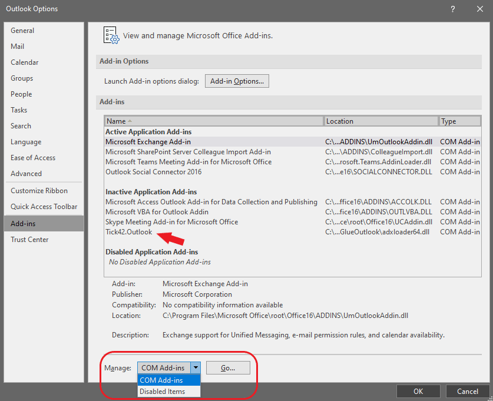

## Overview

Just click a button to launch MS Office apps from within the browser, pre-loaded with relevant data from the web app you are using! For example, if you are viewing portfolio data in an in-house web app, click "View in Excel" to bring up a new Excel window displaying the same data. If you edit and save this data in the Excel window, it is pushed back into the web app in real time. Data validation can be performed by the web app, but the continuous synchronization means that validation issues are instantly flagged in Excel.

The Glue42 MS Office Connectors allow you to:

- Use Excel with its familiar functionality, such as macros and pivot tables, to create sophisticated calculations, or continue using those that may have accumulated over the years, while being able to save all data edits to your web app in real time.

- Edit and format a document in Word, including WordArt, tables and drawings, making use of the familiar and powerful capabilities of the most popular text processing tool in the world.

- Send and receive emails and manage tasks from web apps using all the familiar capabilities of Outlook.

If you are a developer working with users who love Excel, Outlook and Word, then the Glue42 MS Office Connectors will help you enable them to continue working with the apps they enjoy and prefer. The real time integration provided by [**Glue42 Enterprise**](https://glue42.com/enterprise/) means that centralized control of data in the organization doesn't have to limit users to in-house web apps. Instead, they can benefit from the functionality and familiarity of the MS Office desktop apps, without saving any data locally and being able to access all data from web apps as if they are still working in the browser.

## Enabling Connectors Manually

Generally, all Glue42 Connectors for MS Office that are shipped with [**Glue42 Enterprise**](https://glue42.com/enterprise/) are automatically enabled. In some cases, however, an MS Office app may disable or deactivate the respective Glue42 Connector due to internal settings, policies, etc. To manually enable or activate the Glue42 Connector, you have to open the app, go to `File/Options/Add-ins` and see whether the Glue42 Connector is among the inactive or disabled add-ins. If so, you have to enable or activate it manually by selecting `COM Add-ins` (if the Connector is inactive) or `Disabled Items` (if the Connector is disabled) from the `Manage` dropdown menu:

