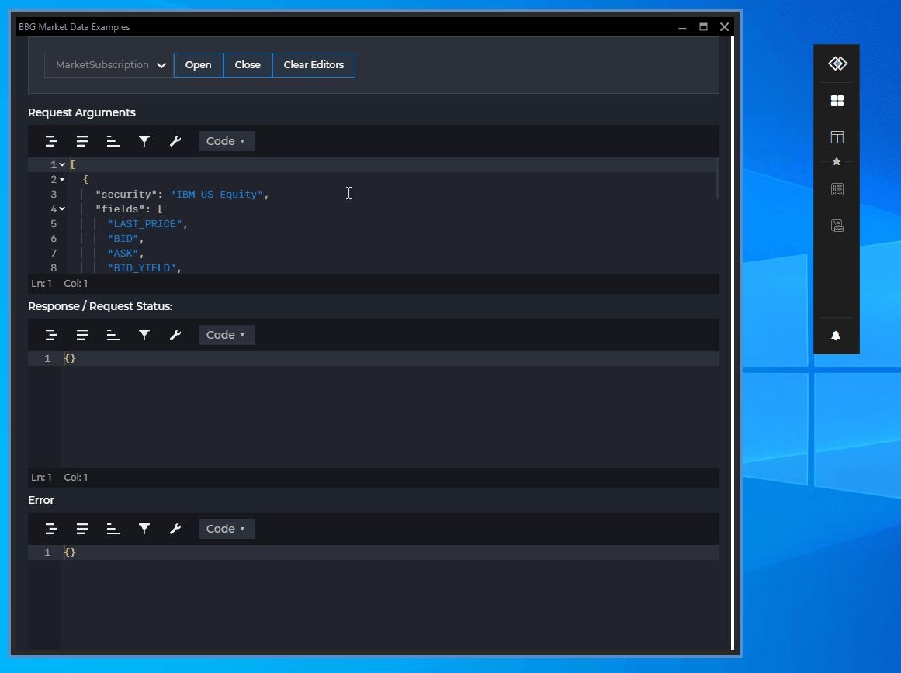

## Overview

<glue42 name="addClass" class="colorSection" element="p" text="Available since Glue42 Enterprise 3.9">

The Glue42 BBG Market Data API provides access to the Bloomberg Market Data service. Real-time/delayed streaming market data and/or static reference data for securities and security fields can be retrieved via subscription or request/response mechanisms.

The demo app below sends an Instrument List request to a Bloomberg service with a query parameter `"VOD"` and the results are limited to 5:

*For more in-depth information on the Bloomberg API, see the [Bloomberg API documentation](https://www.bloomberg.com/professional/support/api-library/).*