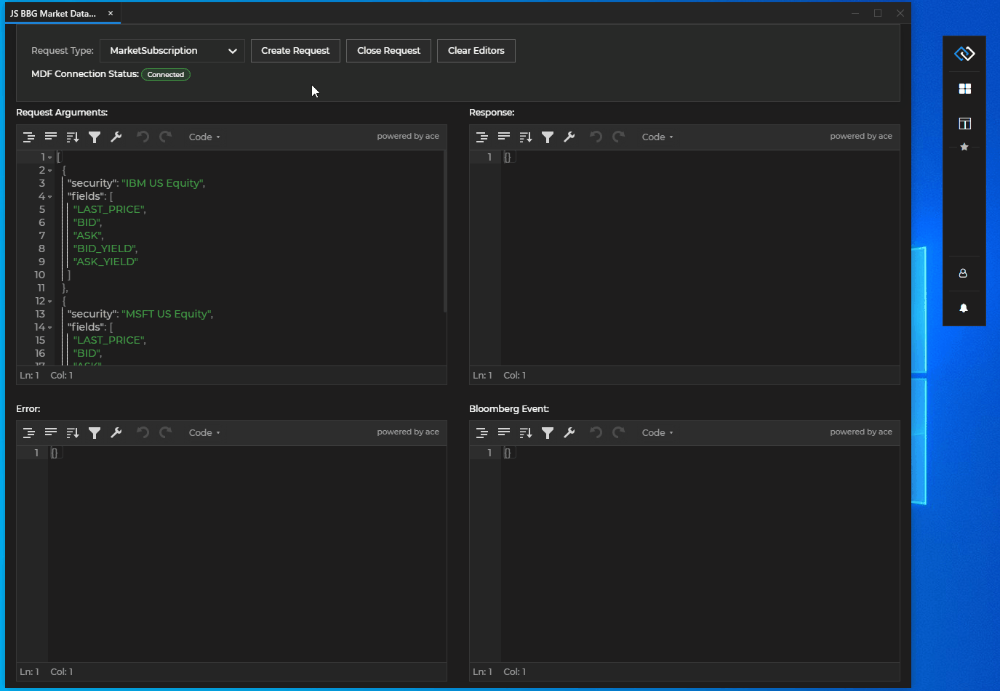

## Overview

<glue42 name="addClass" class="colorSection" element="p" text="Available since Glue42 Enterprise 3.9">

The Glue42 BBG Market Data API provides access to the Bloomberg Market Data service. Real-time and delayed streaming market data and static reference data for securities and security fields can be retrieved via subscription or request/response mechanisms.

The demo app below sends an Instrument List request to a Bloomberg service with a query parameter `"VOD"` and the results are limited to 5:

*See the [BBG Market Data example](https://github.com/Tick42/bbg-market-data-example) on GitHub which demonstrates using the [`@glue42/bbg-market-data`](https://www.npmjs.com/package/@glue42/bbg-market-data) library.*

*See the [BBG Connector Mock](https://github.com/Glue42/bbg-connector-mock) on GitHub which returns sample data in response to client requests. Use this example to write end-to-end tests for your apps without the need for a real Bloomberg Terminal, and to see how to implement your own [Interop methods](../../../../glue42-concepts/data-sharing-between-apps/interop/overview/index.html) for creating data requests and controlling the data returned in your tests.*

*For more in-depth information on the Bloomberg API, see the [Bloomberg API documentation](https://www.bloomberg.com/professional/support/api-library/).*