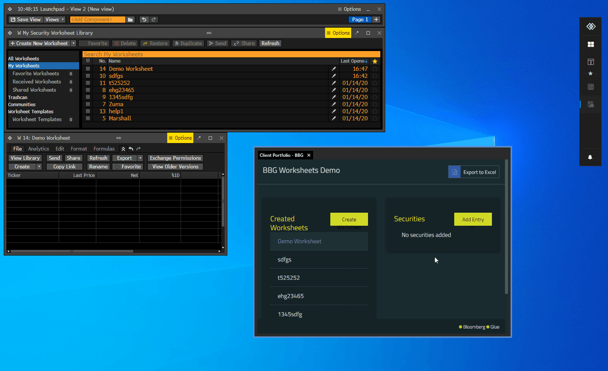

## Overview

The Bloomberg Worksheets are spreadsheets containing a list of securities to monitor. Through the Bloomberg Connector API, when you create, delete or update a Bloomberg worksheet, the changes are synchronized across the Bloomberg components and your Glue42 enabled apps in both directions:



## Worksheet Operations

### Get Worksheets

Get the known worksheets as an array of composites describing each worksheet:

- Interop method name: `"T42.BBG.GetWorksheets"`
- Accepts: `void`
- Returns: An array of objects describing each worksheet:
    - `id` - Bloomberg ID of the worksheet;
    - `name` - name of the worksheet;
    - `isActive` - whether the worksheet is active or deactivated;

Example:

```javascript
const result = await glue.interop.invoke("T42.BBG.GetWorksheets");

// Example value: 
// [
//     {id: "w-3621FCB487E84794A4DB8E4D6CA2042F", name: "Test Worksheet", isActive: true},
//     {id: "w-4FA26721722F47A9817AFA05FFF60F87", name: "New Worksheet", isActive: true}
// ]
const worksheets = result.returned.worksheets;
```

### Create a Worksheet

Create a worksheet by `name` and its initial list of `securities`. This will create a new worksheet within the Bloomberg Terminal with the given `name` and `securities`. This can later be updated by `worksheetId`, returned in the resulting composite value:

- Interop method name: `"T42.BBG.CreateWorksheet"`
- Accepts: A `name` for the worksheet as a string and an array of `securities` to be included in the worksheet;
- Returns: An object describing the created worksheet:
    - `id` - Bloomberg ID of the worksheet;
    - `name` - name of the worksheet;
    - `isActive` - whether the worksheet is active or deactivated;

Example:

```javascript
const invocationOptions = {
    name: "Test Worksheet", 
    securities: ["VOD LN Equity", "BARC LN Equity"]
};
const result = await glue.interop.invoke("T42.BBG.CreateWorksheet", invocationOptions);

// Example value: 
// {id: "w-954D2AD1EB8D4C6C9DD7514E940D46AB", name: "Test Worksheet", isActive: true}
const worksheet = result.returned.worksheet;
```

## Worksheet Context

### Get Worksheet Securities

Retrieve the securities of a worksheet by a given worksheet ID. IDs can be retrieved with a `"T42.BBG.GetWorksheets"` call for existing worksheets or `"T42.BBG.CreateWorksheet"` for new worksheets:

```csharp
(string[] securities) T42.BBG.GetWorksheetSecurities (string worksheetId)
```

- Interop method name: `"T42.BBG.GetWorksheetSecurities"`
- Accepts: A `worksheetId` as a string;
- Returns: A string array of the securities that the worksheet contains;

Example:

```javascript
let result;

result = await glue.interop.invoke("T42.BBG.GetWorksheets");

const worksheets = result.returned.worksheets;
const worksheet = worksheets.find(w => w.name === "Test Worksheet");
const worksheetId = worksheet.id;

result = await glue.interop.invoke("T42.BBG.GetWorksheetSecurities", { worksheetId });

// Example value: 
// ["VOD LN Equity", "BARC LN Equity"]
const securities = result.returned.securities;
```

### Replace Worksheet Securities

Replace the securities of a worksheet by a given worksheet ID and a list of securities. All existing securities will be removed and replaced by the specified ones:

- Interop method name: `"T42.BBG.SetWorksheetSecurities"`
- Accepts: A string array of `securities` with which to replace the existing ones and a `worksheetId` as a string;
- Returns: `void`

Example:

```javascript
let result;

result = await glue.interop.invoke("T42.BBG.GetWorksheets");

const worksheets = result.returned.worksheets;
const worksheet = worksheets.find(w => w.name === "Test Worksheet");
const worksheetId = worksheet.id;
const securities = ["MSFT US Equity"];

glue.interop.invoke("T42.BBG.SetWorksheetSecurities", { securities, worksheetId });
```

### Append Worksheet Securities

Append securities to a worksheet by a given worksheet ID and a list of securities. The specified securities will be appended to the existing ones:

- Interop method name: `"T42.BBG.AppendWorksheetSecurities"`
- Accepts: A string array of `securities` which to append to the existing ones and a `worksheetId` as a string;
- Returns: `void`

Example:

```javascript
let result;

result = await glue.interop.invoke("T42.BBG.GetWorksheets");

const worksheets = result.returned.worksheets;
const worksheet = worksheets.find(w => w.name === "Test Worksheet");
const worksheetId = worksheet.id;
const securities = ["VOD LN Equity", "BARC LN Equity"];

glue.interop.invoke("T42.BBG.AppendWorksheetSecurities", { securities, worksheetId });
```

### Remove Worksheet Securities

Remove securities of a worksheet by a given worksheet ID and a list of securities to be removed from the worksheet:

- Interop method name: `"T42.BBG.RemoveWorksheetSecurities"`
- Accepts: A string array of `securities` which to append to the existing ones and a `worksheetId` as a string;
- Returns: `void`

Example:

```javascript
let result;

result = await glue.interop.invoke("T42.BBG.GetWorksheets");

const worksheets = result.returned.worksheets;
const worksheet = worksheets.find(w => w.name === "Test Worksheet");
const worksheetId = worksheet.id;
const securities = ["MSFT US Equity"];

glue.interop.invoke("T42.BBG.RemoveWorksheetSecurities", { securities, worksheetId });
``` 