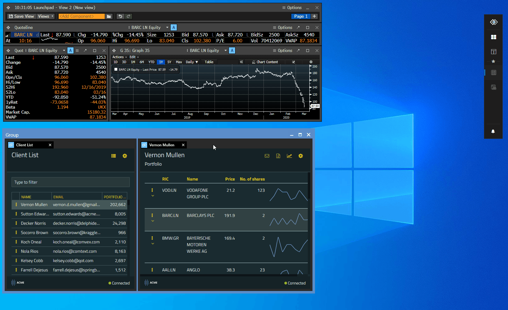

## Overview

The Bloomberg Components are Bloomberg applications (windows) providing Bloomberg Terminal functionalities. Bloomberg components can be hosted in Glue42 WPF windows retaining their UI and functionalities. When hosted in a Glue42 window, a Bloomberg component adopts the behavior of a Glue42 enabled app - it can be stuck/unstuck to/from other Glue42 windows, can participate in a layout, join a Glue42 Channel, etc.:



## Components Operations

### Get Supported Components

Get a list of the supported application types (Bloomberg Components) by the Bloomberg Connector:

- Interop method name: `"T42.BBG.ListApplications"`
- Accepts: `void`
- Returns: An array of composite values describing the supported components.

Example:

```javascript
const result = await glue.interop.invoke("T42.BBG.ListApplications");

// Example value: 
// [
//     {appId: "APCS", name: "APCS", manifest: null, manifestType: null},
//     {appId: "BCHART", name: "BCHART", manifest: null, manifestType: null}
// ]
const components = result.returned.Result;
```

### Host a Component in a Glue42 Window

Create an application (Bloomberg Component) and host it in a Glue42 window by either app name as a string, or a composite describing the application. The returned composite describes the started instance. The `appId` is the ID of the started application and can be used in `"T42.BBG.UpdateApplicationContext"`. The `instanceId` is the ID of the Glue42 instance where all applications (Bloomberg Components) created by the same instance of the Bloomberg Connector are hosted. The `context` is represented by a composite map of name/value pairs:

- Interop method name: `"T42.BBG.StartApplication"`
- Accepts: An `app` name as a string and a `context` object (specific to each BBG Component);
- Returns: A composite consisting of an object describing the started application and an `instanceId` of the Glue42 instance in which the application is hosted;

Example:

```javascript
const context = { 
    glue42Context: { 
        instrument: { 
            ric: "VOD:LN" 
        }
    }
};

glue.interop.invoke("T42.BBG.StartApplication", { app: "BCHART", context });
```

### Get Component Instances

Get a list of application instances (Bloomberg Components) run in Glue42 Windows by the Bloomberg Connector. The `appId` field from the returned composite value can be used to update the component context:

- Interop method name: `"T42.BBG.ListApplications"`
- Accepts: `void`
- Returns: An array of composite values describing the running components instances.

Example:

```javascript
const result = await glue.interop.invoke("T42.BBG.ListApplicationInstances");

// Example value: 
// [
//     {appId: "69981d72aedc434695f9df5089900a20", name: "BCHART", manifest: null, manifestType: null}
// ]
const componentsInstances = result.returned.Result;
```

### Update Component Context

Update a running application (Bloomberg Component) context by the specified `appId` and a `context`, represented by a composite map of name/value pairs:

- Interop method name: `"T42.BBG.UpdateApplicationContext"`
- Accepts: A composite `app` parameter describing the application, and a `context` object with which to update the application (specific to each BBG Component);
- Returns: `void`

Example:

```javascript
const initialContext = { 
    glue42Context: { 
        instrument: { 
            ric: "VOD:LN" 
        }
    }
};

const result = await glue.interop.invoke("T42.BBG.StartApplication", { app: "BCHART", context: initialContext });
const app = result.returned.app;
const updatedContext = { 
    glue42Context: { 
        instrument: { 
            ric: "BARC:LN" 
        }
    }
};

glue.interop.invoke("T42.BBG.UpdateApplicationContext", { app, context: updatedContext });
``` 