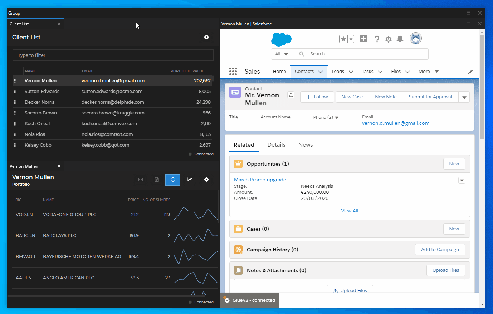

## Overview

The Glue42 **Salesforce Connector** bridges the gap between Salesforce Lighting and your Glue42 enabled applications. It enables Salesforce developers to create [`Actions`](https://help.salesforce.com/articleView?id=actions_in_lex.htm&type=5) and buttons in Salesforce Lightning which can [invoke Interop methods](../../../glue42-concepts/data-sharing-between-apps/interop/javascript/index.html#method_invocation). This allows sharing information and functionality between Salesforce and all Glue42 enabled apps.

The Salesforce Connector is shipped separately from [**Glue42 Enterprise**](https://glue42.com/enterprise/) and is installed as a Salesforce plugin. 

Below you can see an example of how Salesforce Lightning can be integrated visually and functionally with other applications in [**Glue42 Enterprise**](https://glue42.com/enterprise/) with the help of the Glue42 Salesforce Connector:

 