## Installing the Package

The Salesforce Connector is pre-packaged and uploaded as a Salesforce Component which you can install for your organization from the [AppExchange Marketplace](https://appexchange.salesforce.com/appxListingDetail?listingId=a0N3A00000EtDnwUAF):

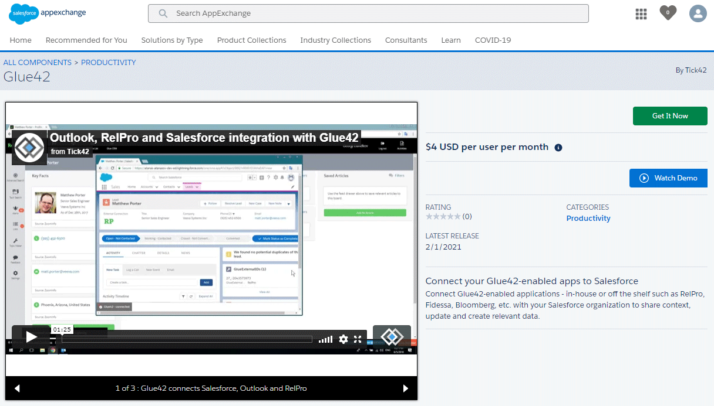

Click the "Get It Now" button and choose whether to install the Glue42 Salesforce Connector in production or in a sandbox:

[Install mode](../../../images/salesforce/install-mode.png)

Accept the terms and conditions and click the "Confirm and Install" button. Enter your Salesforce credentials to go to the installation page. Select for which users you want to install the Connector and click the "Install" button:

[Install](../../../images/salesforce/install.png)

Wait for the installation to complete and press the "Done" button when the screen for successful installation appears:

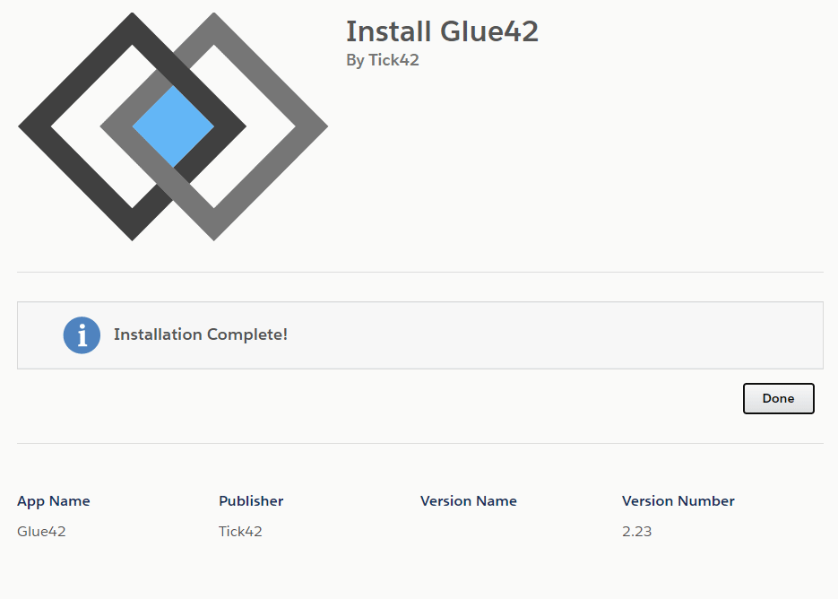

## Enabling the Connector

To enable the Salesforce Connector, you have to: 

- set up a custom domain name for your organization in order to be able to use the Salesforce Lightning [Utility Bar](https://help.salesforce.com/articleView?id=dev_apps_lightning_utilities.htm&type=5) and custom Salesforce Lightning Components;

- attach the Salesforce Connector to the "Sales" Lightning app;

### Custom Domain

*If your organization domain name has already been set up, skip this step.*

Go to `Setup > Company Settings > My Domain` and follow the steps for setting up a domain name for your organization. You have to choose and register an available domain name, login with your new domain name and deploy it to your users.

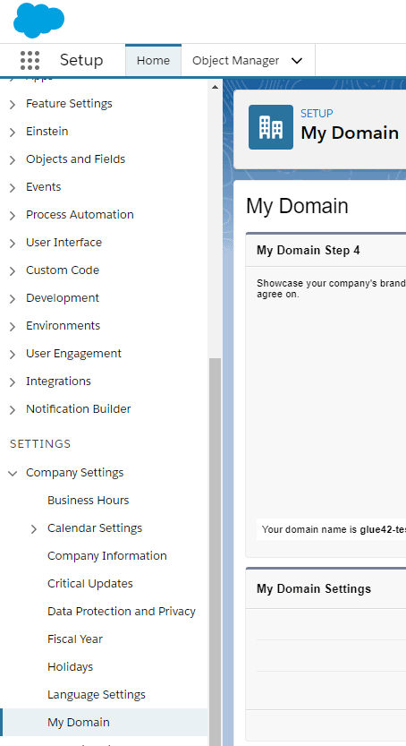

### Attaching the Connector

Go to `Setup > Apps > App Manager`, find the "Sales" Lightning app and click the "Edit" button:

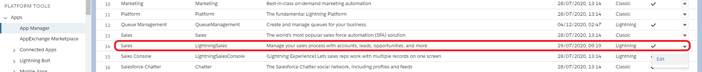

Go to `App Settings > Utility Items` and click the "Add Utility Item" button. Search for "Glue42" and click on the "Glue42" item from the item list:

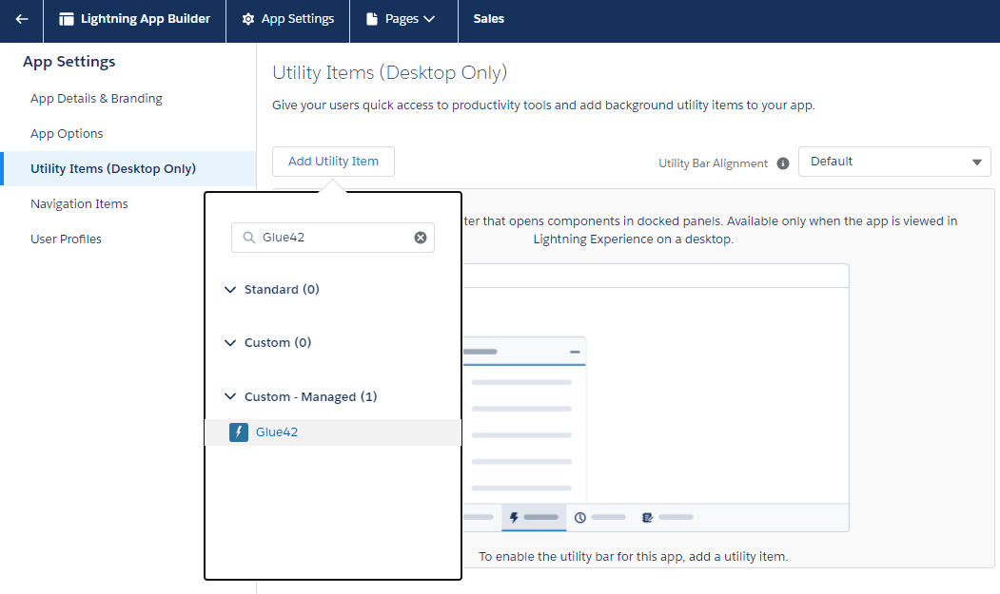

It is recommended to use the default settings for the Connector. You can select the "Start automatically" checkbox to enable the Connector to load and establish a connection automatically before the user clicks on it to activate it, or after a page refresh:

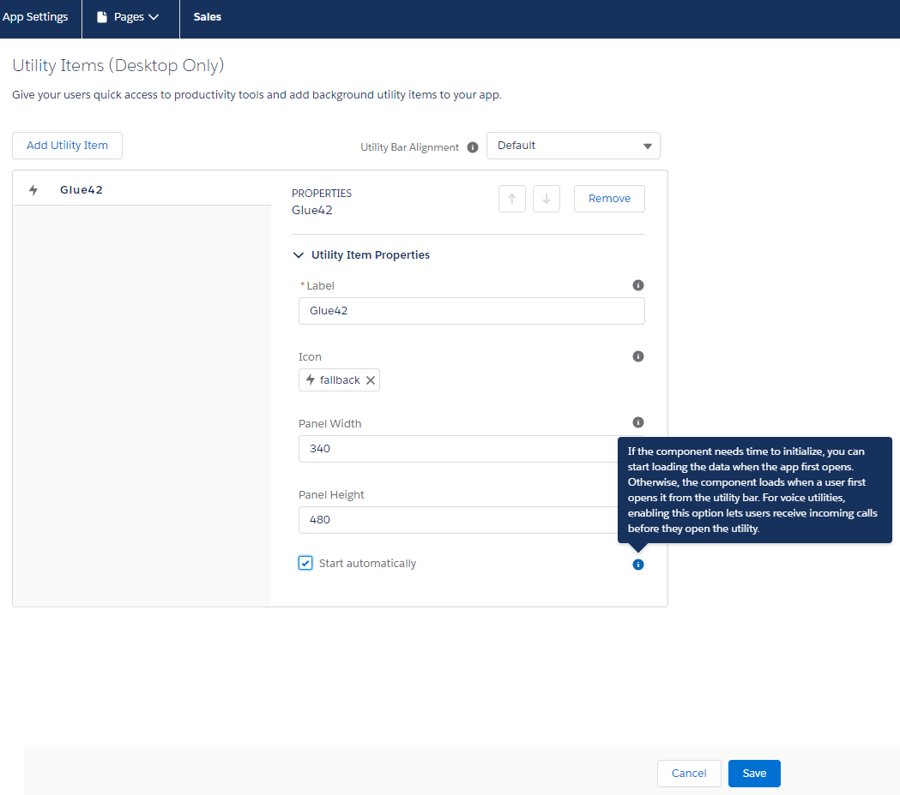

Click the "Save" button to save your changes.

## Establishing a Connection

If you have done everything correctly, the Salesforce Connector should be available as a utility item in the utility bar of the "Sales" Lightning app:

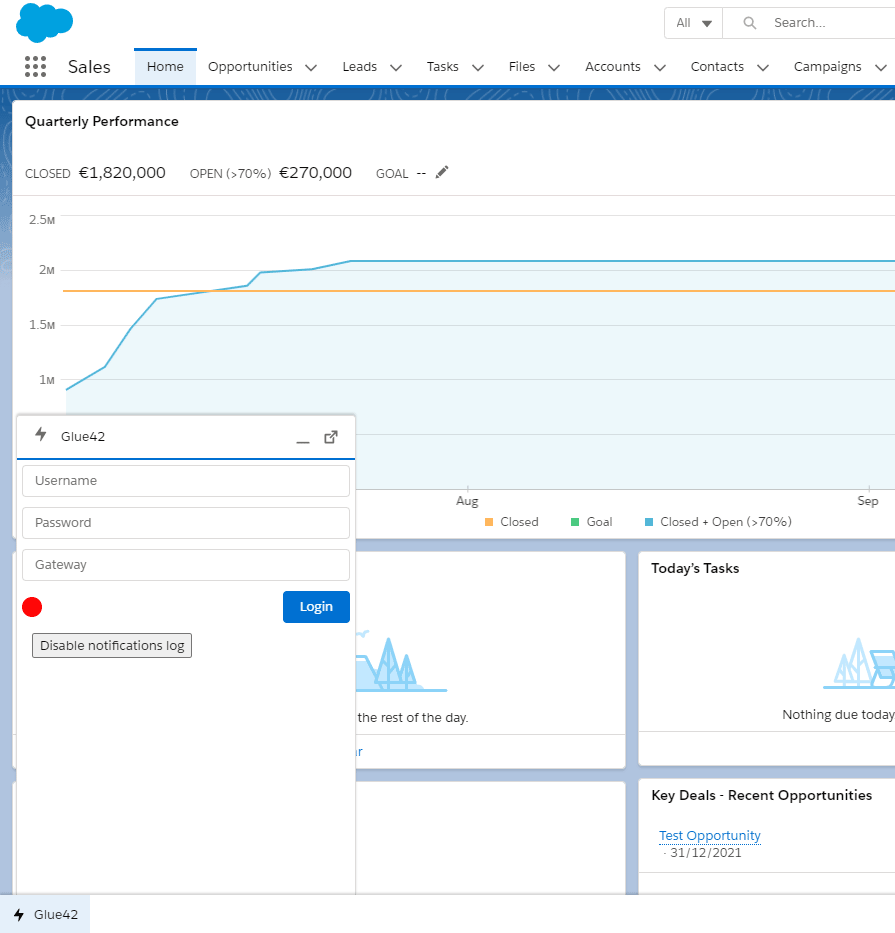

Enter a username, password and a Glue42 Gateway address to establish a connection. The default Gateway address is `ws://localhost:8385`.

*Note that the username you supply to the Connector has to be the same as the one used by [**Glue42 Enterprise**](https://glue42.com/enterprise/), otherwise the Connector will not be able to see the Interop methods your apps have registered in [**Glue42 Enterprise**](https://glue42.com/enterprise/) under a different username. By default, [**Glue42 Enterprise**](https://glue42.com/enterprise/) uses the Windows username of the currently logged in user which you can see by right-clicking on the [**Glue42 Enterprise**](https://glue42.com/enterprise/) tray icon or by running the `echo %USERNAME%` command in a command prompt.*

### Default Credential Settings

You can configure default credentials which the Salesforce Connector will use to establish a connection when the page is reloaded or if the user clicks the "Login" button without entering a Glue42 Gateway address, username or password. Go to `Setup > Custom Code > Custom Settings` and click the "Manage" button of the "Glue42 Settings" list entry. Enter a default Glue42 Gateway address, username and password:

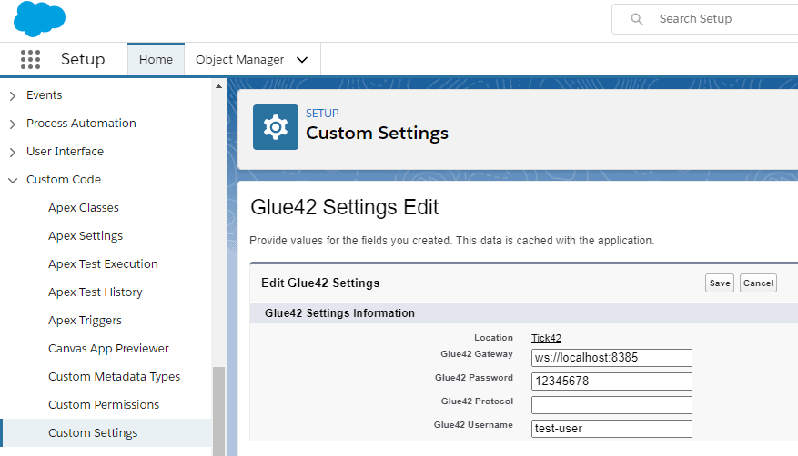

## Custom Metadata Types

Next, you have to edit the values for the "LightningURL" and "VisualURL" labels created for the Salesforce Connector. Go to `Setup > Custom Code > Custom Metadata Types`:

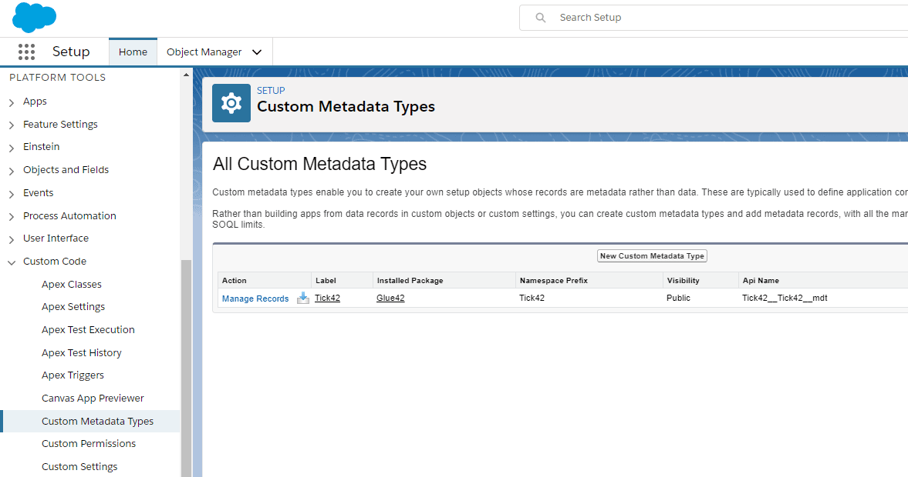

Click the "Manage Records" link next to the "Tick42" label and on the next screen click the "Edit" link next to the "Tick42" label.

### Lightning URL

The value for the "LightningURL" field must be the same as the custom domain name for your organization, e.g. `[organization-name].lightning.force.com`:

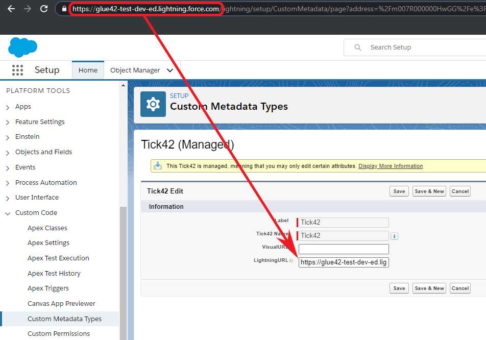

Click the "Save" button to save the changes.

### Visual URL

To get the value for the "VisualURL" field, go to `Setup > Custom Code > Visualforce Pages`, click on the "Breakout" list item and click the "Preview" button on the next screen:

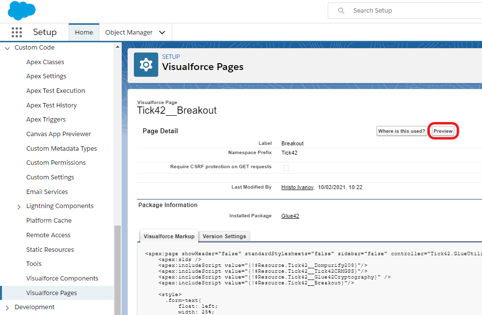

Copy only the domain part of the link from the address bar of the newly opened page:

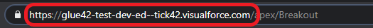

Go back to the Custom Metadata Types section, set this address as a value for the "VisualURL" field and click the "Save" button.

## Update and Uninstall

If you have installed the Salesforce Connector using the AppExchange Marketplace, it isn't necessary to uninstall it first in order to update to a newer version. If you want only to uninstall the Connector, follow the steps below.

If you have an older version of the Salesforce Connector which was not installed through the AppExchange Marketplace, you have to retrace the configuration and installation steps backwards in order to remove all package dependents first and then the package itself. For the example given in the [Actions](../actions/index.html#action_example) section this means:

1. Remove the Action button from the `Contact` page layout. 

Go to `Object Manager > Contact > Page Layouts > Contact Layout` and drag and drop the "Open Client Portfolio" button from the "Salesforce Mobile and Lightning Experience Actions" section back to the "Contact Layout" section and click the "Save" button.

2. Remove the Action from the `Contact` object.

Go to `Object Manager > Contact > Buttons, Links and Actions`, find the "Open Client Portfolio" Action and click the "Delete" button.

3. Remove the Salesforce Connector utility.

Go to `Setup > Apps > App Manager`, find the "Sales" Lightning app and click the "Edit" button. Go to `App Settings > Utility Items` and click the "Remove" button on the Glue42 utility.

4. Delete the `OpenClientPortfolio` Component bundle from the resources in the Salesforce Developer Console.

Open the Salesforce Developer Console, go to `File > Open Resource`, search for the Component (`OpenClientPortfolio.cmp`) and open it. Go to `File > Delete` and confirm the deletion of the entire Component bundle.

5. After all package dependents have been removed, go to `Setup > Apps > Packaging > Installed Packages` and click the "Uninstall" button of the Salesforce Connector package. Go to the bottom of the uninstall page, configure the uninstall settings and click the "Uninstall" button.

*Note that if any dependents on the package exist, the uninstallation will fail. See the remaining dependents in the "Problems" section if the uninstallation fails and follow the links to remove them.* 