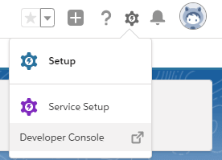
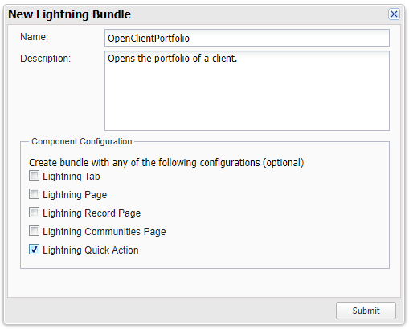
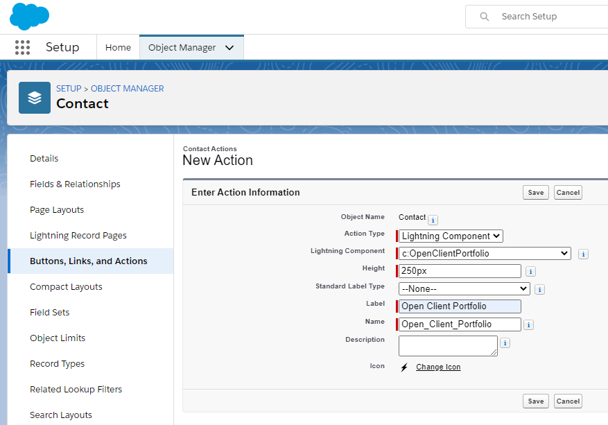
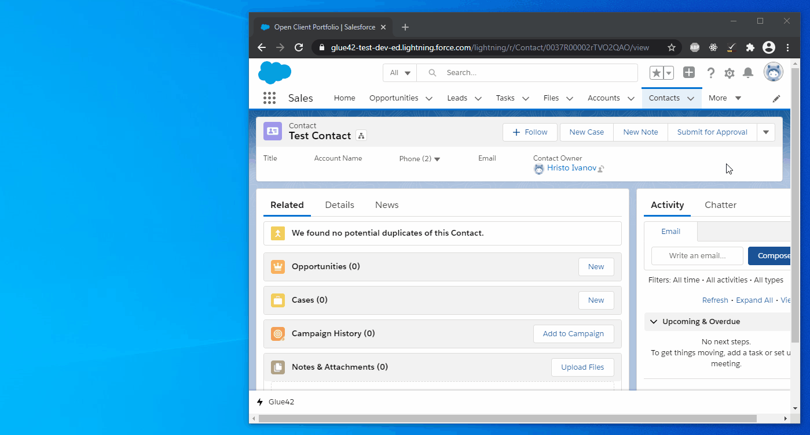

## Interop Actions

The Salesforce Connector allows you to create Actions in Salesforce which can [invoke Interop methods](../../../glue42-concepts/data-sharing-between-apps/interop/javascript/index.html#method_invocation). This is achieved through the `glueInvoke` event that the Salesforce Connector makes available to all Salesforce Components. The `glueInvoke` event accepts two arguments as parameters - an Interop method name and a `payload` object containing arguments with which to invoke the specified Interop method. 

In short, you have to create a Salesforce Component and Controller for it which will check the Glue42 connection, set the arguments for the `glueInvoke` event and fire it. After that, you need to assign this Action to a button of a Salesforce object (`Contact`, `Account`, `Lead`, etc.).

## Example

The Action example below demonstrates outbound interoperability from Salesforce to other Glue42 enabled applications. The Action is attached to a button of the `Contact` Salesforce object and invokes an Interop method [registered](../../../glue42-concepts/data-sharing-between-apps/interop/javascript/index.html#method_registration) by a Glue42 enabled application. The example also shows how to check for the Glue42 connection status using the `ResendGlueConnectionStatus` and `GlueConnectionStatus` events.

The registered Interop method will open a "Client List" application when invoked:

```javascript
const name = "OpenClientPortfolio";
const handler = () => {
    // Start the Client List application.
    glue.appManager.application("channelsclientlist").start();
};

glue.interop.register(name, handler);
```

### Component

To create a custom Component, open the Salesforce Developer Console:



Go to `File > New > Lightning Component` and add a name ("OpenClientPortfolio") and a description for the Component. Select "Lightning Quick Action" for "Component Configuration":



Click "Submit", paste the following code in the newly opened CMP file and save it to create the Component:

```xml
<aura:component implements="force:lightningQuickAction,force:hasRecordID" controller="Tick42.GlueUtilityBarController">
    <aura:handler name="init" value="{!this}" action="{!c.init}"/>
    <aura:registerEvent name="ResendGlueConnectionStatus" type="Tick42:ResendGlueConnectionStatus"/>
    <aura:handler event="Tick42:GlueConnectionStatus" action="{!c.openPortfolio}"/>
</aura:component>
```

The `init` handler will be triggered when the user clicks the button and will fire the `ResendGlueConnectionStatus` event which in turn will fire the `GlueConnectionStatus` event. The `openPortfolio` handler will be triggered when the `GlueConnectionStatus` event fires.

### Controller

To create the Controller, select "CONTROLLER" from the right menu of the Developer Console and paste the following code in the newly opened JS file and save it:

```javascript
({
    // Triggered on button click.
    init: function (component, event, helper) {
        const connectionStatusEvent = $A.get("e.Tick42:ResendGlueConnectionStatus");
        // Fire the `ResendGlueConnectionStatus` event.
        connectionStatusEvent.fire();
    },
    // Triggered when the `GlueConnectionStatus` event fires.
    openPortfolio: function (component, event, helper) {
        // Check the connection status.
        const status = event.getParam("status");

        if (!status) {
            // Display a toast if there is no established connection.
            const toastEvent = $A.get("e.force:showToast");

            toastEvent.setParams({
                title: "No connection to Glue42.",
                message: "Please, connect to Glue42 to continue.",
                type: "error"
            });
           	
            toastEvent.fire();
        } else {
            // No arguments are necessary for this example invocation.
            const payload = {};

            // Get the `glueInvoke` event.
            const appEvent = $A.get("e.Tick42:glueInvoke");

            // Set the event parameters (`method` and `payload`) by passing
            // the name and arguments for the Interop method you want to invoke.
            // It is assumed that the method you want to invoke has already been
            // registered by another Glue42 enabled application.
            appEvent.setParams({ "method": "OpenClientPortfolio", "payload": JSON.stringify(payload) });

            // Fire the event.
            appEvent.fire(); 

            // Close the quick action.
            const dismissAction = $A.get("e.force:closeQuickAction");
            dismissAction.fire();
        };
    }
})
```

*Keep in mind that the Interop method you want to invoke first has to be [registered](../../../glue42-concepts/data-sharing-between-apps/interop/javascript/index.html#method_registration) by a Glue42 enabled application.*

### Assigning the Action

Next, assign the created Action to a button of a Salesforce object (e.g., `Contact`). Go to `Object Manager > Contact > Buttons, Links and Actions` and click the "New Action" button. Enter the settings for the new action - choose "Lightning Component" for the "Action Type" and choose the created Component from the "Lightning Component" dropdown menu. Specify a label and a name for the Action and save the action:



Go to `Object Manager > Contact > Page Layouts > Contact Layout`. Select the "Mobile and Lightning Actions" item in the "Contact Layout" section. Find the created Action among the available Actions, or use the search box:


Drag and drop the Action in the "Salesforce Mobile and Lightning Experience Actions" section and click the "Save" button in the "Contact Layout" section.

The Action will now be available when you navigate to the "Sales" Lightning app and open a contact:

 