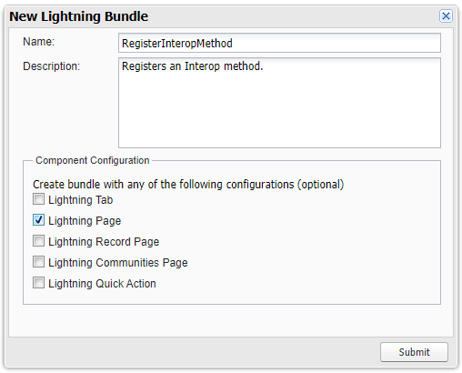
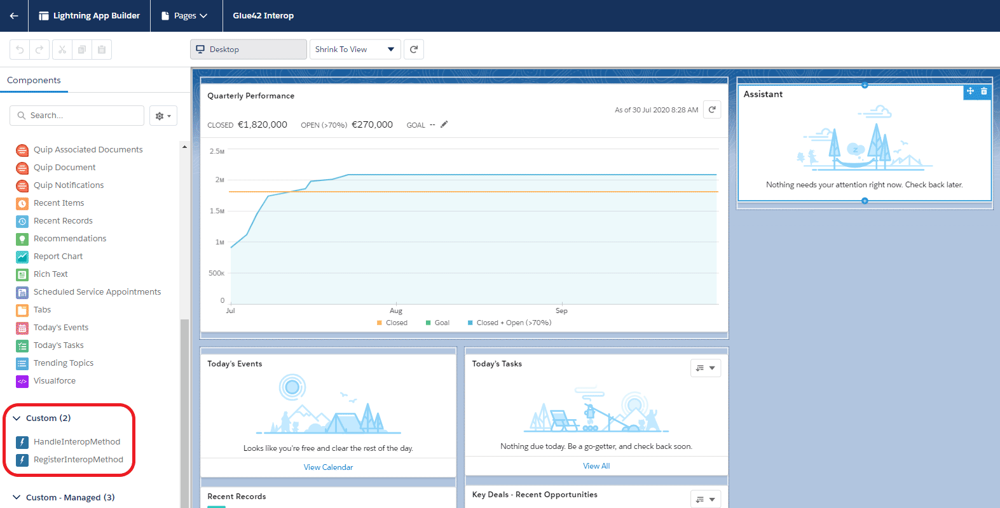
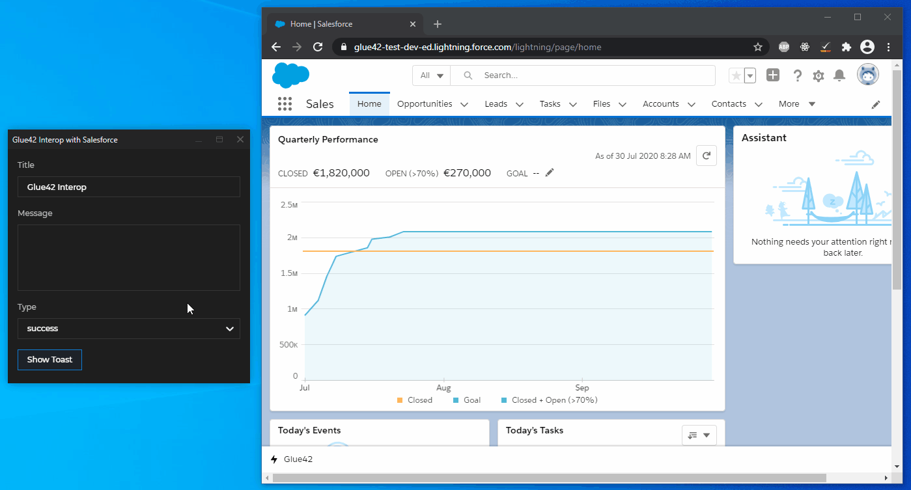

## Interop Events

The Glue42 Salesforce Connector allows you to trigger Interop events in Salesforce from other Glue42 enabled applications. Use the `GlueInteropRegister` event to [register Interop methods](../../../glue42-concepts/data-sharing-between-apps/interop/javascript/index.html#method_registration) in Salesforce and the `GlueCustomInteropEvent` to handle method invocations.

In short, you have to create a Salesforce Component and a Controller for it that will check the Glue42 connection and register an Interop method. After that, you need to create another Component and a Controller for it that will handle method invocations from other Glue42 enabled apps.

## Example

The example below demonstrates inbound interoperability from other Glue42 enabled apps to Salesforce. The Components for registering an Interop method and handling its invocation will be attached to the Sales Lightning app Home page. Another Glue42 enabled application will [invoke](../../../glue42-concepts/data-sharing-between-apps/interop/javascript/index.html#method_invocation) the method and supply arguments for it. The example also shows how to check for the Glue42 connection status using the `GlueConnectionStatus` event.

The registered Interop method will trigger a toast notification in Salesforce with title, text and type provided by the invoking application.

### Method Registration

#### Component

To create a custom Component, open the Salesforce Developer Console:


Go to `File > New > Lightning Component` and add a name ("RegisterInteropMethod") and a description for the Component. Select "Lightning Page" for "Component Configuration":



Click "Submit", paste the following code in the newly opened CMP file and save it to create the Component:

```xml
<aura:component implements="flexipage:availableForAllPageTypes" access="global">
    <aura:handler event="Tick42:GlueConnectionStatus" action="{!c.registerInteropMethod}"/>
</aura:component>
```

The `registerInteropMethod` handler will be triggered when the `GlueConnectionStatus` event fires.

#### Controller

To create the Controller, select "CONTROLLER" from the right menu of the Developer Console and paste the following code in the newly opened JS file and save it:

```javascript
({
    // Triggered when the `GlueConnectionStatus` event fires.
    registerInteropMethod: function (component, event, helper) {
        // Check the connection status.
        const status = event.getParam("status");

        // Register the Interop method if there is connection to Glue42.
        if (status) {
            // Get the `GlueInteropRegister` event.
        	const appEvent = $A.get("e.Tick42:GlueInteropRegister");
            
            // Provide a method name.
            appEvent.setParams({ "method": "ShowToast" });
            appEvent.fire();   
        };
    }
})
```

### Handling Invocations

#### Component

Follow the steps in the previous section to create a new Component that will handle method invocations.

Paste the following code in the newly opened CMP file and save it to create the Component: 

```xml
<aura:component implements="flexipage:availableForAllPageTypes" access="global">
	<aura:handler event="Tick42:GlueCustomInteropEvent" action="{!c.handleInvocation}"/>
</aura:component>
```

The `handleInvocation` handler will be triggered when the Interop method is invoked by other Glue42 enabled applications.

#### Controller

To create the Controller, select "CONTROLLER" from the right menu of the Developer Console and paste the following code in the newly opened JS file and save it:

```javascript
({
    // Triggered when a `GlueCustomInteropEvent` is fired.
	handleInvocation: function(component, event, helper) {
        // The invoking application provides the arguments for the method.
        const { title, message, type } = JSON.parse(event.getParam("args"));
        
        const toastEvent = $A.get("e.force:showToast");
        
        if (message && message !== "") {
            toastEvent.setParams({ title, message, type });
            toastEvent.fire();
        };
	}
})
```

### Assigning the Components

Next, customize the Sales Lightning app Home page with the newly created Components.

1. Go to `Setup > User Interface > Lightning App Builder` and click the "New" button to start customizing the Home page. Choose "Home Page" and enter a page label on the next screen. Choose the "Clone Salesforce Default Page" tab and click the "Finish" button.

2. Drag and drop the newly created custom components to the top of the page template:



3. Click the "Save" button. When prompted, click the "Activate" button and on the next screen select "Assign as Org Default". Click the "Save" button to activate the customized page.

Now all Glue42 enabled apps will be able to invoke the "ShowToast" Interop method:

