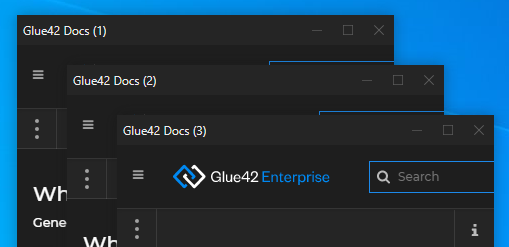

## System Configuration

The system configuration of [**Glue42 Enterprise**](https://glue42.com/enterprise/) is located in the `system.json` file in the main configuration folder - `%LocalAppData%\Tick42\GlueDesktop\config`. This file allows you to alter system-wide configurations for window behavior, application stores, Gateway settings and much more. In most cases, the default configuration settings should suffice. For more details, see the [system configuration schema](../../../assets/configuration/system.json). 

See also the [Glue42 Platform Features](../../../glue42-concepts/glue42-platform-features/index.html) section of the documentation, as many of the platform features are configured via the `system.json` file.

The following examples demonstrate some of the available system level configurations. 

*Note that the globally defined properties in the `system.json` file will be overridden by the respective property definitions in the [application configuration](../application/index.html) files.*

## Dynamic Gateway Port

The Glue42 Gateway starts on port 8385 by default. In environments where multiple user sessions run on the same machine (e.g., running [**Glue42 Enterprise**](https://glue42.com/enterprise/) as a Citrix Virtual App), using a predefined port will not work, as the first instance of [**Glue42 Enterprise**](https://glue42.com/enterprise/) will occupy that port and all other instances will not be able to connect. To avoid this, the Glue42 Gateway can be configured from the `system.json` file to choose dynamically a free port on startup.

To configure the Glue42 Gateway to use a random free port, go to the `"configuration"` object under the `"gw"` top-level key and set its `"port"` property to `0`:

```json
"gw": {
    ...
    "configuration": {
        ...
        "port": 0,
        ...
    },
    ...
}
```

## Application Stores

To configure [**Glue42 Enterprise**](https://glue42.com/enterprise/) to load application configuration files from a local path, use the `"appStores"` top-level key. Set the `"type"` property of the app store configuration object to `"path"` and specify a relative or an absolute path to the application definitions. The environment variables set by [**Glue42 Enterprise**](https://glue42.com/enterprise/) can also be used as values:

```json
"appStores": [
    {
        "type": "path",
        "details": {
            "path": "../config/apps"
        }
    },
    {
        "type": "path",
        "details": {
            "path": "%GD3-APP-STORE%"
        }
    },
    {
        "type": "path",
        "details": {
            "path": "%GLUE-USER-DATA%/apps"
        }
    }
]
```

To configure [**Glue42 Enterprise**](https://glue42.com/enterprise/) to load application definitions from a remote application store, set the the `"type"` property of the app store configuration object to `"rest"` and provide details about the remote application store:

```json
"appStores": [
    {
        "type": "rest",
        "details": {
            "url": "http://localhost:3000/appd/v1/apps/search",
            "auth": "no-auth",
            "pollInterval": 30000,
            "enablePersistentCache": true,
            "cacheFolder": "%LocalAppData%/Tick42/UserData/%GLUE-ENV%-%GLUE-REGION%/gcsCache/"
        }
    }
]
```

The only required properties for each app store configuration object are `"type"`, which should be set to `"rest"`, and `"url"`, which is the address of the remote application store. You can also set the authentication, polling interval, cache persistence and cache folder.

| Property | Description |
|----------|-------------|
| `"auth"` | Authentication configuration. Can be one of `"no-auth"`, `"negotiate"` or `"kerberos"`. |
| `"pollInterval"` | Interval at which to poll the REST service for updates. |
| `"enablePersistentCache"` | Whether to cache and persist the configuration files locally (e.g., in case of connection interruptions). |
| `"cacheFolder"` | Where to keep the persisted configuration files. |

*For details on working with remote store compliant with FDC3 App Directory standards, see the [FDC3 Compliance](../../../getting-started/fdc3-compliance/index.html#fdc3_for_glue42_enterprise-app_directory) section and the [FDC3 App Directory documentation](https://fdc3.finos.org/docs/app-directory/overview).*

You can also use the [Glue42 Server](../../../glue42-concepts/glue42-server/index.html) for hosting and retrieving application stores. The [Glue42 Server](../../../glue42-concepts/glue42-server/index.html) is a complete server-side solution for providing data to Glue42. To configure [**Glue42 Enterprise**](https://glue42.com/enterprise/) to fetch application configurations from a [Glue42 Server](../../../glue42-concepts/glue42-server/index.html), set the `"type"` property of the app store configuration object to `"server"`:

```json
"appStores": [
    {
        "type": "server"
    }
]
```

## Application Settings

- Use the `"titleFormat"` property under the `"applications"` top-level key to set a format for the titles of application windows. Use the supported macros - `{title}` and `{instanceIndex}`:

<glue42 name="addClass" class="colorSection" element="p" text="Available since Glue42 Enterprise 3.10">

```json
"applications": {
    "titleFormat": "{title} ({instanceIndex})"
}
```



The value for the `{title}` macro is the title specified in the application configuration file. The `{instanceIndex}` macro is the consecutive number of the application instance. It is incremented for each new application instance starting from `1`. If all instances are closed, the counter is reset. If some instances are closed while others are still running, the counter will continue to increment accordingly.

*Note that if the application sets the title programmatically through any of the Glue42 APIs, the specified title format will be overridden. For web applications, the window title can be synced with the document title by using the `"syncTitleWithDocumentTitle"` property which will override the specified title format.*

## Window Settings

Global window settings will be overridden per application by the [application configuration](../application/index.html) settings.

### Downloading Files

To configure the global behavior of the Glue42 Windows when downloading files, use the `"downloadSettings"` property of the `"windows"` top-level key:

```json
"windows": {
    "downloadSettings": {
        "autoSave": true,
        "autoOpenPath": false,
        "autoOpenDownload": false,
        "enable": true,
        "enableDownloadBar": true,
        "path": "%DownloadsFolder%"
    }
}
```

*For more information, see the [Glue42 Platform Features: Downloading Files](../../../glue42-concepts/glue42-platform-features/index.html#downloading_files).*

### Zooming

To set the zoom behavior of the Glue42 Windows, use the `"zoom"` property of the `"windows"` top-level key:

```json
"windows": {
    "zoom": {
        "enabled": true,
        "mouseWheelZoom": false,
        "factors": [25, 33, 50, 67, 75, 80, 90, 100, 110, 125, 150, 175, 200, 250, 300, 400, 500],
        "defaultFactor": 100
    }
}
```

*For more information, see the [Glue42 Platform Features: Zooming](../../../glue42-concepts/glue42-platform-features/index.html#zooming).*

### Printing

Use the "CTRL + P" key combination to print a web page opened in a Glue42 Window. To enable or disable printing, or to configure the default print settings use the `"print"` property of the `"windows"` top-level key. The following example demonstrates configuring some of the available print settings:

```json
"windows": {
    "print": {
        "enabled": true,
        "silent": true,
        "color": false,
        "copies": 1,
        "footer": "https://my-domain.com/",
        "pageSize": "A4",
        "duplexMode": "longEdge"
    }
}
```

| Property | Description |
|----------|-------------|
| `"enabled"` | Whether to enable or disable printing. |
| `"silent"` | Whether to ask the user for print settings. |
| `"color"` | Whether to print the page in color or in grayscale. |
| `"copies"` | The number of copies to print. |
| `"footer"` | A string that will be printed as a footer on each page. |
| `"pageSize"` | The size of the printed page. |
| `"duplexMode"` | Setting for duplex printing. |

*For more details on all available print properties and their values, see the `"print"` key in the [`system.json`](../../../assets/configuration/system.json) schema.*

To enable or disable printing a web page as a PDF file, or to configure the default settings for printing to PDF, use the `"printToPdfSettings"` property of the `"windows"` top-level key. The following example demonstrates configuring some of the available settings for printing to a PDF file:

```json
"windows": {
    "printToPdfSettings": {
        "enabled": true,
        "autoSave": true,
        "autoOpenPath": true,
        "fullPath": "C:\\Users\\%USERNAME%\\Documents\\PDF",
        "usePrintShortcutKey": true,
        "pageSize": "A4",
        "printBackground": true,
        "printSelectionOnly": true
    }
}
```

| Property | Description |
|----------|-------------|
| `"enabled"` | Whether to enable or disable printing to a PDF file. |
| `"autoSave"` | Whether to auto save the PDF file. |
| `"autoOpenPath"` | Whether to auto open the directory where the file was saved. |
| `"fullPath"` | The default directory where PDF files will be saved. |
| `"usePrintShortcutKey"` | Whether to use "CTRL + P" to print to a PDF file by default. |
| `"pageSize"` | The size of the printed page. |
| `"printBackground"` | Whether to print the page background. |
| `"printSelectionOnly"` | Whether to print only the currently selected section of the page. |

*For more details on all available properties for printing to a PDF file and their values, see the `"printToPdfSettings"` key in the [`system.json`](../../../assets/configuration/system.json) schema.*

The `"print"` and `"printToPdfSettings"` properties are also available under the `"details"` key of the configuration file for [window applications](../application/index.html#application_configuration-window). Use them to override the system-wide print settings.

## Citrix Apps

Mind that the default system settings for the Citrix Virtual Apps support should work fine in most cases and usually it isn't necessary to make any modifications. If the default settings don't work for your specific environment, use the `"citrix"` top-level key to provide custom values.

The following configuration contains the default Citrix settings:

```json
"citrix": {
    "launcherPath": "%ProgramFiles(x86)%/Citrix/ICA Client/SelfServicePlugin",
    "launcherModule": "SelfService.exe",
    "launcherArguments": "-qlaunch \"$appName$\"",
    "launcherSpawnInterval": 1500
}
```

The `"citrix"` key has the following properties:

| Property | Description |
|----------|-------------|
| `"launcherPath"` | Location of the Citrix module used to launch published Citrix Virtual Apps. |
| `"launcherModule"` | The file name of the Citrix module used to launch published Citrix Virtual Apps. |
| `"launcherArguments"` | The command line arguments used to launch published Citrix Virtual Apps. |
| `"launcherSpawnInterval"` | Interval (in milliseconds) at which multiple launcher modules will be spawned. |