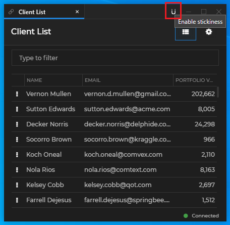

## System Configuration

The system configuration of [**Glue42 Enterprise**](https://glue42.com/enterprise/) is located in the `system.json` file in the main configuration folder - `%LocalAppData%\Tick42\GlueDesktop\config`. This file allows you to alter system-wide configurations for window behavior, app stores, Gateway settings and much more. In most cases, the default configuration settings should suffice. For more details, see the [system configuration schema](../../../assets/configuration/system.json).

See also the [Glue42 Platform Features](../../../glue42-concepts/glue42-platform-features/index.html) section of the documentation, as many of the platform features are configured via the `system.json` file.

The following examples demonstrate some of the available system level configurations.

*Note that some of the globally defined properties in the `system.json` file may be overridden using the respective property definitions in the [app configuration](../application/index.html) files.*

The [logging](#logging) configuration for [**Glue42 Enterprise**](https://glue42.com/enterprise/) is found in the `logger.json` file located in `%LocalAppData%\Tick42\GlueDesktop\config`.

## Dynamic Gateway Port

The Glue42 Gateway starts on port 8385 by default. In environments where multiple user sessions run on the same machine (e.g., running [**Glue42 Enterprise**](https://glue42.com/enterprise/) as a Citrix Virtual App), using a predefined port won't work, as the first instance of [**Glue42 Enterprise**](https://glue42.com/enterprise/) will occupy that port and all other instances won't be able to connect. To avoid this, the Glue42 Gateway can be configured from the `system.json` file to choose dynamically a free port on startup.

To configure the Glue42 Gateway to use a random free port, go to the `"configuration"` object under the `"gw"` top-level key and set its `"port"` property to `0`:

```json
{
    "gw": {
        "configuration": {
            "port": 0
        }
    }
}
```

## App Stores

The settings for the app configuration stores are defined under the `"appStores"` top-level key, which accepts an array of objects defining one or more app stores.

### Local

To configure [**Glue42 Enterprise**](https://glue42.com/enterprise/) to load app configuration files from a local path, set the `"type"` property of the app store configuration object to `"path"` and specify a relative or an absolute path to the app definitions. The environment variables set by [**Glue42 Enterprise**](https://glue42.com/enterprise/) can also be used as values:

```json
{
    "appStores": [
        {
            "type": "path",
            "details": {
                "path": "../config/apps"
            }
        },
        {
            "type": "path",
            "details": {
                "path": "%GD3-APP-STORE%"
            }
        },
        {
            "type": "path",
            "details": {
                "path": "%GLUE-USER-DATA%/apps"
            }
        }
    ]
}
```

Each local path app store object has the following properties:

| Property | Type | Description |
|----------|------|-------------|
| `"type"` | `string` | **Required.** Type of the app store. Must be set to `"path"` for local path app stores. |
| `"details"` | `object` | **Required.** Specific details about the app store. |

The `"details"` object has the following properties:

| Property | Type | Description |
|----------|------|-------------|
| `"path"` | `string` | **Required.** Must point to the local app store. The specified path can be absolute or relative and you can use defined environment variables. |

### Remote

To configure a connection to the REST service providing the remote app store, add a new entry to the `"appStores"` top-level key and set its `"type"` to `"rest"`:

```json
{
    "appStores": [
        {
            "type": "rest",
            "details": {
                "url": "http://localhost:3000/appd/v1/apps/search",
                "auth": "no-auth",
                "pollInterval": 30000,
                "enablePersistentCache": true,
                "cacheFolder": "%LocalAppData%/Tick42/UserData/%GLUE-ENV%-%GLUE-REGION%/gcsCache/"
            }
        }
    ]
}
```

Each remote app store object has the following properties:

| Property | Type | Description |
|----------|------|-------------|
| `"type"` | `string` | **Required.** Type of the app store. Must be set to `"rest"` for remote app stores. |
| `"details"` | `object` | **Required.** Specific details about the app store. |
| `"isRequired"` | `boolean` | If `true` (default), the app store will be required. If the app store can't be retrieved, [**Glue42 Enterprise**](https://glue42.com/enterprise/) will throw an error and shut down. If `false`, [**Glue42 Enterprise**](https://glue42.com/enterprise/) will initiate normally, without apps from that store. |

The `"details"` object has the following properties:

| Property | Type | Description |
|----------|------|-------------|
| `"url"` | `string` | **Required.** The URL to the REST service providing the app configurations. |
| `"auth"` | `string` | Authentication configuration. Can be one of `"no-auth"` (default), `"negotiate"` or `"kerberos"`. |
| `"pollInterval"` | `number` | Interval in milliseconds at which to poll the REST service for updates. Default is `60000`. |
| `"enablePersistentCache"` | `boolean` | If `true` (default), will cache and persist the configuration files locally (e.g., in case of connection interruptions). |
| `"cacheFolder"` | `string` | Where to keep the persisted configuration files. |
| `"readCacheAfter"` | `number` | Interval in milliseconds after which to try to read the cache. Default is `30000`. |
| `"startRetries"` | `number` | Number of times [**Glue42 Enterprise**](https://glue42.com/enterprise/) will try to connect to the REST server. Default is `5`. |
| `"startRetryInterval"` | `number` | Interval in milliseconds at which [**Glue42 Enterprise**](https://glue42.com/enterprise/) will try to connect to the REST Server. Default is `10000`. |
| `"requestTimeout"` | `number` | Timeout in milliseconds to wait for a response from the REST server. Default is `20000`. |
| `"proxy"` | `string` | HTTP proxy to use when fetching data. |
| `"rejectUnauthorized"` | `boolean` | If `true` (default), SSL validation will be enabled for the REST server. |

The remote store must return app definitions in the following response shape:

```json
{
    "applications": [
        // List of app definition objects.
        {}, {}
    ]
}
```

*For details on working with remote app stores compliant with FDC3 App Directory standards, see the [FDC3 Compliance](../../../getting-started/fdc3-compliance/index.html#fdc3_for_glue42_enterprise-app_directory) section and the [FDC3 App Directory documentation](https://fdc3.finos.org/docs/app-directory/overview).*

*For a reference implementation of a remote app configurations store, see the [Node.js REST Config](https://github.com/Glue42/rest-config-example-node-js) example that implements the [FDC3 App Directory](https://fdc3.finos.org/docs/appd-intro) and is compatible with [**Glue42 Enterprise**](https://glue42.com/enterprise/). This basic implementation doesn't take the user into account and returns the same set of data for all requests. For instructions on running the sample server on your machine, see the README file in the repository.*

*For a .NET implementation of a remote app configurations store, see the [.NET REST Config](https://github.com/Tick42/rest-config-example-net) example.*

### Glue42 Server

To configure [**Glue42 Enterprise**](https://glue42.com/enterprise/) to fetch app configurations from a [Glue42 Server](../../../glue42-concepts/glue42-server/index.html), set the `"type"` property of the app store configuration object to `"server"`:

```json
{
    "appStores": [
        {
            "type": "server"
        }
    ]
}
```

The server app store object has the following properties:

| Property | Type | Description |
|----------|------|-------------|
| `"type"` | `string` | **Required.** Type of the app store. Must be set to `"server"` for app stores retrieved from a [Glue42 Server](../../../glue42-concepts/glue42-server/index.html). |

If you are using only a [Glue42 Server](../../../glue42-concepts/glue42-server/index.html) for retrieving app configurations, you can set the `"appStores"` key to an empty array. [**Glue42 Enterprise**](https://glue42.com/enterprise/) will automatically try to connect to the [Glue42 Server](../../../glue42-concepts/glue42-server/index.html) using its [configuration](../../../glue42-concepts/glue42-server/index.html#how_to-configure_glue42_enterprise), and will retrieve the app configurations from it, if any.

## Layout Stores

The settings for the Layout stores are defined under the `"layouts"` top-level key, which accepts an object with a `"store"` property as a value.

The `"store"` object has the following properties:

| Property | Type | Description |
|----------|------|-------------|
| `"type"` | `string` | Type of the Layout store. Can be one of `"file"` (default), `"rest"` or `"server"`. |
| `"restURL"` | `string` | URL pointing to the Layout store. Valid only in `"rest"` mode. |
| `"restFetchInterval"` | `number` | Interval in seconds at which to poll the REST service for updates. Default is `60`. Valid only in `"rest"` mode. |
| `"restClientAuth"` | `string` | Authentication configuration. Can be one of `"no-auth"` (default), `"negotiate"` or `"kerberos"`. Valid only in `"rest"` mode. |
| `"rejectUnauthorized"` | `boolean` | If `true` (default), SSL validation will be enabled for the REST server. Valid only in `"rest"` mode. |

### Local

By default, the Layouts are saved to and loaded from a local Layout store located in the `%LocalAppData%\Tick42\UserData\T42-DEMO\layouts` folder, where you can store, customize and delete your Layout files locally.

To instruct [**Glue42 Enterprise**](https://glue42.com/enterprise/) to manage Layouts as local files, set the `"type"` property of the `"store"` object to `"file"`:

```json
{
    "layouts" : {
        "store": {
            "type": "file"
        }
    }
}
```

### Remote

To configure a connection to the REST service providing the Layout store, set the `"type"` property of the `"store"` object to `"rest"`:

```json
{
    "layouts": {
        "store": {
            "type": "rest",
            "restURL": "http://localhost:8004/",
            "restFetchInterval": 20,
            "restClientAuth": "no-auth"
        }
    }
}
```

The remote store must return Layout definitions in the following response shape:

```json
{
    "layouts": [
        // List of Layout definition objects.
        {}, {}
    ]
}
```

*For a reference implementation of a remote Layout definitions store, see the [Node.js REST Config](https://github.com/Glue42/rest-config-example-node-js) example. The user Layouts are stored in files with the same structure as local Layout files. This basic implementation doesn't take the user into account and returns the same set of data for all users. New Layouts are stored in files using the name of the Layout and there isn't validation for the name. The operation for removing a Layout isn't implemented and just logs to the console. For instructions on running the sample server on your machine, see the README file in the repository.*

*For a .NET implementation of a remote Layout definitions store, see the [.NET REST Config](https://github.com/Tick42/rest-config-example-net) example.*

### Glue42 Server

To configure [**Glue42 Enterprise**](https://glue42.com/enterprise/) to fetch Layouts from a [Glue42 Server](../../../glue42-concepts/glue42-server/index.html), set the `"type"` property of the `"store"` to `"server"`:

```json
{
    "layouts" : {
        "store": {
            "type": "server"
        }
    }
}
```

*Note that when using the [Glue42 Server](../../../glue42-concepts/glue42-server/index.html) as a Layout store, Layout files aren't only fetched from the server, but are also saved on the server (e.g., when the user edits and saves an existing Layout).*

## App Preferences Store

App preferences can be stored locally in a file, or remotely - using a REST service or a [Glue42 Server](../../../glue42-concepts/glue42-server/index.html). By default, app preferences are stored locally in the `%LocalAppData%\Tick42\UserData\<ENV-REG>\prefs` folder where `<ENV-REG>` must be replaced with the environment and region of your [**Glue42 Enterprise**](https://glue42.com/enterprise/) copy (e.g., `T42-DEMO`). To configure [**Glue42 Enterprise**](https://glue42.com/enterprise/) where to store app preferences, use the `"store"` property of the `"applicationPreferences"` top-level key:

```json
{
    "applicationPreferences": {
        "store": {
            "type": "rest",
            "restURL": "https://my-rest-service.com",
            "restClientAuth": "no-auth",
            "newDataCheckInterval": 2000
        }
    }
}
```

The `"store"` object has the following properties:

| Property | Type | Description |
|----------|------|-------------|
| `"type"` | `string` | The type of the app preferences store. Can be one of `"file"` (default), `"rest"` or `"server"`. |
| `"restURL"` | `string` | The URL of the REST service providing the app preferences. Valid only in `"rest"` mode. |
| `"restClientAuth"` | `string` |  The client authentication mechanism for the REST service. Can be one of `"no-auth"` (default), `"negotiate"` or `"kerberos"`. Valid only in `"rest"` mode. |
| `"newDataCheckInterval"` | `number` | Interval in seconds at which to check for new data from the REST store. Executed only if subscribers are available. Valid only in `"rest"` mode. |

The `"type"` property accepts the following values:

| Value | Description |
|-------|-------------|
| `"file"` | Default. App preferences will be saved locally in a file. |
| `"rest"` | App preferences will be saved using the REST service at the URL provided to the `"restURL"` property. |
| `"server"` | App preferences will be saved using a [Glue42 Server](../../../glue42-concepts/glue42-server/index.html) (the [Glue42 Server](../../../glue42-concepts/glue42-server/index.html) must be [configured](../../../glue42-concepts/glue42-server/index.html#how_to-configure_glue42_enterprise) first). |

*For a reference implementation of a remote app preferences store, see the [Node.js REST Config](https://github.com/Glue42/rest-config-example-node-js) example. This basic implementation doesn't take the user into account and returns the same set of data for all requests. For instructions on running the sample server on your machine, see the README file in the repository.*

## App Settings

### Title Format

<glue42 name="addClass" class="colorSection" element="p" text="Available since Glue42 Enterprise 3.10">

Use the `"titleFormat"` property of the `"applications"` top-level key to set a format for the titles of app windows. Use the supported macros - `{title}` and `{instanceIndex}`:

```json
{
    "applications": {
        "titleFormat": "{title} ({instanceIndex})"
    }
}
```


The value for the `{title}` macro is the title specified in the app configuration file. The `{instanceIndex}` macro is the consecutive number of the app instance. It is incremented for each new app instance starting from `1`. If all instances are closed, the counter is reset. If some instances are closed while others are still running, the counter will continue to increment accordingly.

*Note that if the app sets the title programmatically through any of the Glue42 APIs, the specified title format will be overridden. For web apps, the window title can be synced with the document title by using the `"syncTitleWithDocumentTitle"` property of the `"windows"` top-level key, which will override the specified title format.*

## Window Settings

Global Glue42 Window settings are found under the `"windows"` top-level key of the `system.json` file of [**Glue42 Enterprise**](https://glue42.com/enterprise/) and can be overridden per app by the [app configuration](../application/index.html) settings.

### Sticky Button

<glue42 name="addClass" class="colorSection" element="p" text="Available since Glue42 Enterprise 3.11">

To show the Sticky button on all Glue42 Windows:

```json
{
    "windows": {
        "showStickyButton": true
    }
}
```



### Jump List

<glue42 name="addClass" class="colorSection" element="p" text="Available since Glue42 Enterprise 3.15">

To configure the jump list globally for all Glue42 Windows:

```json
{
    "windows": {
        "jumpList": {
            "enabled": true,
            "categories": [
                {
                    "title": "System",
                    "actions": [
                        {
                            "type": "centerScreen",
                            "singleInstanceTitle": "Center on Primary Screen",
                            "multiInstanceTitle": "Center all on Primary Screen"
                        }
                    ]
                }
            ]
        }
    }
}
```

The `"jumpList"` object has the following properties:

| Property | Type | Description |
|----------|------|-------------|
| `"enabled"` | `boolean` | If `true` (default), will enable the jump list. |
| `"categories"` | `object[]` | Categorized lists with actions to execute when the user clicks on them. |

Each object in the `"categories"` array has the following properties:

| Property | Type | Description |
|----------|------|-------------|
| `"title"` | `string` | Title of the category to be displayed in the context menu. |
| `"actions"` | `object[]` | List of actions contained in the category. |

Each object in the `"actions"` array has the following properties:

| Property | Type | Description |
|----------|------|-------------|
| `"type"` | `string` | Type of the action to execute. |
| `"singleInstanceTitle"` | `string` | Title of the action to be displayed in the context menu when there is a single instance with a single taskbar icon. |
| `"multiInstanceTitle"` | `string` | Title of the action to be displayed in the context menu when there are multiple instances with grouped taskbar icons. |

*For more information, see [Glue42 Platform Features > Jump List](../../../glue42-concepts/glue42-platform-features/index.html#jump_list).*

### Downloading Files

To configure the global behavior of the Glue42 Windows when downloading files, use the `"downloadSettings"` property of the `"windows"` top-level key:

```json
{
    "windows": {
        "downloadSettings": {
            "autoSave": true,
            "autoOpenPath": false,
            "autoOpenDownload": false,
            "enable": true,
            "enableDownloadBar": true,
            "path": "%DownloadsFolder%"
        }
    }
}
```

*For more information, see [Glue42 Platform Features > Downloading Files](../../../glue42-concepts/glue42-platform-features/index.html#downloading_files).*

### Zooming

To set the zoom behavior of the Glue42 Windows, use the `"zoom"` property of the `"windows"` top-level key:

```json
{
    "windows": {
        "zoom": {
            "enabled": true,
            "mouseWheelZoom": false,
            "factors": [25, 33, 50, 67, 75, 80, 90, 100, 110, 125, 150, 175, 200, 250, 300, 400, 500],
            "defaultFactor": 100
        }
    }
}
```

*For more information, see [Glue42 Platform Features > Zooming](../../../glue42-concepts/glue42-platform-features/index.html#zooming).*

### Printing

Use the "CTRL + P" key combination to print a web page opened in a Glue42 Window. To enable or disable printing, or to configure the default print settings use the `"print"` property of the `"windows"` top-level key. The following example demonstrates configuring some of the available print settings:

```json
{
    "windows": {
        "print": {
            "enabled": true,
            "silent": true,
            "color": false,
            "copies": 1,
            "footer": "https://my-domain.com/",
            "pageSize": "A4",
            "duplexMode": "longEdge"
        }
    }
}
```

| Property | Description |
|----------|-------------|
| `"enabled"` | Whether to enable or disable printing. |
| `"silent"` | Whether to ask the user for print settings. |
| `"color"` | Whether to print the page in color or in grayscale. |
| `"copies"` | The number of copies to print. |
| `"footer"` | A string that will be printed as a footer on each page. |
| `"pageSize"` | The size of the printed page. |
| `"duplexMode"` | Setting for duplex printing. |

*For more details on all available print properties and their values, see the `"print"` key in the [`system.json`](../../../assets/configuration/system.json) schema.*

To enable or disable printing a web page as a PDF file, or to configure the default settings for printing to PDF, use the `"printToPdfSettings"` property of the `"windows"` top-level key. The following example demonstrates configuring some of the available settings for printing to a PDF file:

```json
{
    "windows": {
        "printToPdfSettings": {
            "enabled": true,
            "autoSave": true,
            "autoOpenPath": true,
            "fullPath": "C:\\Users\\%USERNAME%\\Documents\\PDF",
            "usePrintShortcutKey": true,
            "pageSize": "A4",
            "printBackground": true,
            "printSelectionOnly": true
        }
    }
}
```

| Property | Description |
|----------|-------------|
| `"enabled"` | Whether to enable or disable printing to a PDF file. |
| `"autoSave"` | Whether to auto save the PDF file. |
| `"autoOpenPath"` | Whether to auto open the directory where the file was saved. |
| `"fullPath"` | The default directory where PDF files will be saved. |
| `"usePrintShortcutKey"` | Whether to use "CTRL + P" to print to a PDF file by default. |
| `"pageSize"` | The size of the printed page. |
| `"printBackground"` | Whether to print the page background. |
| `"printSelectionOnly"` | Whether to print only the currently selected section of the page. |

*For more details on all available properties for printing to a PDF file and their values, see the `"printToPdfSettings"` key in the [`system.json`](../../../assets/configuration/system.json) schema.*

The `"print"` and `"printToPdfSettings"` properties are also available under the `"details"` key of the configuration file for [window apps](../application/index.html#app_configuration-window). Use them to override the system-wide print settings.

### User Agent

To specify a custom `User-Agent` request header to be sent when connecting to a server, use the `"userAgent"` property of the `"windows"` top-level key:

```json
{
    "windows": {
        "userAgent": "custom-user-agent-string"
    }
}
```

## Citrix Apps

Note that the default system settings for the Citrix Virtual Apps support should work fine in most cases and usually it isn't necessary to make any modifications. If the default settings don't work for your specific environment, use the `"citrix"` top-level key to provide custom values.

The following configuration contains the default Citrix settings:

```json
{
    "citrix": {
        "launcherPath": "%ProgramFiles(x86)%/Citrix/ICA Client/SelfServicePlugin",
        "launcherModule": "SelfService.exe",
        "launcherArguments": "-qlaunch \"$appName$\"",
        "launcherSpawnInterval": 1500
    }
}
```

The `"citrix"` key has the following properties:

| Property | Description |
|----------|-------------|
| `"launcherPath"` | Location of the Citrix module used to launch published Citrix Virtual Apps. |
| `"launcherModule"` | The file name of the Citrix module used to launch published Citrix Virtual Apps. |
| `"launcherArguments"` | The command line arguments used to launch published Citrix Virtual Apps. |
| `"launcherSpawnInterval"` | Interval in milliseconds at which multiple launcher modules will be spawned. |

## Logging

The logging configuration for [**Glue42 Enterprise**](https://glue42.com/enterprise/) is found in the `logger.json` file located in `%LocalAppData%\Tick42\GlueDesktop\config`. A JSON schema for the `logger.json` file isn't available, as the [**Glue42 Enterprise**](https://glue42.com/enterprise/) logging mechanism is based on [`log4js-node`](https://github.com/log4js-node/log4js-node). The logging configuration provided in the `logger.json` file is identical to the `log4js-node` configuration as described in the `log4js-node` [API documentation](https://log4js-node.github.io/log4js-node/api.html).

*Note that [**Glue42 Enterprise**](https://glue42.com/enterprise/) also offers a JavaScript [Logger API](../../../glue42-concepts/glue42-platform-features/index.html#logging) that enables your Glue42 apps to output logs to files or to the console.*

### Default Configuration

By default, [**Glue42 Enterprise**](https://glue42.com/enterprise/) uses two of the core `log4js-node` [appenders](https://log4js-node.github.io/log4js-node/appenders.html) - `file` and `multiFile`. The `file` appender is used for logging events related to the [**Glue42 Enterprise**](https://glue42.com/enterprise/) app itself, while the `multiFile` appender is used for logging events related to each Glue42 enabled app.

The following is the default logging configuration for [**Glue42 Enterprise**](https://glue42.com/enterprise/), which you can modify according the specifications laid out in the `log4js-node` [documentation](https://log4js-node.github.io/log4js-node/index.html):

```json
{
    "appenders": {
        "app": {
            "type": "file",
            "filename": "%GLUE-USER-DATA%/logs/application.log",
            "maxLogSize": 10485760,
            "backups": 5,
            "minLevel": "info",
            "keepFileExt": true,
            "compress": true
        },
        "applications": {
            "type": "multiFile",
            "base": "%GLUE-USER-DATA%/logs/applications/",
            "property": "applicationName",
            "extension": ".log",
            "maxLogSize": 10485760,
            "backups": 3,
            "category": "app-own-log",
            "layout": {
                "type": "pattern",
                "pattern": "[%d] [%p] [%X{instanceId}] %X{loggerName} - %m"
            }
        }
    },
    "categories": {
        "default": {
            "appenders": ["app"],
            "level": "debug"
        },
        "glue-logger": {
            "appenders": ["app"],
            "level": "trace"
        },
        "app-own-log": {
            "appenders": ["applications"],
            "level": "trace"
        }
    }
}
```

### Custom Log Appenders

You can add any other `log4js-node` [appenders](https://log4js-node.github.io/log4js-node/appenders.html) (core, optional and custom) and [categories](https://log4js-node.github.io/log4js-node/categories.html) to the [**Glue42 Enterprise**](https://glue42.com/enterprise/) logging configuration.

The following example demonstrates how to add the [`logstashHTTP`](https://github.com/log4js-node/logstashHTTP) optional appender to [**Glue42 Enterprise**](https://glue42.com/enterprise/):

1. Create a directory for the appender and run the following command to install it:

```cmd
npm install @log4js-node/logstash-http
```

2. Create an `index.js` file in which import and export the appender:

```javascript
module.exports = require("@log4js-node/logstash-http");
```

3. Add the [`logstashHTTP`](https://github.com/log4js-node/logstashHTTP) appender to the [**Glue42 Enterprise**](https://glue42.com/enterprise/) configuration in the `logger.json` file under the `"appenders"` top-level key:

```json
{
    "appenders": {
        "logstash": {
            "type": "%GDDIR%/assets/logstash-http",
            "url": "http://localhost:9200/_bulk",
            "application": "My App",
            "logType": "application",
            "logChannel": "node"
        }
    }
}
```

The `"type"` property must point to the location of the [`logstash-http`](https://www.npmjs.com/package/@log4js-node/logstash-http) package. You can also use environment variables.

4. Under the `"categories"` top-level key, define the log event [categories](https://log4js-node.github.io/log4js-node/categories.html) for which the log appender will be used:

```json
{
    "categories": {
        "my-custom-category": {
            "appenders": ["logstash"],
            "level": "info"
        }
    }
}
```