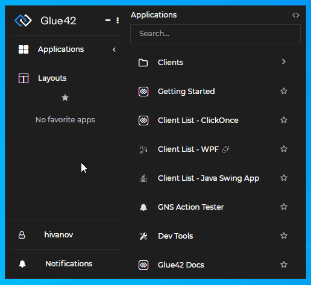

## Application Configuration

The configuration of an application consists of base properties which are common for all types of applications, while type-specific ones are located in the `"details"` property. The bare minimum of properties, regardless of the type of application, is to set the `"name"`, `"type"` and `"details"`. 

User application configuration files should be stored in the `%LocalAppData%\Tick42\UserData\<ENV-REG>\apps` folder where `<ENV-REG>` should be replaced by the environment and region of your [**Glue42 Enterprise**](https://glue42.com/enterprise/) copy (e.g., `T42-DEMO`). The files at this location won't be erased or overwritten in case you change or upgrade your version of [**Glue42 Enterprise**](https://glue42.com/enterprise/).

The configuration files of the apps that come with the [**Glue42 Enterprise**](https://glue42.com/enterprise/) installer are located in the `%LocalAppData%\Tick42\GlueDesktop\config\apps` folder. For more details, see the [application configuration schema](../../../assets/configuration/application.json).

### Window

Window applications are web applications which run in a Glue42 browser window.

```json
{
    "name":"GlueWebsite",
    "title":"Glue42 website",
    "caption": "The website of Glue42",
    "icon": "http://localhost:22080/resources/icons/tick42.ico",
    "type": "window",
    "details":{
         "url":"https://glue42.com",
         "mode": "flat",
         "width": 400,
         "height": 400
    }
}
```

Only `"url"` is required for this type of application. However, for a better user experience, the `"title"` should be set (`"title"` is the name of the app that appears in the App Manager). The `"mode"`, `"width"` and `"height"` properties are responsible for the appearance of the window and the `"caption"` is just a description.

The supported formats for the application icon are ICO, PNG, APNG and JPG.

For more details, see the [application configuration schema](../../../assets/configuration/application.json).

### Workspaces App

A [Workspaces App](../../../glue42-concepts/windows/workspaces/overview/index.html#workspaces_concepts-frame) is a web application that can host Glue42 [Workspaces](../../../glue42-concepts/windows/workspaces/overview/index.html#workspaces_concepts-workspace). Note that [**Glue42 Enterprise**](https://glue42.com/enterprise/) expects only one application definition for a Workspaces App - i.e., one configuration file with `"type"` property set to `"workspaces"`. Having multiple Workspaces App definitions will cause unexpected behavior when handling Workspaces. [**Glue42 Enterprise**](https://glue42.com/enterprise/) comes with a Workspaces UI app and a configuration file for it named `workspaces.json` and located in `%LocalAppData%\Tick42\GlueDesktop\config\apps`. If you are creating your custom Workspaces App, make sure to modify or replace this file with your own configuration file, or delete it, if your application configurations are stored at another location.

The `"type"` property must be set to `"workspaces"`:

```json
{
    "title": "Workspaces UI",
    "type": "workspaces",
    "name": "workspaces-demo",
    "icon": "http://localhost:22080/resources/icons/workspaces.ico",
    "details": {
        "layouts": [],
        "url": "http://localhost:3000"
    },
    "allowMultiple": true,
    "customProperties": {}
}
```

The `"type"` and `"name"` top-level properties are required. The `"url"` and `"layouts"` properties in the `"details"` object are optional.

Use `"url"` to specify where the application is hosted, otherwise it will default to the Workspaces App template distributed with [**Glue42 Enterprise**](https://glue42.com/enterprise/). 

#### Defining Workspace Layouts

Use the `"layouts"` property to predefine [Workspace layouts](../../../glue42-concepts/windows/workspaces/overview/index.html#workspaces_concepts-workspace_layout) that will be loaded automatically when the Workspace App starts:

```json
"details": {
    "layouts": [
        // Standard Workspace layout definition.
        {
            "children": [
                {
                    "type": "column",
                    "children": [
                        {
                            "type": "group",
                            "children": [
                                {
                                    "type": "window",
                                    "appName": "clientlist"
                                }
                            ]
                        },
                        {
                            "type": "group",
                            "children": [
                                {
                                    "type": "window",
                                    "appName": "clientportfolio"
                                }
                            ]
                        }
                    ]
                }
            ]
        },

        // Or a simpler Workspace layout definition for an already existing layout.
        {
            "layoutName": "My Workspace"
        }
    ]
}
```

Use the `"config"` property of the standard Workspace layout object or the `"restoreConfig"` property of the simpler object to pass context to the Workspace or to hide/show its tab header:

```json
"details": {
    "layouts": [
        // Standard Workspace layout definition.
        {
            "children": [
               ...
            ],
            "config": {
                "noTabHeader": true,
                "context": { "glue" : 42 }
            }
        },

        // Or a simpler Workspace layout definition for an already existing layout.
        {
            "layoutName": "My Workspace",
            "restoreConfig": {
                "noTabHeader": true,
                "context": { "glue" : 42 }
            }
        }
    ]
}
```

Hiding the Workspace tab header with the `"noTabHeader"` property prevents the user from manipulating the Workspace through the UI and allows for the Workspace to be controlled entirely through API calls. For instance, a Workspace may be tied programmatically to certain logic, a button, etc., designed to manage its state without any user interaction. For a demonstration of this functionality, see the [Pinned Workspace Tabs](https://github.com/Glue42/templates/tree/master/workspaces-react-pinned-tabs) example on GitHub. It shows how to load default Workspaces with hidden tab headers and control them with custom buttons in the Workspaces App header area.

### Exe

An executable application which can be executed from your OS. This is a basic example for an EXE configuration:

```json
{
    "name":"MyApplication",
    "title":"My application",
    "caption": "An application description",
    "type": "exe",
    "details":{
         "path":"%GDDIR%/../PathToWpfApplication/",
         "command": "WpfApplication.exe",
         "parameters": "param1 param2",
         "width": 400,
         "height": 400
    }
}
```

For more details, see the [application configuration schema](../../../assets/configuration/application.json).

### ClickOnce

Example configuration of a Glue42 enabled ClickOnce application:

```json
{
    "title": "Client List - ClickOnce",
    "type": "clickonce",
    "name": "cl-clickonce",
    "details": {
        "url": "http://enterprise.glue42.com/install/enterprise/demos/ClickOnce/ClickOnceClientProfileDemo.application",
        "width": 1000,
        "height": 400,
        "appParameters": [
            {
                "name": "p1",
                "value": "customParameter"
            }
        ]
    }
}
```

| Property | Description |
|----------|-------------|
| `"type"` | Must be `"clickonce"`. |
| `"url"` | The web address pointing to the physical location where the ClickOnce application is deployed and from where it will be installed on the user machine. |
| `"appParameters"` | Array of objects which define custom parameters that your application can access at runtime through `glue.GDStartingContext.ApplicationConfig.Details.AppParameters`. Each object sets the `"name"` and the `"value"` of a custom parameter. |

For more details, see the [application configuration schema](../../../assets/configuration/application.json).

### Batch file

Batch files can also be included as [**Glue42 Enterprise**](https://glue42.com/enterprise/) applications. Here is an example:

```json
{
    "name":"MyBatchFile",
    "title":"My batch file",
    "caption": "An application description",
    "type": "exe",
    "details":{
         "path":"%GDDIR%/../PathToMyBatchFile",
         "command": "bat.bat",
         "parameters": "param1 param2",
         "width": 400,
         "height": 400
    }
}
```

For more details, see the [application configuration schema](../../../assets/configuration/application.json).

### Node.js

An application which runs under Node.js:

```json
  {
    "title": "MyNodeServer",
    "name": "nodeServer",
    "caption": "Server description",
    "type": "node",
    "service": true,
    "details": {
      "path": "%GDDIR%/PathToMyServer",
      "showConsole": true
    }
  }
```

For a Node.js application, the only type specific property which is required is the `"path"`. It must lead to a JS file which will be executed by Node.js from [**Glue42 Enterprise**](https://glue42.com/enterprise/). For more details, see the [application configuration schema](../../../assets/configuration/application.json).

### Service Window

Service windows are more of a specific usage of a window than an actual type, nevertheless they play a big a role in the development of Glue42 enabled applications, because they can provide data and/or enhance other applications throughout the [**Glue42 Enterprise**](https://glue42.com/enterprise/) life cycle. The window is defined as an application that is hidden and is started along with [**Glue42 Enterprise**](https://glue42.com/enterprise/) (its `"autoStart"` property is set to `true`). An example function of a service window is an app which listens for received emails and notifies applications that require this information.

```json
{
    "name": "EmailsCollector",
    "type": "window",
    "service": true,
    "hidden": true,
    "autoStart": true, 
    "details": {
        "hidden":true,
        "url": "https://myemailcollectorservicewindow.com"
    }
}
```

*Note that the `"hidden"` property in the `"details"` object hides the window from the user while the `"hidden"` top-level key hides it from the user in the App Manager.*

For more details, see the [application configuration schema](../../../assets/configuration/application.json).

### Citrix App

A Citrix Virtual Application can be configured just like any other Glue42 enabled application. It can participate in the Glue42 environment as a first-class citizen and use all Glue42 functionalities. A Citrix application must be configured as a `"citrix"` type and the `"name"` property in the `"details"` key must be set with the exact published name of the Citrix application. Use the `"parameters"` property under `"details"` to pass command line arguments for starting the app.

The following demonstrates a basic Citrix app configuration:

```json
{
    "title": "Client List - Citrix",
    "type": "citrix",
    "name": "clientlist-citrix",
    "details": {
        "name": "Client List",
        "parameters": "--mode=3 --clients=http://localhost:22060/clients",
        "left": 100,
        "top": 100,
        "width": 600,
        "height": 700
    }
}
```

*For system-wide Citrix configuration, see the [System Configuration](../system/index.html#citrix_apps) section.*

## Grouping Applications

<glue42 name="addClass" class="colorSection" element="p" text="Available since Glue42 Enterprise 3.10">

Applications can be grouped in folders and subfolders in the Application Manager via configuration:



To group applications in folders/subfolders, use the `"customProperties"` top-level key in the application configuration file:

```json
{
    "name":"ClientList",
    "title":"Client List",
    "icon": "http://localhost:22080/resources/icons/tick42.ico",
    "type": "window",
    "customProperties": {
        "folder": "Clients"
    },
    "details":{
         "url":"http://localhost:3000/client-list"
    }
}
```

The configuration below shows how to group applications in a subfolder:

```json
{
    ...
    "customProperties": {
        "folder": "Clients/Corporate"
    },
    ...
}
```

## Default Application Bounds

When an application is started from the [Glue42 Toolbar](../../../glue42-concepts/glue42-toolbar/index.html), its initial size and position is defined in the application configuration. When the user moves or resizes an application, [**Glue42 Enterprise**](https://glue42.com/enterprise/) remembers its last position and size and uses them as initial bounds the next time the application starts. Saving the last window bounds is enabled by default for all applications, but can be disabled per application using the `"ignoreSavedLayout"` property in its configuration:

```json
{
    "name": "my-app",
    "type": "window",
    ...
    "ignoreSavedLayout": true,
    "details": {
        "url": "https://example.com",
        ...
    }
}
```

## Configuration Validator

We offer a free [Glue42 Configuration Validator](https://marketplace.visualstudio.com/items?itemName=Tick42.glue42-configuration-validator) tool which you can install as a Visual Studio Code extension. The validator tool has several functionalities:

- Performs real time validation of JSON files on save or change of the active editor.
- Can generate template configurations for different types of Glue42 applications - `"window"`, `"exe"`, `"node"` and Service Windows.
- Can deploy (copy) the created configuration to a specified application configuration folder.

*For more detailed information, see the [README](https://github.com/Tick42/vscode-glue42-app-config-validator/blob/master/README.md) of the Glue42 Configuration Validator.* 