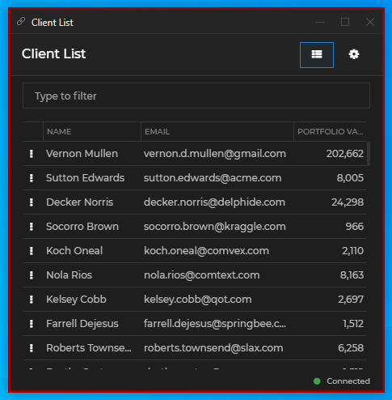
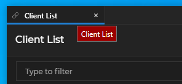
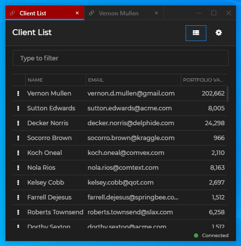
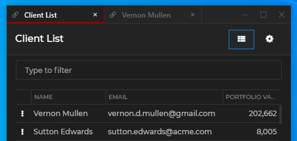
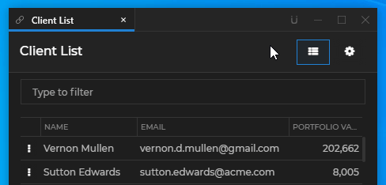
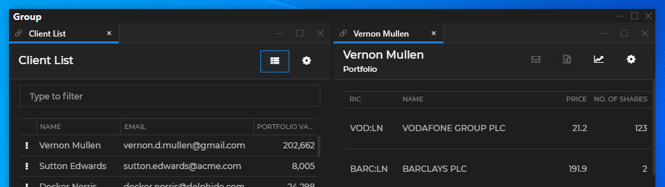

## Overview

By default, [**Glue42 Enterprise**](https://glue42.com/enterprise/) has two built-in themes - **Day** and **Night**. However, you can add more themes or configure the current ones by editing the `themes.json` file located in `%LocalAppData%\Tick42\GlueDesktop\config`.

Some of the configurable theme properties are explained below. For more details, see the [themes configuration schema](../../../assets/configuration/themes.json).

## Theme Properties

Set various theme properties - global theme properties, properties for individual tab windows, window groups.

### Global

The frame of a Glue42 Window (or a group of windows) is its outermost container - changing its thickness will change the visual width and height of the window (window group) without affecting the window content. The border of a window is the border of the actual application loaded inside the Glue42 Window and can be thought of as padding - if you increase the border size, the window content will shrink correspondingly.

*Note that [Glue42 Windows](../../../glue42-concepts/windows/window-management/overview/index.html) with `"mode": "tab"` and `"mode": "flat"` have borders and a frame, while windows with `"mode": "html"` only have a frame.*

Setting the frame thickness and color of single Glue42 Windows:

```json
{
    "properties": {
        "singleFrameThickness": 3,
        "frameColor":"#9c0000"
    }
}
```



The example below shows setting the window border size and color. For the purpose of conveying the difference between the window frame and the window border, the frame is also set:

```json
{
    "properties": {
        "singleFrameThickness": 3,
        "frameColor": "#1e1e1e",
        "borderSize": 2,
        "borderColor": "#9c0000"
    }
}
```


It is possible to indicate visually that a Glue42 Window is on focus by setting thickness and color for a focus frame. For the focus frame to be visible in flat and tab windows, the border must not be set to `0`. For the focus frame to be visible in HTML windows, both the border and the frame must not be set to `0`. Below is an example of setting the size and the color of the window focus frame:

```json
{
    "properties": {
        "borderSize": 2,
        "focusFrameSize": 2,
        "focusFrameColor": "#9c0000"
    }
}
```


Setting the color of text in the Glue42 Window frame:

```json
{
    "properties": {
        "textColor": "#9c0000"
    }
}
```


Setting the tooltip background and text color:

```json
{
    "properties": {
        "tooltips": {
            "foregroundColor": "#ffffff",
            "backgroundColor": "#9c0000"
        }
    }
}
```



Setting the color of the sticky window edges:

```json
{
    "properties": {
        "approachingEdgeColor": "#9c0000"
    }
}
```


Setting the background color of windows when loading:

```json
{
    "properties": {
        "backgroundColor": "#9c0000"
    }
}
```


To set a custom loading animation for Glue42 Windows, specify a path to a XAML file - either absolute or relative to the `%LocalAppData%\Tick42\GlueDesktop\config` folder:

```json
{
    "properties": {
        "loadingAnimation": "../custom/spinner.xaml",
    }
}
```

Setting custom text, font, font size and text color for the Glue42 Window loader:

```json
{
    "properties": {
        "loadingAnimation": "../custom/spinner.xaml",
        "loadingText": "My custom loader text.",
        "loadingTextFont": "Calibri",
        "loadingTextFontSize": 20,
        "loadingTextColor": "#eeeeee"
    }
}
```


### Tabs

The theme properties for individual tab windows are located under the `"tabs"` key in the `themes.json` file.

Setting the color of the active tab:

```json
{
    "tabs": {
        "activeTabColor": "#9c0000"
    }
}
```



Setting the color of inactive tabs:

```json
{
    "tabs": {
        "tabColor": "#9c0000"
    }
}
```


Setting the color of tabs on hover:

```json
{
    "tabs": {
        "hoverTabColor": "#9c0000"
    }
}
```


Setting the color of the tab header:

```json
{
    "tabs": {
        "headerColor": "#9c0000"
    }
}
```


Setting the frame size and color of the active tab:

```json
{
    "tabs": {
        "activeTabFrameThickness": "0, 0, 1, 3",
        "activeTabFrameColors": "#343434, #343434, #9c0000, #9c0000"
    }
}
```



Setting the size, color, hover color and tooltip of the tab "Close" button:

```json
{
    "tabs": {
        "tabCloseButtonSize": 10,
        "closeButton": {
            "color": "#696969",
            "hoverColor": "#9c0000",
            "tooltip": "Close the tab"
        }
    }
}
```


Setting the hover foreground color of tab header buttons and the hover background color of the "Close" button:

```json
{
    "tabs": {
        "headerButtons": {
            "hoverForegroundColor": "#9c0000",
            "close": {
                "hoverBackgroundColor": "#ffffff"
            }
        }
    }
}
```


Setting the tooltips of the Sticky button and its foreground color when pressed and when hovered over in a pressed state:

```json
{
    "tabs": {
        "headerButtons": {
            "sticky": {
                "pressedForegroundColor": "#9c0000",
                "pressedHoverForegroundColor": "#ffffff",
                "tooltip": "Turn on stickiness",
                "pressedTooltip": "Turn off stickiness"
            }
        }
    }
}
```



### Window Groups

The theme properties for Glue42 Window groups are located under the `"group"` key in the `themes.json` file.

Setting the height of the group header and the font weight and size of the group title:

```json
{
    "group": {
        "titleFontWeight": "Bold",
        "titleSize": 14,
        "headerHeight": 20
    }
}
```



Setting the size, hover foreground and background color of the buttons in the group header:

```json
{
    "group": {
        "buttons": {
            "iconSize": 12.0,
            "hoverForegroundColor": "#9c0000",
             "close": {
                "hoverBackgroundColor": "#ffffff"
             }
        }
    }
}
```


Setting a taskbar icon and a title for the window group:

```json
{
    "group": {
        "icon": "custom-group-icon.ico",
        "title": "Glue42 Window Group"
    }
}
```

*The specified group icon file must be an ICO file and must be placed in the `%LocalAppData%\Tick42\GlueDesktop\assets\images` folder.*

Setting a taskbar icon and a title for a tab group:

```json
{
    "group": {
        "tabGroupIcon": "tab-groups.ico",
        "tabGroupTitle": "Glue42 Tab Group"
    }
}
```

*The specified tab group icon file must be an ICO file and must be placed in the `%LocalAppData%\Tick42\GlueDesktop\assets\images` folder.*