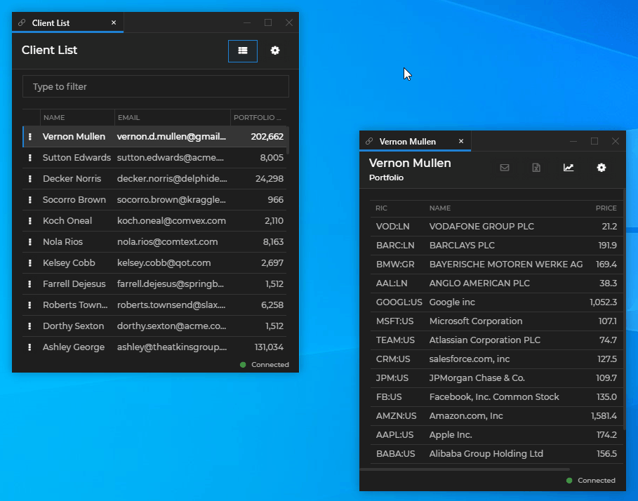

## Channels Configuration

Channels are based on [Shared Contexts](../../../glue42-concepts/data-sharing-between-apps/shared-contexts/overview/index.html) - named objects, holding cross-application data in the form of key/value pairs. The Glue42 [Channels](../../../glue42-concepts/data-sharing-between-apps/channels/overview/index.html) are defined in a `channels.json` file located in `%LocalAppData%\Tick42\GlueDesktop\config`. It contains an array of objects, each one defining a different Channel.

Here is an example of minimal definition of two Channels - red and blue:

```json
[
    {
        "name": "Red",
        "meta": {
            "color": "red"
        }
    },
    {
        "name": "Blue",
        "meta": {
            "color": "#66ABFF"
        }
    }
]
```

| Property | Description |
|----------|-------------|
| `name` | Required. Unique ID of the Channel. |
| `meta` | Required. Meta data about the Channel. The minimum you must specify here is the Channel color. You can also define other meta data which will be visible to all applications using the Channel. |
| `color` | The Channel color, displayed on the Channel Selector UI and on each app using that Channel. Can be either an HTML color name or a hexadecimal color code. |

You can define any number of Channels in [**Glue42 Enterprise**](https://glue42.com/enterprise/) for your applications to use.

Here is an example of adding a custom purple Channel to the already existing list of Channels in [**Glue42 Enterprise**](https://glue42.com/enterprise/):

```json
{
    "name": "Dark Purple",
    "meta": {
        "color": "#6400b0"
    }
}
```



## Adding Channels to Your App

To add the Channel selector to your window, set `"allowChannels"` to `true` in your [application configuration](../application/index.html) file, under the `"details"` top-level key:

```json
{
    "title": "Client List 🔗",
    "type": "window",
    "name": "channelsclientlist",
    "icon": "https://dev-enterprise-demos.tick42.com/resources/icons/clients.ico",
    "details": {
        "url": "https://dev-enterprise-demos.tick42.com/client-list-portfolio-contact/#/clientlist",
        "mode": "tab",
        "allowChannels": true
    }
}
``` 