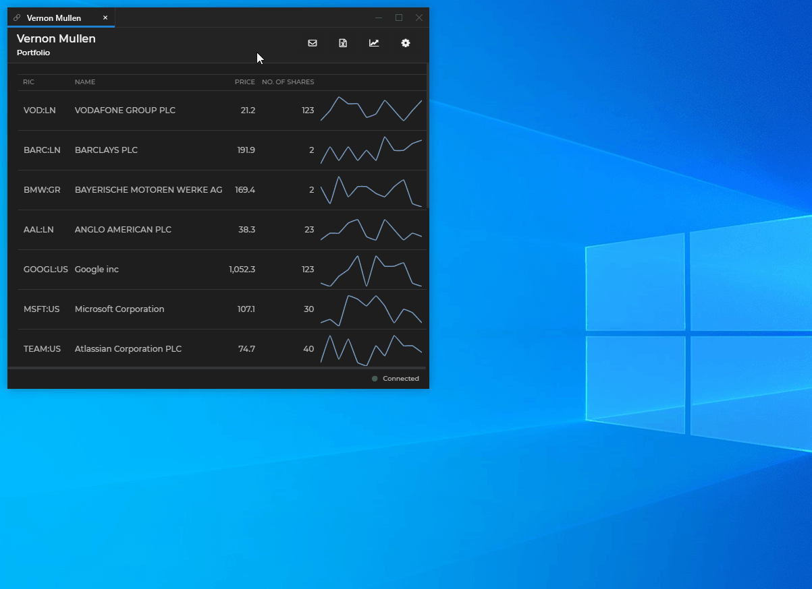
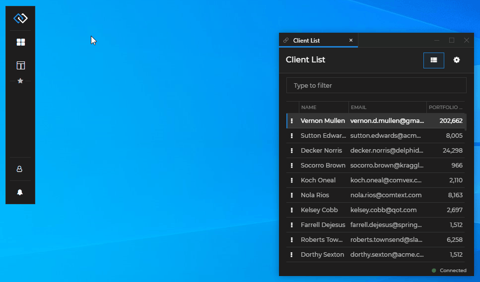
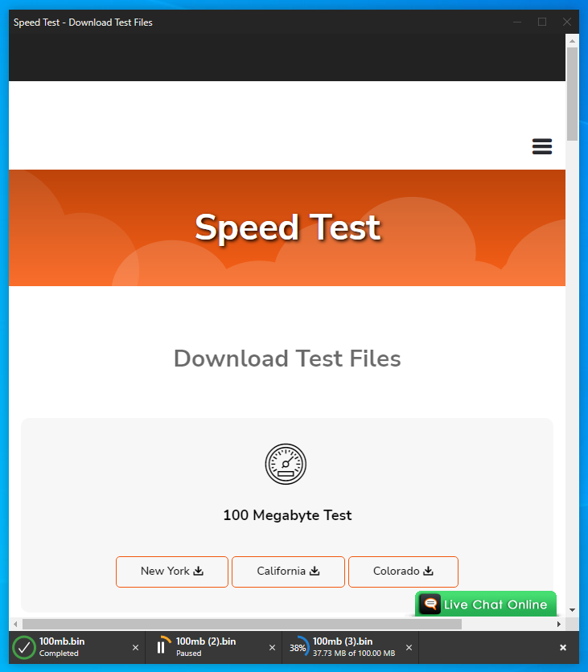
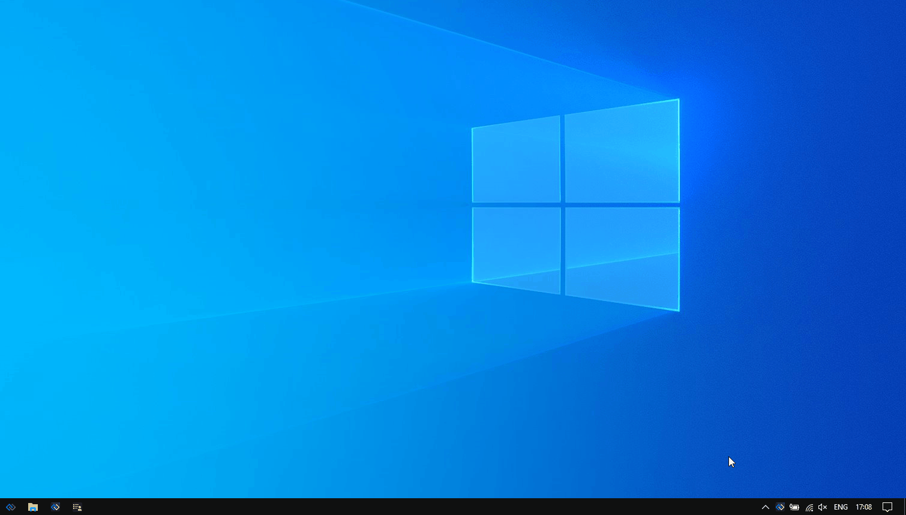

## What is Glue42 Enterprise?

[**Glue42 Enterprise**](https://glue42.com/enterprise/) is a real-time user interface (UI) integration platform. Apps are combined at the user interface level to provide a better user experience (UX). UI integration makes it easier for users to access the right data and functionality at the right time and also reduce the number of times they need to copy/paste their way between one app and another. The objective of [**Glue42 Enterprise**](https://glue42.com/enterprise/) is therefore to provide intuitive paths from one function to the next, in order to deliver business outcomes quickly and reliably. [**Glue42 Enterprise**](https://glue42.com/enterprise/) allows developers to connect to any (legacy, third-party or modern) web or desktop app and have multiple apps interact with each other in real time.

[**Glue42 Enterprise**](https://glue42.com/enterprise/) offers [Connectors](../../../connectors/general-overview/index.html) for integrating Microsoft Office and other products with web and desktop apps.

See also our [**Glue42 Core**](https://glue42.com/core/) project - the world's first open source integration platform for web apps! The [**Glue42 Core**](https://glue42.com/core/) [source code](https://github.com/Glue42/core) is available on GitHub.

### Why UI Integration?

**The Challenge Faced by Users**

Mobile and web apps have proven that user interface (UI) design is a vital component of software development. User experience (UX), however, isn't about how pretty an app is, but rather how easy it is to use in conjunction with other apps and data sources. Is the information a user needs at their fingertips? Is it easy to do everyday tasks or is the process lengthy, complex and cumbersome? The companies that have pioneered user experience centric design have had great success and everyone else is running to catch up.

UX has often been a secondary consideration for in-house apps - or at least in-house teams don't have the resources of Apple or Google to devote to UX. Coupled with this is the fact that users depend on not one, but multiple apps to do their jobs successfully. While `ALT+TAB` has gotten better over the years and window snapping has made it easier to place apps side by side, the average user still faces a huge challenge when working with data across multiple apps.

One solution is to migrate desktop legacy apps to web apps that can pull data from many different databases and offer a variety of views. This isn't always practical as legacy apps are often hard to migrate without a significant expenditure and disruption. Secondly, there are many third-party apps that simply can't be migrated but are still critical, such as MS Office or Salesforce. And what about in-house developed web and mobile apps? How can they be easily integrated with the legacy apps without significant work?

Another solution is to use workflow services. This allows a quick DIY approach to syncing data between (web) apps, but these services have significant drawbacks. The integrations are quite limited and there are significant delays (sometimes minutes) after a trigger is fired in one app to when it appears in the connected app. [**Glue42 Enterprise**](https://glue42.com/enterprise/) offers a way to improve this situation through UX Integration that is powered by a high performance real-time messaging infrastructure.

### Explore Glue42 Enterprise

- Download the [**Glue42 Enterprise**](https://glue42.com/enterprise/) trial version from [here](https://glue42.com/free-trial/).
- Go to the [How To...](../../how-to/install/index.html) section for info on how to install [**Glue42 Enterprise**](https://glue42.com/enterprise/).
- See how to [use **Glue42 Enterprise**](#using_glue42_enterprise) and how to [customize your **Glue42 Enterprise** copy](../../how-to/rebrand-glue42/index.html).
- Get acquainted with the core [Glue42 Concepts](../../../glue42-concepts/glue42-toolbar/index.html) and see how to work programmatically with [**Glue42 Enterprise**](https://glue42.com/enterprise/).
- Explore various Glue42 examples with different technologies in the [Examples](../../../developers/examples/index.html) section.

## Using Glue42 Enterprise

[**Glue42 Enterprise**](https://glue42.com/enterprise/) is a desktop integration platform which brings order and efficiency to the business desktop. It helps you declutter your workspace and make the most use of the precious desktop real estate when your daily workflow requires you to use multiple apps. [**Glue42 Enterprise**](https://glue42.com/enterprise/) allows developers to integrate apps not only at a UI level - providing you with the look and feel of a single app, but also at a functional level - enabling apps to interoperate by communicating with each other. You no longer need to copy-paste your way through several apps multiple times a day just to get the necessary information - [**Glue42 Enterprise**](https://glue42.com/enterprise/) reduces this tiresome and time consuming process to just a single click! What's more, this works for legacy and modern desktop or web apps, and for apps using different technologies - JavaScript, Java, .NET, VBA, Delphi, Node.js, Angular, React, etc.

*In the following sections you will get to know [**Glue42 Enterprise**](https://glue42.com/enterprise/) by using the trial demo edition. If you haven't already done so, download the trial installer from the [official Glue42 site](https://glue42.com/free-trial/) and see the [How to Install](../../how-to/install/index.html) section. Keep in mind that all functionalities and UIs of [**Glue42 Enterprise**](https://glue42.com/enterprise/) can be fully redesigned and customized to suit your specific needs and requirements.*

### Glue42 Toolbar

The [Glue42 Toolbar](../../../glue42-concepts/glue42-toolbar/index.html) is a customizable app which acts as an app hub and offers useful shortcuts and functionalities. Start your Glue42 enabled apps from here, mark your favorite apps, save and restore Workspaces and Layouts, define a default Global Layout that will be auto loaded on startup, search, see notifications, customize settings, restart or shutdown [**Glue42 Enterprise**](https://glue42.com/enterprise/). There are two options for a Toolbar - a Floating Toolbar and a Launchpad.

#### Floating Toolbar

The Floating Toolbar is the default Toolbar for the demo. It is always on screen, you can move it anywhere by dragging or minimize it.

#### Launchpad

The Launchpad is a Windows style Toolbar that is hidden on startup and is activated by pressing a configurable shortcut. Showing the Toolbar only on demand saves screen space and makes locating it much easier. The Launchpad is best suited for power users who prefer working with keyboard shortcuts.

### Window Management

[**Glue42 Enterprise**](https://glue42.com/enterprise/) offers you an extremely flexible way of arranging all your Glue42 enabled apps on your desktop:

- Stick or unstick windows to make them move, resize or close together.
- Organize your apps in tab groups.
- Drag tab windows or tab groups directly into other tab windows or tab groups.
- Tear out tabs as independent windows.
- Move and resize windows or window groups.
- Maximize, minimize and collapse windows or window groups.

### Workspaces

[Workspaces](../../../glue42-concepts/windows/workspaces/overview/index.html) allow you to arrange multiple apps within the same visual window (Frame). This is performed either programmatically or by dragging and dropping floating windows in a Workspace, rearranging windows that are already in the Workspace or extracting windows from the Workspace. Each app is treated as an individual building block that can be added, removed, moved or resized within the unifying Frame. Save easily Workspace layouts and restore them within the same Frame or even in different Frames. The Frame can hold multiple Workspaces (as tabs) and can also be maximized, minimized or resized. When a Workspace layout is restored, the arrangement of the apps participating in it and their context data is preserved - resume working right from where you left off.

### App Data Synchronization

Besides UI integration, [**Glue42 Enterprise**](https://glue42.com/enterprise/) brings app integration on a functional level. By being able to communicate with each other, your apps will not only look as one unified macro app, but will start working together as components of a single system as well. [**Glue42 Enterprise**](https://glue42.com/enterprise/) offers the developers several different approaches to [sharing data between apps](../../../glue42-concepts/data-sharing-between-apps/shared-contexts/overview/index.html), which guarantees flexibility in finding and implementing swift and reliable development solutions for your apps.

In the example below, apps communicate and synchronize cross-app data between each other by using the Glue42 [Channels](../../../glue42-concepts/data-sharing-between-apps/channels/overview/index.html):

### Global Layouts

When you set up the apps on your desktop the way you like them, or arrange a set of apps and/or workspaces needed for a specific task, save this Layout and later restore it when you need to use it again. All your apps will be restored with the same position, size and state on the desktop. What's more, mark a saved Layout as a default Global Layout and it will be restored upon startup of [**Glue42 Enterprise**](https://glue42.com/enterprise/):

### Glue42 Connectors

[**Glue42 Enterprise**](https://glue42.com/enterprise/) provides [Connectors](../../../connectors/general-overview/index.html) for third-party apps like MS Office, Bloomberg, Salesforce, Fidessa, etc. The Glue42 Connectors allow you to continue using all apps with which you are already familiar and comfortable.

See how convenient and easy it is to open a client's portfolio in an Excel sheet at the click of a button:

The Glue42 Bloomberg Connector enables the interaction between the Bloomberg Components and the Glue42 enabled apps. One of the features of the BBG Connector is the synchronization between the Bloomberg Groups and the Glue42 Channels. See below how a financial instrument is updated in a BBG Component (or in a Glue42 enabled app on the corresponding Channel) and the change is reflected in all other apps and components:

### Notifications

The [Glue42 Notifications Service](../../../glue42-concepts/notifications/overview/index.html) receives notifications from all defined notification sources and delivers them directly to your desktop via a notifications UI. The notifications can contain buttons with prioritized actions, which allows you to respond quickly and accordingly by opening the necessary apps with a single click.

Use the demo GNS Action Tester to explore the notifications UI:

### Global Search

The Global Search app enables you to search through multiple search providers (apps, backend services, etc.), providing you almost instantly with the necessary information. This saves you the time and trouble of performing multiple searches in different apps until you finally find what you need. The Global Search is activated by pressing a configurable shortcut. [**Glue42 Enterprise**](https://glue42.com/enterprise/) by default is a search provider for apps, Layouts and actions (switching the theme, saving and restoring Layouts, opening URLs directly in Glue42 Windows, restarting or shutting down Glue42).

### Themes

Change the theme of [**Glue42 Enterprise**](https://glue42.com/enterprise/) from the "Settings" button in the Glue42 Toolbar dropdown menu. [Themes](../../../glue42-concepts/windows/themes/overview/index.html) can be customized and new themes can be added. Instrument your apps to track the current theme, which will integrate them visually and further enhance the perception that all your different apps are part of a single enterprise program.

### Platform Features

[**Glue42 Enterprise**](https://glue42.com/enterprise/) offers a variety of other features - a Logger API, extensible installer, adding extensions to web apps, Hotkeys, support for Flash, zooming, downloading files and more.

See some of the [Glue42 Platform Features](../../../glue42-concepts/glue42-platform-features/index.html) below.

#### Hotkeys

Register Hotkeys (keyboard shortcuts) from your apps for performing certain actions. See all registered Hotkeys from the "Hotkeys" menu item of the [**Glue42 Enterprise**](https://glue42.com/enterprise/) tray icon:

#### Zooming

[**Glue42 Enterprise**](https://glue42.com/enterprise/) supports window zooming through standard keyboard shortcuts (`CTRL + =` for zooming in, `CTRL + -` for zooming out and `CTRL + 0` for restoring the window to the default zoom factor) or by using the "CTRL" key and the mouse wheel:

#### Downloading Files

Download files from the web in Glue42 Windows:

### Applications View

Access a general overview of all running hidden or visible apps from the [**Glue42 Enterprise**](https://glue42.com/enterprise/) tray icon. Right click on the tray icon and select "Applications" from the menu.

| Column | Description |
|--------|-------------|
| `APPLICATION` | The app name. |
| `PID` | The process ID. |
| `MEMORY` | The process memory consumption. The memory consumption value displayed for apps with the same `PID` will be the same and will be an aggregate of the consumed memory by all apps within that process. |
| `TYPE` | The type of the app - `window`, `exe` or `node`|
| `WINDOW`| The window ID within [**Glue42 Enterprise**](https://glue42.com/enterprise/). |
| `API VER` | Version of the Glue42 library used in the app. |
| `STARTED` | The time the app was started. |
| `VISIBLE` | Whether the app is visible or hidden. |
| `ACTIONS` | From this column you can bring the app window on focus, open the Dev Tools for the window or close the app. |

### Keep Learning

This section and the trial demo offer only a quick and limited glimpse into the [**Glue42 Enterprise**](https://glue42.com/enterprise/) platform and its unparalleled capabilities. All functionalities and UIs are entirely customizable in order to meet your specifications. This allows for outstanding tailored enterprise solutions, completely fulfilling your business needs and requirements. See the [results our clients have achieved](https://glue42.com/company/about-us/) by using Glue42 - a true testament to the magnitude of [**Glue42 Enterprise**](https://glue42.com/enterprise/)!

For more information, visit the [official Glue42 site](https://glue42.com/) or explore the [Glue42 Concepts](../../../glue42-concepts/glue42-toolbar/index.html) documentation.

[Contact us](https://glue42.com/contacts/) at `info@glue42.com` to request a tailored demo or to discuss the [**Glue42 Enterprise**](https://glue42.com/enterprise/) platform and how it can benefit you and your business processes!

## Glue42 Enterprise for Developers

#### Offer Existing Functionality to Other Apps

- [Interop](../../../glue42-concepts/data-sharing-between-apps/interop/overview/index.html) - offer functionality to other apps; discover apps offering functionality; publish and subscribe to data streams;

- [Pub/Sub](../../../glue42-concepts/data-sharing-between-apps/pub-sub/overview/index.html) - raw pub/sub support for apps already using a pub/sub technology;

#### Share Data Between Apps

- [Shared Contexts](../../../glue42-concepts/data-sharing-between-apps/shared-contexts/overview/index.html) - named objects, storing cross-app data;

- [Channels](../../../glue42-concepts/data-sharing-between-apps/channels/overview/index.html) - named contexts, allowing users to dynamically group and instruct apps to work together;

#### Manage Your Glue42 Enabled Apps

- [Glue42 Toolbar](../../../glue42-concepts/glue42-toolbar/index.html) - use the Glue42 Floating Toolbar or the Glue42 Launchpad apps as app hubs;

- [Apps](../../../glue42-concepts/application-management/overview/index.html) - manage your apps and app instances;

- [App Preferences](../../../glue42-concepts/app-preferences/overview/index.html) - save and restore user-specific app preferences;

- [Intents](../../../glue42-concepts/intents/overview/index.html) - find and start the right app, offer the user a list of all appropriate apps for performing a certain action;

#### Advanced Window Management

- [Workspaces UI](../../../glue42-concepts/windows/workspaces/overview/index.html) - fully customizable Glue42 web app for hosting Glue42 enabled apps in slick and highly efficient Workspace layouts;

- [Window Management](../../../glue42-concepts/windows/window-management/overview/index.html) - create and manipulate windows;

- [Layouts](../../../glue42-concepts/windows/layouts/overview/index.html) - save the arrangement of any set of Glue42 enabled apps and restore it later;

#### Notifications

- [Notifications](../../../glue42-concepts/notifications/overview/index.html) - normalize, consolidate and deliver notifications directly to the desktop;

#### Searching

- [Global Search](../../../glue42-concepts/global-search/index.html) - enable search across multiple search providers;

#### Gather System and App Feedback

- [Metrics](../../../glue42-concepts/metrics/overview/index.html) - gather extensive metrics describing the user journey, app performance and more;

#### Glue42 Server

- [Glue42 Server](../../../glue42-concepts/glue42-server/index.html) - use this server-side solution to provide data to Glue42 (apps, Layouts, preferences), monitor and interact with users running Glue42.

#### Integrate Third-Party Apps

- [Connectors](../../../connectors/general-overview/index.html) - take advantage of the functionalities offered by third-party apps like Excel, Outlook, Bloomberg Terminal, Salesforce Lightning, etc.