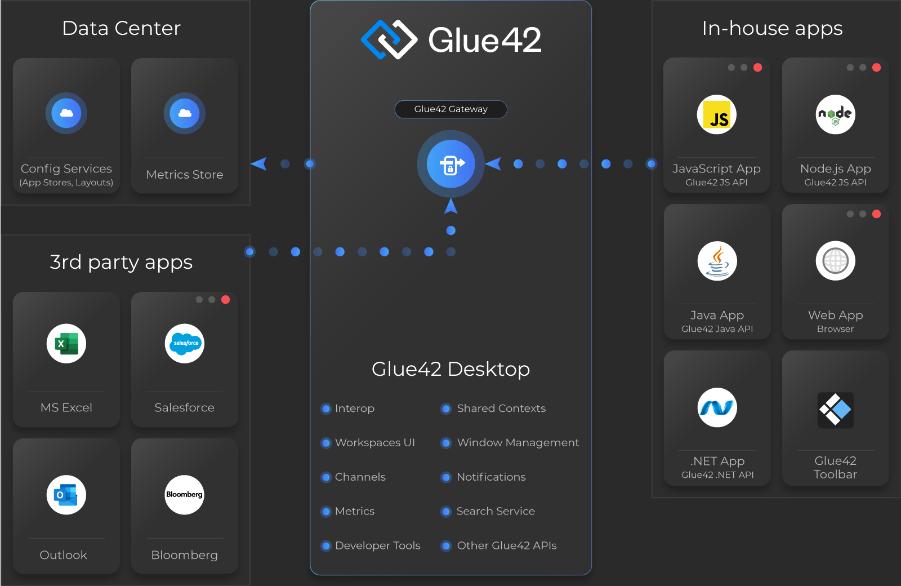

## Architectural Diagram

## How It All Works

The main components of [**Glue42 Enterprise**](https://glue42.com/enterprise/) are **Glue42 Desktop** and the Glue42 Gateway. These two components can be packed together or deployed independently (see [Deployment](../deployment/index.html#installation_and_setup)).

### Glue42 Desktop

**Glue42 Desktop** is an Electron based application which offers APIs for:

[Application Management](../../../glue42-concepts/application-management/overview/index.html)

- Loading the list of application configurations for the current user;
- Managing the applications life-cycle (starting/stopping apps);

[Window Management](../../../glue42-concepts/windows/window-management/overview/index.html)

- Hosting web apps in desktop windows;
- Sticking windows together;
- Advanced window management - [Workspaces UI](../../../glue42-concepts/windows/workspaces/overview/index.html)
- Saving and restoring layouts - [Layouts](../../../glue42-concepts/windows/layouts/overview/index.html)

[Data Sharing Between Apps](../../../glue42-concepts/data-sharing-between-apps/overview/index.html) 

- Synchronizing cross-application data by publishing and subscribing for updates of data objects - [Shared Contexts](../../../glue42-concepts/data-sharing-between-apps/shared-contexts/overview/index.html) 
- UI based on Shared Contexts - [Channels](../../../glue42-concepts/data-sharing-between-apps/channels/overview/index.html) 
- Registering and invoking methods - [Interop](../../../glue42-concepts/data-sharing-between-apps/interop/overview/index.html)

The Glue42 APIs are available in JavaScript/TypeScript (as well as through lightweight Glue42 React and Angular wrappers) for web applications and in .NET, Java, and COM/VBA for desktop applications.

**Glue42 Desktop** is highly customizable and many of its features can be enabled, disabled or [re-configured](../../../developers/configuration/overview/index.html).

### Glue42 Gateway

The Glue42 Gateway is a transport with domain specific protocols. It enables the communication between applications running in [**Glue42 Enterprise**](https://glue42.com/enterprise/). 
By default, it uses WebSockets for delivering messages to applications. Other options are also available upon request. The Glue42 Gateway is written in Clojure and can be transpiled to Java and JavaScript.

### Application Stores

[**Glue42 Enterprise**](https://glue42.com/enterprise/) loads the list of applications available to the user from a pre-configured set of [application stores](../../../glue42-concepts/application-management/overview/index.html#application_stores). They can be of different type:

- Local stores - definitions are read from folders on the machine that is running [**Glue42 Enterprise**](https://glue42.com/enterprise/);
- Remote stores - definitions are fetched from a REST service;

To add an application to [**Glue42 Enterprise**](https://glue42.com/enterprise/), you need to add it to an application store.

### Connectors

[**Glue42 Enterprise**](https://glue42.com/enterprise/) comes with a set of [Connectors](../../../connectors/general-overview/index.html) for integrating third-party applications (MS Office, Bloomberg, Salesforce, etc.) with Glue42 enabled applications. The Connectors expose functionalities provided by a specific third-party application, so that they can be re-used in Glue42 enabled apps.The Glue42 [Excel Connector](../../../connectors/ms-office/excel-connector/javascript/index.html), for instance, allows applications to open an Excel sheet, populate it with data from the application and receive updates when the data in Excel is changed.

## Additional Services

### Notifications

The [Glue42 Notification Service](../../../glue42-concepts/notifications/overview/index.html) (GNS) handles notifications from GNS servers and delivers them to the end-user via a notifications UI.

### Global Search

The [Global Search](../../../glue42-concepts/global-search/index.html) performs global searches on all defined search providers and returns consolidated results to the user.

### Metrics

Extensive [Metrics](../../../glue42-concepts/metrics/overview/index.html) for tracking the user journey can be collected from all Glue42 enabled apps and published to a data center. 