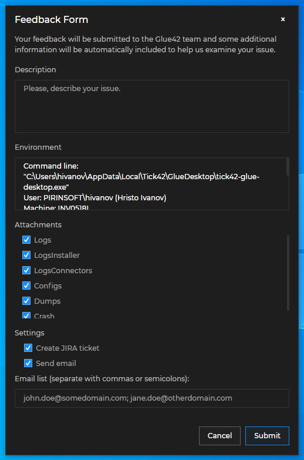

## Login Screen

[**Glue42 Enterprise**](https://glue42.com/enterprise/) allows showing a login screen before the first app is loaded. This is useful if you have shared authentication between your apps (SSO) and you want the user to log in just once.

To enable using a login screen, you have to modify the system configuration of [**Glue42 Enterprise**](https://glue42.com/enterprise/) and create a [configuration file](../../../../developers/configuration/application/index.html) for your SSO app. To complete the authentication process and allow the user access, you have to signal Glue42 that the user has logged in successfully.

### Configuration

The SSO app is a special system app that is loaded on startup of [**Glue42 Enterprise**](https://glue42.com/enterprise/) and allows the user to authenticate. If authentication is successful, then all other app configurations are fetched and loaded based on user permissions.

There are two ways you can define your SSO app:

- By defining a standalone SSO app [configuration file](../../../../developers/configuration/application/index.html), adding it to a System App Store of [**Glue42 Enterprise**](https://glue42.com/enterprise/) and enabling SSO authentication from the `system.json` file of [**Glue42 Enterprise**](https://glue42.com/enterprise/) (see [Standalone SSO App Definition](#login_screen-configuration-standalone_sso_app_definition)). This is the recommended approach, as it allows you more freedom in configuring your SSO app.

- By defining your SSO app directly in the `system.json` file of [**Glue42 Enterprise**](https://glue42.com/enterprise/) (see [SSO Via System Configuration](#login_screen-configuration-sso_via_system_configuration)). Not recommended, as this way you can control only a very limited number of properties for the SSO app.

*Note that no matter how you choose to define your SSO app, it will have [cookies manipulation](../../../../glue42-concepts/glue42-platform-features/index.html#cookies) and [access to OS info](../../../../glue42-concepts/glue42-platform-features/index.html#accessing_os_info) enabled by default, even if you don't set these properties in its configuration file. This is because SSO apps usually need such permissions in order to complete the authentication process.*

#### Standalone SSO App Definition

If you decide to use a standalone [configuration file](../../../../developers/configuration/application/index.html) for your SSO app, follow these steps:

1. Enable the login screen using the `"ssoAuth"` top-level key of the `system.json` file of [**Glue42 Enterprise**](https://glue42.com/enterprise/) located in `%LocalAppData%\Tick42\GlueDesktop\config` and set its `"authController"` property to `"sso"`:

```json
{
    "ssoAuth": {
        "authController": "sso"
    }
}
```

*See also the [authentication controller schema](../../../../assets/configuration/authController.json).*

2. Create a [configuration file](../../../../developers/configuration/application/index.html) for your SSO app.

*Note that it is mandatory to use `"sso-application"` as a name for your app in the definition. Otherwise, [**Glue42 Enterprise**](https://glue42.com/enterprise/) won't recognize your SSO app and will load the built-in login screen.*

The following is an example configuration for an SSO app:

```json
{
    "name":"sso-application",
    "title":"My SSO App",
    "icon": "https://example.com/icon.ico",
    "type": "window",
    "details":{
        "url":"https://example.com",
        "mode": "html",
        "width": 400,
        "height": 400,
        "startLocation": "center"
    }
}
```

3. Add your SSO app configuration to a System App Store of [**Glue42 Enterprise**](https://glue42.com/enterprise/). A System App Store contains system app configurations that are loaded before all other app definitions. Use the `"systemAppStores"` top-level key of the `system.json` file to define a System App Store and provide the location of your SSO app configuration. The System App Store can be any [App Store](../../../../glue42-concepts/application-management/overview/index.html#app_stores) type supported by [**Glue42 Enterprise**](https://glue42.com/enterprise/) - local, remote or from a Glue42 Server.

The following is an example configuration for a System App Store pointing to the location of the configuration files for the system apps:

```json
{
    "systemAppStores": [
        {
            "type": "path",
            "details": {
                "path": "./config/system-apps"
            }
        }
    ]
}
```

#### SSO Via System Configuration

*Note that this approach isn't recommended, because you can define only a very limited number of properties for your SSO app.*

Enable the login screen using the `"ssoAuth"` top-level key of the `system.json` file of [**Glue42 Enterprise**](https://glue42.com/enterprise/) located in `%LocalAppData%\Tick42\GlueDesktop\config` and set its `"authController"` property to `"sso"`. Use the `"options"` property to provide the location of the login screen and settings for the Glue42 Window in which it will be loaded:

```json
{
    "ssoAuth": {
        "authController": "sso",
        "options": {
            "url": "http://localhost:3000/",
            "window": {
                "width": 500,
                "height": 730,
                "mode": "flat"
            }
        }
    }
}
```

The `"options"` object has the following properties:

| Property | Type | Description |
|----------|------|-------------|
| `"url"` | `string` | Location of the login screen. If not provided, will default to the location of the built-in login screen of [**Glue42 Enterprise**](https://glue42.com/enterprise/). |
| `"window"` | `object` | Settings for the Glue42 Window in which the login screen will be loaded. |
| `"keepAlive"` | `boolean` | If `true`, [**Glue42 Enterprise**](https://glue42.com/enterprise/) won't close the login window. This way, you can hide it yourself and use it to refresh the authentication parameters (user, token and headers) when necessary. |

The `"window"` object has the following properties:

| Property | Type | Description |
|----------|------|-------------|
| `"width"` | `integer` | Width of the login window. |
| `"height"` | `integer` | Height of the login window. |
| `"mode"` | `string` | Glue42 Window [mode](../../../../glue42-concepts/windows/window-management/overview/index.html#window_modes). Possible values are `"html"` (default), `"flat"` and `"tab"`. |

*See also the [authentication controller schema](../../../../assets/configuration/authController.json).*

### Authentication

To allow the user access after authenticating, you must signal [**Glue42 Enterprise**](https://glue42.com/enterprise/) that the authentication process is complete. Use the `authDone()` method of the `glue42gd` object which is injected in the global `window` object. It accepts an optional object as a parameter in which you can specify the name of the authenticated user, а token and headers:

```javascript
const options = {
    user: "john.doe@org.com",
    token: "token",
    headers: {
        "name": "value"
    }
};

glue42gd.authDone(options);
```

The optional object passed as an argument to `authDone()` has the following properties:

| Property | Type | Description |
|----------|------|-------------|
| `user` | `string` | The user ID will be set as a value of the `sid` property of `glue42gd`. Can be used for visualization purposes. |
| `token` | `string` | The token will be applied to each request to the remote stores or the [Glue42 Server](../../../../glue42-concepts/glue42-server/index.html). |
| `headers` | `JSON object` | Extra headers that will be passed to the remote stores or the [Glue42 Server](../../../../glue42-concepts/glue42-server/index.html). |

## Remote Apps & Layouts

In the standard [**Glue42 Enterprise**](https://glue42.com/enterprise/) deployment model, app definitions aren't stored locally on the user machine, but are served remotely. Remote apps and [Layouts](../../../../glue42-concepts/windows/layouts/overview/index.html) can be hosted and retrieved using [Glue42 Server stores](#remote_apps__layouts-glue42_server) and/or [REST stores](#remote_apps__layouts-rest_stores).

The settings for the app and Layout stores are defined in the `system.json` file of [**Glue42 Enterprise**](https://glue42.com/enterprise/) located in `%LocalAppData%\Tick42\GlueDesktop\config`. The app store settings are under the `"appStores"` top-level key, the Layout store settings are under the `"layouts"` top-level key.

*Note that [**Glue42 Enterprise**](https://glue42.com/enterprise/) respects the FDC3 standards and can retrieve standard Glue42, as well as FDC3-compliant app definitions. For more details on working with FDC3-compliant apps, see the [FDC3 Compliance](../../../fdc3-compliance/index.html) section, the [FDC3 App Directory documentation](https://fdc3.finos.org/docs/app-directory/overview) and the [FDC3 Application](https://fdc3.finos.org/schemas/2.0/app-directory#tag/Application) schema.*

### Glue42 Server

#### Apps

To configure [**Glue42 Enterprise**](https://glue42.com/enterprise/) to fetch app configurations from a [Glue42 Server](../../../../glue42-concepts/glue42-server/index.html), set the `"type"` property of the app store configuration object to `"server"`:

```json
{
    "appStores": [
        {
            "type": "server"
        }
    ]
}
```

*For more details, see [App Stores > Glue42 Server Stores](../../../../glue42-concepts/application-management/overview/index.html#app_stores-glue42_server).*

#### Layouts

To configure [**Glue42 Enterprise**](https://glue42.com/enterprise/) to fetch Layouts from a [Glue42 Server](../../../../glue42-concepts/glue42-server/index.html), set the `"type"` property of the `"store"` object to `"server"`:

```json
{
    "layouts" : {
        "store": {
            "type": "server"
        }
    }
}
```

*For more details, see [Layout Stores](../../../../glue42-concepts/windows/layouts/overview/index.html#layout_stores).*

### REST Stores

#### Apps

To configure a connection to the REST service providing the app store, add a new entry to the `"appStores"` top-level key of the `system.json` file:

```json
{
    "appStores": [
        {
            "type": "rest",
            "details": {
                "url": "http://localhost:3000/appd/v1/apps/search",
                "auth": "no-auth",
                "pollInterval": 30000,
                "enablePersistentCache": true,
                "cacheFolder": "%LocalAppData%/Tick42/UserData/%GLUE-ENV%-%GLUE-REGION%/gcsCache/"
            }
        }
    ]
}
```

The remote store must return app definitions in the following response shape:

```json
{
    "applications": [
        // List of app definition objects.
        {}, {}
    ]
}
```

*For more details, see [App Stores > Remote](../../../../glue42-concepts/application-management/overview/index.html#app_stores-remote).*

#### Layouts

To configure a connection to the REST service providing the Layout store, edit the `"layouts"` top-level key of the `system.json` file:

```json
{
    "layouts": {
        "store": {
            "type": "rest",
            "restURL": "http://localhost:8004/",
            "restFetchInterval": 20,
            "restClientAuth": "no-auth"
        }
    }
}
```


The remote store must return Layout definitions in the following response shape:

```json
{
    "layouts": [
        // List of Layout definition objects.
        {}, {}
    ]
}
```

*For more details, see [Layout Stores](../../../../glue42-concepts/windows/layouts/overview/index.html#layout_stores).*

### Example Store Implementations

#### Apps

For a reference implementation of a remote app configurations store, see the [Node.js REST Config](https://github.com/Glue42/rest-config-example-node-js) example that implements the [FDC3 App Directory](https://fdc3.finos.org/docs/appd-intro) and is compatible with [**Glue42 Enterprise**](https://glue42.com/enterprise/). This basic implementation doesn't take the user into account and returns the same set of data for all requests. For instructions on running the sample server on your machine, see the README file in the repository.

For a .NET implementation of a remote app configurations store, see the [.NET REST Config](https://github.com/Tick42/rest-config-example-net) example.

#### Layouts

For a reference implementation of a remote Layout definitions store, see the [Node.js REST Config](https://github.com/Glue42/rest-config-example-node-js) example. The user Layouts are stored in files with the same structure as local Layout files. This basic implementation doesn't take the user into account and returns the same set of data for all users. New Layouts are stored in files using the name of the Layout and there isn't validation for the name. The operation for removing a Layout isn't implemented and just logs to the console. For instructions on running the sample server on your machine, see the README file in the repository.

For a .NET implementation of a remote Layout definitions store, see the [.NET REST Config](https://github.com/Tick42/rest-config-example-net) example.

## Remote Configurations

<glue42 name="addClass" class="colorSection" element="p" text="Available since Glue42 Enterprise 3.17">

The configuration of [**Glue42 Enterprise**](https://glue42.com/enterprise/) can be extended with [configuration files](../../../../developers/configuration/overview/index.html) hosted on the [Glue42 Server](../../../../glue42-concepts/glue42-server/index.html) or on another REST service. The configurations from the remote location will be fetched on startup of [**Glue42 Enterprise**](https://glue42.com/enterprise/) and will be merged with the locally available ones.

The following minimal conditions must be met in order for [**Glue42 Enterprise**](https://glue42.com/enterprise/) to function properly when extending its configuration with files from a remote location:

- There must be a locally available `system.json` file and the `"region"`, `"env"`, `"folders"`, `"registerHtmlContainer"`, `"switches"`, `"flash"`, `"protocolHandler"`, `"allowMultipleInstances"` and `"build"` properties must be defined in it. All other properties of the `system.json` file can be defined in a remote location file.

- The `stickywindows.json`, `channels.json` and `themes.json` files must be present locally at least as empty files. The `logger.json` file must be present locally and must not be empty - there must be some configuration settings present in it.

To enable [**Glue42 Enterprise**](https://glue42.com/enterprise/) to fetch configurations from a remote location, use the `"remoteConfigs"` top-level key of the `gilding.json` configuration file located in the `%LocalAppData%\Tick42\GlueDesktop\config` folder. This file contains settings for the so called "gilding" executable file, which is a thin wrapper around the actual [**Glue42 Enterprise**](https://glue42.com/enterprise/) executable. One of its goals is to allow [**Glue42 Enterprise**](https://glue42.com/enterprise/) to fetch its configurations from a remote location before initialization.

The following example demonstrates how to enable [**Glue42 Enterprise**](https://glue42.com/enterprise/) to fetch configuration files from a [Glue42 Server](../../../../glue42-concepts/glue42-server/index.html):

```json
{
    "remoteConfig": {
        "enabled": true,
        "url": "https://<URL-to-my-glue42-server>/api/systemConfig/get",
        "folder": "./config/remote-configs",
        "wipeFolder": true
    }
}
```

The `"remoteConfig"` object has the following properties, all of which are optional:

| Property | Type | Description |
|----------|------|-------------|
| `"enabled"` | `boolean` | If `true`, will enable fetching [**Glue42 Enterprise**](https://glue42.com/enterprise/) configurations from a remote location. |
| `"url"` | `string` | URL pointing to a [Glue42 Server](../../../../glue42-concepts/glue42-server/index.html) or to another REST service hosting the configuration files.  |
| `"folder"` | `string` | Location relative the `%LocalAppData&\Tick42\GlueDesktop` folder where the configuration files will be downloaded. Defaults to the `Local\Tick42\UserData\<ENV>-<REG>\configOverrides` folder, where `<ENV>-<REG>` must be replaced with the environment and region of your [**Glue42 Enterprise**](https://glue42.com/enterprise/) copy - e.g., `T42-DEMO`. |
| `"wipeFolder"` | `boolean` | If `true`, will delete previously fetched configuration files from the specified folder before downloading. |
| `"fileSuffix"` | `string` | Suffix that will be added to the name of the configuration files - e.g., if set to `"-dev"`, the `system.json` file will be downloaded and saved as `system-dev.json`. |
| `"insecureSSL"` | `boolean` | If `true`, will allow insecure connections. |
| `"impersonation"` | `object` | Object with `"user"` and `"version"` properties that accept strings as values. Use to override the default OS user and [**Glue42 Enterprise**](https://glue42.com/enterprise/) version for which to fetch configurations. |
| `"continueOnError"` | `boolean` | If `true`, [**Glue42 Enterprise**](https://glue42.com/enterprise/) will initialize even if fetching the remote configurations fails. |

## Environments & Regions

[**Glue42 Enterprise**](https://glue42.com/enterprise/) allows running it in different environments and regions. Environments usually include development, testing, quality assurance, production environments, etc., in which [**Glue42 Enterprise**](https://glue42.com/enterprise/) is tested or integrated. Regions can be any semantic groups - geographic regions, user groups, product categories, etc., defined by the client adopting [**Glue42 Enterprise**](https://glue42.com/enterprise/).

To enable [**Glue42 Enterprise**](https://glue42.com/enterprise/) to run in different environments/regions, you must:

- create a separate [system configuration file](#environments__regions-system_configuration_files) for each environment/region combination. You can use the `system.json` file of [**Glue42 Enterprise**](https://glue42.com/enterprise/) located in `%LocalAppData%\Tick42\GlueDesktop\config` as a base system configuration template, common for all environments/regions;

- create different [shortcuts](#environments__regions-shortcuts) pointing to the [**Glue42 Enterprise**](https://glue42.com/enterprise/) executable file for each environment/region, and set command line arguments specifying the respective environment/region configuration file that will be merged with the base system configuration file;

### System Configuration Files

To set different environments/regions in which to run [**Glue42 Enterprise**](https://glue42.com/enterprise/), use the `system.json` configuration file of [**Glue42 Enterprise**](https://glue42.com/enterprise/) as a common configuration. Create separate system configuration files for all environments/regions and in each one define only the settings specific for the environment/region. When you start [**Glue42 Enterprise**](https://glue42.com/enterprise/) in a certain environment/region, the respective configuration file will be merged with the base `system.json` file, overriding the settings in it.

*See also the [system configuration](../../../../assets/configuration/system.json) and the [Glue42 Gateway configuration](../../../../assets/configuration/gw.json) schemas.*

It is important to either specify a different port for the Glue42 Gateway for each environment/region, or to use a [Dynamic Gateway Port](../../../../developers/configuration/system/index.html#dynamic_gateway_port) by setting the Glue42 Gateway port to `0` in the base system configuration file. Otherwise, you won't be able to run multiple instances of [**Glue42 Enterprise**](https://glue42.com/enterprise/) simultaneously in different environments/regions, as the first started instance will occupy the specified port and the other instances won't be able to connect.

Use the `"gw"` top-level key in the `system.json` file to set the port number. The following example demonstrates how to configure [**Glue42 Enterprise**](https://glue42.com/enterprise/) to use a random free port for each of its instances by setting the Glue42 Gateway port to `0`:

```json
{
    "gw": {
        "configuration": {
            "port": 0
        }
    }
}
```

The following example demonstrates creating a system configuration file for a `"PROD"` environment and an `"EMEA"` region, named `system-PROD-EMEA.json`. The port for the Glue42 Gateway isn't specified, as it is set to `0` in the common system configuration file. The only setting that will be overridden is for the [app stores](#remote_apps__layouts) under the `"appStores"` top-level key:

```json
// system-PROD-EMEA.json
{
    "env": "PROD",
    "region": "EMEA",
    "appStores": [
        {
            "type": "rest",
            "details": {
                "url": "https://my-domain.com/my-app-store",
                "auth": "no-auth",
                "pollInterval": 30000,
                "enablePersistentCache": true,
                "cacheFolder": "%LocalAppData%/Tick42/UserData/%GLUE-ENV%-%GLUE-REGION%/gcsCache/"
            }
        }
    ]
}
```

Keep in mind that by default [**Glue42 Enterprise**](https://glue42.com/enterprise/) is configured to create sub-folders for each environment/region in the `UserData` and `Cache` folders by using the `%GLUE-ENV%` and `%GLUE-REGION%` environment variables:

```json
{
    "folders": {
        "userData": "%LocalAppData%/Tick42/UserData/%GLUE-ENV%-%GLUE-REGION%/",
        "cache": "%LocalAppData%/Tick42/Cache/%GLUE-ENV%-%GLUE-REGION%/"
    }
}
```

This means that the information stored in these folders by default will be separated per environment/region. To avoid overwriting data in case you decide to change the locations of `UserData` and `Cache` in your base configuration, either use the `%GLUE-ENV%` and `%GLUE-REGION%` environment variables to create sub-folders for each environment/region, or make sure that each environment/region configuration file specifies different locations for these folders.

### Shortcuts

It is possible to create any number of shortcuts to [**Glue42 Enterprise**](https://glue42.com/enterprise/), which will allow you to launch it with custom configuration according to your requirements. The entry point executable is found in `%LocalAppData%\Tick42\GlueDesktop\tick42-glue-desktop.exe`. Running it without arguments will use the default configuration located in `%LocalAppData%\Tick42\GlueDesktop\config\system.json`. To override the base configuration with the specific configuration for an environment/region, use the following template to provide command line arguments for each shortcut:

```cmd
tick42-glue-desktop.exe [optional Electron arguments] -- config=<base config file> configOverrides config0=<custom config override> config1=...
```

Substitute `<base config file>` with the location of your base configuration file (usually `config/system.json`), and `<custom config override>` with the location of your configuration override file. It's possible to supply more than one configuration override files.

The following example demonstrates how to use the `system.json` file as a base configuration for [**Glue42 Enterprise**](https://glue42.com/enterprise/) and override it with a file named `system-PROD-EMEA.json` and also placed in the `%LocalAppData%\Tick42\GlueDesktop\config` folder:

```cmd
tick42-glue-desktop.exe -- config=config/system.json configOverrides config0=config/system-PROD-EMEA.json
```

*Note that to specify command line arguments using a shortcut to the [**Glue42 Enterprise**](https://glue42.com/enterprise/) executable file, you must right click on the shortcut, select the "Properties" menu option, go to the "Target" field and add the arguments after the name of the executable file. Note the space before and after the double dash.*

*For details on how to automatically create shortcuts during installation when using the [**Glue42 Enterprise**](https://glue42.com/enterprise/) installer app for deployment, see the [Installer > Shortcuts](../installer/index.html#shortcuts) section. Otherwise, you can use PowerShell or any other deployment technology to create shortcuts.*

## Issue Reporting

[**Glue42 Enterprise**](https://glue42.com/enterprise/) has a built-in Feedback Form that allows users to send feedback with improvement suggestions or bug reports. To report a problem or submit a suggestion, describe it in the "Description" field and optionally attach logs and configs to the report. The form can be configured to send an email with the report to the Glue42 team and/or to automatically create a Jira ticket with the issue reported by the user. Both on-premise and cloud-based Jira solutions are supported. The Feedback Form is a web app and its HTML file located in the `%LocalAppData%\Tick42\GlueDesktop\assets\issue-reporting` folder can be modified to suit your custom requirements.



### Feedback Button

<glue42 name="addClass" class="colorSection" element="p" text="Available since Glue42 Enterprise 3.17">

The Feedback Form can be opened directly from an app instance by using the "Feedback" button in the app window header. The "Feedback" button is disabled by default and can be enabled globally from the [system configuration](../../../../developers/configuration/system/index.html) of [**Glue42 Enterprise**](https://glue42.com/enterprise/) or per app from the [app configuration](../../../../developers/configuration/application/index.html) file. The app configuration will override the global system configuration.


Enable the "Feedback" button globally for all apps from the `system.json` configuration file using the `"windows"` top-level key:

```json
{
    "windows": {
        "showFeedbackButton": true
    }
}
```

Disable the "Feedback" button for an app from its configuration:

```json
{
    "details": {
        "showFeedbackButton": false
    }
}
```

Use the `"supportEmails"` top-level key of the [app configuration](../../../../developers/configuration/application/index.html) to specify the emails of the app owners. The email addresses defined in this property will be added to the Feedback Form if it has been triggered from that app:

```json
{
    "supportEmails": ["app.owner1@example.com", "app.owner2@example.com"]
}
```

### System Configuration

To configure the Feedback Form, use the `"issueReporting"` top-level key of the `system.json` file of [**Glue42 Enterprise**](https://glue42.com/enterprise/) located in `%LocalAppData%\Tick42\GlueDesktop\config`. The following is an example Feedback Form configuration:

```json
{
    "attachmentsViewMode": "category",
    "jira": {
        "enabled": true,
        "url": "https://jira.tick42.com/rpc/soap/jirasoapservice-v2",
        "user": "user",
        "password": "password",
        "project": "MY_PROJECT"
    },
    "mail": {
        "enabled": true,
        "zipAttachments": true,
        "bugSubjectPrefix": "Error:",
        "reportSubjectPrefix": "Feedback:",
        "recipients": ["support@example.com", "dev-support@example.com"],
        "allowEditRecipients": true,
        "maxAttachmentMB": "10"
    },
    "folderAttachments": [
        {
            "name": "G4E-Screenshots",
            "folderPath": "%GLUE-USER-DATA%/logs",
            "zipFolderPath": "GlueDesktop\\Screenshots",
            "filter": "*.png",
            "category": "Screenshots",
            "selected": false,
            "recursive": true
        },
        {
            "name": "G4E-AppLogs",
            "folderPath": "%GLUE-USER-DATA%/logs",
            "zipFolderPath": "GlueDesktop\\Logs",
            "filter": "*.log*",
            "category": "Logs",
            "selected": true,
            "recursive": true
        },
        {
            "name": "G4E-Crashes",
            "folderPath": "%GLUE-USER-DATA%/crashes/reports",
            "zipFolderPath": "GlueDesktop\\Crashes",
            "filter": "*.dmp",
            "category": "Dumps",
            "recursive": false
        }
    ]
}
```

The `"issueReporting"` top-level key has the following properties:

| Property | Type | Description |
|----------|------|-------------|
| `"jira"` | `object` | **Required.** Jira configuration. For more details, see the [Jira](#issue_reporting-jira) section. |
| `"mail"` | `object` | **Required.** Mail configuration. For more details, see the [Mail](#issue_reporting-mail) section. |
| `"folderAttachments"` | `object[]` | **Required.** Attachments configuration. For more details, see the [Attachments](#issue_reporting-attachments) section. |
| `attachScreenShots` | `boolean` | Whether to attach screenshots of all monitors to the issue report. |
| `attachmentsViewMode` | `string` | Possible values are `"file"` or `"category"`. Defines how the attachments will be displayed in the Feedback Form. If set to `"file"`, all attachable files will be displayed as separate items, otherwise several main categories will be displayed and if the category is selected by the user, all files in it will be attached. |

### Jira

The configuration for automatically creating a Jira ticket when submitting a Feedback Form is found under the required `"jira"` property of the `"issueReporting"` top-level key. It accepts an object with the following properties:

| Property | Type | Description |
|----------|------|-------------|
| `"enabled"` | `boolean` | If `true`, will enable the option to create a Jira ticket when submitting the issue. |
| `"url"` | `string` | **Required.** Link to the Jira API. |
| `"user"` | `string` | **Required.** The username of the user that will create the ticket. |
| `"password"` | `string` | **Required.** The password of the user that will create the ticket. |
| `"project"` | `string` | **Required.** The name of the project in which the ticket will be created. |
| `"preferredRole"` | `string` | Preferred role in the Jira project. |
| `"preferredRoleDescriptor"` | `string` | Description of the preferred role in the Jira project. |
| `"useProjectLeadAsPreferredAssignee"` | `boolean` | Whether to assign the ticket to the project lead. |
| `"tlsVersion"` | `string` | Force TLS protocol version, e.g. `"TLS1.2"`. |
| `"noPriority"` | `boolean` | If `true`, the ticket "Priority" field won't be set. |
| `"noEnvironment"` | `boolean` | If `true`, the ticket "Environment" field won't be set. |

### Mail

The configuration for automatically sending an email when submitting a Feedback Form is found under the required `"mail"` property of the `"issueReporting"` top-level key. It accepts an object with the following properties:

| Property | Type | Description |
|----------|------|-------------|
| `"enabled"` | `boolean` | If `true`, will enable the option to send an email when submitting the issue. |
| `"zipAttachments"` | `boolean` | If `true`, the attachments will be archived. |
| `"bugSubjectPrefix"` | `string` | Prefix for the email subject when the issue is a bug. |
| `"reportSubjectPrefix"` | `string` | Prefix for the email subject when sending feedback. |
| `"recipients"` | `string[]` | A list of email addresses to which the issue report will be sent. |
| `"allowEditRecipients"` | `boolean` | If `true`, the user will be allowed to manually add more recipients. |
| `"maxAttachmentMB"` | `string` | The maximum size of the attachments in MB. |

### Attachments

The configuration for attaching files when submitting a Feedback Form is found under the required `"folderAttachments"` property of the `"issueReporting"` top-level key. It accepts an array of objects, each with the following properties:

| Property | Type | Description |
|----------|------|-------------|
| `"name"` | `string` | **Required.** Name for the attachment. |
| `"folderPath"` | `string` | **Required.** Path to the folder that will be attached. |
| `"zipFolderPath"` | `string` | **Required.** Path in the archived folder. |
| `"filter"` | `string` | **Required.** Regex filter that will be applied to each file in the folder - e.g., `"*.log"`. |
| `"category"` | `string` | **Required.** Category for the attached item. |
| `"selected"` | `boolean` | If `true`, the category (or all files under this category) in the Feedback Form will be selected by default. |
| `"recursive"` | `boolean` | If `true`, will collect and attach all files from all folders located inside the specified folder. Set to `false` to collect the files only in the specified folder. |

## Other System Configurations

### Multiple Instances

To control running multiple instances of [**Glue42 Enterprise**](https://glue42.com/enterprise/), use the `"allowMultipleInstances"` top-level key in the `system.json` file.

The following example demonstrates how to prevent users from running multiple instances of [**Glue42 Enterprise**](https://glue42.com/enterprise/):

```json
{
    "allowMultipleInstances": "never"
}
```

The `"allowMultipleInstances"` property accepts the following values:

| Value | Description |
|-------|-------------|
| `"inDifferentEnvRegion"` | Default. Allows running multiple instances only in different [environments/regions](#environments__regions). |
| `"never"` | Disables running multiple instances. |

### Multiple Versions

It's possible to install multiple versions of [**Glue42 Enterprise**](https://glue42.com/enterprise/) on the same machine. If you plan on supporting multiple installations, ensure that the different versions are installed in separate folders, and use relative paths in the `system.json` configuration file in order to avoid data overwriting.

*Note that the [MS Office Connectors](../../../../connectors/ms-office/overview/index.html) are integrated with the registered MS Office app at installation time. This means that only their last-installed version will be available.*

### Global Protocol Handler

The default name of the Glue42 [global protocol](../../../../glue42-concepts/glue42-platform-features/index.html#global_protocol_handler) is `glue42`, but you can change this prefix using the `"protocol"` property of the `"protocolHandler"` top-level key in the `system.json` file of [**Glue42 Enterprise**](https://glue42.com/enterprise/):

```json
{
    "protocolHandler": {
        "protocol": "mycustomprotocol"
    }
}
```

The following example demonstrates how to start a Glue42 enabled app using the `app` protocol option after you have changed the default protocol name:

```cmd
mycustomprotocol://app/clientlist
```

### Logging

The logging mechanism of [**Glue42 Enterprise**](https://glue42.com/enterprise/) is based on [`log4js-node`](https://github.com/log4js-node/log4js-node) and can be customized through the `logger.json` configuration file. You can modify the configuration for the default log appenders used by [**Glue42 Enterprise**](https://glue42.com/enterprise/) or add your custom log appenders. For more details, see the [Developers > Configuration > System > Logging](../../../../developers/configuration/system/index.html#logging) section.