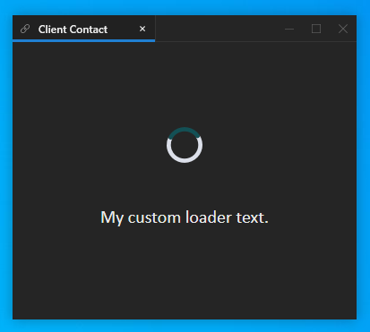

## Splash Screen

[**Glue42 Enterprise**](https://glue42.com/enterprise/) has a built-in splash screen, but also supports showing a custom splash screen. The splash screen can be loaded from a local file or from a remote location. 

To replace the splash screen HTML file, go to `%LocalAppData%\Tick42\GlueDesktop\assets\splash` and add your own custom file. 

Use the `"splash"` top-level key in the `system.json` file of [**Glue42 Enterprise**](https://glue42.com/enterprise/) to specify the splash screen location, bounds and other options. The path to a local splash screen file can be either absolute or relative to the `%LocalAppData%\Tick42\GlueDesktop\assets\splash` folder:

```json
"splash": {
    "disabled": false,
    "url": "../custom/splash.html",
    "width": 350,
    "height": 233,
    "blockStartup": true
}
```

The `"disabled"` property is set to `false` by default. Use the `"blockStartup"` property (set to `false` by default) to specify whether [**Glue42 Enterprise**](https://glue42.com/enterprise/) should wait for the splash screen to load before proceeding with the startup.


For the splash screen setup to work, you must handle the following events: 

```javascript
// `updateStatus` event
ipcRenderer.on("updateStatus", (event, arg) => {
    console.log(`updating status to ${arg.text}`);
    var status = document.getElementById("status");    
    status.innerHTML = arg.text + "...";
});

// `setVersion` event
ipcRenderer.on("setVersion", (event, arg) => {
    var status = document.getElementById("version");
    status.innerHTML = arg.text;
});

// `setEdition` event
ipcRenderer.on("setEdition", (event, arg) => {
    var edition = document.getElementById("version");
    edition.innerHTML += ` (${arg.text})`;
});

// `setEnvRegion` event
ipcRenderer.on("setEnvRegion", (event, arg) => {
    var edition = document.getElementById("version");
    edition.innerHTML += ` -${arg.text}`;
});
```

## Loaders

[**Glue42 Enterprise**](https://glue42.com/enterprise/) comes with built-in loaders that can be replaced with custom ones.

The loader for Glue42 Windows can be set in the `themes.json` configuration file of [**Glue42 Enterprise**](https://glue42.com/enterprise/) located in `%LocalAppData%\Tick42\GlueDesktop\config`.

The loader for [`Layouts`](../../../../glue42-concepts/windows/layouts/overview/index.html) and [`Workspaces`](../../../../glue42-concepts/windows/workspaces/overview/index.html) is an HTML file located in `%LocalAppData%\Tick42\GlueDesktop\assets\loader` which you can replace with your own custom loader.

### Windows

Use the `"loadingAnimation"` property of each respective theme in the `themes.json` file and specify a path to your custom XAML file. The path can be either absolute or relative to the `%LocalAppData%\Tick42\GlueDesktop\config` folder:

```json
// Custom loading animation for the "Dark" theme.
[
    {
        "name": "dark",
        "properties": {
            "loadingAnimation": "../custom/spinner.xaml",
        }
    }
]
```

Use the `"loadingText"`, `"loadingTextFont"`, `"loadingTextFontSize"` and `"loadingTextColor"` properties to add custom text to the Glue42 Window loader:

```json
[
    {
        "name": "dark",
        "properties": {
            "loadingAnimation": "../custom/spinner.xaml",
            "loadingText": "My custom loader text.",
            "loadingTextFont": "Calibri",
            "loadingTextFontSize": 20,
            "loadingTextColor": "#eeeeee"
        }
    }
]
```



### Layouts & Workspaces

To replace the Layouts and Workspaces loader HTML file, go to `%LocalAppData%\Tick42\GlueDesktop\assets\loader` and add your own custom file.

## Product Name

You can specify a custom product name that matches your internal deployment branding. It will be displayed in the:

- Glue42 Tray Icon

To change the product name displayed on hover over the Glue42 tray icon and in the tray icon menu, modify the `"build"` top-level key in the `system.json` configuration file of [**Glue42 Enterprise**](https://glue42.com/enterprise/) located in `%LocalAppData%\Tick42\GlueDesktop\config`:

```json
{
    "build": "My Custom Build"
}
```


- Glue42 Executable Description

Since this information is compiled into the executable file at build time, the recommended approach is to send the name and description strings to the Glue42 team and they will be modified according to your requirements. Otherwise, use a tool for updating Windows executable resources.

*Note that this description is displayed in the Windows Task Manager by default.*

- Installer UI

The product name displayed in the installer can be changed only through the extensibility features of the installer application. For more details, see the [Installer](../installer/index.html#installer_ui-product_name) section.

- Splash Screen and Toolbars

To change the product name in the splash screen or the toolbar applications, you must modify the respective applications. For more details on how to customize the splash screen and the Glue42 Toolbars, see the [Splash Screen](#splash_screen) and [Toolbar](../toolbar/index.html) sections.

## Icons

The built-in [**Glue42 Enterprise**](https://glue42.com/enterprise/) icons are replaceable. You can change:

- the icon displayed when [**Glue42 Enterprise**](https://glue42.com/enterprise/) is pinned to the taskbar;
- the [**Glue42 Enterprise**](https://glue42.com/enterprise/) tray icon;
- the default taskbar icon for apps;
- the taskbar icon for Glue42 Window groups;
- the taskbar icon for tab groups;
- the taskbar icon for the [Workspaces App](../../../../glue42-concepts/windows/workspaces/overview/index.html#workspaces_concepts-frame);
- the icon for the [**Glue42 Enterprise**](https://glue42.com/enterprise/) executable file;

*For details on how to change the icons of the automatically created shortcuts when using the [**Glue42 Enterprise**](https://glue42.com/enterprise/) installer application for deployment, see the [Installer > Shortcuts](../installer/index.html#shortcuts) section. For details on how to change the installer screen icons, see the [Installer > Installer UI](../installer/index.html#installer_ui) section.*

### Glue42 Enterprise

To change the default icon displayed when [**Glue42 Enterprise**](https://glue42.com/enterprise/) is pinned to the taskbar, go to `%LocalAppData%\Tick42\GlueDesktop\assets\images` and replace the `glue.ico` file with your own custom icon, keeping the name `glue.ico`.

### Tray & App Default

The icon displayed in the system tray is also used as a default taskbar icon for Glue42 enabled applications. To change it, go to `%LocalAppData%\Tick42\GlueDesktop\assets\images` and replace the `logo.ico` file with your own custom icon, keeping the name `logo.ico`.

*Note that the [Floating Toolbar](../../../../glue42-concepts/glue42-toolbar/index.html#floating_toolbar) application also uses this icon by default as its taskbar icon.*

### Window Groups

To change the taskbar icon for Glue42 Window groups, go to `%LocalAppData%\Tick42\GlueDesktop\assets\images` and replace the `groups.ico` file with your own custom icon, keeping the name `groups.ico`.

Alternatively, change the icon from the `themes.json` configuration file of [**Glue42 Enterprise**](https://glue42.com/enterprise/) located in `%LocalAppData%\Tick42\GlueDesktop\config`. The Glue42 Window groups theme properties are located under the `"groups"` key for each respective theme. Use the `"icon"` property and specify the name of your custom icon:

```json
// Custom group icon for the "Dark" theme.
{
    "name": "dark",
    "properties": {
        "groups": {
            "icon": "custom-group-icon.ico"
        }
    }
}
```

*Note that the specified group icon file must be an ICO file and must be placed in the `%LocalAppData%\Tick42\GlueDesktop\assets\images` folder.*

### Tab Groups

To change the default icon for tab groups, go to the `themes.json` configuration file of [**Glue42 Enterprise**](https://glue42.com/enterprise/) located in `%LocalAppData%\Tick42\GlueDesktop\config`. The Glue42 Window groups theme properties are located under the `"groups"` key for each respective theme. Use the `"tabGroupIcon"` property and specify the name of your custom icon:

```json
// Custom tab group icon for the "Dark" theme.
{
    "name": "dark",
    "properties": {
        "groups": {
            "tabGroupIcon": "tab-groups.ico"
        }
    }
}
```

*Note that the specified tab group icon file must be an ICO file and must be placed in the `%LocalAppData%\Tick42\GlueDesktop\assets\images` folder.*

### Workspaces

The taskbar icon for the [Workspaces App](../../../../glue42-concepts/windows/workspaces/overview/index.html#workspaces_concepts-frame) can be set from the `workspaces.json` file located in `%LocalAppData%\Tick42\GlueDesktop\config\apps`. Specify an absolute or a relative path to your custom icon:

```json
{
    "title": "Workspaces UI",
    "type": "workspaces",
    "name": "workspaces-demo",
    "icon": "../../resources/icons/workspaces.ico",
    "details": {}
}
```

### Executable File

The icon for the [**Glue42 Enterprise**](https://glue42.com/enterprise/) executable file (`tick42-glue-desktop.exe`) is compiled into the application at build time and can't be changed without invalidating its Authenticode signature. For this reason, the recommended approach is to send your custom icon to the Glue42 team to include it in your customized build step. If that isn't possible, you can replace the icon using a tool for updating Windows executable resources. Keep in mind that if you update the executable file, you'll need to Authenticode sign it yourself, otherwise it won't have a valid signature, which might trigger warnings from Windows or antivirus software.

## Themes

Use the `themes.json` configuration file of [**Glue42 Enterprise**](https://glue42.com/enterprise/) located in `%LocalAppData%\Tick42\GlueDesktop\config` to customize the look and feel of Glue42 Windows. For details and examples on how to customize Glue42 Windows, window and tab groups, see the [Configuration > Themes](../../../../developers/configuration/themes/index.html) section.

[Workspaces](../../../../glue42-concepts/windows/workspaces/overview/index.html) are entirely customizable too. For more details on how to customize the Workspaces UI or build an entirely new custom Workspaces App, see the [Extending Workspaces](../../../../glue42-concepts/windows/workspaces/overview/index.html#extending_workspaces) section.