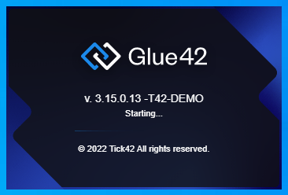

## Splash Screen

[**Glue42 Enterprise**](https://glue42.com/enterprise/) has a built-in splash screen, but also supports showing a custom splash screen. The splash screen can be loaded from a local file or from a remote location.

To replace the splash screen HTML file, go to `%LocalAppData%\Tick42\GlueDesktop\assets\splash` and add your own custom file. You can also use the existing splash files and modify the directly.

Use the `"splash"` top-level key in the `system.json` file of [**Glue42 Enterprise**](https://glue42.com/enterprise/) to specify the splash screen location, bounds and other options. Provide a full path to a local or a remote file:

```json
{
    "splash": {
        "disabled": false,
        "url": "file://%GDDIR%/assets/custom/splash.html",
        "width": 350,
        "height": 233,
        "blockStartup": true
    }
}
```

You can also use the `%GDDIR%` environment variable, which points to the [**Glue42 Enterprise**](https://glue42.com/enterprise/) installation folder.

The `"disabled"` property is set to `false` by default. Use the `"blockStartup"` property (set to `false` by default) to specify whether [**Glue42 Enterprise**](https://glue42.com/enterprise/) should wait for the splash screen to load before proceeding with the startup.



For the splash screen setup to work, you must handle the following events:

```javascript
// `updateStatus` event
ipcRenderer.on("updateStatus", (event, arg) => {
    console.log(`updating status to ${arg.text}`);
    var status = document.getElementById("status");
    status.innerHTML = arg.text + "...";
});

// `setVersion` event
ipcRenderer.on("setVersion", (event, arg) => {
    var status = document.getElementById("version");
    status.innerHTML = arg.text;
});

// `setEdition` event
ipcRenderer.on("setEdition", (event, arg) => {
    var edition = document.getElementById("version");
    edition.innerHTML += ` (${arg.text})`;
});

// `setEnvRegion` event
ipcRenderer.on("setEnvRegion", (event, arg) => {
    var edition = document.getElementById("version");
    edition.innerHTML += ` -${arg.text}`;
});
```

<glue42 name="addClass" class="colorSection" element="p" text="Available since Glue42 Enterprise 3.15">

The Glue42 [frameless window](../../../../glue42-concepts/windows/window-management/overview/index.html#window_modes-frameless_windows) type allows you to customize the splash screen of [**Glue42 Enterprise**](https://glue42.com/enterprise/) with transparent areas or use irregular shapes for it.

## Loaders

[**Glue42 Enterprise**](https://glue42.com/enterprise/) comes with built-in loaders that can be replaced with custom ones.

The loader for Glue42 Windows can be set in the `themes.json` configuration file of [**Glue42 Enterprise**](https://glue42.com/enterprise/) located in `%LocalAppData%\Tick42\GlueDesktop\config`.

The loader for [`Layouts`](../../../../glue42-concepts/windows/layouts/overview/index.html) and [`Workspaces`](../../../../glue42-concepts/windows/workspaces/overview/index.html) is an HTML file located in `%LocalAppData%\Tick42\GlueDesktop\assets\loader` which you can replace with your own custom one or edit it directly.

### Windows

Use the `"loadingAnimation"` property of each respective theme in the `themes.json` file and specify a path to your custom XAML file. The path can be either absolute or relative to the `%LocalAppData%\Tick42\GlueDesktop\config` folder:

```json
// Custom loading animation for the "Dark" theme.
[
    {
        "name": "dark",
        "properties": {
            "loadingAnimation": "../custom/spinner.xaml",
        }
    }
]
```

Use the `"loadingText"`, `"loadingTextFont"`, `"loadingTextFontSize"` and `"loadingTextColor"` properties to add custom text to the Glue42 Window loader:

```json
[
    {
        "name": "dark",
        "properties": {
            "loadingAnimation": "../custom/spinner.xaml",
            "loadingText": "My custom loader text.",
            "loadingTextFont": "Calibri",
            "loadingTextFontSize": 20,
            "loadingTextColor": "#eeeeee"
        }
    }
]
```


### Layouts & Workspaces

To replace the Layouts and Workspaces loader HTML file, go to `%LocalAppData%\Tick42\GlueDesktop\assets\loader` and add your own custom file.

## Product Name

You can specify a custom product name that matches your internal deployment branding. It will be displayed in the:

- Glue42 Tray Icon

To change the product name displayed on hover over the Glue42 tray icon and in the tray icon menu, modify the `"build"` top-level key in the `system.json` configuration file of [**Glue42 Enterprise**](https://glue42.com/enterprise/) located in `%LocalAppData%\Tick42\GlueDesktop\config`:

```json
{
    "build": "My Custom Build"
}
```


- Glue42 Executable Description

Since this information is compiled into the executable file at build time, the recommended approach is to send the name and description strings to the Glue42 team and they will be modified according to your requirements. Otherwise, use a tool for updating Windows executable resources.

*Note that this description is displayed in the Windows Task Manager by default.*

- Installer UI

The product name displayed in the installer can be changed only through the extensibility features of the installer app. For more details, see the [Installer](../installer/index.html#installer_ui-product_name) section.

- Splash Screen and Toolbars

To change the product name in the splash screen or the toolbar apps, you must modify the respective apps. For more details on how to customize the splash screen and the Glue42 Toolbars, see the [Splash Screen](#splash_screen) and [Toolbar](../toolbar/index.html) sections.

## Version

To change the product version, modify the `version.json` file of [**Glue42 Enterprise**](https://glue42.com/enterprise/) located in `%LocalAppData%\Tick42\GlueInstaller`. This file contains the names and the respective versions of all [Glue42 Artefacts](../installer/index.html#artifacts):

```json
{
    "product": "GlueDesktop",
    "version": "3.14.0.27-custom-version"
}
```

## Icons

The built-in [**Glue42 Enterprise**](https://glue42.com/enterprise/) icons are replaceable. You can change:

- the icon displayed when [**Glue42 Enterprise**](https://glue42.com/enterprise/) is pinned to the taskbar;
<!-- - the [**Glue42 Enterprise**](https://glue42.com/enterprise/) splash icon; -->
- the [**Glue42 Enterprise**](https://glue42.com/enterprise/) tray icon;
- the default taskbar icon for apps;
- the taskbar icon for Glue42 Window groups;
- the taskbar icon for tab groups;
- the taskbar icon for the [Workspaces App](../../../../glue42-concepts/windows/workspaces/overview/index.html#workspaces_concepts-frame);
- the icon for the [**Glue42 Enterprise**](https://glue42.com/enterprise/) executable file;

*For details on how to change the icons of the automatically created shortcuts when using the [**Glue42 Enterprise**](https://glue42.com/enterprise/) installer app for deployment, see the [Installer > Shortcuts](../installer/index.html#shortcuts) section. For details on how to change the installer screen icons, see the [Installer > Installer UI](../installer/index.html#installer_ui) section.*

### Glue42 Enterprise

To change the default icon displayed when [**Glue42 Enterprise**](https://glue42.com/enterprise/) is pinned to the taskbar, go to `%LocalAppData%\Tick42\GlueDesktop\assets\images` and replace the `glue.ico` file with your own custom icon, keeping the name `glue.ico`.

<!-- ### Splash

To change the icon displayed in the taskbar when [**Glue42 Enterprise**](https://glue42.com/enterprise/) is starting and the splash screen is showing, go to `%LocalAppData%\Tick42\GlueDesktop\assets\images`, add you custom icon and name it `splash.ico`. If a `splash.ico` file isn't available, the `logo.ico` file will be used as a default. -->

### Tray

To change the icon displayed in the system tray, go to `%LocalAppData%\Tick42\GlueDesktop\assets\images`, add you custom icon and name it `tray.ico`. If a `tray.ico` file isn't available, the `logo.ico` file will be used as a default.

### App Default

The `logo.ico` file located in `%LocalAppData%\Tick42\GlueDesktop\assets\images` is used as a default taskbar icon for Glue42 enabled apps. To change it, replace the `logo.ico` file with your own custom icon, keeping the name `logo.ico`.

*Note that the [Floating Toolbar](../../../../glue42-concepts/glue42-toolbar/index.html#floating_toolbar) app also uses this icon by default as its taskbar icon.*

### Window Groups

To change the taskbar icon for Glue42 Window groups, go to `%LocalAppData%\Tick42\GlueDesktop\assets\images` and replace the `groups.ico` file with your own custom icon, keeping the name `groups.ico`.

Alternatively, change the icon from the `themes.json` configuration file of [**Glue42 Enterprise**](https://glue42.com/enterprise/) located in `%LocalAppData%\Tick42\GlueDesktop\config`. The Glue42 Window groups theme properties are located under the `"groups"` key for each respective theme. Use the `"icon"` property and specify the name of your custom icon:

```json
// Custom group icon for the "Dark" theme.
{
    "name": "dark",
    "properties": {
        "groups": {
            "icon": "custom-group-icon.ico"
        }
    }
}
```

*Note that the specified group icon file must be an ICO file and must be placed in the `%LocalAppData%\Tick42\GlueDesktop\assets\images` folder.*

### Tab Groups

To change the default icon for tab groups, go to the `themes.json` configuration file of [**Glue42 Enterprise**](https://glue42.com/enterprise/) located in `%LocalAppData%\Tick42\GlueDesktop\config`. The Glue42 Window groups theme properties are located under the `"groups"` key for each respective theme. Use the `"tabGroupIcon"` property and specify the name of your custom icon:

```json
// Custom tab group icon for the "Dark" theme.
{
    "name": "dark",
    "properties": {
        "groups": {
            "tabGroupIcon": "tab-groups.ico"
        }
    }
}
```

*Note that the specified tab group icon file must be an ICO file and must be placed in the `%LocalAppData%\Tick42\GlueDesktop\assets\images` folder.*

### Workspaces

The taskbar icon for the [Workspaces App](../../../../glue42-concepts/windows/workspaces/overview/index.html#workspaces_concepts-frame) can be set from the `workspaces.json` file located in `%LocalAppData%\Tick42\GlueDesktop\config\apps`. Specify an absolute or a relative path to your custom icon:

```json
{
    "title": "Workspaces UI",
    "type": "workspaces",
    "name": "workspaces-demo",
    "icon": "../../resources/icons/workspaces.ico",
    "details": {}
}
```

*The Glue42 icon in the Workspaces App can be changed from the app itself. For more details on how to customize the Workspaces UI or build an entirely new custom Workspaces App, see the [Extending Workspaces](../../../../glue42-concepts/windows/workspaces/overview/index.html#extending_workspaces) section.*

### Executable File

The icon for the [**Glue42 Enterprise**](https://glue42.com/enterprise/) executable file (`tick42-glue-desktop.exe`) is compiled into the app at build time and can't be changed without invalidating its Authenticode signature. For this reason, the recommended approach is to send your custom icon to the Glue42 team to include it in your customized build step. If that isn't possible, you can replace the icon using a tool for updating Windows executable resources. Keep in mind that if you update the executable file, you'll need to Authenticode sign it yourself, otherwise it won't have a valid signature, which might trigger warnings from Windows or antivirus software.

## Notifications

The default apps for handling Glue42 [Notifications](../../../../glue42-concepts/notifications/overview/index.html) - the Glue42 Notification Panel and notification toasts - can be customized visually or altogether replaced with your own custom apps. It is also possible to filter notifications, enable or disable notification toasts and specify their size and duration through configuration.

### Configuration

The [app configurations](../../../../developers/configuration/application/index.html) for the Notification Panel and the notification toast apps are in the `gns.json` file located in `%LocalAppData%\Tick42\GlueDesktop\config\apps`. The Notification Panel is named `"js-gns-dialog-panel"` and the notification toast - `"js-gns-dialog-toast"`.

#### Filtering Notifications

To filter notifications by app name, use the `"sourceFilter"` property under the `"customProperties"` top-level key of the Notification Panel configuration. The `"sourceFilter"` object has the following properties:

| Property | Type | Description |
|----------|------|-------------|
| `"allowed"` | `string[]` | List of the app names of the allowed notification sources. Use a wildcard (`"*"`) to allow all. |
| `"blocked"` | `string[]` | List of the app names of the blocked notification sources. Use a wildcard (`"*"`) to block all. |

If you set the `"allowed"` or `"blocked"` property to an empty array (default for both properties), all notification sources will be allowed or blocked respectively. The allowed list is applied first, then the blocked, which means that if an app is in both lists, it will be blocked.

The following example demonstrates how to allow all notification sources using a wildcard and then block a specific app:

```json
{
    "name": "js-gns-dialog-panel",
    "customProperties": {
        "sourceFilter": {
            "allowed": ["*"],
            "blocked": ["glue42-application-manager"]
        }
    }
}
```

#### Notification Toasts

Use the following properties under the `"customProperties"` top-level key of the Notification Panel configuration to enable or disable notification toasts, to customize their size and duration:

| Property | Type | Description |
|----------|------|-------------|
| `"enabled"` | `boolean` | Whether to enable or disable (default) notification toasts. |
| `"width"` | `number` | Width of the notification toast in pixels. |
| `"height"` | `number` | Height of the notification toast in pixels. |
| `"duration"` | `number` | Time in milliseconds after which the notification toast will disappear. If set to `0`, the notification toast will remain visible until the user closes it manually. |

The following example demonstrates how to enable notification toasts, specify their size and set their duration to 5 seconds:

```json
{
    "name": "js-gns-dialog-panel",
    "customProperties": {
        "enabled": true,
        "width": 300,
        "height": 200,
        "duration": 5000
    }
}
```


### Styles

The Glue42 Notification Panel and notification toasts are web apps that can be modified by editing their HTML and CSS files.

The HTML files of the default notification apps are located in `%LocalAppData%\Tick42\GlueDesktop\assets\tick42-gns-js-ui` and are named `dialog-panel.html` for the Notification Panel and `dialog-toast.html` for the notification toasts. Use them to remove, edit or add custom elements to the apps.

As a base style, the default notification apps use the Glue42 web themes bundle - `t42bootstrap.bundle.css`, located in `%LocalAppData%\Tick42\GlueDesktop\assets\styles`. As a style override is used the `panel.css` file located in `%LocalAppData%\Tick42\GlueDesktop\assets\tick42-gns-js-ui\dialog_panel`. Either use the `panel.css` file to override the existing styles, or create your own CSS override file and reference it in the HTML files of the default apps.

To change the taskbar icon of the Notification Panel, modify the [app configuration](../../../../developers/configuration/application/index.html) of the Notification Panel app. Either provide a path to your custom icon using the `"icon"` top-level configuration property, or replace the `icon.ico` file in the `%LocalAppData%\Tick42\GlueDesktop\assets\tick42-gns-js-ui\resources` folder:

```json
{
    "name": "js-gns-dialog-panel",
    "icon": "file:///%GDDIR%/assets/custom/icon.ico"
}
```

### Custom Notification Apps

To replace the default notification apps with your own custom apps, remove or edit the existing [app configurations](../../../../developers/configuration/application/index.html) for the Notification Panel and the notification toast apps. Provide the URLs to your custom apps and don't change the `"name"` properties in the configurations - keep the original names of the apps (`"js-gns-dialog-panel"` for the Notification Panel and `"js-gns-dialog-toast"` for the notification toast), otherwise the Glue42 Notification Service won't function properly.

The following is an example configuration for a custom notification toast app:

```json
{
    "name": "js-gns-dialog-toast",
    "allowMultiple": false,
    "autoStart": true,
    "type": "window",
    "hidden": true,
    "service": true,
    "icon": "file:///%GDDIR%/assets/tick42-gns-js-ui/resources/icon.ico",
    "details": {
        "url": "file:///../assets/custom/my-custom-toast.html",
        "mode": "html",
        "hidden": true,
        "onTop": true,
        "hasMoveAreas": false,
        "hasSizeAreas": false,
        "showInTaskbar": false,
        "focus": false,
        "isSticky": false,
        "allowMinimize": false,
        "allowMaximize": false,
        "allowClose": false,
        "allowCollapse": false,
        "buttonsVisibility": "off"
    }
}
```

## Themes

Use the `themes.json` configuration file of [**Glue42 Enterprise**](https://glue42.com/enterprise/) located in `%LocalAppData%\Tick42\GlueDesktop\config` to customize the look and feel of Glue42 Windows. For details and examples on how to customize Glue42 Windows, window and tab groups, see the [Developers > Configuration > Themes](../../../../developers/configuration/themes/index.html) section.

[Workspaces](../../../../glue42-concepts/windows/workspaces/overview/index.html) are entirely customizable too. For more details on how to customize the Workspaces UI or build an entirely new custom Workspaces App, see the [Extending Workspaces](../../../../glue42-concepts/windows/workspaces/overview/index.html#extending_workspaces) section.