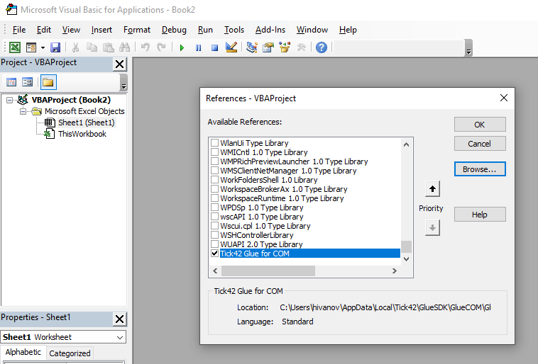

## Overview

The Glue42 COM library allows you to Glue42 enable your MS Office VBA applications and integrate them with other Glue42 enabled applications in [**Glue42 Enterprise**](https://glue42.com/enterprise/). You can use Glue42 functionality in your VBA applications for Excel, Outlook, Word, etc. The Glue42 COM library support the 32-bit and 64-bit versions of MS Office 2013 and up.

To access Glue42 functionalities in your VBA application, you have to reference and initialize the Glue42 COM library. The Glue42 COM library is distributed as a DLL file which is a part of the SDK bundle of [**Glue42 Enterprise**](https://glue42.com/enterprise/) located in the `%LocalAppData%\Tick42\GlueSDK\GlueCOM` folder.

In the [Glue42 VBA Concepts](#glue42_vba_concepts) section below you will find general concepts that apply when using the Glue42 COM library in VBA. The [COM/VBA Reference](#comvba_reference) section provides reference documentation specific to using the Glue42 COM library in VBA applications.

## Using the Glue42 COM Library

### Referencing

The [Glue42 COM](https://www.nuget.org/packages/GlueCOM/) library is available as a package in `NuGet` which you can include in your projects. The Glue42 COM library is also distributed with [**Glue42 Enterprise**](https://glue42.com/enterprise/) and is usually located in the `%LocalAppData%\Tick42\GlueSDK\GlueCOMv2` folder.

To reference the Glue42 COM library, open the Microsoft VBA Editor and go to `Tools > References`. Click "Browse" find and select the `GlueCOM.dll` file. In the list of available references you should now see "Tick42 Glue for COM":



### Initialization

To initialize the Glue42 COM library, import the library and create an instance of the `Glue42` class. You can use this instance to access all Glue42 functionality. Finally, register your application.

Below is an example of a subroutine which initializes Glue42, exposing the application instance under the name "My VBA Application":

```vbnet
Dim Glue As Glue42

Public Sub InitializeGlue()
    If Glue Is Nothing Then
        Set Glue = New Glue42
        ' Connecting to Glue42 and registering the application instance.
        Glue.StartWithAppName ("My VBA Application")
    End If
End Sub
```

## Glue42 VBA Concepts

Once the Glue42 COM library has been initialized, your application has access to all Glue42 functionalities. For more detailed information on the different Glue42 concepts and APIs, see:

- [Shared Contexts](../../../../glue42-concepts/data-sharing-between-apps/shared-contexts/vba/index.html)
- [Channels](../../../../glue42-concepts/data-sharing-between-apps/channels/vba/index.html)
- [Interop](../../../../glue42-concepts/data-sharing-between-apps/interop/vba/index.html)
- [Window Management](../../../../glue42-concepts/windows/window-management/vba/index.html)

The sections below explain several concepts related to using the Glue42 COM library.

### Composite Values

All Glue42 functionality related to receiving and sending data works with composite data values (structures). The Glue42 COM library for VBA provides a mechanism based on the [`GlueDynamicValue`](#classes-gluedynamicvalue) class to dynamically build composite values and to access individual fields within the composite structure.

#### Building Composite Values

- use [`CreateGlueValues`](#classes-glue42-creategluevalues) to get an empty dynamic value representing the root of the composite data structure;
- use chained indexing to set individual fields within the data structure (see [Indexing](#glue42_vba_concepts-composite_values-indexing));

The following shows how to build a sample composite value which can be used as an argument when [invoking an Interop method](../../../../glue42-concepts/data-sharing-between-apps/interop/vba/index.html#method_invocation):

```vbnet
' Creating an empty root value.
Dim MyVal
Set MyVal = Glue.CreateGlueValues

' Setting a field with a string value.
MyVal("operation") = "AddSub"

' Setting a field with an array of integers as a value.
Dim OperandsArray(0 To 1) As Integer
OperandsArray(0) = 5
OperandsArray(1) = 3
MyVal("operands") = OperandsArray

' Setting a string field nested in another composite value.
MyVal("metadata")("reason") = "testing"
```

As a result, `MyVal` will contain the following composite value (represented as a JSON object):

```json
{
    "operation": "AddSub",
    "operands": [5, 3],
    "metadata": {
        "reason": "testing"
    }
}
```

#### Indexing

You can use named indexing with instances of [`GlueDynamicValue`](#classes-gluedynamicvalue) to access child nodes by name.

For example:

```vbnet
Dim MyValue
MyValue = DynamicValue("ChildNodeName")
```

Depending on whether `"ChildNodeName"` exists and its type, the return value from the named indexing can be:

- `Variant`/[`GlueDynamicValue`](#classes-gluedynamicvalue) if `"ChildNodeName"` represents a composite value. If `"ChildNodeName"` doesn't exist, it will be automatically created as an empty composite value.
- `Variant`/`<some native type>` if `"ChildNodeName"` represents an elementary field.

As indexing can return another instance of `GlueDynamicValue`, this allows for chained indexing to access nested composite values:

```vbnet
Dim MyDoubleValue as Double
MyDoubleValue = DynamicValue("CompositeLevel_0")("CompositeLevel_1")("ElementaryDoubleField")
```

*Note that using indexing is recommended only when accessing fields within a composite value with a known structure.*

#### Accessing Composite Value Fields

- use the `GetReflectData` method of a data provider instance passing an empty string as an argument to get the root of the composite value;
- the data provider is typically passed as an argument to callback/event handler subroutines which are invoked when Glue42 sends data to the application;

The example below uses the same data structure from the previous example and shows how to access fields in a composite value. The `invocationRequest` data provider is passed as an argument to the handler subroutine:

```vbnet
' Declaring the native variables.
Dim Operation As String
Dim Operand1, Operand2 As Integer
Dim Reason As String
Dim Error As Integer

' Getting the root of the composite value from the data provider.
Dim Args
Set Args = invocationRequest.GetReflectData("")

' Extracting the elementary fields from the composite value:

' Accessing a string value.
Operation = Args("operation")
' Accessing integer values in an array.
Operand1 = Args("operands")(0)
Operand2 = Args("operands")(1)
' Access a string value inside a composite value.
Reason = Args("metadata")("reason")
' This will raise a "Type Mismatch" exception: "metadata" is a composite value which can't be cast to "Integer".
Error = Args("metadata")
```
Elementary fields are automatically cast to the compatible native type. Trying to assign to an incompatible type will raise an exception. Array elements can be accessed by their numeric index. Arrays can't be directly cast to a native array type. Accessing a field which doesn't exist will return an empty [GlueDynamicValue](#classes-gluedynamicvalue).

You can also store a lower-level composite value or array in a temporary variable and use it to access its fields. This helps avoid unnecessary repetitions of the path to deeper nested composite values and extra calls to the Glue42 COM library:

```vbnet
Dim OperArr
' Storing an array from a composite data structure in a variable.
OperArr = Args("operands")
' Accessing array elements from the temporary variable.
Operand1 = OperArr(0)
Operand2 = OperArr(1)
```

Another possibility for accessing a lower-level value in a composite structure directly from the data provider is to specify a path to the value when invoking `GetReflectData`. This can be useful when handling complex composite values where only part of the value structure is of interest:

```vbnet
' Accessing directly a lower-level value by providing a path as an argument.
Reason = invocationRequest.GetReflectData("metadata.reason")
```

#### Traversing Composite Values with Unknown or Dynamic Structure

To traverse and get information about the fields of a composite value with unknown or dynamic structure, use the `Count`, `Names` and `Values` properties of a [`GlueDynamicValue`](#classes-gluedynamicvalue) instance and its [`Contains`](#classes-gluedynamicvalue-contains) method.

### Glue42 Time

Glue42 time is essentially a Unix timestamp: the number of milliseconds since the Unix epoch, i.e. `1970-01-01 00:00:00 UTC`, ignoring leap seconds. To convert from Glue42 time to VBA `Date`, you can use the following formula:

```vbnet
VBADate = CDate(GlueTime / 86400 + 25569)
```

- `86400` is the number of seconds in one day (60 * 60 * 24);
- `25569` is the VBA numeric representation of `1970-01-01 00:00:00`;

Note that the resulting `Date` timestamp will also be in UTC, and not in local time.

### Helper Functions

The VBA samples use a helper function which simplifies the use of the Glue42 COM library and/or provides functionality not directly available in VBA.

#### GetFormHwnd

This helper function is used to retrieve the window handle (HWND) of a VBA `UserForm`.

Implementation:

```vbnet
Private Declare PtrSafe Function FindWindowA _
    Lib "user32.dll" ( _
    ByVal lpClassName As String, _
    ByVal lpWindowName As String) As LongPtr

Public Function GetFormHwnd(Form As Variant) As Long
    Dim strCaption As String
    Dim strClass As String

    ' Class name changed in Office 2000.
    If Val(Application.Version) >= 9 Then
        strClass = "ThunderDFrame"
    Else
        strClass = "ThunderXFrame"
    End If

    Randomize
    ' Saving the caption.
    strCaption = Form.Caption
    Form.Caption = "FindMe#" + CStr(Rnd)

    GetFormHwnd = CLng(FindWindowA(strClass, Form.Caption))
    'Restoring the caption.
    Form.Caption = strCaption
End Function
```

## COM/VBA Reference

This reference describes the components in the Glue42 COM library relevant to VBA.

*Note that the library also contains components that aren't intended to be directly used by VBA applications.*

## Enums

### GlueMethodFlags

Enumeration of the possible flags associated with a Glue42 method.

| Name | Value | Hex | Binary |
|------|-------|-----|--------|
| `GlueMethodFlags_None` | 0 | 00 | 00000000 |
| `GlueMethodFlags_ReturnsResult` | 1 | 01 | 00000001 |
| `GlueMethodFlags_IsGuiOperation` | 2 | 02 | 00000010 |
| `GlueMethodFlags_IsUserSpecific` | 4 | 04 | 00000100 |
| `GlueMethodFlags_IsMachineSpecific` | 8 | 08 | 00001000 |
| `GlueMethodFlags_OutsideDomain` | 16 | 10 | 00010000 |
| `GlueMethodFlags_SupportsStreaming` | 32 | 20 | 00100000 |

### GlueMethodInvocationStatus

Enumeration of the possible values for the status of a Glue42 method invocation.

| Name | Value |
|------|-------|
| `GlueMethodInvocationStatus_Succeeded` | 0 |
| `GlueMethodInvocationStatus_Failed` | 1 |
| `GlueMethodInvocationStatus_TimedOut` | 2 |
| `GlueMethodInvocationStatus_NotAvailable` | 3 |
| `GlueMethodInvocationStatus_Started` | 4 |

### GlueStreamState

Enumeration of the possible values for the status of a Glue42 stream subscription.

| Name | Value |
|------|-------|
| `GlueStreamState_Pending` | 0 |
| `GlueStreamState_Stale` | 1 |
| `GlueStreamState_Opened` | 2 |
| `GlueStreamState_Closed` | 3 |
| `GlueStreamState_SubscriptionRejected` | 4 |
| `GlueStreamState_SubscriptionFailed` | 5 |

### GlueWindowEventType

Enumeration of the possible values for the event type passed to [`HandleWindowEvent`](#classes-gluewindow-handlewindowevent)

*Note that not all event types are applicable to VBA applications.*

| Name | Value | Hex |
|------|-------|-----|
| `GlueWindowEventType_Unknown` | 0 | 00 |
| `GlueWindowEventType_Snapshot` | 1 | 01 |
| `GlueWindowEventType_WindowFrameAdded` | 2 | 02 |
| `GlueWindowEventType_WindowFrameRemoved` | 3 | 03 |
| `GlueWindowEventType_WindowFrameChanged` | 4 | 04 |
| `GlueWindowEventType_ButtonClicked` | 5 | 05 |
| `GlueWindowEventType_ButtonRemoved` | 6 | 06 |
| `GlueWindowEventType_ButtonAdded` | 7 | 07 |
| `GlueWindowEventType_GroupHeaderVisibilityChanged` | 8 | 08 |
| `GlueWindowEventType_CompositionChanged` | 9 | 09 |
| `GlueWindowEventType_FrameColorChanged` | 10 | 0A |
| `GlueWindowEventType_Created` | 11 | 0B |
| `GlueWindowEventType_Closed` | 12 | 0C |
| `GlueWindowEventType_UrlChanged` | 13 | 0D |
| `GlueWindowEventType_ContextChanged` | 14 | 0E |
| `GlueWindowEventType_VisibilityChanged` | 15 | 0F |
| `GlueWindowEventType_BoundsChanged` | 16 | 10 |
| `GlueWindowEventType_StateChanged` | 17 | 11 |
| `GlueWindowEventType_FocusChanged` | 18 | 12 |
| `GlueWindowEventType_TitleChanged` | 19 | 13 |
| `GlueWindowEventType_WindowCanvasWindowChanged` | 20 | 14 |
| `GlueWindowEventType_TabHeaderVisibilityChanged` | 21 | 15 |
| `GlueWindowEventType_FrameSelectionChanged` | 22 | 16 |
| `GlueWindowEventType_ShowFlydownBoundsRequested` | 23 | 17 |
| `GlueWindowEventType_WindowZoomFactorChanged` | 24 | 18 |
| `GlueWindowEventType_FrameIsLockedChanged` | 25 | 19 |
| `GlueWindowEventType_DOMReady` | 26 | 1A |
| `GlueWindowEventType_Hibernated` | 27 | 1B |
| `GlueWindowEventType_Resumed` | 28 | 1C |

## Types

### GlueContext

This type is used to store information about a Glue42 context.

**Properties**

| Name | Type | Description |
|------|------|-------------|
| `Id` | `String` | Identifier of the context within Glue42. |
| `Name` | `String` | Name of the context. |

### VBGlueInstance

This type is used to store information about a Glue42 application instance.

**Properties**

| Name | Type | Description |
|------|------|-------------|
| `ApplicationName` | `String` | Name of the application. |
| `Environment` | `String` | Glue42 environment in which the application instance is running. |
| `InstanceId` | `String` | Identifier assigned to the application instance by Glue42. |
| `MachineName` | `String` | Hostname of the machine where the application instance is running. |
| `Metadata` | [`GlueDynamicValue`](#classes-gluedynamicvalue) | Additional optional information about the application instance represented as a composite value. |
| `MetricsRepositoryId` | `String` | Identifier of the metrics repository used by the application instance (if any). |
| `ProcessId ` | `Long` | Identifier of the process (PID) in which the application instance is running. |
| `ProcessStartTime` | `Double` | Number representing the [Glue42 Time](#glue42_vba_concepts-glue42_time) when the process was started. |
| `Region` | `String` | Glue42 region in which the application instance is running. |
| `ServiceName` | `String` | Service name under which the application instance is running. |
| `UserName` | `String` | Username under which the application instance is running. |
| `Version` | `String` | Glue42 client version. |

### VBGlueMethod

This type is used to store information about a Glue42 method or stream.

**Properties**

| Name | Type | Description |
|------|------|-------------|
| `Flags` | [`GlueMethodFlags`](#enums-gluemethodflags) | Contains various flags associated with the method. |
| `Input` | `String` | String representation of the method arguments signature as provided during the method registration. |
| `Instance` | [`VBGlueInstance`](#types-vbglueinstance) | Contains information about the Glue42 application instance that has registered the method. |
| `Name` | `String` | Method name. |
| `ObjectTypes` | `String()` | Optional array of strings specifying the types of objects that the method works with (e.g., `Instrument`, `Client`, etc.) |
| `Output` | `String` | String representation of the method return value signature as provided during the method registration. |
| `RegistrationCookie` | `String` | Unique identifier assigned to the method during registration. |

### VBGlueResult

This type is used to store information about the result that a Glue42 Interop method will return when invoked.

**Properties**

| Name | Type | Description |
|------|------|-------------|
| `GlueData` | [`GlueData`](#classes-gluedata) | Represents the data contained in the result. |
| `LogDetails` | `String` | Additional optional information about the result. |
| `Message` | `String` | Optional message associated with the result. |
| `method` | [`VBGlueMethod`](#types-vbgluemethod) | Information about the Glue42 method providing the result. |
| `Status` | [`GlueMethodInvocationStatus`](#enums-gluemethodinvocationstatus) | Enumeration value representing the method invocation status. |

## Classes

### Glue42

This class is used as the main entry point for using any Glue42 functionality.

**Properties**

This class has no properties which can be used in VBA.

**Methods**

#### CreateDefaultVBGlueWindowSettings

Creates an instance of [`GlueWindowSettings`](#classes-gluewindowsettings) which can be used to initiate window registration with specific settings. See also [`RegisterGlueWindowWithSettings`](#classes-glue42-registergluewindowwithsettings)

*Signature:*

```vbnet
Function CreateDefaultVBGlueWindowSettings() As GlueWindowSettings
```

*Parameters:* None

*Return value:* [`GlueWindowSettings`](#classes-gluewindowsettings)

#### CreateGlueData

Creates an instance of [`GlueData`](#classes-gluedata) containing a composite value. The returned instance can be used to initialize the `GlueData` property of [`VBGlueResult`](#types-vbglueresult)

*Signature:*

```vbnet
Function CreateGlueData(data) As GlueData
```

*Parameters:*

| Name | Type | Description |
|------|------|-------------|
| `data` | `Variant` | An instance of [`GlueDynamicValue`](#classes-gluedynamicvalue) representing the root of the composite value. |

*Return value:* [`GlueData`](#classes-gluedata)

#### CreateGlueValues

Creates an instance of [`GlueDynamicValue`](#classes-gluedynamicvalue) which can represent a root node in a composite value.

*Signature:*

```vbnet
Function CreateGlueValues() as Variant
```

*Parameters:* None

*Return value:* `Variant`/[`GlueDynamicValue`](#classes-gluedynamicvalue)

#### CreateMethodInvocator

Creates an instance of [`GlueMethodInvocator`](#classes-gluemethodinvocator) which can serve as a proxy for invoking Glue42 methods and receiving results from method invocations.

*Signature:*

```vbnet
Function CreateMethodInvocator() As GlueMethodInvocator
```

*Parameters:* None

*Return value:* [`GlueMethodInvocator`](#classes-gluemethodinvocator)

#### CreateServerMethod

Creates an instance of [`GlueServerMethod`](#classes-glueservermethod) which can be used to register a Glue42 method and handle the server-side interaction with Glue42.

*Signature:*

```vbnet
Function CreateServerMethod(methodName As String, Input As String, Output As String, objectTypesCSV As String) As GlueServerMethod
```

*Parameters:*

| Name | Type | Description |
|------|------|-------------|
| `methodName` | `String` | Name of the method to create. |
| `Input` | `String` | Optional string representation of the method input arguments signature. |
| `Output` | `String` | Optional string representation of the method return value signature. |
| `objectTypesCSV` | `String` | Optional string of comma-separated values specifying the types of objects that the method works with (e.g., `Instrument`, `Client`, etc.) |

*Return value:* [`GlueServerMethod`](#classes-glueservermethod)

#### CreateServerStream

Creates an instance of [`GlueServerStream`](#classes-glueserverstream) which can be used to register a Glue42 stream and handle the server-side interaction with Glue42.

*Signature:*

```vbnet
Function CreateServerStream(streamName As String, Input As String, Output As String, objectTypesCSV As String) As GlueServerStream
```

*Parameters:*

| Name | Type | Description |
|------|------|-------------|
| `streamName` | `String` | Name of the stream to create. |
| `Input` | `String` | Optional string representation of the stream subscription request arguments. |
| `Output` | `String` | Optional string representation of the published stream data structure. |
| `objectTypesCSV` | `String` | Optional string of comma-separated values specifying the types of objects that the stream method works with (e.g., `Instrument`, `Client`, etc.) |

*Return value:* [`GlueServerStream`](#classes-glueserverstream)

#### CreateStreamConsumer

Creates an instance of [`GlueStreamConsumer`](#classes-gluestreamconsumer) which can be used to subscribe to Glue42 streams and handle the client-side interaction with Glue42.

*Signature:*

```vbnet
Function CreateStreamConsumer() As GlueStreamConsumer
```

*Parameters:* None

*Return value:* [`GlueStreamConsumer`](#classes-gluestreamconsumer)

#### GetChannels

Obtains the names of all available Glue42 Channels.

*Signature:*

```vbnet
Function GetChannels() As String()
```

*Parameters:* None

*Return value:* `String()`

#### GetGlueContext

Creates an instance of [`GlueContextManager`](#classes-gluecontextmanager) which can later be linked to a Glue42 context with the [`Open`](#classes-gluecontextmanager-open) method.

*Signature:*

```vbnet
Function GetGlueContext(contextName As String) As GlueContextManager
```

*Parameters:*

| Name | Type | Description |
|------|------|-------------|
| `contextName `| `String` | Name of the context. |

*Return value:* [`GlueContextManager`](#classes-gluecontextmanager)

#### GetKnownContexts

Obtains a list of all currently available Glue42 contexts.

*Signature:*

```vbnet
Function GetKnwonContexts() As GlueContext()`
```

*Parameters:* None

*Return value:* `GlueContext()` - [`GlueContext`](#types-gluecontext) array containing information about the currently available Glue42 contexts.

#### GetMethodNamesForTarget

Obtains the names of all Glue42 methods or streams exposed by the specified application(s).

*Signature:*

```vbnet
Function GetMethodNamesForTarget(targetRegex As String) As String()
```

*Parameters:*

| Name | Type | Description |
|------|------|-------------|
| `targetRegex` | `String` | Optional regular expression pattern which allows selecting for which target applications to retrieve the registered Interop methods/streams. If provided, only methods and streams exposed by applications with names matching the regular expression will be returned. An empty string or `Nothing` will match all application names. |

*Return value:* `String()`

#### GetTargets

Obtains the names of all Glue42 applications currently exposing methods or streams.

*Signature:*

```vbnet
Function GetTargets() As String()
```

*Parameters:* None

*Return value:* `String()`

#### Log

Outputs a message to the Glue42 log.

*Signature:*

```vbnet
Sub Log(level As Byte, Message As String)
```

*Parameters:*

| Name | Type | Description |
|------|------|-------------|
| `level` | `Byte` | Log level. The following values are accepted: `0` (trace), `1` (debug), `2` (info), `3` (warn), `4` (error), `5` (fatal) |
| `Message` | `String` | The message to log. |

*Return value:* None

#### RegisterGlueWindow

Initiates the registration of a VBA `UserForm` as a Glue42 window with default settings.

*Signature:*

```vbnet
Function RegisterGlueWindow(hwnd As Long, windowEventHandler As IGlueWindowEventHandler) As GlueWindow
```

*Parameters:*

| Name | Type | Description |
|------|------|-------------|
| `hwnd` | `Long` | Handle (HWND) to the VBA `UserForm` window. It can be obtained with the helper function [`GetFormHwnd`](#glue42_vba_concepts-helper_functions-getformhwnd).|
| `windowEventHandler` | `IGlueWindowEventHandler` | `Nothing` must be provided in VBA. |

*Return value:* [`GlueWindow`](#classes-gluewindow)

*Note that the returned instance of `GlueWindow` shouldn't be used to interact with the Glue42 window until the [`HandleWindowReady`](#classes-gluewindow-handlewindowready) event has been raised (i.e., the window registration is complete).*

#### RegisterGlueWindowWithSettings

Initiates the registration of a VBA `UserForm` as a Glue42 window with custom settings.

*Signature:*

```vbnet
Function RegisterGlueWindowWithSettings(hwnd As Long, settings As GlueWindowSettings, windowEventHandler As IGlueWindowEventHandler) As GlueWindow
```

*Parameters:*

| Name | Type | Description |
|------|------|-------------|
| `hwnd` | `Long` | Handle (HWND) to the VBA `UserForm` window. It can be obtained with the helper function [`GetFormHwnd`](#glue42_vba_concepts-helper_functions-getformhwnd). |
| `settings` | `GlueWindowSettings` | An instance of [`GlueWindowSettings`](#classes-gluewindowsettings) containing the settings to use during the window registration. You need to obtain an instance by using [`CreateDefaultVBGlueWindowSettings`](#classes-glue42-createdefaultvbgluewindowsettings) first, and then modify the property values as needed. |
| `windowEventHandler` | `IGlueWindowEventHandler` | `Nothing` must be provided in VBA. |

*Return value:* [`GlueWindow`](#classes-gluewindow)

*Note that the returned instance of `GlueWindow` shouldn't be used to interact with the Glue42 window until the [`HandleWindowReady`](#classes-gluewindow-handlewindowready) event has been raised (i.e., the window registration is complete).*

#### StartWithAppName

Connects to the Glue42 Gateway and announces the application instance. Connection to the Glue42 Gateway is required for using any Glue42 functionality.

*Signature:*

```vbnet
Sub StartWithAppName(ApplicationName As String)
```

*Parameters:*

| Name | Type | Description |
|------|------|-------------|
| `ApplicationName` | `String` | Name under which the application will be registered in Glue42. |

*Return value:* None

#### Stop

Disconnects from the Glue42 Gateway, shutting down all communication:

- The application instance will no longer receive any notifications from Glue42, no event handlers will be invoked.
- All stream subscriptions will be terminated.
- All methods and streams published by the application will be automatically unregistered.
- The application instance will no longer be visible/discoverable.
- Glue42 context data (including Glue42 Channel data) set by the application will persist until overwritten by other applications.

*Signature:*

```vbnet
Sub Stop()
```

*Parameters:* None

*Return value:* None

### GlueContextManager

This class is used for interaction with Glue42 contexts. Interface: `IGlueContext`.

**Properties**

This class has no properties.

**Methods**

#### Close

Closes an open Glue42 context. The context is unlinked from the `GlueContextManager` which can no longer be used to interact with the context. The associated event handler will no longer be executed when the context data changes.

*Signature:*

```vbnet
Sub Close()
```

*Parameters:*  None

*Return value:* None

#### GetContextInfo

Obtains a [`GlueContext`](#types-gluecontext) containing information about the linked context.

*Signature:*

```vbnet
Function GetContextInfo() As GlueContext
```

*Parameters:* None

*Return value:* [`GlueContext`](#types-gluecontext)

#### GetDataAsJson

Gets a composite value or an elementary field in JSON format.

*Signature:*

```vbnet
Function GetDataAsJson(fieldPath As String) As String
```

*Parameters:*

| Name | Type | Description |
|------|------|-------------|
| `fieldPath` | `String` | Path to the field in the composite value structure. An empty string refers to the root of the composite value structure. |

*Return value:* `String`

#### GetReflectData

Gets a composite value or an elementary field from the associated composite value structure.

*Signature:*

```vbnet
Function GetReflectData(fieldPath As String) as Variant
```

*Parameters:*

| Name | Type | Description |
|------|------|-------------|
| `fieldPath` | `String` | Path to the field in the composite value structure. An empty string refers to the root of the composite value structure. |

*Return value:*

- `Variant`/[`GlueDynamicValue`](#classes-gluedynamicvalue) if `fieldPath` refers to a composite value;
- `Variant`/`<some native type>` if `fieldPath` refers to an elementary field;
- `Variant`/`Empty` if the specified `fieldPath` doesn't exist;

#### Open

Opens a Glue42 context. If the context doesn't exist, it is automatically created with an empty data value.

*Signature:*

```vbnet
Sub Open()
```

*Parameters:*  None

*Return value:* None

#### Remove

Removes a shared context value.

*Signature:*

```vbnet
Sub Remove(fieldPath As String)
```

*Parameters:*

| Name | Type | Description |
|------|------|-------------|
| `fieldPath` | `String` | Path to the composite value or field in the composite value structure to remove. |

*Return value:* None

#### SetValue

Sets or updates a context value.

*Signature:*

```vbnet
Sub SetValue(fieldPath As String, Value)
```

*Parameters:*

| Name | Type | Description |
|------|------|-------------|
| `fieldPath` | `String` | Path to the composite value or field in the composite value structure. Non-existent elements in the path are automatically created as composite values. If any of the path elements (apart from the last one) exist but aren't composite values, the call will fail. |
| `Value` | `Variant` | An instance of [`GlueDynamicValue`](#classes-gluedynamicvalue) to which the composite value or field will be set. See [Building Composite Values](#glue42_vba_concepts-composite_values-building_composite_values) for details about obtaining and initializing a `GlueDynamicValue`. |

*Return value:* None

#### UpdateContextDataJson

Updates a composite value or an elementary field in the shared context.

*Signature:*

```vbnet
Sub UpdateContextDataJson(fieldPath As String, jsonEncodedData As String)
```

*Parameters:*

| Name | Type | Description |
|------|------|-------------|
| `fieldPath` | `String` | Path to the composite value or field in the composite value structure. Non-existent elements in the path are automatically created as composite values. If any of the path elements (apart from the last one) exist but aren't composite values, the call will fail. |
| `jsonEncodedData` | `String` | String representation of the new value in JSON format. |

*Return value:* None

#### Nonapplicable Methods

The following methods aren't intended to be used in VBA:

- `BuildAndSetContextData`
- `BuildAndUpdateContextData`
- `GetData`
- `IsLaunchedByGD`
- `JsonToVariant`
- `SetContextData`
- `SetContextDataOnFieldPath`
- `UpdateContextData`

**Events**

#### HandleContextUpdate

The handler for this event is executed when the linked context data has been updated or when a context has been linked with the [`Open`](#classes-gluecontextmanager-open) method.

*Handler signature:*

```vbnet
Sub GlueContextManager_HandleContextUpdate(ByVal contextUpdate As IGlueContextUpdate)
```

*Parameters:*

| Name | Type | Description |
|------|------|-------------|
| `contextUpdate` | `IGlueContextUpdate` | An instance of [`GlueContextUpdate`](#classes-gluecontextupdate) which can be used to access the context data. |

#### Nonapplicable events

The following events aren't intended to be used in VBA:

- `HandleContext`

### GlueContextUpdate

An instance of this class is passed by Glue42 to the [`HandleContextUpdate`](#classes-gluecontextmanager-handlecontextupdate) event handler. Interface: `IGlueContextUpdate`.

**Properties**

This class has no properties.

**Methods**

#### GetContext

Obtains an instance of [`GlueContextManager`](#classes-gluecontextmanager) linked to the Glue42 context that has been updated.

*Signature:*

```vbnet
Function GetContext() As GlueContextManager
```

*Parameters:* None

*Return value:* [`GlueContextManager`](#classes-gluecontextmanager)

### GlueData

This class is used to store composite data values. Interface: `IGlueData`.

**Properties**

This class has no properties.

**Methods**

#### GetReflectData

Gets a composite value or an elementary field from the associated composite value structure.

*Signature:*

```vbnet
Function GetReflectData(fieldPath As String) as Variant
```

*Parameters:*

| Name | Type | Description |
|------|------|-------------|
| `fieldPath` | `String` | Path to the field in the composite value structure. An empty string refers to the root of the composite value structure. |

*Return value:*

- `Variant`/[`GlueDynamicValue`](#classes-gluedynamicvalue) if `fieldPath` refers to a composite value;
- `Variant`/`<some native type>` if `fieldPath` refers to an elementary field;
- `Variant`/`Empty` if the specified `fieldPath` doesn't exist;

### GlueDynamicValue

An instance of this class represents a node in a composite value. Composite values are passed to and returned by various Glue42 COM methods involving data exchange between applications. See also [Building Composite Values](#glue42_vba_concepts-composite_values-building_composite_values) and [Accessing Composite Value Fields](#glue42_vba_concepts-composite_values-accessing_composite_value_fields).

**Properties**

| Name | Type | Description |
|------|------|-------------|
| `Count` | `Long` | Contains the number of child nodes. |
| `Names` | `String()` | Array of `String`s containing the child node names. |
| `Values` | `Variants()` | Array of `Variant`s representing the child nodes. A `Variant` can contain another `GlueDynamicValue` (if the node has children, i.e. the node is a nested composite value) or a native type. |

**Methods**

#### Contains

Checks if a child node with the specified name exists.

*Signature:*

```vbnet
Function Contains(Name As String) As Boolean
```

*Parameters:*

| Name | Type | Description |
|------|------|-------------|
| `Name` | `String` | Name of the child node to check whether it exists. |

*Return value:* `Boolean`

#### Nonapplicable Methods

The following methods aren't intended to be used in VBA:

- `GetEnumerator`

### GlueInvocationRequest

This class is used by applications when providing a Glue42 method implementation. An instance of this class is passed by Glue42 to the [`HandleInvocationRequest`](#classes-glueservermethod-handleinvocationrequest) event handler. Interface: `IGlueInvocationRequest`.

**Properties**

| Name | Type | Description |
|------|------|-------------|
| `Caller` | [`VBGlueInstance`](#types-vbglueinstance) | Information about the application instance that has invoked the method. |
| `method` | [`VBGlueMethod`](#types-vbgluemethod) | Information about the method being invoked. |

**Methods**

#### GetReflectData

Gets a composite value or an elementary field from the associated composite value structure. In the case of an invocation request, this is the composite value structure holding the arguments with which the request was made.

*Signature:*

```vbnet
Function GetReflectData(fieldPath As String) as Variant
```

*Parameters:*

| Name | Type | Description |
|------|------|-------------|
| `fieldPath` | `String` | Path to the field in the composite value structure. An empty string refers to the root of the composite value structure. |

*Return value:*

- `Variant`/[`GlueDynamicValue`](#classes-gluedynamicvalue) if `fieldPath` refers to a composite value;
- `Variant`/`<some native type>` if `fieldPath` refers to an elementary field;
- `Variant`/`Empty` if the specified `fieldPath` doesn't exist;

#### SendFailure

Returns a `"Failed"` status to the Glue42 method invocator (caller).

*Signature:*

```vbnet
Sub SendFailure(Message As String, additionalData as Variant)
```

*Parameters:*

| Name | Type | Description |
|------|------|-------------|
| `Message`| `String` | Message describing the failure to be returned to the caller. |
| `additionalData` | `Variant` | Optional additional data to return to the caller. See details below. |

The following may be provided as `additionalData`:

| Type | Description |
|------|-------------|
| [`GlueDynamicValue`](#classes-gluedynamicvalue) | Composite value to return to the caller together with the `"Failed"` status. |
| `Nothing` | No additional information will be returned to the caller. |

*Return value:* None

Invoking `SendFailure` is equivalent to invoking `SendResult` with an argument of type [`VBGlueResult`](#types-vbglueresult) with the following properties initialized:
- `Status` is set to `GlueMethodInvocationStatus_Failed`.
- `Message` is set to the `Message` argument.
- `GlueData` is initialized according to the provided `additionalData` argument.

#### SendResult

Returns a result to the Glue42 method invocator (caller).

*Signature:*

```vbnet
Sub SendResult(result as Variant)
```

*Parameters:*

| Name | Type | Description |
|------|------|-------------|
| `result` | `Variant` | Optional additional data to return to the caller. See details below. |

The following may be provided as `result`:

| Type | Description |
|------|-------------|
| [`VBGlueResult`](#types-vbglueresult) | An instance of `VBGlueResult` fully describing the result which will be returned back to the caller. You may initialize some or all properties as needed. The `method` property doesn't need to be initialized (its value is ignored), it will be automatically populated by Glue42 when delivering the result to the caller. |
| [`GlueDynamicValue`](#classes-gluedynamicvalue) | Composite value to return to the caller. This is equivalent to providing a `VBGlueResult` with `Status = GlueMethodInvocationStatus_Succeeded`, `GlueData` initialized with the provided composite value, and all other properties initialized with empty/default values. |
| `Nothing` | No value will be returned to the caller. This is equivalent to sending a `VBGlueResult` with `Status = GlueMethodInvocationStatus_Succeeded` and all other properties initialized with empty/default values. |

*Return value:* None

Below is an example of initializing a `VBGlueResult` for use with `SendResult`:

```vbnet
' Build the composite value to be returned to the caller.
Dim DynamicValue
Set DynamicValue = Glue.CreateGlueValues
DynamicValue("jobID") = "JOB#1234"

' Initialize the result.
Dim VBResult As VBGlueResult
VBResult.Message = "Background job started."
VBResult.Status = GlueMethodInvocationStatus_Started
Set VBResult.GlueData = Glue.CreateGlueData(DynamicValue)

' Send the result.
request.SendResult VBResult
```

### GlueMethodInfo

This class is used to store information about a Glue42 streaming method. Instances of this class are passed as parameters to stream subscription event handlers. Interface: `IGlueMethodInfo`.

**Properties**

| Name | Type | Description |
|------|------|-------------|
| `correlationId` | `String` | Optional user-defined string which was passed as an argument to [`Subscribe`](#classes-gluestreamconsumer-subscribe) when the application initiated the stream subscription. |
| `method` | [`VBGlueMethod`](#types-vbgluemethod) | Contains details about the Glue42 stream. |

**Methods**

This class has no methods.

### GlueMethodInvocator

This class is used to handle the client-side method invocation. Instances of this class can be created by using [`CreateMethodInvocator`](#classes-glue42-createmethodinvocator).

**Properties**

This class has no properties.

**Methods**

#### InvokeAsync

Invokes a Glue42 method asynchronously. The result is delivered via the [`HandleInvocationResult`](#classes-gluemethodinvocator-handleinvocationresult) event.

*Signature:*

```vbnet
Sub InvokeAsync(method As String, targetRegex As String, args, all As Boolean, correlationId As String, timeoutMsecs As Long)
```

*Parameters:*

| Name | Type | Description |
|------|------|-------------|
| `method` | `String` | Name of the method to invoke. |
| `targetRegex` | `String` | Optional regular expression pattern which allows selecting the target application(s) which will service the method invocation. If provided, only targets with application name matching the regular expression will be considered. An empty string or `Nothing` will match all application names. |
| `args` | `Variant` | An instance of [`GlueDynamicValue`](#classes-gluedynamicvalue) representing the arguments to pass to the Glue42 method being invoked (see also [Building Composite Values](#glue42_vba_concepts-composite_values-building_composite_values)) or `Nothing` in case the method accepts no arguments. |
| `all` | `Boolean` | Indicates whether the method invocation request should be sent to all available application targets or to one target only. |
| `correlationId` | `String` | Optional user-defined string which will be delivered back to the invocation result handler. This can be used to distinguish the returned results in case you make several invocations without waiting for the results to arrive first. |
| `timeoutMsecs` | `Long` | Specifies how long (in milliseconds) Glue42 will wait for the method invocation to complete before sending a "timed out" status to the caller. |

*Return value:* None

#### InvokeSync

Invokes a Glue42 method synchronously.

*Note that invoking this method will block VBA execution until the method invocation completes. As VBA code runs in a single thread, it isn't possible to synchronously invoke methods registered by the same VBA application.*

*Signature:*

```vbnet
Function InvokeSync(method As String, targetRegex As String, args, all As Boolean, timeoutMsecs As Long) as VBGlueInvocationResult
```

*Parameters:*

| Name | Type | Description |
|------|------|-------------|
| `method` | `String` | Name of the method to invoke. |
| `targetRegex` | `String` | Optional regular expression pattern which allows selecting the target application(s) which will service the method invocation. If provided, only targets with application name matching the regular expression will be considered. An empty string or `Nothing` will match all application names. |
| `args` | `Variant` | An instance of [`GlueDynamicValue`](#classes-gluedynamicvalue) representing the arguments to pass to the Glue42 method being invoked (see also [Building Composite Values](#glue42_vba_concepts-composite_values-building_composite_values)) or `Nothing` in case the method accepts no arguments. |
| `all` | `Boolean` | Indicates whether the method invocation request should be sent to all available application targets or to one target only. |
| `timeoutMsecs` | `Long` | Specifies how long (in milliseconds) Glue42 will wait for the method invocation to complete before sending a "timed out" status to the caller. |

*Return value:* [`VBGlueInvocationResult`](#classes-vbglueinvocationresult) - an instance of `VBGlueInvocationResult` containing information about the result from the method invocation.

**Events**

#### HandleInvocationResult

The handler for this event is executed when a method invocation initiated with [`InvokeAsync`](#classes-gluemethodinvocator-invokeasync) has completed.

*Handler signature:*

```vbnet
Sub GlueMethodInvocator_HandleInvocationResult(ByVal result As IGlueInvocationResult)
```

*Parameters:*

| Name | Type | Description |
|------|------|-------------|
| `result` | `IGlueInvocationResult` | An instance of [`VBGlueInvocationResult`](#classes-vbglueinvocationresult) containing information about the result from the method invocation. |

### GlueServerMethod

This class is used to expose Glue42 methods and handle the server-side interaction with Glue42. Instances of this class can be created with [`CreateServerMethod`](#classes-glue42-createservermethod). Interface: `IGlueServerMethod`.

**Properties**

| Name | Type | Description |
|------|------|-------------|
| `Definition` | [`VBGlueMethod`](#types-vbgluemethod) | Contains details about the Glue42 method definition. |

**Methods**

#### Register

Registers an Interop method in Glue42. The registered Interop method becomes visible to other Glue42 applications.

*Signature:*

```vbnet
Sub Register()
```

*Parameters:* None

*Return value:* None

#### Unregister

Unregisters an Interop method from Glue42. The unregistered Interop method is no longer available in Glue42.

*Signature:*

```vbnet
Sub Unregister()
```

*Parameters:* None

*Return value:* None

**Events**

#### HandleInvocationRequest

The handler for this event is executed when an application invokes a registered Glue42 method.

*Handler signature:*

```vbnet
Sub GlueServerMethod_HandleInvocationRequest(ByVal request As IGlueInvocationRequest)
```

*Parameters:*

| Name | Type | Description |
|------|------|-------------|
| `request` | `IGlueInvocationRequest` | An instance of [`GlueInvocationRequest`](#classes-glueinvocationrequest) which can be used to send the invocation result back to the caller. |

### GlueServerStream

This class is used to expose Glue42 streams (streaming methods) and handle the server-side interaction with Glue42. Instances of this class can be created with [`CreateServerStream`](#classes-glue42-createserverstream). Interface: `IGlueServerStream`.

**Properties**

| Name | Type | Description |
|------|------|-------------|
| `Definition` | [`VBGlueMethod`](#types-vbgluemethod) | Contains details about the Glue42 streaming method definition. |

**Methods**

#### CloseBranch

Closes a stream branch. This will disconnect (unsubscribe) all subscribers from the branch and remove the branch from the stream.

*Signature:*

```vbnet
Sub CloseBranch(branch As String)
```

*Parameters:*

| Name | Type | Description |
|------|------|-------------|
| `branch` | `String` | Name (key) of the branch to close. |

*Return value:* None

#### CloseStream

Closes a stream. This will disconnect (unsubscribe) all subscribers (on all branches) from the stream. All branches will be removed from the stream.

*Signature:*

```vbnet
Sub CloseStream()
```

*Parameters:* None

*Return value:* None

#### GetBranchKeys

Gets an array containing the names of all branches of the stream.

*Signature:*

```vbnet
Function GetBranchKeys() As String()
```

*Parameters:* None

*Return value:* `String()` - an array of `String`s containing the names (keys) of all stream branches.

#### PushVariantData

Push data to a stream or stream branch.

*Signature:*

```vbnet
Sub PushVariantData(data, branch As String)
```

*Parameters:*

| Name | Type | Description |
|------|------|-------------|
| `data` | `Variant` | An instance of [`GlueDynamicValue`](#classes-gluedynamicvalue) representing the data to publish (see also [Building Composite Values](#glue42_vba_concepts-composite_values-building_composite_values)).|
| `branch` | `String` | Name of the branch to which to push the data. Providing an empty string will broadcast the data to all subscribers on all branches. |

*Return value:* None

#### Register

Registers an Interop stream in Glue42. The registered stream becomes visible to other Glue42 applications.

*Signature:*

```vbnet
Sub Register()
```
*Parameters:* None

*Return value:* None

#### Unregister

Unregisters an Interop stream from Glue42. The unregistered stream is no longer available in Glue42.

*Signature:*

```vbnet
Sub Unregister()
```

*Parameters:* None

*Return value:* None

#### Nonapplicable Methods

The following methods aren't intended to be used in VBA:

- `GatBranch`
- `Push`

**Events**

#### HandleSubscriber

The handler for this event is executed when a new stream subscriber is accepted.

*Handler signature:*

```vbnet
Sub GlueServerStream_HandleSubscriber(ByVal subscriber As IVBGlueStreamSubscriber, ByVal requestData As IGlueData)
```

*Parameters:*

| Name | Type | Description |
|------|------|-------------|
| `subscriber` | `IVBGlueStreamSubscriber`| An instance of [`VBGlueStreamSubscriber`](#classes-vbgluestreamsubscriber) containing information about the new stream subscriber. |
| `requestData` | `IGlueData` | An instance of [`GlueData`](#classes-gluedata) representing the composite value passed with the subscription request. |

#### HandleSubscriberLost

The handler for this event is executed when an existing subscriber is unsubscribed from the stream.

*Handler signature:*

```vbnet
Sub GlueServerStream_HandleSubscriberLost(ByVal subscriber As IVBGlueStreamSubscriber)
```

*Parameters:*

| Name | Type | Description |
|------|------|-------------|
| `subscriber` | `IVBGlueStreamSubscriber`| An instance of [`VBGlueStreamSubscriber`](#classes-vbgluestreamsubscriber) containing information about the lost stream subscriber. |

#### HandleSubscriptionRequest

The handler for this event is executed when an application attempts to subscribe to a stream.

*Handler signature:*

```vbnet
Sub GlueServerStream_HandleSubscriptionRequest(ByVal request As IGlueSubscriptionRequest)
```

*Parameters:*

| Name | Type | Description |
|------|------|-------------|
| `request` | `IGlueSubscriptionRequest` | An instance of [`GlueSubscriptionRequest`](#classes-gluesubscriptionrequest) which can be used to accept or reject a new subscriber. |

### GlueStreamConsumer

This class is used to subscribe to Glue42 streams and handle the client-side interaction with Glue42. Instances of this class can be created by using [`CreateStreamConsumer`](#classes-glue42-createstreamconsumer).

**Properties**

This class has no properties.

**Methods**

#### Subscribe

Attempt to subscribe to a Glue42 stream by sending a subscription request.

*Signature:*

```vbnet
Sub Subscribe(stream As String, targetRegex As String, args, all As Boolean, correlationId As String, timeoutMsecs As Long)
```

*Parameters:*

| Name | Type | Description |
|------|------|-------------|
| `stream` | `String` | Name of the stream to which to subscribe. |
| `targetRegex` | `String` | Optional regular expression pattern which allows selecting the target application(s) publishing the stream. If provided, only applications with name matching the regular expression will be considered. An empty string or `Nothing` will match all application names. |
| `args` | `Variant` | An instance of [`GlueDynamicValue`](#classes-gluedynamicvalue) representing the arguments to pass along with the subscription request (see also [Building Composite Values](#glue42_vba_concepts-composite_values-building_composite_values)) or `Nothing` if the stream publisher requires no arguments. |
| `all` | `Boolean` | Indicates whether the subscription request should be sent to all matching applications which publish the stream, or a single application only. |
| `correlationId` | `String` | Optional user-defined string which will be delivered back to the stream consumer event handlers. It can be used to distinguish subscriptions in case you use the same stream consumer for multiple subscriptions. |
| `timeoutMsecs` | `Long` | Specifies how long (in milliseconds) Glue42 will wait for the subscription request to be accepted or rejected before sending a "timed out" status to the caller. |

*Return value:* None

**Events**

#### HandleStreamClosed

The handler for this event is executed when the associated stream subscription has been terminated.

*Handler signature:*

```vbnet
Sub GlueStreamConsumer_HandleStreamClosed(ByVal stream As IGlueMethodInfo)
```

*Parameters:*

| Name | Type | Description |
|------|------|-------------|
| `stream` | `IGlueMethodInfo` | An instance of [`GlueMethodInfo`](#classes-gluemethodinfo) containing information about the streaming method. |

#### HandleStreamData

The handler for this event is executed when a stream publishing application pushes data to a stream.

*Handler signature:*

```vbnet
Sub GlueStreamConsumer_HandleStreamData(ByVal stream As IGlueMethodInfo, ByVal Data As IGlueData)
```

*Parameters:*

| Name | Type | Description |
|------|------|-------------|
| `stream` | `IGlueMethodInfo` | An instance of [`GlueMethodInfo`](#classes-gluemethodinfo) containing information about the streaming method. |
| `Data` | `IGlueData` | An instance of [`GlueData`](#classes-gluedata) containing the latest data published to the stream. |

#### HandleStreamStatus

The handler for this event is executed when the status of the associated stream changes.

*Handler signature:*

```vbnet
Sub GlueStreamConsumer_HandleStreamStatus(ByVal stream As IGlueMethodInfo, ByVal state As GlueStreamState, ByVal Message As String, ByVal dateTime As Double)
```

*Parameters:*

| Name | Type | Description |
|------|------|-------------|
| `stream` | `IGlueMethodInfo` | An instance of [`GlueMethodInfo`](#classes-gluemethodinfo) containing information about the streaming method. |
| `state` | [`GlueStreamState`](#enums-gluestreamstate) | Enumeration value representing the status of the Glue42 stream. |
| `Message` | `String` | Optional message describing the reason for the status change. |
| `datetime` | `Double` | Number representing the [Glue42 Time](#glue42_vba_concepts-glue42_time) when the stream status changed. |

#### HandleSubscriptionActivated

The handler for this event is executed when a subscription request has been dispatched to Glue42. The main purpose for invoking this event is to provide an instance of the stream subscription which the application may later use to unsubscribe from the stream.

*Handler signature:*

```vbnet
Sub GlueStreamConsumer_HandleSubscriptionActivated(ByVal subscription As IGlueStreamSubscription, ByVal correlationId As String)
```

*Parameters:*

| Name | Type | Description |
|------|------|-------------|
| `subscription` | `IGlueStreamSubscription` | An instance of [`GlueStreamSubscription`](#classes-gluestreamsubscription). |
| `correlationId` | `String` | Optional user-defined string which was passed as a parameter to [`Subscribe`](#classes-gluestreamconsumer-subscribe) when the application initiated the stream subscription. |

*Note that when this event is invoked, the subscription request hasn't yet been resolved.*

### GlueStreamSubscription

This class is used to represent a Glue42 stream subscription. Interface: `IGlueStreamSubscription`.

**Properties**

This class has no properties.

**Methods**

#### Close

Unsubscribes from the associated Glue42 stream.

*Signature:*

```vbnet
Sub Close()
```

*Parameters:* None

*Return value:* None

### GlueSubscriptionRequest

This class is used by applications which expose Glue42 streams. An instance of this class is passed by Glue42 to the [`HandleSubscriptionRequest`](#classes-glueserverstream-handlesubscriptionrequest) event handler. Interface: `IGlueSubscriptionRequest`.

**Properties**

| Name | Type | Description |
|------|------|-------------|
| `Requester` | [`VBGlueInstance`](#types-vbglueinstance) | Contains information about the Glue42 application instance which has sent the subscription request. |
| `stream` | [`VBGlueMethod`](#types-vbgluemethod) | Contains details about the Glue42 streaming method. |

**Methods**

#### Accept

Accepts a new subscriber on the stream.

*Signature:*

```vbnet
Function Accept(branch As String, result) As IGlueStreamBranch
```

*Parameters:*

| Name | Type | Description |
|------|------|-------------|
| `branch` | `String` | Name of the branch on which to accept the new subscriber. If the branch doesn't exist, it will be automatically created. Providing an empty string will put the new subscriber on the default (unnamed) branch. |
| `result` | `Variant` | This parameter isn't applicable in VBA. Use `Nothing` when invoking the method. |

*Return value:* `IGlueStreamBranch`

*Note that the return value isn't intended to be used in VBA and can be ignored.*

#### GetReflectData

Gets a composite value or an elementary field from the associated composite value structure. In the case of a subscription request, this is the composite value structure holding the arguments with which the request was made.

*Signature:*

```vbnet
Function GetReflectData(fieldPath As String) as Variant
```

*Parameters:*

| Name | Type | Description |
|------|------|-------------|
| `fieldPath` | `String` | Path to the field in the composite value structure. An empty string refers to the root of the composite value structure. |

*Return value:*

- `Variant`/[`GlueDynamicValue`](#classes-gluedynamicvalue) if `fieldPath` refers to a composite value;
- `Variant`/`<some native type>` if `fieldPath` refers to an elementary field;
- `Variant`/`Empty` if the specified `fieldPath` doesn't exist;

#### Reject

Rejects a subscription request.

*Signature:*

```vbnet
Sub Reject(result)
```

*Parameters:*

| Name | Type | Description |
|------|------|-------------|
| `result` | `Variant` | Optional `String` containing a message to deliver back to the application which has sent the subscription request. |

*Return value:* None

### GlueWindow

This class represents a Glue42 Window. Interface: `IGlueWindow`.

**Properties**

This class has no properties.

**Methods**

#### Activate

Activates the window.

*Signature:*

```vbnet
Sub Activate()
```

*Parameters:* None

*Return value:* None

#### GetChannelContext

Obtains an instance of [`GlueContextManager`](#classes-gluecontextmanager) for the Glue42 Channel selected in the window.

*Signature:*

```vbnet
Function GetChannelContext() As GlueContextManager
```

*Parameters:* None

*Return value:* [`GlueContextManager`](#classes-gluecontextmanager) or `Nothing` in case no Channel is selected in the window.

#### GetChannelSupport

Determines whether the Glue42 Window has Channel support enabled. When Channel support is enabled, a Channel selection box will be available in the windows title bar. See also [`SetChannelSupport`](#classes-gluewindow-setchannelsupport).

*Signature:*

```vbnet
Function GetChannelSupport() As Boolean
```

*Parameters:* None

*Return value:* `Boolean`

#### GetId

Obtains the Glue42 Window identifier. The Glue42 Window identifier is an opaque value and the application shouldn't try to interpret the contents of the value in any way.

*Signature:*

```vbnet
Function GetId() As String
```

*Parameters:* None

*Return value:* `String`

Contains the identifier that Glue42 keeps for the registered window.

#### GetTitle

Obtains the Glue42 Window title (caption). The Glue42 Window title is separate and independent from the the VBA form title. The initial Glue42 Window title will be set to the name with which the application was registered in Glue42. See also [`SetTitle`](#classes-gluewindow-settitle).

*Signature:*

```vbnet
Function GetTitle() As String
```

*Parameters:* None

*Return value:* `String`

#### IsVisible

Determines whether the Glue42 Window is visible. See also [`SetVisible`](#classes-gluewindow-setvisible).

*Signature:*

```vbnet
Function IsVisible() As Boolean
```

*Parameters:* None

*Return value:* `Boolean`

#### SetChannelSupport

Enables or disables Channel support for the Glue42 Window. When Channel support is enabled, a Channel selection box will be available in the windows title bar. See also [`GetChannelSupport`](#classes-gluewindow-getchannelsupport).

*Signature:*

```vbnet
Sub SetChannelSupport(showLink As Boolean)
```

*Parameters:*

| Name | Type | Description |
|------|------|-------------|
| `showLink` | `Boolean` | `True` if Channel support is to be enabled, `False` if Channel support is to be disabled. |

*Return value:* None

#### SetTitle

Sets the title (caption) of the Glue42 Window. See also [`GetTitle`](#classes-gluewindow-gettitle).

*Signature:*

```vbnet
Sub SetTitle(title As String)
```

*Parameters:*

| Name | Type | Description |
|------|------|-------------|
| `title` | `String` | The new window title. |

*Return value:* None

#### SetVisible

Shows or hides the Glue42 Window. See also [`IsVisible`](#classes-gluewindow-isvisible).

*Signature:*

```vbnet
Sub SetVisible(visible As Boolean)
```

*Parameters:*

| Name | Type | Description |
|------|------|-------------|
| `visible` | `Boolean` | `True` to show the Glue42 Window, `False` to hide it. |

*Return value:* None

#### Nonapplicable Methods

The following methods aren't intended to be used in VBA:

- `Unregister`

**Events**

#### HandleChannelChanged

The handler for this event is executed when the user changes the Channel from the Channel selection box in the window title bar.

*Handler signature:*

```vbnet
Sub GlueWindow_HandleChannelChanged(ByVal Window As IGlueWindow, ByVal Channel As IGlueContext, ByVal prevChannelName As String)
```

*Parameters:*

| Name | Type | Description |
|------|------|-------------|
| `Window` | `IGlueWindow` | An instance of [`GlueWindow`](#classes-gluewindow) representing the window for which the Channel was changed. |
| `Channel` | `IGlueContext` | An instance of [`GlueContextManager`](#classes-gluecontextmanager) which can be used to interact with the Glue42 context on which the new Channel is based. `Nothing` will be provided if no new Channel is selected, i.e. the user deselects the current Channel. |
| `prevChannelName` | `String` | Name of the previously selected Channel. An empty string will be provided in case no Channel was previously selected. |

#### HandleChannelData

The handler for this event is executed in two cases:
- when the data in the selected Channel changes;
- after the `HandleChannelChanged` event, when the user switches to another Channel using the Channel selection box in the title bar.

*Handler signature:*

```vbnet
Sub GlueWindow_HandleChannelData(ByVal window As IGlueWindow, ByVal channelUpdate As IGlueContextUpdate)
```

*Parameters:*

| Name | Type | Description |
|------|------|-------------|
| `window` | `IGlueWindow` | An instance of [`GlueWindow`](#classes-gluewindow) representing the window for which the data of the currently selected Channel has changed. |
| `channelUpdate` | `IGlueContextUpdate` | An instance of [`GlueContextUpdate`](#classes-gluecontextupdate) which can be used to access the Channel data. |

#### HandleWindowDestroyed

The handler for this event is executed when the Glue42 Window is being destroyed. The purpose for raising this event is to provide an opportunity for the VBA application to gracefully unload the VBA `UserForm`.

*Handler signature:*

```vbnet
Sub GlueWindow_HandleWindowDestroyed(ByVal window As IGlueWindow)
```

*Parameters:*

| Name | Type | Description |
|------|------|-------------|
| `window` | `IGlueWindow` | The application should ignore this parameter. |

#### HandleWindowEvent

The handler for this event is executed when various events related to the Glue42 Window are fired, e.g. when the window is activated, moved, etc.

*Handler signature:*

```vbnet
Sub GlueWindow_HandleWindowEvent(ByVal window As IGlueWindow, ByVal eventType As GlueWindowEventType, ByVal eventData As GlueDynamicValue)ndow)
```

*Parameters:*

| Name | Type | Description |
|------|------|-------------|
| `window` | `IGlueWindow` | An instance of [`GlueWindow`](#classes-gluewindow) representing the window for which the event was fired.  |
| `eventType` | [`GlueWindowEventType`](#enums-gluewindoweventtype) | Enumeration value representing the type of the event. |
| `eventData` | [`GlueDynamicValue`](#classes-gluedynamicvalue) | Additional information about the specific event, represented as a composite value. |

#### HandleWindowReady

The handler for this event is executed when the Glue42 Window registration has completed.

*Handler signature:*

```vbnet
Sub GlueWindow_HandleWindowReady(ByVal window As IGlueWindow)
```

*Parameters:*

| Name | Type | Description |
|------|------|-------------|
| `window` | `IGlueWindow` | An instance of [`GlueWindow`](#classes-gluewindow) representing the window that has been registered. |

To interact with the Glue42 Window, the application can use either the instance of `GlueWindow` passed to this event handler, or the instance obtained from [`RegisterGlueWindow`](#classes-glue42-registergluewindow).

### GlueWindowSettings

This class is used to store the settings to be used when registering a `UserForm` as a Glue42 Window.

**Properties**

| Name | Type | Default | Description |
|------|------|---------|-------------|
| `AllowMove` | `Boolean` | `True` | Specifies whether the window can be moved. (Currently unusable.) |
| `AllowResize` | `Boolean` | `True` | Specifies whether the window can be resized. (Currently unusable.) |
| `AllowTabClose` | `Boolean` | `True` | Specifies whether a tab window will have a "Close" button. Only applicable when the window `Type` is set to `"Tab"`. |
| `AllowUnstick` | `Boolean` | `True` | Specifies whether the Glue42 Window can be separated from other Glue42 Windows once it has been stuck to another Glue42 Window or window group. |
| `Channel` | `String` | `""` | Specifies the Channel to be initially selected. No Channel is selected by default. |
| `ChannelSupport` | `Boolean` | `True` | Specifies whether the window will have Channel support enabled. |
| `FrameColor` | `String` | `""` | The color of the window frame. (Currently unusable.) |
| `Icon` | `String` | `""` | Icon for the application. (Currently unusable.) |
| `IsSticky` | `Boolean` | `True` | Specifies whether the window can be stuck to other Glue42 Windows or window groups. |
| `MaxHeight` | `Long` | `0` | Specifies the maximum height (in pixels) to which the window can be resized. A value of `0` means no limit. The height of the window title bar isn't included. |
| `Maximizable` | `Boolean` | `True` | Specifies whether the window will have a "Maximize" button. |
| `MaxWidth` | `Long` | `0` | Specifies the maximum width (in pixels) to which the window can be resized. A value of `0` means no limit. |
| `MinHeight` | `Long` | `0` | Specifies the minimum height (in pixels) to which the window can be resized. The height of the window title bar isn't included. |
| `Minimizable` | `Boolean` | `True` | Specifies whether the window will have a "Minimize" button. |
| `MinWidth` | `Long` | `0` | Specifies the minimum width (in pixels) to which the window can be resized. |
| `ShowTaskbarIcon` | `Boolean` | `True` | Specifies whether the window should have an icon in the taskbar. |
| `StandardButtons` | `String` | `""` | Optional list of comma-separated values specifying which command buttons will be available in the window title bar. See [StandardButtons](#classes-gluewindowsettings-standardbuttons) below. |
| `SynchronousDestroy` | `Boolean` | `False` | VBA applications must always set this value to `True`. |
| `Title` | `String` | `""` | Specifies the window title. If an empty string is provided, the initial window title will be set to the name of the Glue42 application registering the window. |
| `Type` | `String` | `"Flat"` | Specifies the window type. The available types are `"Flat"` and `"Tab"`. |

#### StandardButtons

The `StandardButtons` property specifies which command buttons will be available in the window title bar. A comma-separated list of the following values may be provided:

| Value | Description |
|-------|-------------|
| `"None"` | No command buttons will be shown. This is used to hide all command buttons and can't be combined with other values. |
| `"LockUnlock"` | Show the "Lock/Unlock" button. |
| `"Extract"` | Show the "Extract" button. |
| `"Collapse"` | Show the "Collapse" button. |
| `"Minimize"` | Show the "Minimize" button. Works in conjunction with the `Minimizable` property which must also be set to `True` for the button to be visible. |
| `"Maximize"` | Show the "Maximize" button. Works in conjunction with the `Maximizable` property which must also be set to `True` for the button to be visible. |
| `"Close"` | Show the "Close" button. |
| `"Default"` \| `""` | Equivalent to `"Collapse,Minimize,Maximize,Close"` |

**Methods**

This class has no methods.

### VBGlueInvocationResult

Instances of this class are returned by Glue42 when an asynchronous method invocation has completed. Interface: `IGlueInvocationResult`.

**Properties**

| Name | Type | Description |
|------|------|-------------|
| `correlationId` | `String` | User-defined string which was passed as a parameter to [`InvokeAsync`](#classes-gluemethodinvocator-invokeasync). |
| `Results` | `VBGlueResult()` | A [`VBGlueResult`](#types-vbglueresult) array containing details about the invocation result. If the invocation request was sent to multiple target applications, the array will have an element for each result returned by each application. The array will always contain at least one element even if the invoked method isn't available (e.g., the specified method isn't registered by any application). |

**Methods**

This class has no methods.

### VBGlueStreamSubscriber

This class is used to store information about a Glue42 stream subscriber application. An instance of this class is passed to event handlers of [`GlueServerStream`](#classes-glueserverstream) (see [`HandleSubscriber`](#classes-glueserverstream-handlesubscriber) and [`HandleSubscriberLost`](#classes-glueserverstream-handlesubscriberlost). Interface: `IVBGlueStreamSubscriber`.

**Properties**

This class has no properties.

**Methods**

#### Close

Unsubscribes (removes) a subscriber from the stream.

*Signature:*

```vbnet
Sub Close(data)
```

*Parameters:*

| Name | Type | Description |
|------|------|-------------|
| `data` | `Variant` | This parameter isn't applicable in VBA. Use `Nothing` when invoking the method. |

*Return value:* None

#### GetStream

Gets information about the streaming method to which the application is subscribing.

*Signature:*

```vbnet
Function GetStream() As VBGlueMethod
```

*Parameters:* None

*Return value:* [`VBGlueMethod`](#types-vbgluemethod)

#### GetSubscriberInstance

Gets information about the subscriber application instance.

*Signature:*

```vbnet
Function GetSubscriberInstance() As VBGlueInstance
```

*Parameters:* None

*Return value:* [`VBGlueInstance`](#types-vbglueinstance)

#### Push

Pushes stream data only to the associated subscriber application instance.

*Signature:*

```vbnet
Sub Push(data)
```

*Parameters:*

| Name | Type | Description |
|------|------|-------------|
| `data` | `Variant` | An instance of [`GlueDynamicValue`](#classes-gluedynamicvalue) representing the data to publish (see also [Building Composite Values](#glue42_vba_concepts-composite_values-building_composite_values)). |

*Return value:* None