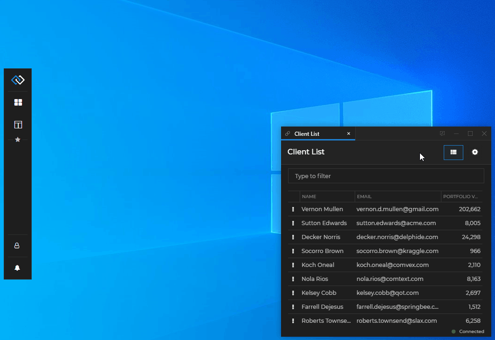

## Glue42 Desktop

*Release date: 22.11.2022*

<glue42 name="addClass" class="newFeatures" element="p" text="New Features">

> ### Workspaces
>
> #### Lock Settings
>
> - Added [UI for lock settings](../../../glue42-concepts/windows/workspaces/overview/index.html#using_workspaces-locking_workspaces) to the Workspaces App, which enables users to manually lock or unlock various Workspace elements in order to disable or allow their modification:
>
> 
>
> *See also how to provide lock settings in the [Workspace Layout](../../../glue42-concepts/windows/workspaces/overview/index.html#workspaces_concepts-workspace_layout-lock_settings) and [lock Workspaces programmatically](../../../glue42-concepts/windows/workspaces/javascript/index.html#workspace-lock_settings).*
>
> - Workspaces can now be saved and restored in a locked state.
>
> - Added new [lock settings](../../../glue42-concepts/windows/workspaces/javascript/index.html#workspace-lock_settings) for controlling the reordering of tabs and windows on a [`Workspace`](../../../reference/glue/latest/workspaces/index.html#Workspace), [`Group`](../../../reference/glue/latest/workspaces/index.html#Group) and [`WorkspaceWindow`](../../../reference/glue/latest/workspaces/index.html#WorkspaceWindow) level:
>
> ```javascript
> // Prevent the user from reordering the Workspace tab.
> myWorkspace.lock({ allowWorkspaceTabReorder: false });
>
> // Prevent the user from reordering the windows inside the Workspace.
> myWorkspace.lock({ allowWindowReorder: false });
>
> // Prevent the user from reordering the windows inside a `Group` element of the Workspace.
> // This will override the `Workspace` locking configuration.
> myWorkspaceGroup.lock({ allowReorder: false });
>
> // Prevent the user from reordering a window in the Workspace.
> // This will override the `Workspace` and `Group` locking configurations.
> myWorkspaceWindow.lock({ allowReorder: false });
> ```
>
> - Added a new [lock setting](../../../glue42-concepts/windows/workspaces/javascript/index.html#workspace-lock_settings) for preventing users from extracting Workspace tabs:
>
> ```javascript
> myWorkspace.lock({ allowWorkspaceTabExtract: false });
> ```
>
> #### Excluding Apps from Workspaces
>
> It's now possible to [prevent the user from dropping an app in a Workspace](../../../glue42-concepts/windows/workspaces/overview/index.html#extending_workspaces-workspaces_app_configuration-excluding__including_apps_in_workspaces) by using the `"allowWorkspaceDrop"` top-level property in the [app configuration](../../../developers/configuration/application/index.html):
>
> ```json
> {
>    "allowWorkspaceDrop": false
> }
> ```
>
> #### Custom Loader for Workspaces
>
> The [loading animation for individual Workspaces](../../../glue42-concepts/windows/workspaces/overview/index.html#extending_workspaces-loading_animation) can be customized by passing your own loader component when creating a [custom Workspaces App](../../../glue42-concepts/windows/workspaces/overview/index.html#extending_workspaces):
>
> ```javascript
> import React from "react";
> import Workspaces from "@glue42/workspaces-ui-react";
> import MyCustomLoader from "./MyCustomLoader";
>
> const App = () => {
>     return (
>         <div className="App">
>             <Workspaces
>                 components={{
>                     loadingAnimation: {
>                         Workspace: MyCustomLoader
>                     }
>                 }}
>             />
>         </div>
>     );
> };
>
> export default App;
> ```
>
> #### Workspaces API
>
> - Workspace [`Row`](../../../reference/glue/latest/workspaces/index.html#Row) and [`Column`](../../../reference/glue/latest/workspaces/index.html#Column) objects now have a [`setMaximizationBoundary()`](../../../reference/glue/latest/workspaces/index.html#Row-setMaximizationBoundary) method which you can use to restrict the maximization of Workspace windows within the bounds of a column or a row:
>
> ```javascript
> workspaceRow.setMaximizationBoundary({ enabled: true });
> ```
>
> - An [`onFocusChanged()`](../../../reference/glue/latest/workspaces/index.html#Frame-onFocusChanged) event for the Workspaces [`Frame`](../../../reference/glue/latest/workspaces/index.html#Frame) has been added that enables you to determine whether the `Frame` is focused:
>
> ```javascript
> const handler = ({ isFocused }) => console.log(`The Frame is ${isFocused ? "focused" : "not focused"}.`);
>
> myFrame.onFocusChanged(handler);
> ```
>
> #### Extending Workspaces
>
> A new [`<WorkspaceTabV2 />`](https://github.com/Glue42/core/blob/master/packages/workspaces-ui-react/src/defaultComponents/workspace/tabV2/WorkspaceTabV2.tsx) component has been added to the [`@glue42/workspaces-ui-react`](https://www.npmjs.com/package/@glue42/workspaces-ui-react) library that differs in structure from the [`<WorkspaceTab />`](https://github.com/Glue42/core/blob/master/packages/workspaces-ui-react/src/defaultComponents/workspace/WorkspaceTab.tsx) component, as it contains a [Lock Settings UI](../../../glue42-concepts/windows/workspaces/overview/index.html#using_workspaces-locking_workspaces) for the Workspace.

> ### Notifications
>
> The notification apps in [**Glue42 Enterprise**](https://glue42.com/enterprise/) have been replaced with more easily customizable React web apps. The [`@glue42/notifications-ui-react`](https://www.npmjs.com/package/@glue42/notifications-ui-react) library provides React hooks and default components that can be used, customized or entirely replaced when building your own [custom Notifications App](../../../glue42-concepts/notifications/overview/index.html#extending_notifications) with a custom Notification Panel and notification toasts.
>
> The following example demonstrates a basic usage of the library:
>
> ```javascript
> import React from "react";
> import {
>     NotificationsProvider,
>     useNotificationsContext,
>     Toasts
> } from "@glue42/notifications-ui-react";
> import CustomPanel from "./CustomPanel";
>
> const NotificationsWrapper = () => {
>     const { isPanelVisible } = useNotificationsContext();
>     return isPanelVisible ? <CustomPanel /> : <Toasts />;
> };
>
> const App = () => {
>     return (
>         <NotificationsProvider>
>             <NotificationsWrapper />
>         </NotificationsProvider>
>     );
> };
>
> export default App;
> ```
>
> A Notification Panel containing custom buttons in the header, a custom footer and customized footer buttons:
>
> 
>
> *Note that the [legacy Glue42 notifications](../../../glue42-concepts/notifications/overview/index.html#legacy_notifications) and the configurations for them are still supported.*

> ### Glue42 Window Groups
>
> #### Renaming Group & Window Captions
>
> Users can now manually [change the caption titles](../../../glue42-concepts/windows/window-management/overview/index.html#renaming_window__group_captions) of classic window groups, flat and tab Glue42 Windows. The user-defined names of groups and windows saved in a Layout will be preserved when the Layout is restored. To enable or disable renaming group and window captions, use the `"enableWindowGroupsCaptionEdit"` and `"enableWindowsCaptionEdit"` properties in the `stickywindows.json` [configuration file](../../../developers/configuration/glue42-windows/index.html) of [**Glue42 Enterprise**](https://glue42.com/enterprise/).
>
> 
>
> #### Showing the Apps in the Window Group
>
> The titles of all app windows participating in a window group are visible when right clicking on the group taskbar icon. When restoring a minimized group, the selected app is focused.
>
> 
>
> #### Web Groups Stickiness
>
> The `"enableStickiness"` property in the `stickywindows.json` configuration file of [**Glue42 Enterprise**](https://glue42.com/enterprise/) is now valid for the Glue42 [web groups](../../../glue42-concepts/windows/window-management/overview/index.html#window_groups-web_groups) as well and controls their [stickiness](../../../developers/configuration/glue42-windows/index.html#glue42_window_properties-window_stickiness):
>
> ```json
> // Disabling Glue42 Window stickiness (valid for both classic and web groups).
> {
>     "enableStickiness": false
> }
> ```

> ### Remote Configurations
>
> [**Glue42 Enterprise**](https://glue42.com/enterprise/) now supports [fetching configurations from a remote location](../../how-to/rebrand-glue42/functionality/index.html#remote_configurations). The [**Glue42 Enterprise**](https://glue42.com/enterprise/) [configuration files](../../../developers/configuration/overview/index.html) can be hosted on a [Glue42 Server](../../../glue42-concepts/glue42-server/index.html) or on another REST service. The configurations from the remote location will be fetched on startup of [**Glue42 Enterprise**](https://glue42.com/enterprise/) and will be merged with the locally available ones.
>
> To enable [**Glue42 Enterprise**](https://glue42.com/enterprise/) to fetch configurations from a remote location, use the `"remoteConfigs"` top-level key of the `gilding.json` configuration file located in the `%LocalAppData%\Tick42\GlueDesktop\config` folder:
>
> ```json
> {
>     "remoteConfig": {
>         "enabled": true,
>         "url": "https://<URL-to-my-glue42-server>/api/systemConfig/get",
>         "folder": "./config/remote-configs",
>         "wipeFolder": true
>     }
> }
> ```
>
> The [Glue42 Server](../../../glue42-concepts/glue42-server/index.html) now supports [hosting and providing remote configurations](../../../glue42-concepts/glue42-server/index.html#admin_ui-desktop_configs) for [**Glue42 Enterprise**](https://glue42.com/enterprise/).
>
> 

> ### Telemetry Data
>
> [**Glue42 Enterprise**](https://glue42.com/enterprise/) now exposes [telemetry data](../../../glue42-concepts/glue42-platform-features/index.html#telemetry_data) containing info related to the system environment and the running web apps which can be consumed by invoking the `"T42.Telemetry"` Interop method.
>
> On system level, you can track: focus duration, start and stop events for apps; the step-by-step system startup flow allowing you to investigate slow startups; all log entries; system CPU and memory usage.
>
> For web apps, you can track: all network requests per app; all app console logs; web page exceptions caught by the window [`"error"`](https://developer.mozilla.org/en-US/docs/Web/API/Window/error_event) event; CPU and memory usage per process.
>
> Telemetry data can be enabled or disabled using the `"telemetry"` top-level key of the `system.json` [configuration file](../../../developers/configuration/system/index.html) of [**Glue42 Enterprise**](https://glue42.com/enterprise/):
>
> ```json
> // Disabling telemetry data.
> {
>     "telemetry": {
>         "enabled": false
>     }
> }
> ```

> ### Feedback Button
>
> The [Feedback Form](../../how-to/rebrand-glue42/functionality/index.html#issue_reporting) can now be opened directly from an app instance by using the "Feedback" button in the app window header. The "Feedback" button is disabled by default and can be enabled globally from the [system configuration](../../../developers/configuration/system/index.html) of [**Glue42 Enterprise**](https://glue42.com/enterprise/) or per app from the [app configuration](../../../developers/configuration/application/index.html) file. The app configuration will override the global system configuration.
>
> 
>
> Enable the "Feedback" button globally for all apps from the `system.json` configuration file using the `"windows"` top-level key:
>
> ```json
> {
>     "windows": {
>         "showFeedbackButton": true
>     }
> }
> ```
>
> A new `"supportEmails"` property is available at top-level of the [app configuration](../../../developers/configuration/application/index.html) which is meant to be used for specifying the emails of the app owners. The email addresses defined in this property will be added to the Feedback Form if it has been triggered from that app.
>
> ```json
> {
>     "supportEmails": ["app.owner1@example.com", "app.owner2@example.com"]
> }
> ```

> ### Jump List Dynamic Control
>
> Added a JavaScript [jump list API](../../../glue42-concepts/glue42-platform-features/index.html#jump_list-jump_list_api) which you can use to enable or disable dynamically the jump list for individual windows, create jump list categories and actions:
>
> ```javascript
> const myWindow = glue.windows.my();
> // Check whether the jump list is enabled for the current window.
> const isJumpListEnabled = await myWindow.jumpList.isEnabled();
>
> if (!isJumpListEnabled) {
>     // Enabling the jump list.
>     await myWindow.jumpList.setEnabled(true);
> };
>
> // Finding a category.
> const category = await myWindow.jumpList.categories.find("Tasks");
> // Action settings.
> const actions = [
>     {
>         icon: "../images/toggle-theme.ico",
>         // This action will toggle the Glue42 theme.
>         callback: async () => {
>             const currentTheme = await glue.themes.getCurrent();
>
>             if (currentTheme.name === "dark") {
>                 glue.themes.select("light");
>             } else {
>                 glue.themes.select("dark");
>             };
>         },
>         singleInstanceTitle: "Toggle Theme",
>         multiInstanceTitle: "Toggle Theme"
>     }
> ];
>
> // Creating actions for an existing category.
> await category.actions.create(actions);
> ```
>
> 

> ### JavaScript Window Management API
>
> Added [`goForward()`](../../../reference/glue/latest/windows/index.html#GDWindow-goForward) and [`goBack()`](../../../reference/glue/latest/windows/index.html#GDWindow-goForward) methods on the [`GDWindow`](../../../reference/glue/latest/windows/index.html#GDWindow) object for navigating web pages forward and back.
>
> ```javascript
> // Navigate the web page forward.
> await myWindow.goForward();
>
> // Navigate the web page back.
> await myWindow.goBack();
> ```

> ### Java Channels API
>
> Added an `all()` method to the [Channels API](../../../glue42-concepts/data-sharing-between-apps/channels/java/index.html#all_channels) for getting a collection of all Channel names.
>
> ```java
> CompletionStage<Collection<String>> allChannelNames = glue.channels.all();
> ```

> ### Support for FDC3 2.0 Standards
>
> #### Glue42 FDC3 Implementation
>
> A new version of the [`@glue42/fdc3`](https://www.npmjs.com/package/@glue42/fdc3) library is available that supports the [FDC3 2.0](https://fdc3.finos.org/docs/fdc3-intro) standards. This is a new light-weight implementation of the FDC3 standards that, unlike previous versions, doesn't contain a Glue42 library within itself. For more details on how to use the [`@glue42/fdc3`](https://www.npmjs.com/package/@glue42/fdc3) library in your apps and correctly initialize the Glue42 library on which it depends, see the [FDC3 Compliance](../../fdc3-compliance/index.html) documentation.
>
> Auto injecting the [`@glue42/fdc3`](https://www.npmjs.com/package/@glue42/fdc3) library in your Glue42 enabled apps through [system configuration](../../../developers/configuration/system/index.html):
>
> ```json
> {
>     "windows": {
>         "autoInjectFdc3": {
>             "enabled": true,
>             "version": "*",
>             "whitelist": ["my-fdc3-app"]
>         }
>     }
> }
> ```
>
> Initializing the Glue42 JavaScript library in your app with the appropriate settings in order to be able to use all features of the [`@glue42/fdc3`](https://www.npmjs.com/package/@glue42/fdc3) library:
>
> ```javascript
> const config = {
>     // This is needed for the default Intents Resolver UI app to work properly.
>     appManager: "full",
>     // This is necessary in order to use the FDC3 Channels.
>     channels: true
> };
>
> await Glue(config);
> ```
>
> #### Intents Resolver
>
> [**Glue42 Enterprise**](https://glue42.com/enterprise/) now provides a default [Intents Resolver UI](../../../glue42-concepts/intents/overview/index.html#intents_resolver) app. The Intents Resolver UI allows users to choose which app to use for handling a raised [Intent](../../../glue42-concepts/intents/overview/index.html):
>
> 

> ### Gateway Memory Diagnostics
>
> Added new Glue42 Gateway [configuration](../../../developers/configuration/system/index.html#gateway_memory_diagnostics) that enables you to:
>
> - get snapshots of the heap memory when it exceeds a specified size;
> - limit the number of simultaneous app connections to the Glue42 Gateway;
> - specify maximum size of messages sent by apps to the Glue42 Gateway that, if exceeded, will trigger a warning in the logs;
>
> Sample configuration:
>
> ```json
> {
>     "gw": {
>         "configuration": {
>             "memory": {
>                 "report_interval": 300000,
>                 "max_backups": 5,
>                 "memory_limit": 1073741824,
>                 "dump_location": "%GLUE-USER-DATA%/heapsnapshots",
>                 "dump_prefix": "gw"
>             },
>             "limits": {
>                 "max_connections": 1000,
>                 "large_msg_threshold": 524288
>             }
>         }
>     }
> }
> ```

> ### App Keywords
>
> Added a `"keywords"` top-level key in the [app configuration](../../../developers/configuration/application/index.html#keywords) which allows for specifying a list of keywords for the app:
>
> ```json
> {
>     "keywords": ["keyword1", "keyword2"]
> }
> ```
>
> The keywords can be accessed through the JavaScript App Management API and used for filtering and searching for apps:
>
> ```javascript
> const keywords = glue.appManager.application("MyApp").keywords;
> ```

> ### Sending POST Data & Uploading Files
>
> Web apps can now send POST data and upload files. Use the `"urlLoadOptions"` property of the `"details"` top-level key in the [app configuration](../../../developers/configuration/application/index.html#sending_post_data__uploading_files) files for window apps to specify extra headers, an HTTP referrer, POST data or a user agent:
>
> ```json
> {
>     "details": {
>         "urlLoadOptions": {
>             "extraHeaders": "Content-Type: application/x-www-form-urlencoded",
>             "postData": [
>                 {
>                     "type": "base64",
>                     "data": "base64-encoded-string"
>                 }
>             ]
>         }
>     }
> }
> ```

> ### Clearing DNS & HTTP Cache
>
> To allow an app to [clear the DNS or HTTP cache](../../../glue42-concepts/glue42-platform-features/index.html#clearing_dns__http_cache), use the `"allowClearingCache"` top-level key of the [app configuration](../../../developers/configuration/application/index.html) file. Methods for clearing the cache are available on the `glue42gd` object attached to the global `window` object:
>
> Allowing an app to clear cache:
>
> ```json
> {
>     "allowClearingCache": true
> }
> ```
>
> Clearing HTTP and DNS cache:
>
> ```javascript
> // Clearing the HTTP cache.
> await glue42gd.clearCache();
> // Clearing the DNS cache.
> await glue42gd.clearHostResolverCache();
> ```

<glue42 name="addClass" class="bugFixes" element="p" text="Improvements and Bug Fixes">

> - Minor improvements and bugfixes.