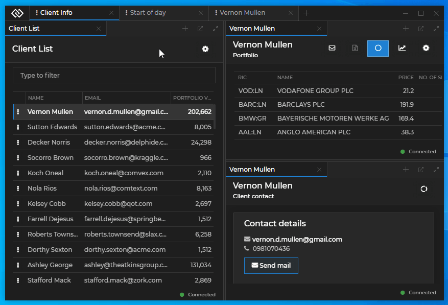

## Glue42 Desktop

*Release date: 26.07.2022*

<glue42 name="addClass" class="newFeatures" element="p" text="New Features">

> ### Workspaces
>
> #### Shortcuts
>
> Added [Workspace shortcuts](../../../glue42-concepts/windows/workspaces/javascript/index.html#workspace_shortcuts) that can be registered programmatically using the [`registerShortcut()`](../../../reference/glue/latest/workspaces/index.html#Frame-registerShortcut) method of the Workspaces [`Frame`](../../../reference/glue/latest/workspaces/index.html#Frame) object. There are also some default shortcuts available to the user. Workspace shortcuts allow the users to control the Workspaces only through the keyboard.
>
> The following shows the user going through all open Workspace tabs in a sequential order using the `CTRL + TAB` shortcut:
>
> 
>
> #### Multiple Workspaces Apps
>
> It's now possible to use [multiple Workspaces Apps](../../../glue42-concepts/windows/workspaces/overview/index.html#extending_workspaces-workspaces_app_configuration-multiple_workspaces_apps) when you need different design or functional solutions for your business use-cases. Created and saved Workspaces will be restored by the Workspaces App with which they are associated. This is also valid when saving and restoring a Global Layout which contains one or more Workspaces. Using configuration, you can specify which of the available Workspaces Apps will be the default one. The default Workspaces App will handle Workspaces that aren't associated with any Workspaces App, and also the case when the specified Workspaces App isn't available.
>
> You can [target a Workspaces App](../../../glue42-concepts/windows/workspaces/javascript/index.html#workspace-targeting) programmatically when creating or restoring a Workspace and when opening an empty Frame.

> ### Frameless Windows
>
> [Frameless windows](../../../glue42-concepts/windows/window-management/overview/index.html#window_modes-frameless_windows) now support showing [flydown and popup windows](../../../glue42-concepts/windows/window-management/overview/index.html#flydown__popup_windows) and can also be used as flydown or popup windows.

> ### JavaScript Cookies API
>
> Added a new JavaScript API for [manipulating cookies](../../../glue42-concepts/glue42-platform-features/index.html#cookies). The [Cookies API](../../../reference/glue/latest/cookies/index.html) enables your app to retrieve, filter, set and remove cookies at runtime.
>
> Setting a cookie:
>
> ```javascript
> const cookie = {
>     url: "https://example.com",
>     name: "MyCookie",
>     value: "42"
> };
>
> await glue.cookies.set(cookie);
> ```

> ### JavaScript APIs
>
> #### Window Events
>
> Added an [`onNavigating()`](../../../glue42-concepts/windows/window-management/javascript/index.html#window_events-navigating) method to the [`GDWindow`](../../../reference/glue/latest/windows/index.html#GDWindow) instance that allows handling the event when the web app is about to navigate to a new address.
>
> ```javascript
> const navigationHandler = (info) => {
>     console.log(`Navigating to: ${info.newUrl}`);
> };
>
> myWindow.onNavigating(navigationHandler);
> ```
>
> #### Window Operations
>
> Added a [`getChannel()`](../../../glue42-concepts/windows/window-management/javascript/index.html#window_operations-channel) method to the [`GDWindow`](../../../reference/glue/latest/windows/index.html#GDWindow) instance that allows retrieving the name of the current Channel.
>
> ```javascript
> const channelName = await myWindow.getChannel();
>
> if (channelName) {
>     // Use the Channels API to manipulate the Channel context.
> };
> ```
>
> #### Notifications
>
> Added a [`configure()`](../../../glue42-concepts/notifications/javascript/index.html#configuration) method that can be used to enable or disable notification toasts or completely turn off notifications.
>
> ```javascript
> const config = { enable: false };
>
> await glue.notifications.configure(config);
> ```

> ### SSO Windows
>
> It's now possible to [define your SSO app](../../how-to/rebrand-glue42/functionality/index.html#login_screen-configuration) in a standard Glue42 configuration file, gaining more control over the login screen.

<glue42 name="addClass" class="bugFixes" element="p" text="Improvements and Bug Fixes">

> - Upgraded to Electron 19 (Chromium 102).
>
> - Minor improvements and bugfixes.