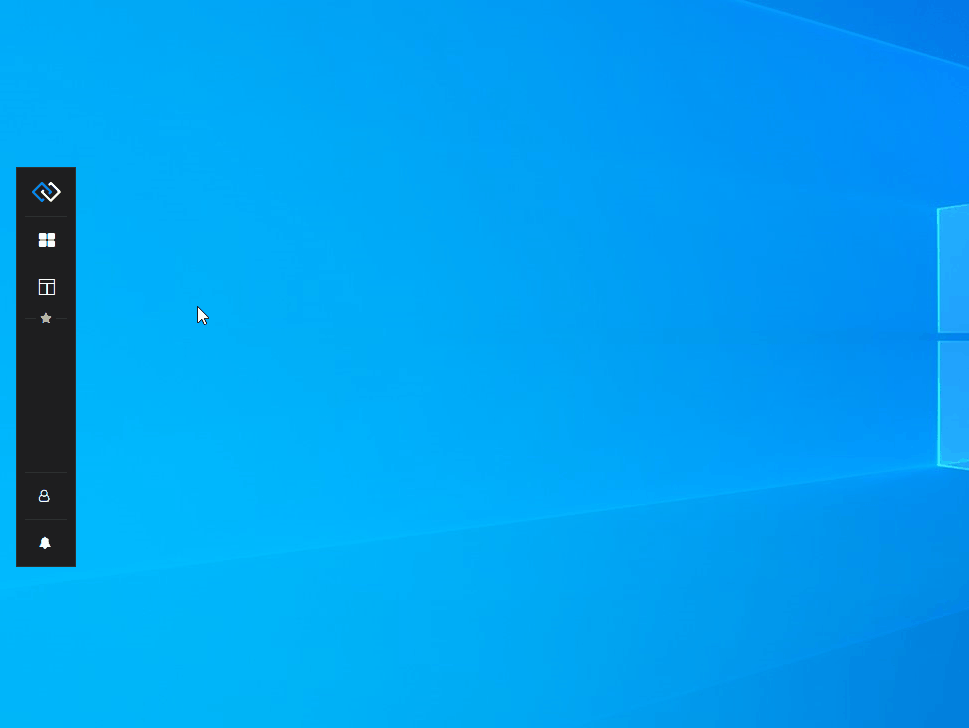

## Glue42 Desktop

*Release date: 20.05.2022*

<glue42 name="addClass" class="newFeatures" element="p" text="New Features">

> ### Web Groups
>
> Added an experimental web-based implementation of the Glue42 Window groups - Glue42 [web groups](../../../glue42-concepts/windows/window-management/overview/index.html#window_groups-web_groups), which are entirely [customizable](../../../glue42-concepts/windows/window-management/overview/index.html#extending_web_groups) with the help of the [`@glue42/groups-ui-react`]() library.
>
> The default group implementation in [**Glue42 Enterprise**](https://glue42.com/enterprise/), the Glue42 [classic groups](../../../glue42-concepts/windows/window-management/overview/index.html#window_groups-classic_groups), is based on WPF components. To try out and experiment with the Glue42 web groups, set the `"groupType"` property in the `stickywindows.json` configuration file to `"Web"`:
>
> ```json
> // The default value is `"Classic"`.
> {
>     "groupType": "Web"
> }
> ```
>
> *Note that the web-based implementation of the Glue42 Window groups is still an experimental feature and some inconsistencies in functionality and UI may be present.*

> ### Frameless Windows
>
> Added a new Glue42 Window type - [frameless window](../../../glue42-concepts/windows/window-management/overview/index.html#window_modes-frameless_windows). Frameless windows allow for creating apps with non-standard, freeform shapes.
>
> 
>
> [Configuring](../../../developers/configuration/application/index.html#application_configuration-frameless_window) a frameless window:
>
> ```json
> {
>     "name":"frameless-app",
>     "icon": "https://example.com/icon.ico",
>     "type": "window",
>     "details":{
>         "url":"https://localhost:3000",
>         "mode": "frameless",
>         "width": 400,
>         "height": 400
>     }
> }
> ```
>
> The new frameless window type also allows you to [customize the splash screen](../../how-to/rebrand-glue42/user-interface/index.html) of [**Glue42 Enterprise**](https://glue42.com/enterprise/) with transparent areas or use irregular shapes for it.

> ### Jump List
>
> Added a [jump list](../../../glue42-concepts/glue42-platform-features/index.html#jump_list) to the taskbar icon context menu of Glue42 enabled apps. The jump list contains a categorized list with predefined actions that can be configured globally and per app. Currently, only an action for centering apps on the primary screen is supported:
>
> 
>
> Default jump list system configuration:
>
> ```json
> {
>     "windows": {
>         "jumpList": {
>             "enabled": true,
>             "categories": [
>                 {
>                     "title": "System",
>                     "actions": [
>                         {
>                             "type": "centerScreen",
>                             "singleInstanceTitle": "Center on Primary Screen",
>                             "multiInstanceTitle": "Center all on Primary Screen"
>                         }
>                     ]
>                 }
>             ]
>         }
>     }
> }
> ```

> ### Java API Window Events
>
> Added new [Glue42 Window events](../../../glue42-concepts/windows/window-management/java/index.html#window_events) for the Java API. You can now subscribe for changes to the window [title](../../../glue42-concepts/windows/window-management/java/index.html#window_events-title), [bounds](../../../glue42-concepts/windows/window-management/java/index.html#window_events-size__position), [visibility](../../../glue42-concepts/windows/window-management/java/index.html#window_events-visibility) and [focus](../../../glue42-concepts/windows/window-management/java/index.html#window_events-focus).

<glue42 name="addClass" class="bugFixes" element="p" text="Improvements and Bug Fixes">

> - Upgraded to Electron 17 (Chromium 98).
>
> - Minor improvements and bugfixes.