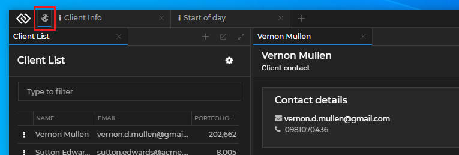

## Glue42 Desktop

*Release date: 21.02.2022*

<glue42 name="addClass" class="breakingChanges" element="p" text="Breaking Changes">

> ### Process Reuse
>
> Due to upgrading to Electron 16 (Chromium 96), the Process Reuse feature is no longer supported.

<glue42 name="addClass" class="newFeatures" element="p" text="New Features">

> ### Workspaces
>
> New functionalities and API features of [Workspaces](../../../glue42-concepts/windows/workspaces/overview/index.html).
>
> #### Empty Frame
>
> It is now possible to [open an empty frame](../../../glue42-concepts/windows/workspaces/javascript/index.html#frame-empty_frame) and initializing it with Workspace Layouts programmatically.
>
> #### Pinning & Unpinning
>
> It is now possible to [pin and unpin](../../../glue42-concepts/windows/workspaces/javascript/index.html#workspace-pinning__unpinning_workspaces) Workspaces programmatically.
>
> Pinned Workspace with a custom icon:
>
> 
>
> #### Focus
>
> It is now possible to [control the focus](../../../glue42-concepts/windows/workspaces/javascript/index.html#workspace-focusing_a_workspace) of a newly created Workspace.
>
> #### Tab Position
>
> It is now possible to [define the position](../../../glue42-concepts/windows/workspaces/javascript/index.html#workspace-positioning_a_workspace) of a Workspace tab.
>
> #### Using Glue42 APIs in the Frame
>
> Added documentation for the specifics of [using Glue42 APIs from a Workspaces App](../../../glue42-concepts/windows/workspaces/overview/index.html#extending_workspaces-using_glue42_apis_in_the_frame).


> ### Cookies
>
> Web apps can now [manipulate cookies](../../../glue42-concepts/glue42-platform-features/index.html#cookies) for the default web session.

> ### Global Protocol Handler
>
> The name of the Glue42 [global protocol handler](../../../glue42-concepts/glue42-platform-features/index.html#global_protocol_handler) is now [configurable](../../how-to/rebrand-glue42/functionality/index.html#other_system_configurations-global_protocol_handler).
>
> Use the `"protocol"` property of the `"protocolHandler"` top-level key in the `system.json` file:
>
> ```json
> {
>     "protocolHandler": {
>         "protocol": "mycustomprotocol"
>     }
> }
> ```
>
> Using the custom protocol name to start a Glue42 enabled application:
>
> ```cmd
> mycustomprotocol://app/clientlist
> ```

> ### Electron Apps
>
> Third-party [Electron apps](../../how-to/glue42-enable-your-app/electron/index.html) can now participate in Glue42 using the [`@glue42/electron`](https://www.npmjs.com/package/@glue42/electron) library.

> ### Node.js Versions
>
> Added support for [multiple Node.js versions](../../../developers/configuration/application/index.html#application_configuration-nodejs-using_different_nodejs_versions) for Node.js apps.
>
> Use the `"nodeVersion"` property of the `"details"` top-level key in the [application configuration](../../../developers/configuration/application/index.html#application_configuration-nodejs) to specify a Node.js version:
>
> ```json
> {
>     "details": {
>         "nodeVersion": "16.13.2"
>     }
> }
> ```

> ### Remote Node.js Apps
>
> Added support for [remote Node.js apps](../../../developers/configuration/application/index.html#application_configuration-nodejs-remote).
>
> Use the `"remote"` property of the `"details"` top-level key in the [application configuration](../../../developers/configuration/application/index.html#application_configuration-nodejs):
>
> ```json
> {
>     "details": {
>         "remote": {
>             "url": "http://localhost:8080/bundled.js",
>             "noCache": true
>         }
>     }
> }
> ```

> ### Preventing Shutdown & Restart
>
> Shutdown and restart of [**Glue42 Enterprise**](https://glue42.com/enterprise/) can now be [prevented](../../../glue42-concepts/application-management/javascript/index.html#events-shutdown_event) programmatically.
>
> ```javascript
> // Preventing restart or shutdown.
> const handler = async () => { return { prevent: true } };
>
> glue.appManager.onShuttingDown(handler);
> ```

> ### Bypassing App Default Layout
>
> Using `SHIFT + click` to start an application from the Glue42 Toolbar will [bypass the last saved Application Default Layout](../../../glue42-concepts/windows/layouts/overview/index.html#bypassing_application_default_layouts) and will open the application window with the bounds specified in its configuration file.

> ### Publishing Metrics with Kafka
>
> Added documentation for [publishing metrics with Kafka](../../../glue42-concepts/metrics/overview/index.html#publishing-publishing_with_kafka).

> ### Delphi Documentation
>
> Added Delphi documentation:
>
> - [Glue42 Enable Your App](../../how-to/glue42-enable-your-app/delphi/index.html)
> - [Application Management](../../../glue42-concepts/application-management/delphi/index.html)
> - [Shared Contexts](../../../glue42-concepts/data-sharing-between-apps/shared-contexts/delphi/index.html)
> - [Channels](../../../glue42-concepts/data-sharing-between-apps/channels/delphi/index.html)
> - [Interop](../../../glue42-concepts/data-sharing-between-apps/interop/delphi/index.html)
> - [Window Management](../../../glue42-concepts/windows/window-management/delphi/index.html)
> - [Delphi Reference](../../how-to/glue42-enable-your-app/delphi/index.html#comdelphi_reference)

> ### Blazor Documentation
>
> Added [Blazor](../../how-to/glue42-enable-your-app/blazor/index.html) documentation.

<glue42 name="addClass" class="bugFixes" element="p" text="Improvements and Bug Fixes">

> - Upgraded to Electron 16 (Chromium 96).
>
> - Minor improvements and bugfixes.