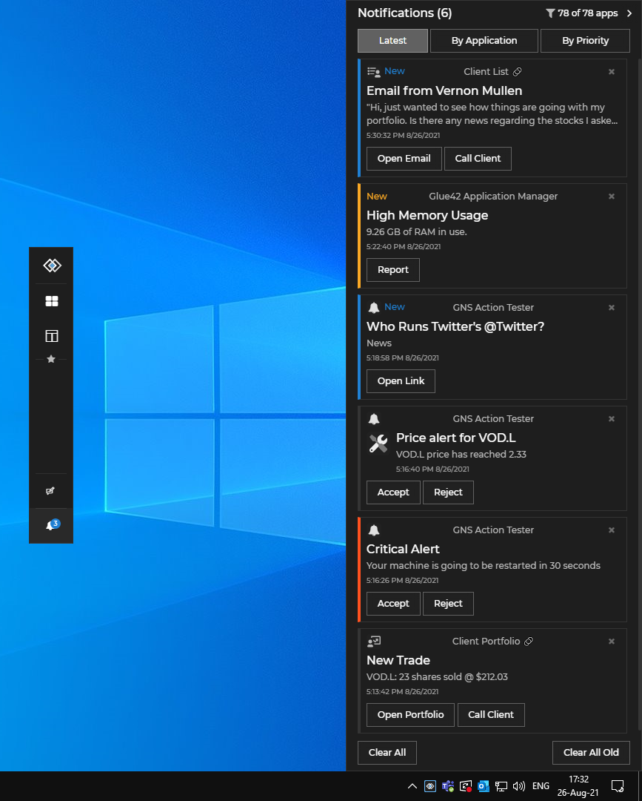

## Glue42 Desktop

*Release date: 02.09.2021*

<glue42 name="addClass" class="newFeatures" element="p" text="New Features">

> ### Notifications
>
>  New notifications design and features of the JavaScript [Notifications API](../../../glue42-concepts/notifications/javascript/index.html) - [notification filters](../../../glue42-concepts/notifications/javascript/index.html#notification_filters), [notification options](../../../glue42-concepts/notifications/javascript/index.html#raising_notifications-notification_options) and [Notification Panel API](../../../glue42-concepts/notifications/javascript/index.html#notification_panel)
>
> 

> ### Workspace Lockdown
>
> Added more [Lockdown](../../../glue42-concepts/windows/workspaces/javascript/index.html#workspace-lockdown) options for [Workspaces](../../../glue42-concepts/windows/workspaces/overview/index.html) elements.

> ### Themes
>
> Added `"title"`, `"tabGroupIcon"` and `"tabGroupTitle"` properties to the `"group"` key in the [Themes](../../../developers/configuration/themes/index.html#theme_properties-window_groups) configuration file which can be used for specifying a title for [Glue42 Window groups](../../../glue42-concepts/windows/window-management/javascript/index.html#window_groups) and an icon and a title for [Glue42 tab groups](../../../glue42-concepts/windows/window-management/javascript/index.html#tab_windows).
>
> ```json
> {
>     "group": {
>         "title": "Glue42 Window Group",
>         "tabGroupIcon": "tab-groups.ico",
>         "tabGroupTitle": "Glue42 Tab Group"
>     }
> }
> ```

> ### Glue42 Java
>
> Support for Channel context without registering a window.

<glue42 name="addClass" class="bugFixes" element="p" text="Improvements and Bug Fixes">

> - Improvements regarding the design and stability of Workspaces.
>
> - Improvements regarding Glue42 Desktop stability.
>
> - Minor bug fixes in the Glue42 Java library regarding the Glue42 Channels.