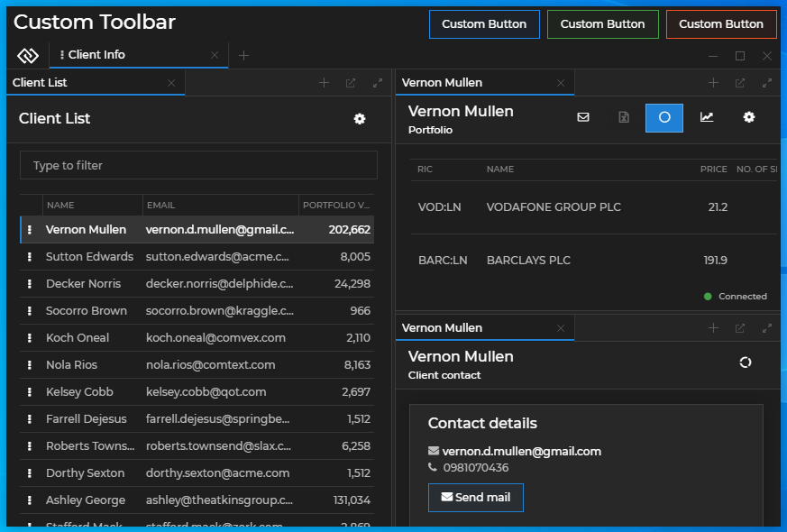
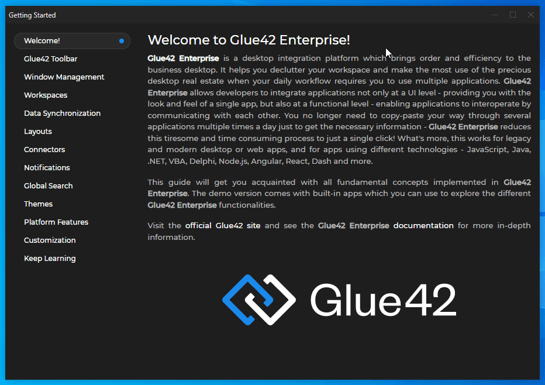

## Glue42 Desktop

*Release date: 09.12.2020*

<glue42 name="addClass" class="breakingChanges" element="p" text="Breaking Changes">

> **Opening and Saving Layouts from Earlier Glue42 Versions**
>
> [Layouts](../../../glue42-concepts/windows/layouts/overview/index.html) created with Glue42 3.10 or earlier *can* be opened in Glue42 3.11, however, *once saved in Glue42 3.11, they can't be opened in Glue42 3.10 or earlier.* It is strongly recommended that you don't point Glue42 3.10 or earlier and Glue42 3.11 to the same Layout stores.

<glue42 name="addClass" class="newFeatures" element="p" text="New Features">

> Workspaces can now be [customized and extended](../../../glue42-concepts/windows/workspaces/overview/index.html#extending_workspaces) with custom components.
>
> 

> Added documentation for manipulating [Workspace context](../../../glue42-concepts/windows/workspaces/javascript/index.html#workspace_context).

> Window stickiness can now be controlled [programmatically](../../../glue42-concepts/windows/window-management/javascript/index.html#window_operations-stickiness) and through a [Sticky button](../../../developers/configuration/glue42-windows/index.html#glue42_window_properties-sticky_button).
>
> 

> [Window placement](../../../glue42-concepts/windows/window-management/javascript/index.html#window_operations-placement) functionality added.

> ["CTRL + F" search feature](../../../glue42-concepts/glue42-platform-features/index.html#web_app_search) added for web apps in Glue42 Windows.
>
> 

> Glue42 Windows can now be [extracted programmatically](../../../glue42-concepts/windows/window-management/javascript/index.html#ungrouping_windows) from Glue42 Window Groups.
>
> 

> Added a [shutdown hook](../../../glue42-concepts/application-management/javascript/index.html#events-shutdown_event) to the JavaScript Application Management API to enable the execution of custom code before [**Glue42 Enterprise**](https://glue42.com/enterprise/) shuts down.

> PDF files can now be [opened and controlled with URL parameters](../../../glue42-concepts/windows/window-management/javascript/index.html#opening_windows-opening_pdf_files) in Glue42 Windows.

> Web pages can now be printed or saved as PDF files [programmatically](../../../glue42-concepts/windows/window-management/javascript/index.html#window_operations-print) or by [using "CTRL + P"](../../../developers/configuration/system/index.html#window_settings-printing).

<glue42 name="addClass" class="bugFixes" element="p" text="Improvements and Bug Fixes">

> Improved support for [FDC3 compliant applications](../../fdc3-compliance/index.html#fdc3_for_glue42_enterprise-configuration) regarding the control over initializing the Glue42 JavaScript library.