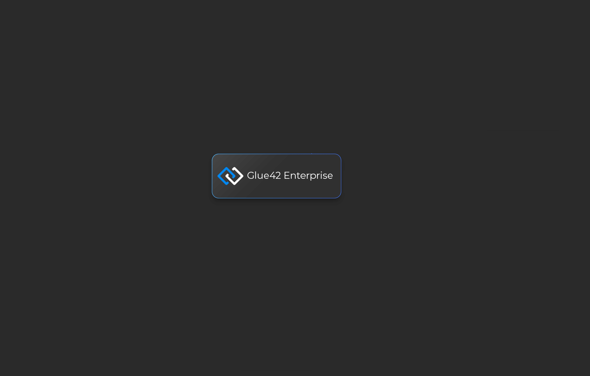
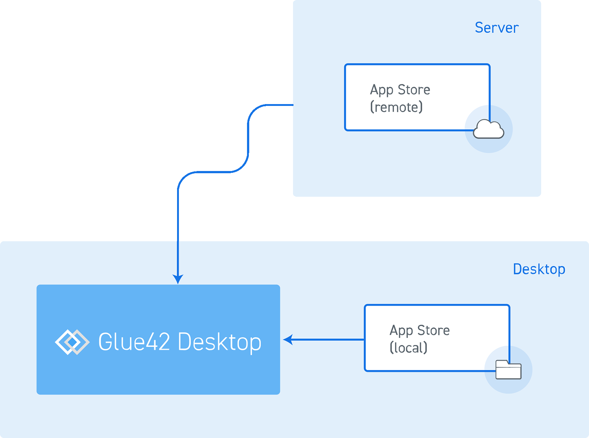

## Overview

The Application Management API provides a way to manage [**Glue42 Enterprise**](https://glue42.com/enterprise/) applications. It offers abstractions for:

- *Application* - a program as a logical entity, registered in [**Glue42 Enterprise**](https://glue42.com/enterprise/) with some metadata (name, description, icon, etc.) and with all the configuration needed to spawn one or more instances of it. The Application Management API provides facilities for retrieving application metadata and for detecting when an application is started.

*On how to define and configure an application, see the [Configuration](../../../developers/configuration/application/index.html) section of the documentation.*

- *Instance* - a running copy of an application. The Application Management API provides facilities for starting/stopping application instances and tracking application related events.



## Application Stores

[**Glue42 Enterprise**](https://glue42.com/enterprise/) can obtain application configurations from a path to a local app configurations folder, as well as from a remote REST service. The settings for defining application configuration stores can be edited in the `system.json` file of Glue42 Enterprise, located in `%LocalAppData%\Tick42\GlueDesktop\config`.

In the standard [**Glue42 Enterprise**](https://glue42.com/enterprise/) deployment model, application definitions are not stored locally on the user machine but are served remotely. If [**Glue42 Enterprise**](https://glue42.com/enterprise/) is configured to use a remote FDC3 App Directory compatible application store, it will poll it periodically and discover new application definitions. The store implementation is usually connected to an entitlement system based on which different users can have different applications or versions of the same application. In effect, [**Glue42 Enterprise**](https://glue42.com/enterprise/) lets users run multiple versions of the same application simultaneously and allows for seamless forward/backward application rolling. 




### Local Path App Stores

If you want to add an app store, add an object like the one below in the `appStores` array property:

```json
"appStores": [
    {
        "type": "path",
        "details": {
            "path": "path to a folder with app configurations"
        }
    },
    {
        "type": "path",
        "details": {
            "path": "path to another folder with app configurations"
        }
    }
]
```

### REST Service App Stores

Application configurations can also be hosted on a server and obtained from a REST service. 

For a reference implementation of a remote application configurations store, see the [Node.js REST Config](https://github.com/Glue42/rest-config-example-node-js) example that implements the [FDC3 App directory](https://fdc3.finos.org/docs/1.0/appd-intro) and is compatible with [**Glue42 Enterprise**](https://glue42.com/enterprise/). This basic implementation does not take the user into account and returns the same set of data for all requests. For instructions on running the sample server on your machine, see the `README.md` in the repository.

For a .NET implementation of a remote application configurations store, see the [.NET REST Config](https://github.com/Tick42/rest-config-example-net) example.

If your [**Glue42 Enterprise**](https://glue42.com/enterprise/) copy is not configured to retrieve its configuration from a remote source, you will need to edit the `system.json` file (located in the `%LOCALAPPDATA%\Tick42\GlueDesktop\config` directory).

**Connecting to the REST Service**

To configure a connection to the REST service providing the application store, you only need to add a new entry to the `appStores` top-level key:

```json
"appStores": [
    {
        "type": "rest",
        "details": {
            "url": "http://localhost:3000/appd/v1/apps/search",
            "auth": "no-auth",
            "pollInterval": 30000,
            "enablePersistentCache": true,
            "cacheFolder": "%LocalAppData%/Tick42/UserData/%GLUE-ENV%-%GLUE-REGION%/gcsCache/"
        }
    }
]
```

The only required properties are `type`, which should be set to `rest`, and `url`, which is the address of the remote application store. You can also set the authentication, polling interval, cache persistence and cache folder.

- `auth` - authentication configuration;
- `pollInterval` - interval at which to poll the REST service for updates;
- `enablePersistentCache` - whether to cache and persist the configuration files locally (e.g., in case of connection interruptions);
- `cacheFolder` - where to keep the persisted configuration files;

## Default Application Bounds

When an application is started from the [Glue42 Toolbar](../../glue42-toolbar/index.html), its initial size and position is defined in the [application configuration](../../../developers/configuration/application/index.html). When the user moves or resizes an application, [**Glue42 Enterprise**](https://glue42.com/enterprise/) remembers its last position and size and uses them as initial bounds the next time the application starts. Saving the last window bounds is enabled by default for all applications, but can be disabled per application using the `ignoreSavedLayout` property in its configuration:

```json
{
    "name": "my-app",
    "type": "window",
    ...
    "ignoreSavedLayout": true,
    "details": {
        "url": "https://example.com",
        ...
    }
}
``` 