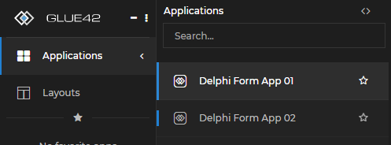

## Register Froms as Separate Glue Applications
In a multi-form application, you can expose individual forms as separate applications in Glue42.  
You will need the following:
- Implement the IGlueApp interface in the forms which are to be exposed as Glue applications
- Register a form as a Glue application factory and configure the applications

### Implement the `IGlueApp` Interface
The forms which are to be exposed as Glue applications need to implement the `IGlueApp` interface.
```delphi
TApp01Form = class(TForm, IGlueApp)
  ...
protected
    function SaveState(out pRetVal: GlueValue): HResult; stdcall;
    function Initialize(state: GlueValue; const glueWindow: IGlueWindow): HResult; stdcall;
    function Shutdown: HResult; stdcall;
  ...
```
This is a sample minimal implementation of the interface methods:
```delphi
function TApp01Form.Initialize(state: GlueValue;
  const glueWindow: IGlueWindow): HResult;
begin
  Result := S_OK;
end;

function TApp01Form.SaveState(out pRetVal: GlueValue): HResult;
begin
  Result := S_OK;
end;

function TApp01Form.Shutdown: HResult;
begin
  Result := S_OK;
  Close;
end;
```

### Turn a form into a Glue application factory
A form can act as a Glue application factory when it implements the `IAppFactory` interface. The `CreateApp` method will be invoked by Glue whenever a new Glue application/form is to be created.  
The form acting as a Glue application factory does not need to be visible.

```delphi
  TMainForm = class(TForm, IAppFactory)
  ...
  protected
    // implements IAppFactory
    function CreateApp(const appDefName: WideString; state: GlueValue; const announcer: IAppAnnouncer): HResult; stdcall;
  ...
```    

### Register the Glue application(s)

```delphi
procedure TMainForm.InitializeGlue;
var
  ...
  appDef: GlueAppDefinition;
begin
  ...
    // init and start the Glue42
    G42.Start(inst);
  ...
    // register an application using the main form as an application factory
    ZeroMemory(@appDef, sizeof(appDef));
    appDef.Name := 'DelpiFormApp01';
    appDef.title := 'Delphi Form App 01';
    appDef.Category := 'COM Apps';
    G42.AppFactoryRegistry.RegisterAppFactory(appDef, Self);

    // register another application
    ZeroMemory(@appDef, sizeof(appDef));
    appDef.Name := 'DelpiFormApp02';
    appDef.title := 'Delphi Form App 02';
    appDef.Category := 'COM Apps';
    G42.AppFactoryRegistry.RegisterAppFactory(appDef, Self);
  ...
```

### Create the Glue applications/forms
Creating the forms and wrapping them as Glue windows is done in the implementation of the `CreateApp` method

```delphi
function TMainForm.CreateApp(const appDefName: WideString; state: GlueValue; const announcer: IAppAnnouncer): HResult; stdcall;
var
  form01Inst: TApp01Form;
  form02Inst: TApp02Form;
begin
  if appDefName = 'DelphiFormApp01' then
  begin
    form01Inst := TApp01Form.Create(self);
    announcer.RegisterAppInstance(form01Inst.Handle, form01Inst);
    Result := S_OK;
  end
  else if appDefName = 'DelphiFormApp02' then
  begin
    form02Inst := TApp02Form.Create(self);
    announcer.RegisterAppInstance(form02Inst.Handle, form02Inst);
    Result := S_OK;
  end
  else
    Result := E_FAIL;
end;

```

### Start the Applications

Once the Delphi application has started started and the code to initialize Glue and register the forms has executed, the newly registered applications will appear in the Glue42 Enterprise Application Manager.



When the application is started from the Application Manager, Glue will invoke the `CreateApp` method of the form acting as application factory with appropriate parameters.
This will trigger the creation of the forms and wrapping them as Glue windows.