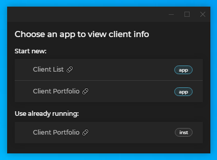

## Overview

In certain workflow scenarios, your app may need to start (or activate) a specific app. For instance, you may have an app showing client portfolios with financial instruments. When the user clicks on an instrument, you want to start an app which shows a chart for that instrument. In other cases, you may want to present the user with several options for executing an action or handling data from the current app.

The Intents API makes all that possible by enabling apps to register, find and raise Intents.

The case with the "Portfolio" and the "Chart" app above can be implemented in the following way:

1. The "Chart" apps registers an Intent called "ShowChart", specifying the data type (predefined data structure) that it works with - e.g., "Instrument".

2. When the user clicks on on instrument, the "Portfolio" app raises the "ShowChart" Intent, optionally specifying an Intent target, data type and app start up options.

This way, the "Portfolio" and "Chart" apps can be completely decoupled. If later the "Chart" app needs to be replaced, the new app for showing charts only needs to register the same Intent in order to replace the old one (provided that it works with the "Instrument" data structure as well).

Another case where the Intents API can be useful is if you want to find (and possibly filter) all apps that have registered a certain Intent. This may be because you want to present the user with all available (or appropriate) options for executing an action or handling data - e.g., on hover over an instrument or when clicking an instrument, the user sees a menu with all apps that have registered the Intent "ShowChart" *and* can work with the "Instrument" data structure:

1. All apps that can visualize data in charts register an Intent called "ShowChart", specifying the data structure they work with. Some of them work with "Instrument" data type, others work with different data types.

2. When the user clicks on an instrument in the "Portfolio" app, the "Portfolio" app searches for all registered Intents with a name "ShowChart" and filters them by the data type they work with.

3. The user sees a menu built on the fly which shows all currently available apps for visualizing charts that work with "Instrument" data type.

## Defining Intents

Intents are either defined through the app configuration file, or registered dynamically at runtime. User defined app files are usually located in the `%LocalAppData%\Tick42\UserData\<ENV>-<REG>\apps` folder, where `<ENV>-<REG>` must be replaced with the environment and region of your [**Glue42 Enterprise**](https://glue42.com/enterprise/) copy (e.g., `T42-DEMO`). Intents are configured under the `intents` top-level key of the app configuration file.

It is possible for different apps to register an Intent with the same name, which is useful when several apps perform the same action or work with the same data structure. This allows for easy replacement of apps. You may have an old app that has registered an Intent called `"ShowChart"` which you want to replace with a new app. Your new app only needs to register the same Intent (you can either remove the old app or leave it as an additional option for the users who prefer it). No changes to the calling app are necessary - when it raises the `"ShowChart"` Intent, the new app will be called.

Use the `intents` top-level key in the app configuration file to define an Intent:

```json
{
    "intents": [
        {
            "name": "ShowChart",
            "displayName": "BBG Instrument Chart",
            "contexts": ["Instrument"]
        }
    ]
}
```

| Property | Description |
|----------|-------------|
| `name` | **Required**. The name of the Intent. |
| `displayName` | The human readable name of the Intent. Can be used in context menus, etc., to visualize the Intent. |
| `contexts` | The type of predefined data structures with which the app can work. |

## Intents Resolver

<glue42 name="addClass" class="colorSection" element="p" text="Available since Glue42 Enterprise 3.17">

[**Glue42 Enterprise**](https://glue42.com/enterprise/) provides a default Intents Resolver UI app that is enabled by default and will be started when there are more than one handlers available for a raised Intent. The Intents Resolver UI allows you to manually select which app to handle the raised Intent and to choose whether to start a new instance of an Intent handler or use an already running instance of it:



The Intents Resolver UI is enabled by default and will be used by all Glue42 enabled apps that raise an Intent. To disable it for an app, set to `false` the `enableIntentsResolverUI` property of the `intents` key in the configuration object when [initializing](../../../getting-started/how-to/glue42-enable-your-app/javascript/index.html#initializing_the_library) the Glue42 library:

```javascript
import Glue from "@glue42/desktop";

const config = {
	intents: {
		enableIntentsResolverUI: false
	}
};

await Glue(config);
```

If you want to disable the Intents Resolver UI for all apps, you can use the [library auto injection and initialization](../../../getting-started/how-to/glue42-enable-your-app/javascript/index.html#auto_injecting_the_library) configuration in the `system.json` [configuration file](../../../developers/configuration/system/index.html) of [**Glue42 Enterprise**](https://glue42.com/enterprise/):

```json
{
    "windows": {
        "autoInjectAPI": {
            "enabled": true,
            "version": "5.*",
            "autoInit": {
                "intents": {
                    "enableIntentsResolverUI": false
                }
            }
        }
    }
}
```

## Extending the Intents Resolver

The [source code of the Intents Resolver UI](https://github.com/Glue42/core/tree/master/templates/intents-resolver) app is available on GitHub. You can use it as a template when creating your own Intents Resolver App.

To create a custom Intents Resolver App, you must provide an [app configuration](../../../developers/configuration/application/index.html) file for it and implement the Intents Resolver functionalities using the [`@glue42/intents-resolver-api`](https://www.npmjs.com/package/@glue42/intents-resolver-api) library.

### Configuration

Your custom Intents Resolver App, as every Glue42 enabled app, must have an [app configuration](../../../developers/configuration/application/index.html) file. You can either modify the configuration of the default Intents Resolver App located in `%LocalAppData%\Tick42\GlueDesktop\config\apps`, or replace it altogether:

```json
{
    "name": "my-custom-intents-resolver",
    "type": "window",
    "title": "Open with...",
    "details": {
        "url": "http://localhost:3000"
    }
}
```

By default, [**Glue42 Enterprise**](https://glue42.com/enterprise/) expects an Intents Resolver App with the `"name"` property set to `"intentsResolver"`. If you choose another name, you must specify it when initializing the Glue42 library in all apps that should use your custom Intents Resolver App when raising an Intent:

```javascript
import Glue from "@glue42/desktop";

const config = {
	intents: {
	    // Name of your custom Intents Resolver App.
		intentsResolverAppName: "my-custom-intents-resolver"
	}
};

await Glue(config);
```

### Intents Resolver API

The [`@glue42/intents-resolver-api`](https://www.npmjs.com/package/@glue42/intents-resolver-api) library offers out-of-the-box functionalities that facilitate the implementation of a custom Intents Resolver App.

#### Installation & Initialization

To use the library in your project, execute the following command:

```cmd
npm install @glue42/intents-resolver-api
```

To initialize the [`@glue42/intents-resolver-api`](https://www.npmjs.com/package/@glue42/intents-resolver-api) library, pass its factory function to the `libraries` array of the configuration object when initializing the Glue42 library. Also, set the `appManager` property of the configuration object to `"full"`, so that app and instance events are available:

```javascript
import Glue from "@glue42/desktop";
import GlueIntentsResolver from "@glue42/intents-resolver-api";

const config = {
	libraries: [GlueIntentsResolver],
    // This is necessary for listening for app and instance events.
	appManager: "full"
};

await Glue(config);
```

#### Usage

The Intents Resolver API is accessible through the [`glue.intents.resolver`](../../../reference/glue/latest/intents/index.html#Resolver) object. It offers methods for listening for events fired when a new Intent handler has been added, or when an Intent handler has been removed. A method for sending the selected Intent handler to the app that has raised the Intent is also available.

To check the name of the Intent that has been raised, use the `intent` property:

```javascript
const intentName = glue.intents.resolver.intent;
```

To listen for events fired when a new Intent handler app has been added or removed, use the [`onHandlerAdded()`](../../../reference/glue/latest/intents/index.html#Resolver-onHandlerAdded) and [`onHandlerRemoved()`](../../../reference/glue/latest/intents/index.html#Resolver-onHandlerRemoved) methods respectively. Both methods receive as an argument a callback that will be invoked when the respective event is fired, and return an unsubscribe function. The callback receives as an argument a [`ResolverIntentHandler`](../../../reference/glue/latest/intents/index.html#ResolverIntentHandler) object describing an Intent handler:

```javascript
const callback = handler => console.log(`App name: ${handler.applicationName}, instance ID: ${handler.instanceId}`);

const unsubscribe = glue.intents.resolver.onHandlerAdded(callback);
const unsubscribe = glue.intents.resolver.onHandlerRemoved(callback);
```

The [`ResolverIntentHandler`](../../../reference/glue/latest/intents/index.html#ResolverIntentHandler) object has the following properties:

| Property | Type | Description |
|----------|------|-------------|
| `applicationName` | `string` | Name of the handler app as defined within the Glue42 framework. |
| `applicationIcon` | `string` | Base64 string of the app icon. |
| `instanceId` | `string` | Unique ID of the app instance within the Glue42 framework. |

The [`onHandlerAdded()`](../../../reference/glue/latest/intents/index.html#Resolver-onHandlerAdded) and [`onHandlerRemoved()`](../../../reference/glue/latest/intents/index.html#Resolver-onHandlerRemoved) methods allow you to keep an up-to-date list of the available Intent handler. After the user selects from the UI which app to start or which already running instance to use, you can find the selected handler from the list and send it to the app that has raised the Intent. Use the [`sendResponse()`](../../../reference/glue/latest/intents/index.html#Resolver-sendResponse) method and pass a [`ResolverIntentHandler`](../../../reference/glue/latest/intents/index.html#ResolverIntentHandler) object as an argument:

```javascript
await glue.intents.resolver.sendResponse(selectedIntentHandler);
```