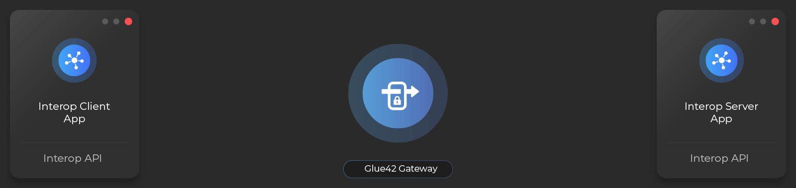

## Overview

The Interop API enables applications to:

- offer functionality to other applications (web and native) by registering Interop methods;
- discover applications which offer methods;
- invoke methods on the user's desktop and across the network;
- stream and subscribe for real-time data using the streaming methods of the Interop API;

Applications which offer methods and streams are called *Interop servers*, and applications which consume them - *Interop clients*, and collectively - *Interop instances*.

Any running instance of an application is identified by its *Interop instance*, which is a set of known key/value pairs uniquely identifying an application.