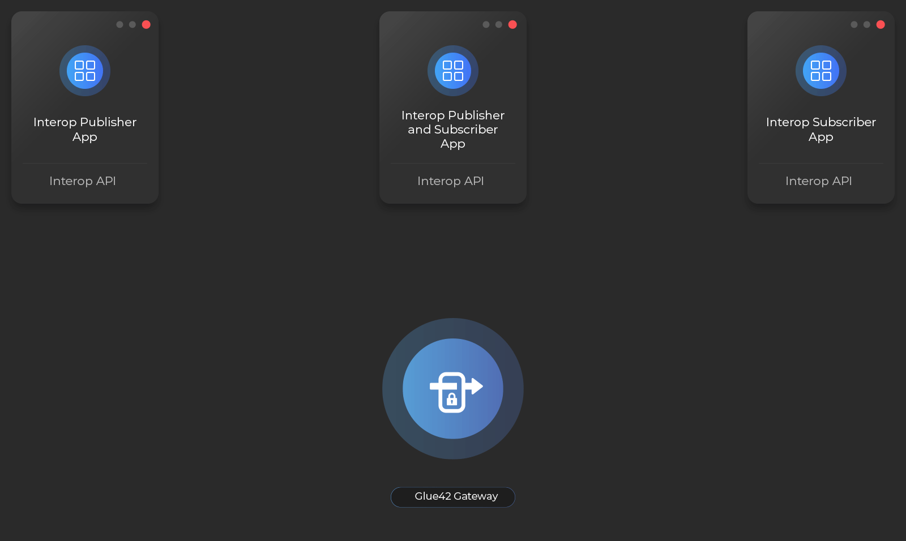

## Declarative Model

*See the .NET [Simple](https://github.com/Glue42/net-examples/tree/master/interop/SimpleDeclarativeInterop) and [Advanced](https://github.com/Glue42/net-examples/tree/master/interop/AdvancedDeclarativeInterop) declarative Interop examples on GitHub.*

With the declarative model you can provide methods to other applications by creating and attributing interfaces. In the following example, we create a CRM service interface that exposes a `SynchronizeContact()` method:

```csharp
[ServiceContract(MethodNamespace = "T42.CRM.")]
public interface ICRMService : IDisposable
{
    [ServiceOperation(AsyncIfPossible = true, ExceptionSafe = true)]
    bool SynchronizeContact(TContact contact);
}
```

`CRMServiceImpl` holds the actual application logic that will handle **Interop** calls:

```csharp
public class CRMServiceImpl : ICRMService 
{
    public bool SynchronizeContact(TContact contact)
    {
        // handle an Interop call
        return true;
    }
}
```

After the interface is implemented, we create an instance and pass it to the `RegisterService()` method. By doing so, any method of the interface that is attributed with `ServiceOperation` will be exposed as an **Interop** method:

```csharp
var impl = new CRMServiceImpl();
glue.Interop.RegisterService<ICRMService>(impl);
```

Any app that wants to call the `SynchronizeContact()` method should create a proxy of `ICRMService`:

```csharp
var crmService = Glue.Interop.CreateServiceProxy<ICRMService>();
var result = crmService.SynchronizeContact(new Contact() { Id = "293" });
```

## Returning Results

You can return results from **Interop** methods in two ways:

### Synchronous Results

Returning results synchronously:

```csharp
[ServiceContract(MethodNamespace = "T42.CRM.")]
public interface IStateService : IDisposable
{
    [ServiceOperation(AsyncIfPossible = true, ExceptionSafe = true)]
    string GetState();
}

public class StateService : IStateService
{
    public string GetState()
    {
        return "my-state";
    }
}

```

### Asynchronous Results

Returning results asynchronously:

```csharp
[ServiceContract(MethodNamespace = "T42.CRM.")]
public interface IStateService : IDisposable
{
    [ServiceOperation(AsyncIfPossible = true, ExceptionSafe = true)]
    void GetState([ServiceOperationResultHandler("state")] Action<ClientPortfolioDemoState> handleResult);
}

public class StateService : IStateService
{
    public void GetState(Action<ClientPortfolioDemoState> handleResult)
    {
        ThreadPool.QueueUserWorkItem(_ => 
        {
            handleResult(new ClientPortfolioDemoState());
        });
    }
}
```

## Available Services

To check if there is a service, the methods (endpoints) of which are all implemented (by one or many servers):

```csharp
Glue.Interop.IsServiceAvailable(serviceProxy);
```

## Available Service Operations

To check if there is an available service method:

```csharp
Glue.Interop.IsServiceOperationAvailable(serviceProxy, p => p.SynchronizeContact(null));
```

## Unregister a Service

To unregister a service, use `UnregisterService()` method:

```csharp
glue.Interop.UnregisterService<ICRMService>(impl);
```

## Imperative Model

*See the .NET [Simple](https://github.com/Glue42/net-examples/tree/master/interop/SimpleImperativeInteropDuplexChat) and [Advanced](https://github.com/Glue42/net-examples/tree/master/interop/AdvancedImperativeInterop) imperative Interop examples on GitHub.*

### Method Registration

```csharp
IServerMethod interopMethod = Glue.Interop.RegisterEndpoint(mdb => mdb.SetMethodName("DoWork"),
    (method, context, caller, resultBuilder, asyncResponseCallback, cookie) =>
        ThreadPool.QueueUserWorkItem(_ =>
        {
            // simulate asynchronous work
            // grab the invocation context (e.g. take "id" from the input arguments)
            Value id = context.Arguments.First(cv => cv.Name == "id").Value;
            Console.WriteLine("Async call " + id);
            // do slow job here with context and caller
            Thread.Sleep(500);
            // respond when ready
            asyncResponseCallback(resultBuilder.SetMessage(id + " processed").
                SetContext(cb => cb.AddValue("id", id)).Build());
        }));
```

### Method Invocation

```csharp
    Glue.Interop.Invoke("DoWork", mib => mib.SetContext(cb => cb.AddValue("id", Guid.NewGuid().ToString("N")))
    .SkipInvocationMetrics().SetInvocationLoggingLevel(LogLevel.Info), 
    new TargetSettings().WithTargetInvokeTimeout(TimeSpan.FromSeconds(8)).WithTargetType(MethodTargetType.Any))
    .ContinueWith(r =>
        {
            IClientMethodResult result = r.Result;
            // result.Status
            Console.WriteLine("Result arrived for: " + result.ResultContext.First(cv => cv.Name == "id").Value);
        });
```

## Unregister a Method

```csharp
IServerMethod serverMethod = ...

glue.Interop.UnregisterEndpoint(method)
```

## Discovery

### Getting Known Endpoints

To get the known servers and their methods:

```csharp
IDictionary<IInstance, IMethod[]> methodsPerServer = glue.Interop.GetTargetEndpoints();
```

### Server Added/Removed Events

The **Interop** API exposes multiple events:

```csharp
glue.Interop.TargetStatusChanged += (sender, eargs) => ServersLabel.Text = "Servers: " + string.Join(", ", eargs.Servers.Select(serverInfo => serverInfo.ApplicationName));
```

### Method Added/Removed Events

```csharp
Glue.Interop.EndpointStatusChanged += (sender, args) => { Console.WriteLine($"{args.InteropEndpoint} is now {args.EndpointStatus}");};
```

## Defining Service Options Adapter Logic

Define and implement your own service options interface exposing anything you want, based on your business logic:

```csharp
public interface IServiceOptions
{
    AgmInvocationContext InvocationContext { get; }
    IServerAGMOptions ServerOptions { get; }
}

public class ServiceOptions : IServiceOptions
{
    public ServiceOptions(IServerAGMOptions serverOptions, AgmInvocationContext invocationContext)
    {
        ServerOptions = serverOptions;
        InvocationContext = invocationContext;
    }

    public ServiceOptions(
        Action<ServiceOperation, IMethodInvocation, IClientMethodResult, Exception> resultInterceptor)
    {
        ResultInterceptor = resultInterceptor;
    }

    public Action<ServiceOperation, IMethodInvocation, IClientMethodResult, Exception> ResultInterceptor { get; }

    public AgmInvocationContext InvocationContext { get; }
    public IServerAGMOptions ServerOptions { get; }
}
```

Then implement the service options adapter, adapting your business logic to the inner **Interop** logic:

```csharp
internal class OptionsAdapter : IAGMServiceOptionsAdapter<IServiceOptions>
{
    IServiceOptions IAGMServiceOptionsAdapter<IServiceOptions>.AdaptServerOptions(IAGMService service,
        IServerAGMOptions serviceOptions)
    {
        return new ServiceOptions(serviceOptions, serviceOptions.InvocationContext);
    }

    public IClientAGMOptions AdaptClientOptions(IAGMProxyService proxyService, IServiceOptions options)
    {
        var opt = (ServiceOptions) options;
        return new ClientServiceAGMOptions(additionalSettings: new AdditionalSettings
        {
            // all remote calls are exception safe so actual failures can be taken from IServiceOptions with the result interceptor
            ExceptionSafe = true,
            // no fire-and-forget, always get an acknowledgement
            FireAndForgetInvocation = false,
            ResultInterceptor = (so, invocation, result) =>
            {
                opt?.ResultInterceptor?.Invoke(so, invocation, result, null);
                return null;
            },
            InvocationFailureHandler =
                (operation, method, result, exception) =>
                    opt?.ResultInterceptor?.Invoke(operation, null, result, exception)
            // or set to best
            //InvocationPreProcessor = builder => builder.SetInvocationTarget(MethodTargetType.Any)
        });
    }
}
```

## Best Practices

**Using service options adapters** 

In this example, the `IServiceOptions` is the sample service options adapter logic provided in the `Glue42` library. You can define and implement a different interface that hides/adapts all Interop specifics:

```csharp
[ServiceContract(MethodNamespace = "g4o.demo.")]
public interface IG40DemoRemoteService : IDisposable
{
    [ServiceOperation]
    void ShowClient(T42Contact contact, [AGMServiceOptions] IServiceOptions serviceOption);
}       

g40RemoteService_.ShowClient(sender, new ServiceOptions(
     (so, invocation, result, ex) =>
     {
         logger_.Info($"{nameof(g40RemoteService_.ShowClient)} of {sender.Name} completed with {result}", ex);
         Facts.Instance.AddNormalEvent($"{invocation} completed with {result}");
         
         if (result == null || result.Status != MethodInvocationStatus.Succeeded || ex != null)
         {
             ShowNotification("Show client failed",
                 "Cannot show client due to " +
                 (result?.ToString() ?? "appropriate target method not found"));
         }
     }));
```

## Streaming

*See the .NET [Streaming example](https://github.com/Glue42/net-examples/tree/master/streaming) on GitHub.*

### Overview

Your application can publish events that can be observed by other applications and can provide real-time data (e.g., market data, news alerts, notifications, etc.) to other applications by publishing an Interop stream. It can also receive and react to these events and data by creating an Interop stream subscription.

Applications that create and publish to Interop streams are called *publishers*, and applications that subscribe to Interop Streams are called *subscribers*. An application can be both.



Interop streams are used extensively in [**Glue42 Enterprise**](https://glue42.com/enterprise/) products and APIs:

- to publish notifications about window status change (events);
- to publish application configuration changes and notifications about application instance state changes (events);
- in the Glue42 Notification Service (GNS) Desktop Manager and GNS Interop Servers - to publish Notifications (real-time data);
- in the Window Management and Application Management APIs (events);

### Subscribing to a Stream

Streams are simply special Interop methods, so subscribing to a stream resembles very much invoking a method. To subscribe, you need to create a pending subscription request by calling `Glue.Interop.Subscribe()`.
Then the subscriber calls `IEventStream.Open()` passing a stream-subscription handler for receiving data and status updates from that stream. If the publisher accepts the subscription request, this opens a "long-living" data subscription (as opposed to request-response (`Invoke()` method)) to the publisher(s), so that when the publishing side publishes data, the data will be received by all subscribers to that stream. A subscriber can decide to cancel the subscription at any time, or the publisher can remove the subscriber - that way, the subscriber is no longer subscribed to the stream of that publisher and is no longer going to receive updates.

The case where the subscription targets more than one publisher (configured in `targetSettings`) is called a broadcast subscription.

Here are the different overload signatures of the `Subscribe()` method:

```csharp
Task<IEventStream> Subscribe(
      string streamName,
      IClientEventStreamHandler clientEventStreamHandler,
      Action<IMethodInvocationBuilder> subscriptionRequest = null,
      TargetSettings targetSettings = null,
      ClientEventStreamSettings clientEventStreamSettings = null);

Task<IEventStream> Subscribe(
    string streamName,
    IClientEventStreamHandler clientEventStreamHandler,
    Action<IObjectInvocationBuilder> subscriptionRequest,
    TargetSettings targetSettings = null,
    ClientEventStreamSettings clientEventStreamSettings = null);

Task<IEventStream> Subscribe(
    string streamName,
    IClientEventStreamHandler clientEventStreamHandler,
    IDictionary<string, object> subscriptionRequest,
    TargetSettings targetSettings = null,
    ClientEventStreamSettings clientEventStreamSettings = null);

Task<IEventStream> Subscribe(
    IMethod endpoint,
    IClientEventStreamHandler clientEventStreamHandler,
    Action<IMethodInvocationBuilder> subscriptionRequest = null,
    TargetSettings targetSettings = null,
    ClientEventStreamSettings clientEventStreamSettings = null);

Task<IEventStream> Subscribe(
    IMethod endpoint,
    IClientEventStreamHandler clientEventStreamHandler,
    IDictionary<string, object> subscriptionRequest,
    TargetSettings targetSettings = null,
    ClientEventStreamSettings clientEventStreamSettings = null);

Task<IEventStream> Subscribe(
    IMethod endpoint,
    IClientEventStreamHandler clientEventStreamHandler,
    Action<IObjectInvocationBuilder> subscriptionRequest,
    TargetSettings targetSettings = null,
    ClientEventStreamSettings clientEventStreamSettings = null);
```

The `subscriptionRequest` holds the arguments for the subscription request. Typically, this represents the subscriber's area of interest (desired context) for that particular stream.
The subscription context is received by the publisher(s) of that stream and the publisher can then **group** subscribers in stream branches (more on stream branches in [Publishing Streams](#streaming-publishing_streams)).

The `targetSettings` holds various options for selecting targets (or publishers) for that particular stream subscription request, so, for example, you can target a single publisher based on a filter or target multiple publishers (offering the same stream) at once and open stream subscriptions to all of them, receiving data from each one of them.

```csharp
Glue.Interop.Subscribe(streamName,
    new ClientEventStreamHandler
    {
        // this lambda is invoked when the status of the stream has changed
        EventStreamStatusChanged = (info, status, cookie) => LogMessage(
            $"{info.EventStreamingMethod.Name} to {info.Server} is {status}"),

        // this lambda is invoked when there is data published to the stream
        EventHandler = (info, data, cookie) =>
            DispatchAction(() =>
            {
                var isOOB = data.IsCallbackStream;
                // if isOOB is true (out-of-band), the data has been pushed only to this subscriber 
                LogMessage($"{data.ResultContext.AsString()}");
            })
    },
    // these are the arguments sent in the subscription request
    mib => mib.SetContext(cb => cb.AddValue("arg1", "arg1Value").AddValue("someOtherSubscriptionRequestArgments", (int) 5000)),
    // additional settings - specify target await timeout
    new TargetSettings().WithTargetAwaitTimeout(TimeSpan.FromSeconds(5)),
    // stream settings, specifying that we accept "personal" (out-of-band) stream pushes
    new ClientEventStreamSettings {AllowCallbacks = true, ReestablishStream = false});
```

### Publishing Streams

To start publishing data, you need to create an Interop stream by calling `Glue.Interop.RegisterStreamingEndpoint()`. This registers an Interop streaming method, similar to the one created by `Glue.Interop.RegisterEndpoint()`, but this enables the registering side to receive subscription requests from other Glue42 peers, accept or reject them, group them by some criteria (e.g., subscription area of interest, passed in the subscription request arguments) and push data to them, where the data is distributed to all underlying subscribers by the Glue42 Gateway.

Here is the signature of the method:

```csharp
IServerEventStream RegisterStreamingEndpoint(
    Action<IAsyncServerMethodBuilder> streamBuilder,
    IServerEventStreamHandler serverEventStreamHandler,
    AsyncMethodHandler methodHandler = null,
    ServerEventStreamSettings streamSettings = null,
    object cookie = null);
```

The stream definition is identical to the Interop method definition for the `Glue.Interop.RegisterEndpoint()` call.

An example of registering a stream:

```csharp
IServerEventStream streamingMethod = Glue.Interop.RegisterStreamingEndpoint(
    mdb => mdb.SetMethodName(streamName),
    new ServerEventStreamHandler(false)
    {
        // You can omit this handler if you don't need branching/validating requests.
        // Here, you can validate/check a subscription request
        // and then reject it or direct it to a respective branch:

        //  SubscriptionRequestHandler = (stream, request, cookie) =>
        //  {
        //      //  register a subscriber and associate it to a branch; 
        //      //  "null" branch key means to associate it to the main branch, i.e. the stream itself

        //      return request.Accept(reply => reply.SetMessage("subscribed").Build(), branchKey: null);
        //      or accept the subscriber on a named branch (represented by any object you want)

        //      Assigning a branch will effectively group the subscribers (that use the same subscription arguments) 
        //      on a stream branch and then publish to that branch, which will multicast data to all these subscribers:

        //      return request.Accept(reply => reply.SetMessage("subscribed").Build(), branchKey: "myBranchName");

        //      request.Reject(rd => rd.SetMessage("Subscription rejected, missing necessary arguments.").Build());

        //      return null;
        //  },
        SubscriberHandler = (stream, subscriber, branch, streamCookie) =>
        {
            // you have a new subscriber, optionally push some "image" data to it:
            subscriber.Push(eventData => eventData.AddValue("Snapshot", data));
            Console.WriteLine("Got a subscriber - " + subscriber.Subscription.Caller);
        },
        UnsubscribeHandler = (stream, subscriber, subscriberRemovedContext, branch, streamCookie) =>
        {
            Console.WriteLine("Lost a subscriber due to " + subscriberRemovedContext.Reason + " : " +
                                subscriber.Subscription.Caller);
            if (branch != null && branch.GetSubscribers().Length == 0)
            {
                branch.Close();
            }
            // remove the branch from any internal caches
        }
    }
    // optionally, supply request-response handler for that streaming method
    // so that it can be invoked via "Glue.Interop.Invoke()", and subscribe to it:
    //  ,(method, context, caller, builder, callback, cookie) =>
    //  {
    //      // the method is invoked in the old-style manner - calculate the result
    //      callback(builder.SetContext(cb => cb.AddValue("Status", 5)).Build());
    //  }
);

```

Pushing data to a stream can be done via pushing to a branch found by key or broadcasting to the whole stream (effectively pushing to all branches).

Finding all branches:

```csharp
IEventStreamBranch[] branches = streamingMethod.GetBranches();
```

Pushing to a branch by key:

```csharp
if (streamingMethod.TryGetBranch(out IEventStreamBranch streamBranch, "myBranchName"))
{
    streamBranch.Push(cb => cb.AddValue("Data", "someData").AddValue("OtherValues", new[] {1.2, 3, 54}));
}
```

Pushing to a specific subscriber of a branch:

```csharp
if (streamingMethod.TryGetBranch(out IEventStreamBranch streamBranch, "myBranchName"))
{
    streamBranch.GetSubscribers()
        .FirstOrDefault(s => s.Subscription.Caller.ApplicationName == "SomeSpecificSubscriber")
        ?.Push(cb => cb.AddValue("Data_to_be_received_only_by_that_subscriber", 5));
}
```

Broadcasting to all branches (and all subscribers) of a stream:

```csharp
streamingMethod.Broadcast(cb => cb.AddValue("Broadcasted_values", 1551));
```

Using Glue42 to serialize your objects and push them to streams/branches:

```csharp
if (streamingMethod.TryGetBranch(out IEventStreamBranch streamBranch, "myBranchName"))
{
    streamBranch.Push(cb => cb
        .AddValue("my_object_data", Glue.AGMObjectSerializer.Serialize(myObject))
        .AddValue("OtherValues", new[] {1.2, 3, 54}));
}
```

### Stream Discovery

Streams are special Interop methods, so you can use the [Interop Discovery](#discovery) API to find available streams. The only difference is that streaming methods are flagged with a property `IMethod.Definition.Flags.HasFlag(DOT.AGM.MethodFlags.SupportsStreaming)`.

## Basic Streaming Example

The following is a basic example of creating and consuming an Interop stream.

Creating a stream and publishing data to it:

```csharp
// Define the hierarchy of objects to publish.
public class Fruit
{
    public string Type { get; set; } = "Generic";
}
public class Apple : Fruit
{
    public Apple()
    {
        Type = "Apple";
    }
    public string Color { get; set; }
    public int Price { get; set; }
}
public class Pear : Fruit
{
    public Pear()
    {
        Type = "Pear";
    }
    public string Color { get; set; }
    public int Price { get; set; }
    public int Shape { get; set; }
}

// Create the streaming endpoint.
var stream = Glue.Interop.RegisterStreamingEndpoint(asmb => { asmb.SetMethodName("FruitsStream"); },
    new ServerEventStreamHandler(true));

// Every 1000 msecs publish random fruits on this stream.
var rnd = new Random();
new Timer(state =>
{
    stream.Broadcast(cb =>
        Enumerable.Range(1, rnd.Next(5, 25)).Each(i => cb.AddObject(Glue, $"fruit{i}",
            i % 2 == 0 ? new Apple
            {
                Price = rnd.Next(),
                Color = rnd.NextDouble().ToString(),
            } :
            i % 3 == 0 ? new Pear()
            {
                Price = rnd.Next(),
                Color = rnd.NextDouble().ToString(),
                Shape = rnd.Next()
            } : new Fruit())));
}).Change(1000, 1000);
```

Subscribing to the stream and consuming the data:

```csharp
// Consume the stream on the subscription side.
var subscriptionStream = await Glue.Interop.Subscribe("FruitsStream", new ClientEventStreamHandler
{
    EventHandler = (info, data, _) =>
    {
        var fruits = data.ResultContext.DeserializeMap<string, Fruit>(Glue,
            // This is the decider - can choose what specific object to create.
            (value, serializer) =>
            {
                value.AsComposite.TryGetFieldPathValue("type", out var type);
                Fruit fruit = null;
                if (type == "Apple")
                {
                    fruit = new Apple();
                }
                else if (type == "Pear")
                {
                    fruit = new Pear();
                }
                return fruit ?? new Fruit();
            });
    }}).ConfigureAwait(false);
```