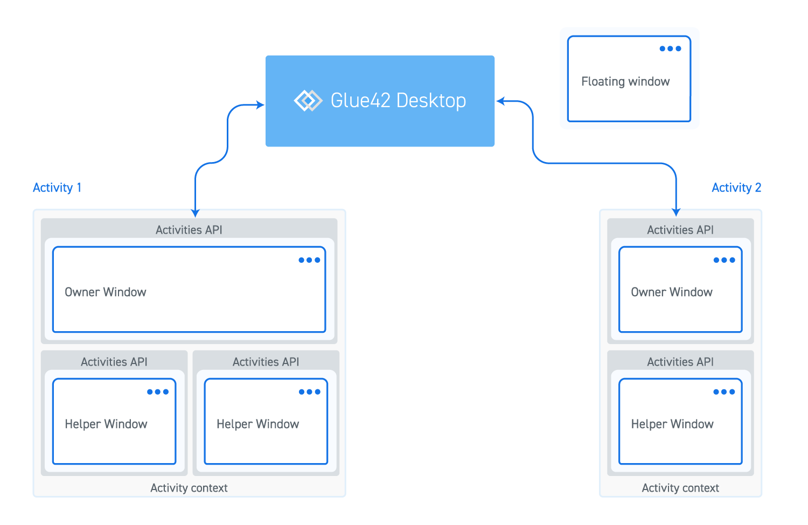

## Activity Participants

Each Activity instance has a single owner window and can optionally have one or more helper windows. The owner window controls the lifetime of the Activity - if the owner is closed, the Activity and all other windows are closed as well. The Activity is running as long as the owner is running. Helper windows support the owner of the Activity and may be defined in the Activity type configuration or joined to the Activity at runtime.



## Configuring an Activity

Activity applications are defined in the same manner as regular applications. You can configure an Activity by creating an Activity configuration JSON file and place it in the `%LocalAppData%\Tick42\UserData\<ENV-REG>\apps` folder, where `<ENV-REG>` should be replaced by the environment and region of your [**Glue42 Enterprise**](https://glue42.com/enterprise/) copy (e.g., `T42-DEMO`).

```json
[
    {
        "title": "Clients",
        "type": "activity",
        "name": "clients",
        "icon": "http://localhost:22080/resources/icons/client-list.ico",
        "hidden": false,
        "details": {
            "initialContext": {
                "context": "someContext"
            },
            "layout": {
                "mode": "pixels"
            },
            "owner": {
                "type": "clientlist",
                "name": "ClientList",
                "left": 20,
                "top": 20,
                "width": 400,
                "height": 400
            },
            "windows": [    
                {
                    "type": "clientportfolio",
                    "name": "ClientPortfolio",
                    "left": 420,
                    "top": 20,
                    "width": 400,
                    "height": 400
                }
            ]
        }
    },
    {
        "title": "Client List",
        "type": "window",
        "name": "ClientList",
        "hidden": true,
        "details": {
            "url": "http://localhost:22080/client-list-portfolio-contact/dist/#/clientlist",
            "mode": "html"
        },
        "activityTarget": {
            "enabled": true,
            "windowType": "clientlist"  
        }                               
    },
    {
        "title": "Client Portfolio",
        "type": "window",
        "name": "ClientPortfolio",
        "hidden": true,
        "details": {
            "url": "http://localhost:22080/client-list-portfolio-contact/dist/#/clientportfolio/",
            "mode": "html"
        },
        "activityTarget": {
            "enabled": true,
            "windowType": "clientportfolio"
        }
    }
]
```

| Property | Description |
|----------|-------------|
| `"owner"` | The owner window of the Activity. |
| `"windows"` | Array of helper windows. |
| `"windowType"` | Unique identifier within the Activities API (defaults to the application name). |

Only the `"owner"` property is required. It is useful to specify the `"activityTarget"` property in order to describe how your application will look when it is an Activity window. The same is valid for the `"layout"` property, which specifies whether the window dimensions are in `"pixels"` (default) or relative to the screen (`"percents"`). For more details, see the [application configuration schema](../../../../assets/configuration/application.json).

## Detecting Activities

The Activities API is accessible through the [`glue.activities`](../../../../reference/glue/latest/activities/index.html) object.

*For manipulating an Activity and its windows, it is highly recommended to use the lightweight Activities API accessible through the [`glue.activities.my`](../../../../reference/glue/latest/activities/index.html#My) object. This API is single Activity oriented and should be used by most Activity applications.*

A window is not necessarily aware whether it was instantiated as part of an Activity or as a standalone window, so the best practice is to design windows to either pick context from the Activity, or use other Glue42 APIs for sharing data - [Interop](../../interop/overview/index.html), [Shared Contexts](../../shared-contexts/overview/index.html), [Channels](../../channels/overview/index.html).

Use the [`aware`](../../../../reference/glue/latest/activities/index.html#API-aware) boolean flag to check whether your window was created as part of an Activity:

```javascript
const isInActivity = glue.activities.aware;
``` 

To check whether a window has joined or left an Activity, use the [`inActivity`](../../../../reference/glue/latest/activities/index.html#API-inActivity) flag:

```javascript
const hasJoinedActivity = glue.activities.inActivity;
```

## Activity

To get a reference to the current [`Activity`](../../../../reference/glue/latest/activities/index.html#Activity), use the [`activity`](../../../../reference/glue/latest/activities/index.html#My-activity) property:

```javascript
const myActivity = glue.activities.my.activity;
```

To get the owner window of the Activity, use its [`owner`](../../../../reference/glue/latest/activities/index.html#Activity-owner) property: 

```javascript
const ownerWindow = myActivity.owner;
```

To get all windows participating in the Activity, use its [`windows`](../../../../reference/glue/latest/activities/index.html#Activity-windows) property:

```javascript
const allActivityWindows = myActivity.windows;
```

To get all Activity windows of a specific window type, use the [`getWindowsByType()`](../../../../reference/glue/latest/activities/index.html#Activity-getWindowsByType) method:

```javascript
const clientListWindows = currentActivity.getWindowsByType("clientlist");
```

## Activity Windows

### Current Window

To get a reference to the current [`ActivityWindow`](../../../../reference/glue/latest/activities/index.html#ActivityWindow), use the [`window`](../../../../reference/glue/latest/activities/index.html#My-window) property:

```javascript
const activityWindow = glue.activities.my.window;
```

### Owner Window

To check whether the Activity window is the owner window, use its [`isOwner`](../../../../reference/glue/latest/activities/index.html#ActivityWindow-isOwner) property:

```javascript
const isOwnerWindow = activityWindow.isOwner;
```

### Manipulation

To get a reference to the underlying Glue42 Window object, use the [`underlyingWindow`](../../../../reference/glue/latest/activities/index.html#ActivityWindow-underlyingWindow) property of an [`ActivityWindow`](../../../../reference/glue/latest/activities/index.html#ActivityWindow):

```javascript
const glue42Window = activityWindow.underlyingWindow;
```

Then use the [Window Management](../../../windows/window-management/overview/index.html) API to manipulate the window:

```javascript
await glue42Window.moveResize({ left: 100 });
```

## Activity Operations

Methods for manipulating [`Activity`](../../../../reference/glue/latest/activities/index.html#Activity) and [`ActivityWindow`](../../../../reference/glue/latest/activities/index.html#ActivityWindow) instances are available both on the instance objects and at top level of the Activities API.

### Frame Color

To get the current frame color of an Activity, use the [`getFrameColor()`](../../../../reference/glue/latest/activities/index.html#My-getFrameColor) method:

```javascript
const color = glue.activities.my.getFrameColor();
```

To set the frame color of an Activity, use the [`setFrameColor()`](../../../../reference/glue/latest/activities/index.html#My-setFrameColor) method:

```javascript
await glue.activities.my.setFrameColor();
```

### Creating Windows

To create an Activity window, use the  [`createWindow()`](../../../../reference/glue/latest/activities/index.html#My-createWindow) method and pass either the window type as a string or a [`WindowDefinition`](../../../../reference/glue/latest/activities/index.html#WindowDefinition) object:

```javascript
await glue.activities.my.createWindow("clientlist");

// Or

const windowDefinition = {
    type: "clientportfolio",
    relativeTo: "clientlist",
    relativeDirection: "bottom",
    height: 300
};

await glue.activities.my.createWindow(windowDefinition);
```

Use the returned [`ActivityWindow`](../../../../reference/glue/latest/activities/index.html#ActivityWindow) object to manipulate the created Activity window.

### Closing Windows

To close an Activity window, use its [`close()`](../../../../reference/glue/latest/activities/index.html#ActivityWindow-close) method:

```javascript
const activityWindow = glue.activities.my.window;

await activityWindow.close();
```

### Stopping an Activity

To stop an Activity and close all windows participating in it, use its [`stop()`](../../../../reference/glue/latest/activities/index.html#Activity-stop) method:

```javascript
const myActivity = glue.activities.my.activity;

await myActivity.stop();
```

## Activity Context

Properties and methods for retrieving and manipulating the Activity context are available at top level of the API and on the [`Activity`](../../../../reference/glue/latest/activities/index.html#Activity) object.

### Get

To get the context of an Activity, either use the [`context`](../../../../reference/glue/latest/activities/index.html#Activity-context) property:

```javascript
const context = glue.activities.my.context;
```

The context can be any object with key/value pairs holding cross-application information.

### Update

To update a context object, use the [`updateContext()`](../../../../reference/glue/latest/activities/index.html#My-updateContext) method. New properties will be added, existing ones will be updated and the ones set to `null` will be removed from the context:

```javascript
// Existing context: { tick: 0, msft: 0 }

const contextUpdate = {
    glue: 42,
    tick: 42,
    msft: null
};

await glue.activities.my.updateContext(contextUpdate);

// Result: { glue: 42, tick: 42 }
```

### Set

To replace a context, use the [`setContext()`](../../../../reference/glue/latest/activities/index.html#My-setContext) method:

```javascript
const newContext = { glue: 42 };

await glue.activities.my.setContext(newContext);
```

This method will completely overwrite the existing context.

## Events

### Joining an Activity

To track when your window joins an Activity, use the [`onActivityJoined()`](../../../../reference/glue/latest/activities/index.html#My-onActivityJoined) method:

```javascript
const handler = activity => console.log(`Joined Activity with ID: "${activiti.id}"`);

glue.acticities.my.onActivityJoined(handler);
```

### Leaving an Activity

To track when your window joins an Activity, use the [`onActivityLeft()`](../../../../reference/glue/latest/activities/index.html#My-onActivityLeft) method:

```javascript
const handler = activity => console.log(`Left Activity with ID: "${activiti.id}"`);

glue.acticities.my.onActivityLeft(handler);
```

### Context Updates

To subscribe for updates of the Activity context, use the [`onContextChanged()`](../../../../reference/glue/latest/activities/index.html#My-onContextChanged) method at top level of the API or on an [`Activity`](../../../../reference/glue/latest/activities/index.html#Activity) object:

```javascript
const handler = (context, delta, removed) => {
    console.log(`Updated: ${JSON.stringify(delta)}; Removed: ${removed}`);
};

glue.activities.my.onContextChanged(handler);
```

The callback for handling context updates receives the following arguments:

| Argument | Description |
|----------|-------------|
| `context` | The current context object of the Activity. |
| `delta` | An object containing only the changes between the previous and the latest context. |
| `removed` | An array of strings containing the names of the properties removed from the context. |

### Frame Color

To track changes of the Activity frame color, use the [`onFrameColorChanged()`](../../../../reference/glue/latest/activities/index.html#My-onFrameColorChanged) method:

```javascript
const handler = () => console.log("Frame color changed.");

glue.activities.my.onFrameColorChanged(handler);
```

## Activity Layouts

Activities have special layouts (arrangement of windows/apps) that can be saved and later restored.

For more information on how to do that, see the [Activity Layouts](../../../windows/layouts/javascript/index.html#activity_layouts) section of the Layouts documentation.

## Reference

[Activities API Reference](../../../../reference/glue/latest/activities/index.html) 