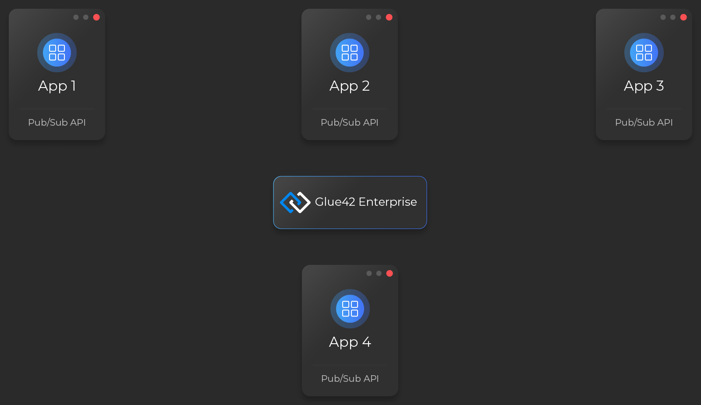
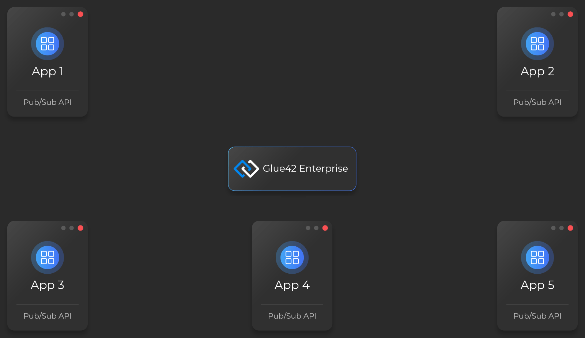

## Overview

By default, the Pub/Sub API is disabled. To enable it in your Glue42 enabled applications, set the `bus` property of the Glue42 configuration object to `true` when initializing the Glue42 library:

```javascript
const config = { bus: true };

window.glue = await Glue(config);
```

The Pub/Sub API is accessible through the [`glue.bus`](../../../../reference/glue/latest/pub%20sub/index.html) object.

*See the JavaScript [Pub/Sub example](https://github.com/Tick42/js-examples/tree/master/pub-sub-example) on GitHub.*

## Publish

### To All Applications

To publish a message on a specific topic to all subscribed applications, use the [`publish()`](../../../../reference/glue/latest/pub%20sub/index.html#API-publish) method. It accepts the message topic and the data to publish as arguments:

```javascript
const topic = "stocks";
const data = { RIC: "AAPL.O" };

glue.bus.publish(topic, data);
```



### To Specific Applications

Use the [`MessageOptions`](../../../../reference/glue/latest/pub%20sub/index.html#MessageOptions) object to make an application publish a message only to specific applications that have subscribed to a topic.

The [`MessageOptions`](../../../../reference/glue/latest/pub%20sub/index.html#MessageOptions) object has the following properties, all of which are optional:

| Property | Description |
|----------|-------------|
| `target` | An object that will be compared to the identity of the subscriber applications. |
| `routingKey` | A string which will be compared to the routing keys of the subscribers. |


The example below demonstrates how to publish a message to another application (or to multiple instances of it) with a specific name:

```javascript
const topic = "stocks";
const data = { RIC: "AAPL.O" };
const options = {
    target: { 
        application: "client-portfolio" 
    }
};

glue.bus.publish(topic, data, options);
```


The Pub/Sub API compares the [`target`](../../../../reference/glue/latest/pub%20sub/index.html#MessageOptions-target) property of the `options` argument with the identity of each application subscribed to the topic. It delivers the message only to subscribers with identity properties matching the respective properties of the [`target`](../../../../reference/glue/latest/pub%20sub/index.html#MessageOptions-target) object.

The example below demonstrates how to publish messages with a specific routing key:

```javascript
const topic = "stocks";
const data = { RIC: "AAPL.O" };
const options = {
    target: { 
        routingKey: "portfolio" 
    }
};

glue.bus.publish(topic, data, options);
```

The Pub/Sub API delivers messages with a [`routingKey`](../../../../reference/glue/latest/pub%20sub/index.html#MessageOptions-routingKey) to all subscribers with the same routing key and to the ones with no routing key.



## Subscribe

### Messages from Any Application

To subscribe for messages on a specific topic, use the [`subscribe()`](../../../../reference/glue/latest/pub%20sub/index.html#API-subscribe) method. Upon successful subscription, it resolves with a [`Subscription`](../../../../reference/glue/latest/pub%20sub/index.html#Subscription) object. Use the `unsubscribe` property of this object to stop receiving messages on that topic.

Provide the topic on which you want to receive messages and a callback to handle the messages:

```javascript
const topic = "stocks";
const handler = (data, topic, source) => console.log(data, topic, source);

const { unsubscribe } = await glue.bus.subscribe(topic, handler);
```


### Messages from Specific Applications

Use the [`MessageOptions`](../../../../reference/glue/latest/pub%20sub/index.html#MessageOptions) object to make an application subscribe for messages only from specific applications:

```javascript
const topic = "stocks";
const handler = (data, topic, source) => console.log(data, topic, source);
const options = {
    target: {
        application: "instrument-list"
    }
};

const { unsubscribe } = await glue.bus.subscribe(topic, handler, options);
```

The Pub/Sub API compares the [`target`](../../../../reference/glue/latest/pub%20sub/index.html#MessageOptions-target) property of the `options` argument with the identity of the publisher. It invokes the callback only if all the properties of the [`target`](../../../../reference/glue/latest/pub%20sub/index.html#MessageOptions-target) object match the respective properties of the identity of the publisher.


The example below demonstrates how to subscribe for messages with a specific routing key:

```javascript
const topic = "stocks";
const handler = (data, topic, source) => console.log(data, topic, source);
const options = {
    target: {
        routingKey: "portfolio"
    }
};

const { unsubscribe } = await glue.bus.subscribe(topic, handler, options);
```

The Pub/Sub API invokes the callback only for messages with a matching routing key and for the ones with no routing key.


## Reference

[Pub/Sub API Reference](../../../../reference/glue/latest/pub%20sub/index.html) 