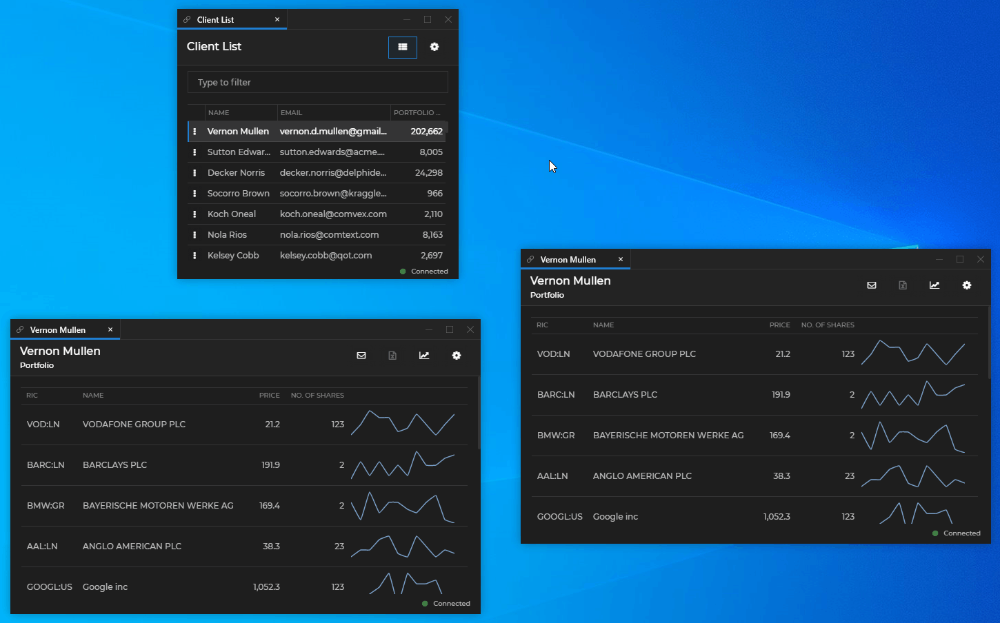

## Overview

The Glue42 Channels are globally accessed named contexts that allow users to dynamically group apps, instructing them to work over the same shared data object. Assign a Glue42 enabled app to a Channel through the Channel Selector of the Glue42 Window:


When apps are on the same Channel, they share a context data object which they can monitor and/or update. See below how apps interact with each other using the Glue42 Channels:



Channels are based on [Shared Contexts](../../shared-contexts/overview/index.html). A context object may contain various types of data - `ids`, `displayName`, etc.:

```json
{
    "contact": {
        "ids": [
        {
            "systemName": "g42sfId",
            "nativeId": "0031r00002IukOxAAJ"
        },
        {
            "systemName": "rest.id",
            "nativeId": "0e23375b-dd4f-456a-b034-98ee879f0eff"
        }
        ],
        "displayName": "Nola Rios",
        "name": {
            "lastName": "Rios",
            "firstName": "Nola",
            "otherNames": null,
            "honorific": "Ms.",
            "postNominalLetters": null
        }
    }
}
```

Different apps on the same Channel may use different parts of the data:

- The "Client List" app updates the context object with data for the selected user (`ids`, `displayName`, etc.).
- The "Portfolio" app uses the `ids` to load the portfolio of the client selected in the "Client List" app by the user. It also updates the shared context object with new values when the user selects different instruments (e.g., the `RIC` field is updated).

## Defining Channels

Define any number of Channels in [**Glue42 Enterprise**](https://glue42.com/enterprise/) for your apps to use - configure them in the `channels.json` file located in the `%LocalAppData%\Tick42\GlueDesktop\config` folder. Below is an example of adding a custom dark purple Channel to the already existing default list of Channels in [**Glue42 Enterprise**](https://glue42.com/enterprise/):

```json
{
    "name": "Dark Purple",
    "meta": {
        "color": "#6400b0"
    }
}
```


See the [Configuration](../../../../developers/configuration/channels/index.html) section for more detailed info on the configuration properties.