## Overview

<glue42 name="addClass" class="colorSection" element="p" text="Available since Glue42 Enterprise 3.10">

The [Workspaces API](../../../../reference/glue/latest/workspaces/index.html) offers advanced window management functionalities. Workspaces allow you to arrange multiple applications within the same visual window (called *Frame*). This is performed either programmatically or by dragging and dropping floating windows in a Workspace, rearranging windows that are already in the Workspace or extracting windows from the Workspace. Each application is treated as an individual building block that can be added, removed, moved or resized within the unifying frame. Save easily Workspace Layouts and restore them within the same frame or even in different frames. When a Workspace Layout is restored, the arrangement of the apps participating in it and their context data is preserved - resume working right from where you left off.

See below how the user builds, saves, restores and manipulates Workspaces:


## Workspaces Concepts

### Frame

The Frame is a web application (also called Workspaces App) which comes with [**Glue42 Enterprise**](https://glue42.com/enterprise/). This application is the shell that can hold multiple Workspaces as tabs in a single or multiple windows (frames). The Frame application is a vital element in the Workspaces functionality as it handles opening and closing Workspaces, arranging windows in a Workspace, adding or removing Workspaces and windows.

You can also create your own custom Workspaces App. For more details, see the [Extending Workspaces](#extending_workspaces) section below.

### Workspace

A Workspaces contains one or more applications (windows) arranged in columns, rows or groups of tabbed windows. Each application acts as a building block of a Workspace and can be resized, maximized and restored within a Workspace. Applications can be added to a Workspace (by drag and drop or programmatically) and can also be ejected from a Workspace as floating windows. The arrangement of each Workspace can be uniquely suited to provide the necessary layout and functionalities for performing tasks quickly and intuitively. Instead of wasting time and effort in finding, opening and arranging the relevant applications, restore the respective Workspace with a single click.

### Workspace Layout

A Workspace Layout is a JSON object which describes the model of a Workspace. It contains the name of the Workspace, the structure of its children and how they are arranged, the names of each application present in the Workspace, context and other settings. This Layout is the blueprint used by the API to build the Workspace and its components. Workspace Layouts can be defined both programmatically - when creating or restoring Workspaces at runtime, and through configuration - when defining default Workspaces to be loaded by the Workspaces App.

The following example demonstrates a basic Layout definition of a Workspace containing two apps:

```json
{
    "children": [
        {
            "type": "column",
            "children": [
                {
                    "type": "group",
                    "children": [
                        {
                            "type": "window",
                            "appName": "clientlist"
                        }
                    ]
                },
                {
                    "type": "group",
                    "children": [
                        {
                            "type": "window",
                            "appName": "clientportfolio"
                        }
                    ]
                }
            ]
        }
    ]
}
```

If an already existing Workspace Layout has been saved under a specific name, you can use a simpler Layout object to restore it:

```json
{
    "layoutName": "My Workspaces"
}
```

Use the `"config"` property of the standard Workspace Layout object or the `"restoreConfig"` property of the simpler object to pass context to the Workspace or to hide/show its tab header:

```json
// Standard Workspace Layout definition.
{
    "children": [
        ...
    ],
    "config": {
        "noTabHeader": true,
        "context": { "glue" : 42 }
    }
},

// Or a simpler Workspace Layout definition for an already existing Layout.
{
    "layoutName": "My Workspace",
    "restoreConfig": {
        "noTabHeader": true,
        "context": { "glue" : 42 }
    }
}
```

Hiding the Workspace tab header with the `"noTabHeader"` property prevents the user from manipulating the Workspace through the UI and allows for the Workspace to be controlled entirely through API calls. For instance, a Workspace may be tied programmatically to certain logic, a button, etc., designed to manage its state without any user interaction. For a demonstration of this functionality, see the [Pinned Workspace Tabs](https://github.com/Glue42/templates/tree/master/workspaces-react-pinned-tabs) example on GitHub. It shows how to load default Workspaces with hidden tab headers and control them with custom buttons in the Workspaces App header area.

## Using Workspaces

To begin creating and manipulating Workspaces, start the Workspaces UI from the Glue42 Toolbar:

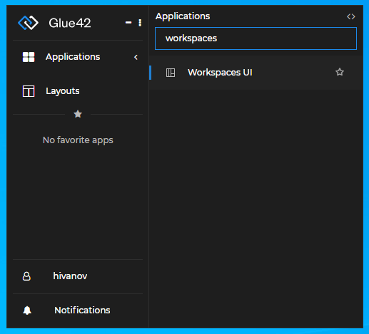

### Adding Applications

Add your first app by using the "+" button at the center of an empty Workspace or by dragging and dropping an app inside it:

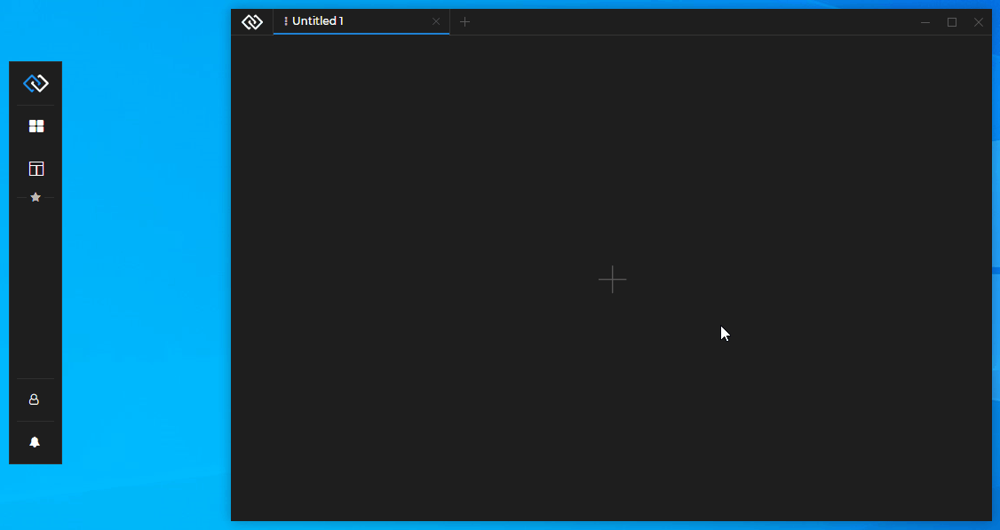

Continue adding apps from the "+" button in the tab header of an already opened app or by dragging and dropping apps inside the Workspace:

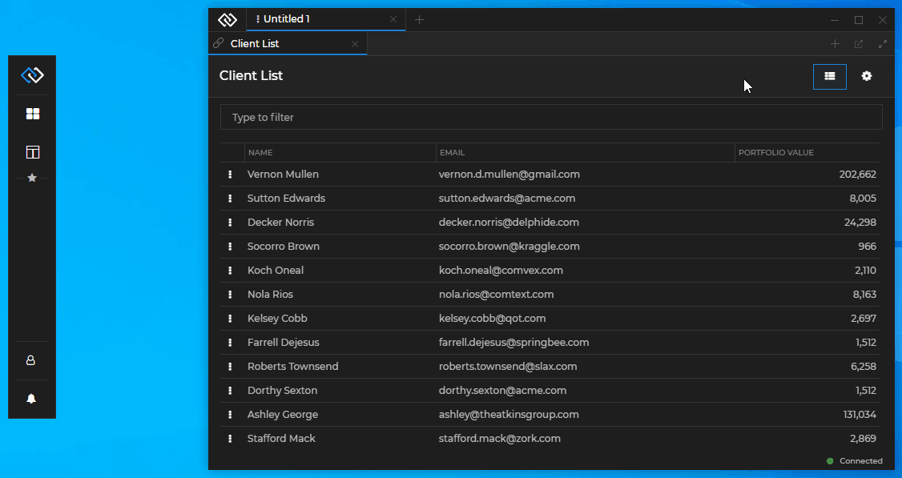

### Extracting Windows

Extract apps from a Workspace by dragging and dropping them outside the Workspace, or by using the "Eject" button in the window tab header:

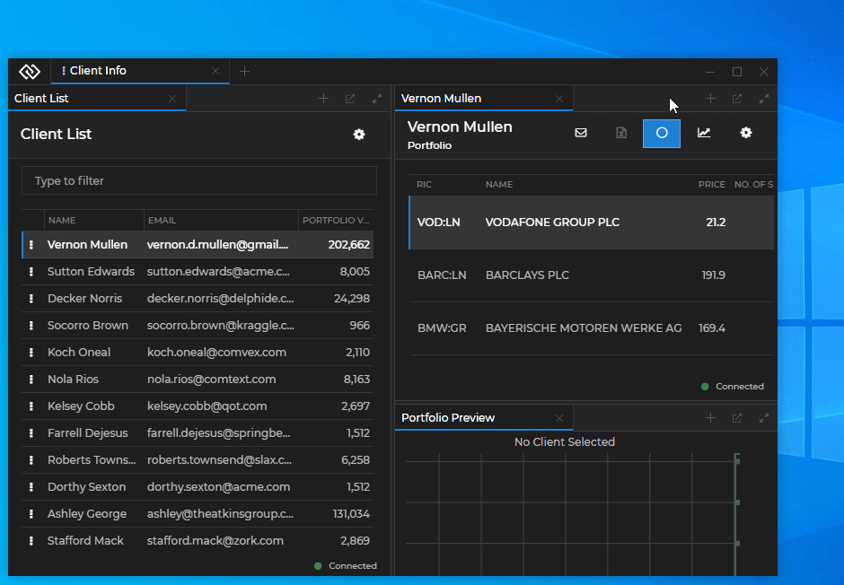

### Arranging Workspaces

Arrange the applications in a Workspace by dragging and dropping them at the desired location. Hover over the Workspace while holding the app window to see where the window will be situated when you drop it. Place the window as a new column, row or as a new tab in a tab group. Resize the Workspace elements by dragging the borders between them:

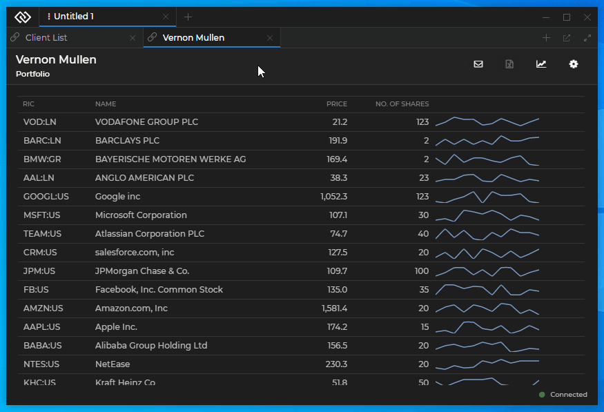

Maximize and restore an app window within a Workspace with the "Maximize/Restore" button in the window tab header:


Rearrange the tab order in a tab group by dragging and dropping the tabs at the desired position:

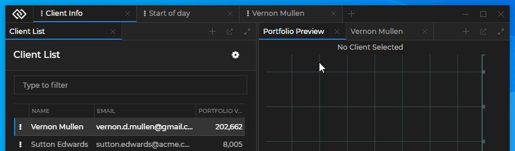

### Creating, Saving and Restoring

To create a new empty Workspace, use the "+" button in the Workspaces UI tab header and click "Create New":

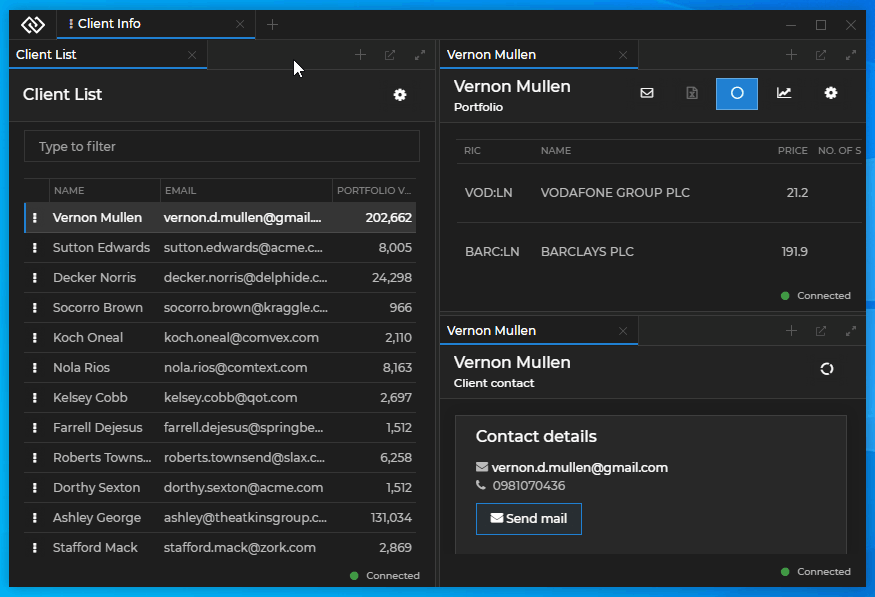

To save a Workspace Layout, use the "Save" button on the Workspace tab:

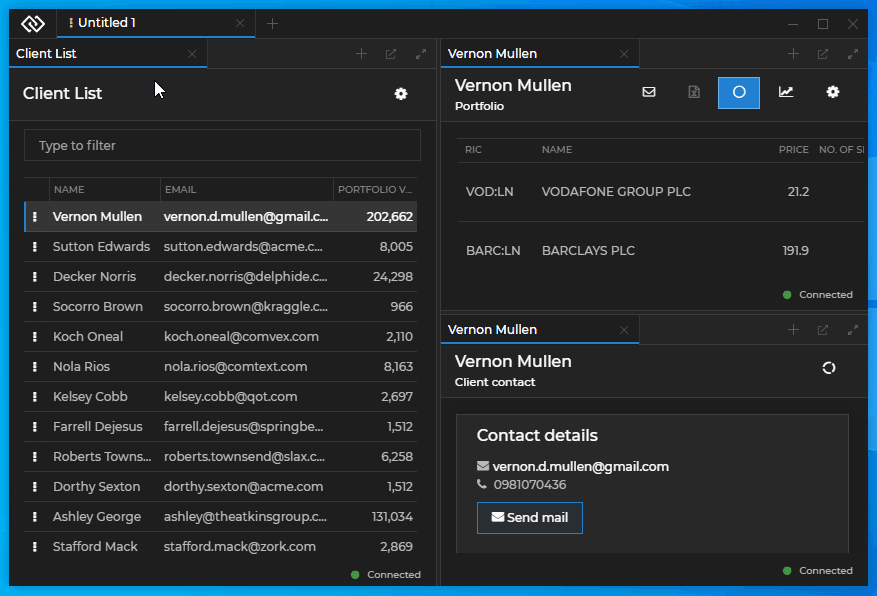

To restore a Workspace Layout, use the "+" button on the Workspace tab and select a previously saved Workspace from the menu:

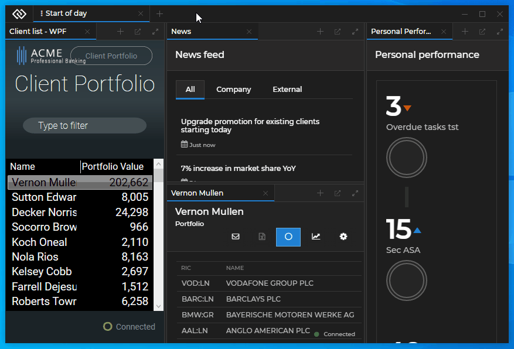

## Extending Workspaces

<glue42 name="addClass" class="colorSection" element="p" text="Available since Glue42 Enterprise 3.11">

The [`@glue42/workspaces-ui-react`](https://www.npmjs.com/package/@glue42/workspaces-ui-react) library provides all functionalities necessary for building a Workspaces App as a single React component - `<Workspaces />`. The `<Workspaces />` component provides extensibility points for passing custom components to it and can also be wrapped in other components (see [Workspaces Component](#extending_workspaces-workspaces_component)). The library enables you to use custom system popups, create your own popups from HTML elements (see [Custom Popups](#extending_workspaces-custom_popups)) and compose the content of a Workspace (see [Composing Workspace Content](#extending_workspaces-composing_workspace_content)).

Hot module reloading is supported, but keep in mind that each refresh closes all apps and Workspaces in the Frame.

*Note that the `@glue42/workspaces-ui-react` library doesn't include a built Workspaces App. A Workspaces App is provided in [**Glue42 Enterprise**](https://glue42.com/enterprise/). You can also use and customize the [Workspaces App template](https://github.com/Glue42/templates/tree/master/workspaces-react).*

*If your Workspaces App is meant for a [**Glue42 Core**](https://glue42.com/core/) project, skip the [Workspace App Configuration](#extending_workspaces-workspaces_app_configuration) and the [Limitations](#extending_workspaces-limitations) sections, as well as the instructions for ensuring Windows 7 support, as they are relevant only for [**Glue42 Enterprise**](https://glue42.com/enterprise/) projects.*

### Workspaces App Configuration

Your custom Workspaces App, as every Glue42 enabled app, must have an [application configuration](../../../../developers/configuration/application/index.html) file. Note that [**Glue42 Enterprise**](https://glue42.com/enterprise/) expects only one application definition for a Workspaces App - i.e., one configuration file with `"type"` property set to `"workspaces"`. Having multiple Workspaces App definitions will cause unexpected behavior when handling Workspaces. [**Glue42 Enterprise**](https://glue42.com/enterprise/) comes with a Workspaces UI app and a configuration file for it named `workspaces.json` and located in `%LocalAppData%\Tick42\GlueDesktop\config\apps`. Modify or replace this file with your own configuration file, or delete it, if your application configurations are stored at another location.

The `"type"` property must be set to `"workspaces"`:

```json
{
    "title": "Workspaces UI",
    "type": "workspaces",
    "name": "workspaces-demo",
    "icon": "http://localhost:22080/resources/icons/workspaces.ico",
    "details": {
        "layouts": [],
        "url": "http://localhost:3000",
        "updateFrameConstraints": false
    },
    "allowMultiple": true,
    "customProperties": {}
}
```

The `"url"` and `"layouts"` properties are optional. Use `"url"` to specify where the application is hosted, otherwise it will default to the Workspaces App template distributed with [**Glue42 Enterprise**](https://glue42.com/enterprise/). Use the `"layouts"` property to define Workspace Layouts that will be loaded on startup of the Workspaces App (for more details, see the [Workspace Layout](#workspaces_concepts-workspace-layout) section).

The `"updateFrameConstraints"` property by default is set to `true`, which means that the [Frame](#workspaces_concepts-frame) is restricted to the constraints of the Workspace and its elements inside it. Set to `false` if you don't want to prevent the user from resizing your custom Workspaces App beyond the constraints of its content.

#### Hibernation

<glue42 name="addClass" class="colorSection" element="p" text="Available since Glue42 Enterprise 3.12">

Workspaces can be configured to use hibernation in order to free up system resources. Apps in hibernated Workspaces are closed and when the user activates the Workspace, they are loaded again in the same configuration. This allows for a more flexible system resource usage, as a single Workspace may contain many apps and the user may be working simultaneously with several Workspaces, not taking into account other applications that may already be heavily consuming system resources.

By default, hibernation is disabled. To enable and configure hibernating Workspaces, add a `"hibernation"` property to the `"details"` key in the Workspaces App configuration file. There are three rules available which you can set in order to define when a Workspace should be hibernated. The rules set limits in regard to available system memory, Workspace idle time and maximum number of active Workspaces:

```json
"details": {
    "hibernation": {
        "enabled": true,
        "interval": 10,
        "workspacesToClose": 2,
        "rules": [
            {
                "enabled": true,
                "type": "InsufficientSystemMemory",
                // In MBs.
                "threshold": 1024
            },
            {
                "enabled": true,
                "type": "WorkspaceIdleTime",
                // In minutes.
                "threshold": 10
            },
            {
                "enabled": true,
                "type": "MaximumActiveWorkspaces",
                "threshold": 3
            }
        ]
    }
}
```

The `"hibernation"` key has the following properties:

| Property | Type | Description | Default |
|----------|------|-------------|---------|
| `"enabled"` | `object` | Set to `true` to enable Workspaces hibernation. | `false` |
| `"interval"` | `number` | Interval in minutes at which to check whether any Workspaces should be hibernated. | `120` |
| `"workspacesToClose"` | `number` | Number of Workspaces to hibernate at a time. The higher the number, the more the usage of system resources will spike. | `1` |
| `"rules"` | `object[]` | Rules that will define whether a Workspace should be hibernated. | `-` |

Each hibernation rule is an object with three properties - `"enabled"`, `"type"` and `"threshold"`. Set `"enabled"` to `true` to activate the rule. The `"type"` property accepts the name of the rule and `"threshold"` - the value for the rule. Available hibernation rules:

| Rule | Description | Default |
|------|-------------|---------|
| `"InsufficientSystemMemory"` | If the available system memory falls below the limit set by this rule, Workspaces will be hibernated. | `2048` |
| `"WorkspaceIdleTime"` | If a Workspace has been idle for the amount of time set by this rule, it will be hibernated. | `120` |
| `"MaximumActiveWorkspaces"` | If the maximum number of active Workspaces set by this rule has been reached, Workspace hibernation will begin. | `5` |

*For programmatic control of Workspace hibernation, see the [Hibernation](../javascript/index.html#workspace-hibernation) section.*

#### Loading Strategies

<glue42 name="addClass" class="colorSection" element="p" text="Available since Glue42 Enterprise 3.12">

Apps in Workspaces can be loaded using different strategies depending on whether everything should be loaded simultaneously from the very beginning, or the visible apps should be loaded first. If the visible apps are loaded first, you can specify whether the invisible ones (hidden behind another app as a tab) should load only when the user activates them, or should start loading in the background at set intervals.

The available loading strategies are `"direct"`, `"delayed"` and `"lazy"`. In `"direct"` mode, all apps are loaded on startup. In `"delayed"` mode, the visible apps are loaded first and then the invisible apps are loaded in batches at set intervals until all apps are eventually loaded. In `"lazy"` mode, the visible apps are loaded first and then invisible apps are loaded only on demand when the user activates them. This way some apps may never load if the user doesn't need them. Each strategy for loading apps in a Workspace has different advantages and disadvantages. It is important to take into consideration the actual user needs, as well as the available machine resources, before deciding on a specific strategy.

Advantages and disadvantages of the different loading strategies:

| Mode | Advantages | Disadvantages |
|------|------------|---------------|
| `"direct"` | The user gets everything up and running from the very beginning. | The CPU usage will spike when opening the Workspaces (because all apps start loading at the same time). May lead to poor user experience. High memory consumption - all applications are loaded and take up memory, even if they remain unused. |
| `"delayed"` | The loading time of visible apps is decreased due to reduced CPU load at startup (invisible apps aren't loaded initially). | High memory consumption - delayed loading, but still all apps are loaded and take up memory, even if they remain unused. |
| `"lazy"` | The loading time of visible apps is decreased due to reduced CPU load on startup (invisible apps aren't loaded initially). Some apps might not be loaded at all if the user doesn't need them. Eventually, this leads to reduced memory usage. | Apps which aren't loaded initially are loaded only when the user activates them. This may be inconvenient if loading the application takes too long. |

To configure the loading strategies for Workspaces, add a `"loading"` property to the `"details"` key in the Workspaces App configuration file:

```json
"details": {
    "loading": {
        "loadingStrategy": "delayed",
        "initialOffsetInterval": 2000,
        "interval": 3000,
        "batch": 2,
        // This indicator should only be used in development.
        "showDelayedIndicator": true
    }
}
```

The `"loading"` key has the following properties:

| Property | Type | Description | Default |
|----------|------|-------------|---------|
| `"loadingStrategy"` | `string` | Determines the default loading strategy. Can be `"direct"`, `"delayed"` or `"lazy"`. | `"direct"` |
| `"initialOffsetInterval"` | `number` | Initial period in milliseconds after which to start loading applications in batches. Valid only in `"delayed"` mode. | `1000` |
| `"interval"` | `number` | Interval in milliseconds at which to load the application batches. Valid only in `"delayed"` mode. | `5000` |
| `"batch"` | `number` | Number of applications in a batch to be loaded at each interval. Valid only in `"delayed"` mode. | `1` |
| `"showDelayedIndicator"` | `boolean` | Whether to show a `Zzz` indicator on the tabs of the apps that haven't been loaded yet. Useful in development for testing purposes, but shouldn't be delivered to end users. | `false` |

*For programmatic control of Workspace loading strategies, see the [Loading Strategies](../javascript/index.html#workspace-loading_strategies) section.*

#### Allowing Apps in the "Add Application" Menu

To control whether an app will be available in the Workspace "Add Application" menu (the dropdown that appears when you click the "+" button to add an application), use the `"includeInWorkspaces"` property of the `"customProperties"` top-level key in your [application configuration](../../../../developers/configuration/application/index.html):

```json
"customProperties": {
    "includeInWorkspaces": true
}
```

By default, this property is set to `false`.

### Header Area Zones

It is possible to add custom components in the Workspaces App header area in the following zones:

- Logo zone
- Add Workspace zone
- System Buttons zone

*The Move Area zone, located between the Add Workspace and the System Buttons zones, can't be used to add custom components in it, but can be relocated by using the `<MoveArea />` component (see [Move Area Component](#extending_workspaces-header_area_components-move_area_component)).*

The Logo zone is located at the leftmost part of the header area, to the left of the Workspace tabs, and hosts the `<GlueLogo />` component. By default, it renders the Glue42 logo:


The Add Workspace zone is located between the Workspace tabs and the move area and hosts the `<AddWorkspaceButton />` component. By default, it renders the "+" button that opens the Add Workspace popup:


The System Buttons zone is located at the rightmost part of the header area, after the move area, and hosts the `<MinimizeFrameButton />`, `<MaximizeFrameButton />` and `<CloseFrameButton />` components. By default, they render the Minimize, Maximize and Close buttons:


### Using the Components

All default components can be reused and composed with custom code. If usage of such component has been detected, its default behavior will be applied. For instance, if you use the `<AddWorkspaceButton />` component, a popup will automatically appear when the button is clicked, without the need of custom code to induce this behavior. If you pass the same component more than once, an error will be thrown.

To remove a component and make the respective zone empty, pass a `<Fragment />` component.

There are several prerequisites when creating a custom Workspaces App:

- The `<Workspaces />` component accepts the size of its container. If it is nested in another component, the parent component must have its `height` style property set to `100%` in order for the `<Workspaces />` component to be visible.
- The `@glue42/workspaces-ui-react` library depends on the `glue` object returned by the [initialized Glue42 JavaScript library](../../../../getting-started/how-to/glue42-enable-your-app/javascript/index.html#initializing_the_library). If you have used the [Glue42 React Hooks](../../../../getting-started/how-to/glue42-enable-your-app/react/index.html) wrapper to obtain the `glue` object, or if you have attached the `glue` object to the global `window` object, it will be automatically passed to the `<Workspaces />` component as a prop. Otherwise, you must pass it manually as a prop to the `<Workspaces />` component.
- The CSS files must be added manually (see [Styles](#extending_workspaces-styles)).

### Workspaces Component

The `<Workspaces />` component has two props - `glue` and `components`. The `glue` prop expects the `glue` object returned by the initialized Glue42 library. The `components` prop is used to define the header area components (see [Header Area Components](#extending_workspaces-header_area_components)), the system popup components or apps (see [Replacing the System Popups](#extending_workspaces-custom_popups-replacing_the_system_popups)) and the Workspace content to be rendered (see [Composing Workspace Content](#extending_workspaces-composing_workspace_content)).

*It is important to note that the `<Workspaces>` component is not meant to be used as a typical React component. Besides its rendering responsibilities, it also contains heavy logic. This component is meant to allow you to create a dedicated Workspaces App which must function as a standalone window - you must never use it as a part of another application, as this will lead to malfunctioning. The Workspaces App should be customized only using the available extensibility points.*

The following example shows the `<Workspaces />` component props, their properties and default values:

```javascript
<Workspaces 
    components={{
        header: {
            LogoComponent: GlueLogo,
            AddWorkspaceComponent: AddWorkspaceButton,
            SystemButtonsComponent: () => {
                return (
                    <>
                        <MinimizeFrameButton /> 
                        <MaximizeFrameButton />
                        <CloseFrameButton />
                    </>
                );
            }
        },
        popups: {
            SaveWorkspaceComponent: SaveWorkspacePopup,
            AddApplicationComponent: AddApplicationPopup,
            AddWorkspaceComponent: AddWorkspacePopup
        },
        WorkspaceContents: WorkspaceContents
    }}

    glue={glue}
/>
```

Wrapping the Workspaces web app in a single React component allows you to place custom components around it. The following example demonstrates how easy it is to customize the Workspaces App with your own toolbar:

```javascript
import React from "react";
import Workspaces from "@glue42/workspaces-ui-react";
import MyCustomToolbar from "./MyCustomToolbar";

const App = () => {
    return (
        <div className="App">
            <MyCustomToolbar />
            <Workspaces />
        </div>
    );
};

export default App;
```

Adding a custom toolbar with buttons to the Workspaces App:


### Header Area Components

Use the default header components or replace them with your custom ones. Compose more than one component in a [header area zone](#extending_workspaces-header_area_zones) by passing a function that returns a `<Fragment />` component. 

#### Logo

The following example demonstrates composing the Glue42 logo and a custom button in the Logo zone:

```javascript
import React from "react";
import Workspaces, { GlueLogo } from "@glue42/workspaces-ui-react";
import CustomButton from "./CustomButton";

const App = () => {
    return (
        <div className="App">
            <Workspaces
                components={{
                    header: {
                        LogoComponent: () => <> <CustomButton /> <GlueLogo /> </>
                    }
                }}
            />
        </div>
    );
};

export default App;
```

Adding a custom button in the Logo zone:

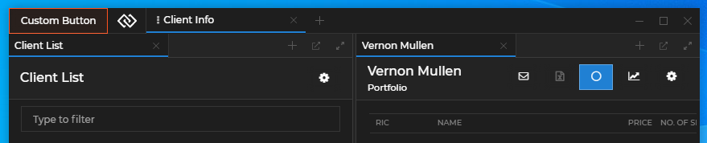

#### Add Workspace

The following example demonstrates replacing the default Add Workspace component with a custom button:

```javascript
import React from "react";
import Workspaces from "@glue42/workspaces-ui-react";
import CustomButton from "./CustomButton";

const App = () => {
    return (
        <div className="App">
            <Workspaces
                components={{
                    header: {
                        AddWorkspaceComponent: CustomButton
                    }
                }}
            />
        </div>
    );
};

export default App;
```

Using a custom button for the Add Workspace component:

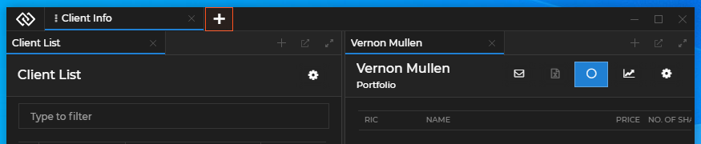

#### System Buttons

The following example demonstrates adding a custom button to the System Buttons zone and using the default Minimize, Maximize and Close buttons:

```javascript
import React from "react";
import Workspaces, { 
    MinimizeFrameButton,
    MaximizeFrameButton,
    CloseFrameButton
} from "@glue42/workspaces-ui-react";
import CustomButton from "./CustomButton";

const App = () => {
    return (
        <div className="App">
            <Workspaces
                components={{
                    header: {
                        SystemButtonsComponent: () => {
                            return (
                                <>
                                    <CustomButton />
                                    <MinimizeFrameButton /> 
                                    <MaximizeFrameButton />
                                    <CloseFrameButton />
                                </>
                            );
                        }
                    }
                }}
            />
        </div>
    );
};

export default App;
```

Adding a custom button in the System Buttons zone:

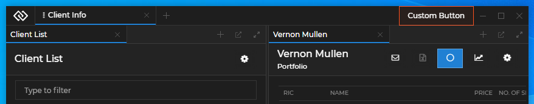

#### Move Area

The `<MoveArea />` component allows you to place the move area wherever you like in your custom Workspaces App. If you use the `<MoveArea />` component anywhere in your app, the default move area will be automatically disabled, there is no need to do that manually in the code.

*Note that you must use only one instance of the `<MoveArea />` component.*

The following examples demonstrates placing the move area at the bottom of a custom Workspaces App by wrapping it in a custom component:

```javascript
// Wrapping the move area in a custom component.
import React from "react";
import { MoveArea } from "@glue42/workspaces-ui-react";
import CustomLogo from "./CustomLogo";

const CustomFrameComponent = () => {
    return (
        <div className="custom-frame">
            <CustomLogo />
            <MoveArea />
        </div>
    );
};
```

```javascript
// Placing the move area at the bottom of the Workspaces App.
import React from "react";
import Workspaces from "@glue42/workspaces-ui-react";
import CustomFrameComponent from "./CustomFrameComponent";

const App = () => {
    return (
        <div className="App">
            <Workspaces />
            <CustomFrameComponent />
        </div>
    );
};

export default App;
```

For a demonstration of using the `<MoveArea />` component, see the [Workspace with Header](https://github.com/Glue42/workspace-with-header) example on GitHub.

### Custom Popups

The library allows you to customize the system popups of the Workspaces App, as well as to create custom popups for your applications participating in the Workspace.

Using a custom button and a custom popup for the Add Workspace component:


#### Replacing the System Popups

The `components` prop of the `<Workspaces />` component has a `popups` property that enables you to pass custom components or Glue42 apps that will act as system popups. To specify a custom Glue42 app as a system popup, pass its name as a string. 

*Note that if you decide to use the default system popups, you must ensure that they receive their required props. This includes a `glue` object with initialized [Workspaces](../javascript/index.html) library and [Application Management](../../../application-management/overview/index.html) library initialized in `"full"` or `"skipIcons"` mode.*

The following example demonstrates how to pass default popup components and their props correctly and how to pass a custom Glue42 app as a popup:

```javascript
import React from "react";
import Workspaces, { 
    SaveWorkspacePopup,
    AddApplicationPopup
} from "@glue42/workspaces-ui-react";

const App = () => {
    return (
        <div className="App">
            <Workspaces 
                components={{
                    popups: {
                        // Props are passed automatically.
                        SaveWorkspaceComponent: SaveWorkspacePopup,
                        // You must pass the props explicitly to the component and spread them.
                        AddApplicationComponent: props => <AddApplicationPopup {...props} />,
                        // Specifying a custom Glue42 app as a system popup.
                        AddWorkspaceComponent: "custom-add-workspace-popup"
                    }
                }}
            />
        </div>
    );
};

export default App;
```

Each system popup component receives several default props - functions for resizing and hiding the popup, as well as props for identifying the Frame, the Workspace or the Workspace element where the popup is located.

Save Workspace component:

| Prop | Signature | Description |
|------|-----------|-------------|
| `resizePopup` | `(s: Size) => void` | Function for resizing the popup. Accepts a required `Size` object as a parameter with optional `height` and `width` properties. |
| `hidePopup` | `() => void` | Function for hiding the popup. |
| `workspaceId` | `string` | The ID of the Workspace that will be saved. |
| `glue` | `any` | *Optional*. The Glue42 JavaScript library object. |

Add Workspace component:

| Prop | Signature | Description |
|------|-----------|-------------|
| `resizePopup` | `(s: Size) => void` | Function for resizing the popup. Accepts a required `Size` object as a parameter with optional `height` and `width` properties. |
| `hidePopup` | `() => void` | Function for hiding the popup. |
| `frameId` | `string` | The ID of the Frame in which the Workspace will be created or loaded. |
| `glue` | `any` | *Optional*. The Glue42 JavaScript library object. |

Add Application component:

| Prop | Signature | Description |
|------|-----------|-------------|
| `resizePopup` | `(s: Size) => void` | Function for resizing the popup. Accepts a required `Size` object as a parameter with optional `height` and `width` properties. |
| `hidePopup` | `() => void` | Function for hiding the popup. |
| `filterApps` | `(app: Glue42.AppManager.Application) => bool` | Property expecting a user-defined predicate for filtering the applications that will be available in the "Add Application" popup menu. |
| `workspaceId` | `string` | The ID of the Workspace in which the application will be added. |
| `boxId` | `string` | The ID of the Workspace element in which the application will be added. |
| `glue` | `any` | *Optional*. The Glue42 JavaScript library object. |

The following example demonstrates a reference implementation of a custom system popup component and how to handle resizing and hiding the popup:

```javascript
import React, { useEffect } from "react";

const SaveWorkspacePopup = ({ resizePopup, hidePopup }) => {
    const containerRef = React.createRef(); 
    const refreshHeight = () => {
        if (!containerRef?.current) {
            return;
        }
 
        const bounds = containerRef.current.getBoundingClientRect();
 
        resizePopup({
            height: bounds.height,
            width: bounds.width
        });
    };
 
    useEffect(() => {
        refreshHeight();
    }, []);
 
    return (
        <div onClick={(e) =>e.stopPropagation()} ref={containerRef}>
            Custom Popup
            <button onClick={hidePopup}>Hide</button>
        </div>
    );
};

export default SaveWorkspacePopup; 
```

The following example demonstrates how to use the default `<AddApplicationPopup />` system popup and filter the applications that will be available in the "Add Application" menu by a custom user-defined property:

```javascript
import React from "react";
import Workspaces { AddApplicationPopup } from "@glue42/workspaces-ui-react";
import "@glue42/workspaces-ui-react/dist/styles/popups.css";
import "@glue42/workspaces-ui-react/dist/styles/goldenlayout-base.css";
import "@glue42/workspaces-ui-react/dist/styles/glue42-theme.css";
import "./index.css";

const App = () => {
    // The custom properties from your application configuration are accessible through
    // the `userProperties` property of the `Application` object passed to the predicate function.
    const appFilter = app => app.userProperties.customAppFilterProperty;

    return (
        <Workspaces
            components={{
                popups:{
                    AddApplicationComponent: props => <AddApplicationPopup {...props} filterApps={appFilter} />
                }
            }}
        />
    );
};

export default App;
```

*See the [Limitations](#extending_workspaces-limitations) for using popups.*

#### User Defined Popups

There are two ways for you to create custom popups from HTML elements - by using the `<WorkspacePopup />` component, or by using the `useWorkspacePopup()` and `useWorkspaceWindowClicked()` hooks. 

*Note that the purpose of the `<WorkspacePopup />` component and the `useWorkspacePopup()` hook is to ensure compatibility of the popups with Windows 7. If you don't need to support Windows 7, use only the `useWorkspaceWindowClicked()` hook to handle window clicks.*

The `<WorkspacePopup />` component is based on the popular [`reactjs-popup`](https://www.npmjs.com/package/reactjs-popup) library. All features of the library are supported (see the [Limitations](#extending_workspaces-limitations) for using popups) with the addition of two new properties:

| Property | Type | Description |
|----------|------|-------------|
| `innerContentStyles` | `object` | Value for the `style` property of the element that wraps the popup content. |
| `popupRef` | `React.RefObject<PopupActions>` | Ref to the `reactjs-popup` popup element. |

The following example demonstrates how to create a custom popup using the `<WorskpacePopup />` component:

```javascript
import React from "react";
import { WorkspacePopup } from "@glue42/workspaces-ui-react";
 
const CustomPopup = ({ trigger }) => {
    const popupRef = React.createRef();

    return (
        <WorkspacePopup innerContentStyle={{ height:300 }} popupRef={popupRef} trigger={trigger}> 
            <div style={{ backgroundColor:"blue", height:"100%" }}>
                Custom Popup 
                <button onClick={() => popupRef.current?.close()}>Close</button>
            </div>
        </WorkspacePopup>
    );
};
 
export default CustomPopup;
```

The other way to create a popup is to implement a custom popup element and use the `useWorkspacePopup()` and/or `useWorkspaceWindowClicked()` hooks.

- `useWorkspacePopup()` - accepts the ref object to the HTML element of the popup as a parameter and ensures compatibility of the popup with Windows 7. Returns an array of two functions - the first one is to manually notify [**Glue42 Enterprise**](https://glue42.com/enterprise/) that the popup has been resized and the second one is to manually notify [**Glue42 Enterprise**](https://glue42.com/enterprise/) that the popup has been hidden;

```javascript
const popupRef = React.createRef();
const [popupResized, popupHidden] = useWorkspacePopup(popupRef);
```

- `useWorkspaceWindowClicked()` - accepts a callback that is invoked when a window in the Frame is focused. A generic `onClick` event will not work for handling window clicks, because although the Workspaces App is a web application, it contains different applications from different processes. The hook returns an unsubscribe function, however, this unsubscribe function is called when the component is unmounted so implementing cleanup logic is usually unnecessary;

The following example demonstrates how to create a custom popup using the `useWorkspacePopup()` and `useWorkspaceWindowClicked()` hooks:

```javascript
import React from "react";
import { 
    useWorkspacePopup, 
    useWorkspaceWindowClicked
} from "@glue42/workspaces-ui-react";
 
const CustomPopup = ({ closePopup }) => {
    const popupRef = React.createRef();
    
    useWorkspacePopup(popupRef);
    useWorkspaceWindowClicked(closePopup);
    
    return (
        <div ref={popupRef} style={popupStyle}>
            Custom Popup
            <button onClick={closePopup}>Close</button>
        </div>
    );
};
 
const popupStyle = {
    backgroundColor:"blue",
    height:100,
    position:"fixed",
    zIndex:99,
    top:100,
    left:100,
    width:100
};
 
export default CustomPopup;
```

*See the [Limitations](#extending_workspaces-limitations) for using popups.*

### Composing Workspace Content

The `components` prop of the `<Workspaces />` component has a `WorkspaceContents` property that enables you to manipulate the content of a Workspace - hide/show the Workspace content or add custom elements to the Workspace. For instance, you may need to render the Workspace content conditionally:

```javascript
import React, { useState } from "react";
import Workspaces, { WorkspaceContents } from "@glue42/workspaces-ui-react";
import CustomWorkspaceContent from "./CustomWorkspaceContent";

const App = () => {
    const [showContent, setShowContent] = useState(true);
    ...
    return (
        <Workspaces components={{
                ...
                WorkspaceContents: (props) => showContent ?
                    // Show the default Workspace content with the `<WorkspaceContents />` library component.
                    <WorkspaceContents {...props} /> :
                    // Or show custom Workspace content with your custom component.
                    <CustomWorkspaceContent workspaceId={props.workspaceId} />
            }} 
        />
    )
};

export default App;
```

*Note that it is not advisable to add complex components as additional Workspace content - the `WorkspaceContents` property is meant to allow you to add styling elements or interaction areas (simple toolbars, buttons, etc.) around the usual Workspace content.*

The `<WorkspaceContents />` component expects a Workspace ID as a prop.

*Note that you must never render simultaneously components containing the same Workspace ID, as this will lead to unexpected behavior.*

The following example demonstrates how to add a custom toolbar inside a Workspace:

```javascript
import React from "react";
import Workspaces, { WorkspaceContents } from "@glue42/workspaces-ui-react";
import Toolbar from "./Toolbar";

const App = () => {
    return (
        <Workspaces
            components={{
                WorkspaceContents: props => <> <Toolbar /> <WorkspaceContents {...props}/> </>
            }}
        />       
    );
};

export default App;
```

Adding a custom toolbar as part of the Workspace content:

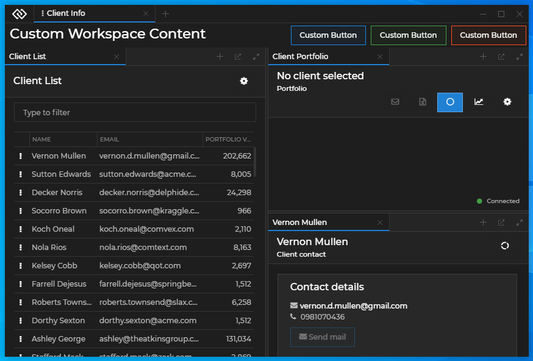

For a demonstration of using the `<WorkspaceContents />` component, see the [Pinned Workspace Tabs](https://github.com/Glue42/templates/tree/master/workspaces-react-pinned-tabs) example on GitHub. It shows how to render Workspace content conditionally using a button in the Workspaces header area.

### Styles

To use the default styles for your custom Workspaces App, import the following CSS files:

```javascript
import "@glue42/workspaces-ui-react/dist/styles/popups.css";
import "@glue42/workspaces-ui-react/dist/styles/goldenlayout-base.css";
import "@glue42/workspaces-ui-react/dist/styles/glue42-theme.css";
```

To use custom styles for the Workspaces App, simply import a your CSS file after the default CSS imports to override them. The `goldenlayout-base.css` file is mandatory, but you may skip the `popup.css` or `glue42-theme.css` imports if you don't want to use the default styles for the system popups or the default [Glue42 themes](../../themes/overview/index.html). Two default themes are available - **Day** and **Night** - and the trigger for switching between them is the class property of the `<html>` element - `"light"` for the **Day** theme and `"dark"` for the **Night** theme:

```html
<!-- Day theme -->
<html class="light">

<!-- Night theme -->
<html class="dark">
```

### Limitations

You should consider the following technical limitations when using the `@glue42/workspaces-ui-react` library:

- Due to the mechanism used for rendering Glue42 Windows, when running under Windows 10 a single color must always be transparent. The color is specified in the [`stickywindows.json`](../../../../assets/configuration/stickywindows.json) system configuration file (see also [Glue42 Windows](../../../../developers/configuration/glue42-windows/index.html)) and should not be used individually or in a gradient as it will always be rendered as fully transparent.
- For the previous reason the popups must not have shadows or any transparency if they are positioned over any of the apps in the Workspace.
- To ensure full compatibility with Windows 7 and Windows 10, you must use the `<WorkspacePopup />` component or the `useWorkspacePopup()` and `useWorkspaceWindowClicked()` hooks for your custom popups (except for any custom system popups where this is already handled internally).
- The Frame doesn't have a Glue42 Window object (`glue.windows.my()` returns `undefined`).
- Refs to the custom components passed to the `<Workspaces />` component shouldn't be used in any parent component of `<Workspaces />` because the children of `<Workspaces />` are not immediately rendered and therefore these refs will not work as expected. 
