## Overview

The [Window Management](../../../../reference/glue/latest/windows/index.html) API enables you to create and manipulate Glue42 Windows and is the basis of the [App Management](../../../application-management/overview/index.html) API. It allows users to [group Glue42 Windows](#window_groups) so that they move, maximize and minimize together, and provides the following features, not found in any normal browser:

- 4 types of window modes: flat, tab, HTML and frameless;

- Complete control and customization of the windows:
	- visibility - create hidden windows, show them later;
	- bounds - set window location and size;
	- user interaction - allow a window to be sticky, enable or disable "Minimize", "Maximize" and "Close" buttons;
	- add custom frame buttons to the windows and respond accordingly to user interaction with them;
	- organize windows into tabs that the user can also tear off;

Native apps, as opposed to web apps, can have more than one window. After you Glue42 enable your native app, your app windows aren't automatically registered as Glue42 Windows. You can choose which ones to register as Glue42 Windows so that they can use [**Glue42 Enterprise**](https://glue42.com/enterprise/) functionalities.

Web and native windows are handled by [**Glue42 Enterprise**](https://glue42.com/enterprise/) as window abstractions, which means that:

- You can use any technology adapter provided by Glue42 (JavaScript, .NET, Java, and many more) to control any window, web or native.
- From an end user perspective, there is no difference between web or native windows.
- Feature parity is provided by the different technology adapters.

## Window Modes

Glue42 supports four different window modes: flat, tab, HTML and frameless. The window mode is controlled by the `"mode"` window setting, specified in the [app configuration](../../../../developers/configuration/application/index.html) or as a setting when [opening a Glue42 Window](../../../../glue42-concepts/windows/window-management/javascript/index.html#opening_windows) programmatically.

Specifying the window mode in the app configuration:

```json
{
    "title": "My App",
    "type": "window",
    "name": "my-app",
    "details": {
        "url": "http://localhost:3000",
        "mode": "html"
    }
}
```

### Flat Windows

Flat windows are available for web and native apps. They have a caption bar that contains the app title and standard system buttons ("Minimize", "Maximize", "Close"):


### Tab Windows

Tab windows are available for web and native apps. The user can group them in or tear them off a tab group. They have a tab caption bar which contains that window tabs and standard system buttons ("Minimize", "Maximize", "Close"):


### HTML Windows

HTML windows are available for web apps only. The HTML page spans the entire window, there is no caption bar, and the standard system buttons ("Minimize", "Maximize", "Close") become visible when the user hovers over them:


### Frameless Windows

<glue42 name="addClass" class="colorSection" element="p" text="Available since Glue42 Enterprise 3.15">

Frameless windows are based on HTML windows, but allow for creating apps with freeform (non-rectangular) shapes and transparent areas. They don't have the usual Glue42 Window decorations - title bars, standard system buttons ("Minimize", "Maximize", "Close"), resizing areas, and can't be dragged (unless you define a [custom draggable area](https://www.electronjs.org/docs/latest/tutorial/window-customization#set-custom-draggable-region) within the web app), can't be dropped in [Workspaces](../../workspaces/overview/index.html) or stuck to other Glue42 Windows. Frameless windows can be saved and restored in [Layouts](../../layouts/overview/index.html) and can use all Glue42 functionalities provided by the Glue42 libraries.

The following example demonstrates a freeform frameless window, registered in [**Glue42 Enterprise**](https://glue42.com/enterprise/) as a Glue42 enabled app, and using the [App Management](../../../application-management/overview/index.html) API to start another app. The window is draggable, because the web app has a defined draggable area:


## Flydown & Popup Windows

The Glue42 JavaScript library offers convenient facilities for creating [flydown](../javascript/index.html#flydown_windows) and [popup](../javascript/index.html#popup_windows) windows. Flydown and popup windows can be very useful for dropdown menus and helper windows for your app, but when implementing them from scratch, it may be hard to control their behavior as there are many corner cases to consider. The Glue42 library resolves these issues and provides an easy way for creating and manipulating flydown and popup windows.

Flydown windows appear when the user hovers over a predefined area in your app:


Popup windows appear when the user clicks on a predefined area in your app:


## Window Groups

Besides providing full control over individual windows, [**Glue42 Enterprise**](https://glue42.com/enterprise/) also enables you to arrange Glue42 Windows visually by sticking them together and forming window groups. Grouping separate Glue42 Windows in a single frame (window) allows the users to move, resize, minimize, maximize, restore and close all participating windows together using the standard buttons on the window group frame. Grouped windows have a single [customizable taskbar icon](../../../../developers/configuration/themes/index.html#theme_properties-window_groups), can be resized within the group frame and can be torn off from the group. Tab windows can be grouped in tab groups that in turn can be stuck to other Glue42 Windows or groups.


The standard buttons ("Minimize", "Maximize", "Restore", "Close") of the individual Glue42 Windows participating in the group can also be used which will result in the following behavior:

- "Minimize" - will minimize the entire group.
- "Maximize" - will maximize only the window, breaking it off from the window group. If none of the other windows in the group has been manipulated in any way (moved, resized or changed its state), the group will be restored when the maximized window is restored.
- "Restore" - restores a maximized window to its normal state, restoring also the window group, unless any of the other windows participating in it has been manipulated in any way (moved, resized or changed its state).
- "Close" - will close only the window.

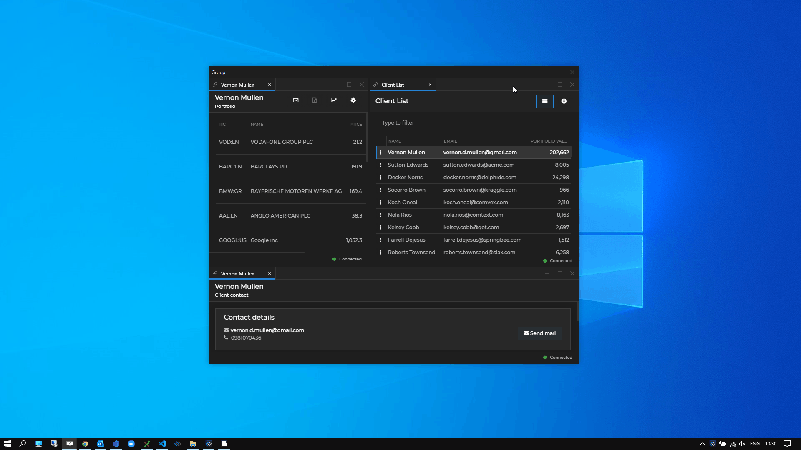

Groups can be saved and restored in [Layouts](../../layouts/overview/index.html), saving users time and effort to find and rearrange the necessary apps again after closing the group.

Glue42 Window groups can be controlled programmatically - maximize and restore, show and hide the group header, get and set the group title, find an individual window or all windows participating in the group, find and list window groups, subscribe for group-related events.

[**Glue42 Enterprise**](https://glue42.com/enterprise/) offers two implementations of Glue42 Window groups, which are visually indistinguishable to the user - classic and web groups.

### Classic Groups

The Glue42 classic groups are based on WPF components and are the default group implementation in [**Glue42 Enterprise**](https://glue42.com/enterprise/). To switch to the Glue42 classic groups, use the `"groupType"` property in the `stickywindows.json` configuration file of [**Glue42 Enterprise**](https://glue42.com/enterprise/) located in the `%LocalAppData%\Tick42\GlueDesktop\config` folder:

```json
{
    "groupType": "Classic"
}
```

Glue42 classic groups allow limited visual customization through the `themes.json` configuration file of [**Glue42 Enterprise**](https://glue42.com/enterprise/). For more details, see the [Developers > Configuration > Themes](../../../../developers/configuration/themes/index.html#theme_properties-window_groups) section.

### Web Groups

<glue42 name="addClass" class="colorSection" element="p" text="Available since Glue42 Enterprise 3.15">

*Note that the web-based implementation of the Glue42 Window groups is still an experimental feature and some inconsistencies in functionality and UI may be present.*

The Glue42 web groups are based on web technologies and allow for complete customization of the containing group frame and all elements of the different Glue42 Window types (flat, tab and HTML) that may be a part of it. To switch to the Glue42 web groups, use the `"groupType"` property in the `stickywindows.json` configuration file of [**Glue42 Enterprise**](https://glue42.com/enterprise/) located in the `%LocalAppData%\Tick42\GlueDesktop\config` folder:

```json
{
    "groupType": "Web"
}
```

Glue42 web groups can be customized visually by supplying custom CSS styles for the default Web Group App in [**Glue42 Enterprise**](https://glue42.com/enterprise/), or you can fashion your own, completely tailored Web Group App using the [`@glue42/groups-ui-react`](https://www.npmjs.com/package/@glue42/groups-ui-react) library. For more details, see the [Extending Web Groups](#extending_web_groups) section.

## Extending Web Groups

<glue42 name="addClass" class="colorSection" element="p" text="Available since Glue42 Enterprise 3.15">

*Note that as the Glue42 [web groups](#window_groups-web_groups) are still an experimental feature, the [`@glue42/groups-ui-react`](https://www.npmjs.com/package/@glue42/groups-ui-react) library doesn't support some of the features supported by the Glue42 [classic groups](#window_groups-classic_groups). For more details, see the [Limitations](#extending_web_groups-limitations) section.*

The [`@glue42/groups-ui-react`](https://www.npmjs.com/package/@glue42/groups-ui-react) library provides all functionalities necessary for building a Web Group App as a single React component - `<Group />`. The `<Group />` component provides extensibility points for passing custom components to it (see [Group Component](#extending_web_groups-group_component)).

See below an example of a Web Group App with the following customized elements:

- [Group Caption Bar](#extending_web_groups-group_caption_bar_components) containing a custom button that shows and hides a custom [Group Overlay](#extending_web_groups-overlays);
- [Caption Bar for flat windows](#extending_web_groups-flat_window_components) containing a custom caption;
- [tab element for tab windows](#extending_web_groups-tab_window_components) containing a custom Close button;
- [Before Tabs zone](#extending_web_groups-group_elements-tab_windows) containing a custom icon;
- [Below Window zone](#extending_web_groups-common_window_components) containing custom content;

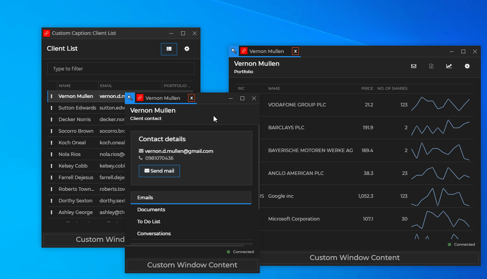

*Note that the [`@glue42/groups-ui-react`](https://www.npmjs.com/package/@glue42/groups-ui-react) library doesn't include a built Web Group App. A Web Group App is provided in [**Glue42 Enterprise**](https://glue42.com/enterprise/). You can also use and customize the [Web Group App template](https://github.com/Glue42/templates/tree/master/groups-react).*

*See also the [Web Groups with Banners](https://github.com/Glue42/web-groups-with-banners) example on GitHub.*

### Configuration

Your custom Web Group App, as every Glue42 enabled app, must have an [app configuration](../../../../developers/configuration/application/index.html) file. By default, [**Glue42 Enterprise**](https://glue42.com/enterprise/) will search for an app registered with the name `"glue42-web-group-application"` and if one is available, will use it as the Web Group App. If no such app is found, the first available app definition of type `"webGroup"` will be used. Note that [**Glue42 Enterprise**](https://glue42.com/enterprise/) expects only one app definition for a Web Group App - i.e., one configuration file with `"type"` property set to `"webGroup"`. If multiple Web Group App definitions are present, the first one will be used. [**Glue42 Enterprise**](https://glue42.com/enterprise/) comes with a Web Group App and a configuration file for it named `webGroup.json` and located in `%LocalAppData%\Tick42\GlueDesktop\config\apps`. Modify or replace this file with your own configuration file, or delete it, if your app configurations are stored at another location.

The `"type"` property must be set to `"webGroup"`:

```json
{
    "name": "web-group-app",
    "title": "Web Group App",
    "type": "webGroup",
    "hidden": true,
    "details": {
        "url": "http://localhost:3000/",
        "autoOpenDevTools": true,
        "preloadScripts": ["https://example.com/my-script.js"],
        "pool": {
            "min": 5
        }
    }
}
```

The `"url"` property is required and must point to the location of your custom Web Group App.

Use the `"autoOpenDevTools"` property to automatically open the Chrome Dev Tools (disabled by default) when debugging your Web Group App.

Use the `"preloadScripts"` property to specify a list of URLs pointing to scripts that will be loaded and executed before loading the Web Group App.

Use the `"pool"` property to specify the minimum number of cached Web Group App instances (default is `3`) used for improving group performance and user experience. The higher the number, the more memory will be consumed; the lower the number, the higher the chance to experience delay during web group operations.

The `"hidden"` property is set to `true` in order to hide the Web Group App from the Glue42 [Toolbar](../../../glue42-toolbar/index.html), because this is a service app used directly by [**Glue42 Enterprise**](https://glue42.com/enterprise/) to handle Glue42 Window groups.

### Group Elements

It is possible to add your custom components to the Web Group App or customize the default ones. This section demonstrates the available customizable zones and the default components of the Web Group App.

#### Group Caption Bar

The Group Caption Bar element is located at the topmost part of the window group:

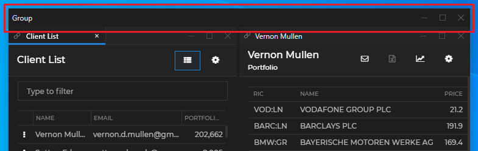

The Group Caption Bar element hosts the `<GroupCaptionBar />` component which contains the `<GroupMoveArea />`, `<GroupCaption />` and `<GroupButtons />` components. The following demonstrates the default structure of the `<GroupCaptionBar />` component:

```javascript
<GroupCaptionBar>
    <GroupMoveArea>
        <GroupCaption />
    </GroupMoveArea>
    <GroupButtons>
        <MinimizeButton />
        <MaximizeButton />
        <RestoreButton />
        <CloseButton />
    </GroupButtons>
</GroupCaptionBar>
```

For an example usage, see [Group Caption Bar Components](#extending_web_groups-group_caption_bar_components)

#### Flat Windows

The Glue42 flat windows have a Flat Caption Bar element located at the topmost part of a flat window:

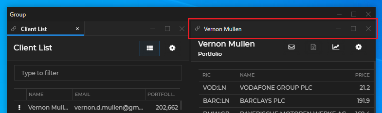

The Flat Caption Bar element hosts the `<FlatCaptionBar />` component which contains the `<FlatChannelSelector />`, `<FlatMoveArea />`, `<FlatCaption />` and `<FlatButtons />` components. The following demonstrates the default structure of the `<FlatCaptionBar />` component:

```javascript
<FlatCaptionBar>
    <FlatChannelSelector />
    <FlatMoveArea>
        <FlatCaption />
    </FlatMoveArea>
    <FlatButtons>
        <MinimizeButton />
        <MaximizeButton />
        <RestoreButton />
        <CloseButton />
    </FlatButtons>
</FlatCaptionBar>
```

For an example usage, see [Flat Window Components](#extending_web_groups-flat_window_components)

#### Tab Windows

The Tab Header element of a tab group isn't available as a single customizable component, but contains several customizable zones and components. One or more Tab elements hold the individual tabs and the Tab Header Buttons element holds the standard system buttons:

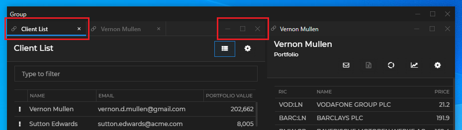

There are four additional customizable zones that are located before and after the tabs, above and below the tab header - the Before Tabs, After Tabs, Above Tabs and Below Tabs zones:

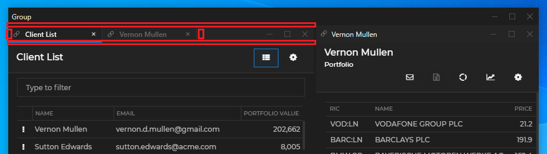

Each Tab element hosts an individual `<Tab />` component. Each `<Tab />` component contains the `<TabChannelSelector />`, `<TabCaption />` and `<TabCloseButton />` components. The Tab Header Buttons element hosts the `<TabHeaderButtons />` component. The following demonstrates the default structure of the `<Tab />` and the `<TabHeaderButtons />` components:

```javascript
<Tab>
    <TabChannelSelector />
    <TabCaption />
    <TabCloseButton />
</Tab>

<TabHeaderButtons>
    <MinimizeButton />
    <MaximizeButton />
    <RestoreButton />
    <CloseButton />
</TabHeaderButtons>
```

The move area for a tab group is automatically created between the After Tabs zone and the Tab Header Buttons element. There is no component for it and it isn't necessary to create it explicitly.

For an example usage, see [Tab Window Components](#extending_web_groups-tab_window_components)

#### HTML Windows

The Glue42 HTML windows have only an element holding standard and custom buttons, which currently isn't customizable. For more details, see the [Limitations](#extending_web_groups-limitations) section.

#### Other Zones

The [`@glue42/groups-ui-react`](https://www.npmjs.com/package/@glue42/groups-ui-react) library offers other customizable zones that don't contain default components and can be used for additional customizations:

- On a group level, you can use an Overlay zone to show a custom element anywhere within the group bounds. The bounds and lifetime of this element are determined by your custom styles and logic. For an example usage, see [Overlays](#extending_web_groups-overlays).

- On a window level, you can use an Overlay zone to show a custom element anywhere within the bounds of all window types in the group. The bounds and lifetime of this element are determined by your custom styles and logic. The window-level overlay can be shown either in all windows simultaneously, or you can target a specific window. For an example usage, see [Overlays](#extending_web_groups-overlays).

- On a window level, you can use a Below Window zone to show custom content that will be situated at the bottom of all window types. For example usage, see [Common Window Components](#extending_web_groups-common_window_components).

### Using the Components

All default components can be reused and composed with custom code. If usage of such component has been detected, its default behavior will be applied. For instance, if you use the `<CloseButton />` component, it will automatically close the window or group when the button is clicked, without the need of custom code to induce this behavior. If you pass the same component more than once, an error will be thrown.

To remove a component and make the respective zone or element empty, pass a `<Fragment />` component.

There are several prerequisites when creating a custom Web Group App:

- The size of the `<Group />` component must always be 100% of the window to avoid unexpected behavior and errors.
- The `<Group />` component must not be nested in other components, as its bounds are determined by the windows forming the window group and the group may also have an irregular shape. Wrapping the `<Group />` component will result in unexpected behavior.
- The CSS files must be added manually (see [Styles](#extending_web_groups-styles)).

### Group Component

The `<Group />` component has one prop - `components`. Use it to define the components for the various group and window elements and zones - [Group Caption Bar Components](#extending_web_groups-group_caption_bar_components), [Flat Window Components](#extending_web_groups-flat_window_components), [Tab Window Components](#extending_web_groups-tab_window_components), [Common Window Components](#extending_web_groups-common_window_components) and [Overlays](#extending_web_groups-overlays).

The following example demonstrates the structure of the `<Group />` component, its properties and default values:

```javascript
<Group
    components={{
        group: {
            CaptionBar: () => {
                return (
                    <GroupCaptionBar>
                        <GroupMoveArea>
                            <GroupCaption />
                        </GroupMoveArea>
                        <GroupButtons>
                            <MinimizeButton />
                            <MaximizeButton />
                            <RestoreButton />
                            <CloseButton />
                        </GroupButtons>
                    </GroupCaptionBar>
                );
            },
            Overlay: () => <></>
        },
        frame: {
            Overlay: () => <></>,
            BelowWindow: () => <></>
        },
        flat: {
            CaptionBar: () => {
                return (
                    <FlatCaptionBar>
                        <FlatChannelSelector />
                        <FlatMoveArea>
                            <FlatCaption />
                        </FlatMoveArea>
                        <FlatButtons>
                            <MinimizeButton />
                            <MaximizeButton />
                            <RestoreButton />
                            <CloseButton />
                        </FlatButtons>
                    </FlatCaptionBar>
                );
            }
        },
        tabs: {
            Element: () => {
                return (
                    <Tab>
                        <TabChannelSelector />
                        <TabCaption />
                        <TabCloseButton />
                    </Tab>
                );
            },
            Before: () => <></>,
            After: () => <></>,
            Above: () => <></>,
            Below: () => <></>,
            Buttons: () => {
                return (
                    <TabHeaderButtons>
                        <MinimizeButton />
                        <MaximizeButton />
                        <RestoreButton />
                        <CloseButton />
                    </TabHeaderButtons>
                )
            }
        }
    }}
/>
```

### Group Caption Bar Components

The `group` property in the `<Group />` component is used for defining the structure and content of the group caption bar and the group [overlay](#extending_web_groups-overlays).

The following example demonstrates how to create a custom group caption bar and add a custom button in it:

```javascript
import React from "react";
import {
    GroupMoveArea,
    GroupCaption,
    GroupButtons
} from "@glue42/groups-ui-react";
import CustomButton from "./CustomButton";

const CustomGroupCaptionBar = ({ moveAreaId, caption, ...rest }) => {
    return (
        <div className="custom-group-caption-bar">
            <GroupMoveArea moveAreaId={moveAreaId}>
                <GroupCaption caption={caption} />
            </GroupMoveArea>
            <CustomButton />
            <GroupButtons {...rest} />
        </div>
    );
};

export default CustomGroupCaptionBar;
```

Using the custom group caption bar in your Web Group App:

```javascript
import React from "react";
import Group from "@glue42/groups-ui-react";
import CustomGroupCaptionBar from "./CustomGroupCaptionBar";

const App = () => {
    return (
        <Group
            components={{
                group: {
                    CaptionBar: CustomGroupCaptionBar
                }
            }}
        />
    );
};

export default App;
```

Custom group caption bar with a custom button in it:


*See also the [Web Groups with Banners](https://github.com/Glue42/web-groups-with-banners) example on GitHub.*

### Flat Window Components

The `flat` property in the `<Group />` component is used for defining the structure and content of the caption bar for flat windows.

The following example demonstrates how to create a custom caption for flat windows:

```javascript
import React from "react";

const CustomCaption = ({ caption }) => {
    return <div className="custom-caption">Custom Caption: {caption}</div>
};

export default CustomCaption;
```

Creating a custom caption bar for flat windows containing a [Channel](../../../data-sharing-between-apps/channels/overview/index.html) Selector and a custom caption:

```javascript
import React from "react";
import {
    FlatChannelSelector,
    FlatMoveArea,
    FlatButtons
} from "@glue42/groups-ui-react";
import CustomCaption from "./CustomCaption";

const CustomFlatCaptionBar = ({ channels, moveAreaId, caption, ...rest }) => {
    return (
        <div className="custom-flat-caption-bar">
            {channels?.visible && <FlatChannelSelector {...channels} />}
            <FlatMoveArea moveAreaId={moveAreaId}>
                <CustomCaption caption={caption} />
            </FlatMoveArea>
            <FlatButtons {...rest} />
        </div>
    );
};

export default CustomFlatCaptionBar;
```

Using the custom caption bar for flat windows in your Web Group App:

```javascript
import React from "react";
import Group from "@glue42/groups-ui-react";
import CustomFlatCaptionBar from "./CustomFlatCaptionBar";

const App = () => {
    return (
        <Group
            components={{
                flat: {
                    CaptionBar: CustomFlatCaptionBar
                }
            }}
        />
    );
};

export default App;
```

Custom caption bar for flat windows containing a custom caption:

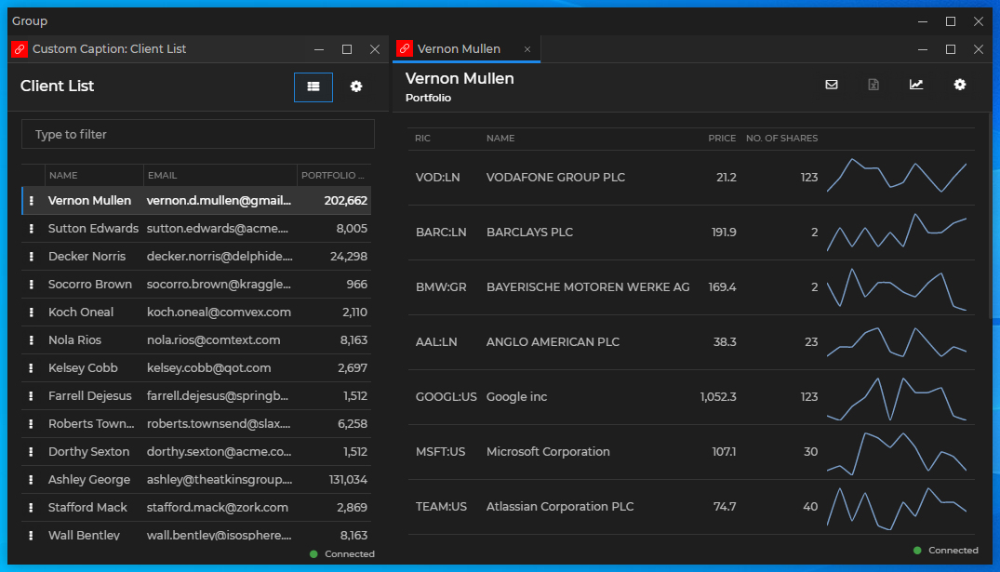

*See also the [Web Groups with Banners](https://github.com/Glue42/web-groups-with-banners) example on GitHub.*

### Tab Window Components

The `tabs` property in the `<Group />` component is used for defining the structure and content of each tab element, tab header buttons and the additional zones around the tab elements.

The following example demonstrates how to create a custom "Close" button for tab windows:

```javascript
import React, { useEffect, useRef } from "react";

const CustomCloseButton = ({ close }) => {
    const ref = useRef(null);

    useEffect(() => {
        if (!ref.current) { return };

        ref.current.onmousedown = e => e.stopPropagation();
    }, [ref]);

    return <button ref={ref} onClick={() => close()}>x</button>
};

export default CustomCloseButton;
```

In this example, the propagation of the `"mousedown"` event is stopped, because otherwise the tab will enter draggable state. The `close()` handler is attached to the `"click"` event, because attaching it to the `"mousedown"` event won't work - the propagation of the `"mousedown"` event has been stopped using a direct DOM reference, which means that this event will never be fired as a React event.

*Note that the final implementation of a Web Group App is a mixture of React and pure JavaScript. That's why when preventing the propagation of DOM events, it is strongly recommended to use direct references to the DOM elements. If you use React events, the event notifications may be received too late to stop the propagation.*

Creating a custom tab element for tab windows containing a [Channel](../../../data-sharing-between-apps/channels/overview/index.html) Selector and a custom "Close" button:

```javascript
import React from "react";
import { TabChannelSelector, TabCaption } from "@glue42/groups-ui-react";
import CustomCloseButton from "./CustomCloseButton";

const CustomTab = ({ channels, caption, selected, close }) => {
    return (
        <div className="custom-tab">
            {channels.visible && <TabChannelSelector {...channels} />}
            <TabCaption caption={caption} selected={selected} />
            <CustomCloseButton close={close} />
        </div>
    );
};

export default CustomTab;
```

Using the custom tab element for tab windows in your Web Group App and defining a custom component for the Before Tabs zone:

```javascript
import React from "react";
import Group from "@glue42/groups-ui-react";
import CustomTab from "./CustomTab";

const App = () => {
    return (
        <Group
            components={{
                tabs: {
                    Element: CustomTab,
                    Before: () => {
                        return <div className="custom-before-tab">&#128269;</div>
                    }
                }
            }}
        />
    );
};

export default App;
```

Custom Before Tabs zone containing a custom icon and a custom tab element containing a custom Close button:

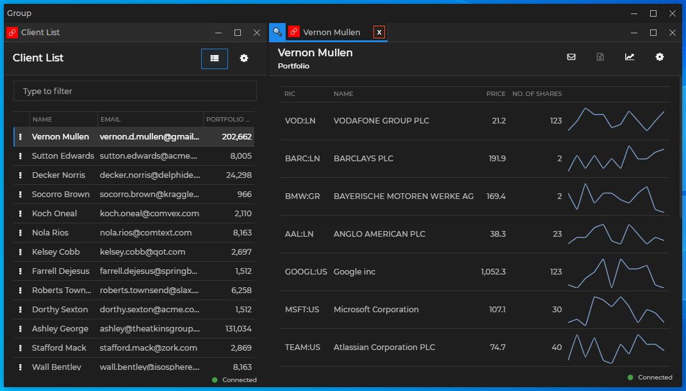

*See also the [Web Groups with Banners](https://github.com/Glue42/web-groups-with-banners) example on GitHub.*

### Common Window Components

The `frame` property in the `<Group />` component is used for defining the structure and content of window and [overlay](#extending_web_groups-overlays) zones that are common for all window types.

The following example demonstrates how to create a custom component for the Below Window zone that will be shown in all windows in the group, regardless of their type:

```javascript
import React from "react";
import Group from "@glue42/groups-ui-react";

const App = () => {
    return (
        <Group
            components={{
                frame: {
                    BelowWindow: () => {
                        return <div className="custom-below-window">Custom Window Content</div>
                    }
                }
            }}
        />
    );
};

export default App;
```

*Note that showing content in a Below Window zone effectively reduces the height of the window area.*

Custom Below Window zone:

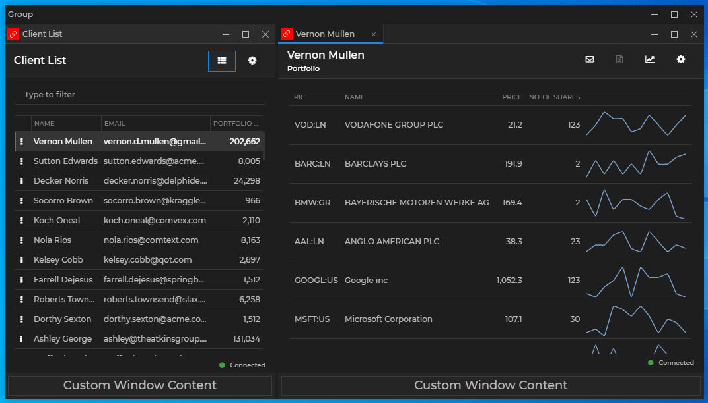

*See also the [Web Groups with Banners](https://github.com/Glue42/web-groups-with-banners) example on GitHub.*

### Overlays

The [`@glue42/groups-ui-react`](https://www.npmjs.com/package/@glue42/groups-ui-react) library allows you to show custom overlays on a group or on a window level. The bounds and lifetime of overlay components is determined by your custom styles and logic. The window-level overlays can be shown either in all windows simultaneously, or you can target a specific window.

To define a window-level overlay, use the Overlay zone of the `frame` property in the `<Group />` component:

```javascript
import React from "react";
import Group from "@glue42/groups-ui-react";

const App = () => {
    return (
        <Group
            components={{
                frame: {
                    Overlay: () => {
                        return <div className="custom-window-overlay">Custom Content</div>
                    }
                }
            }}
        />
    );
};

export default App;
```

The following examples demonstrate how to create a group-level overlay that will show or hide when the user clicks a button in the group caption bar.

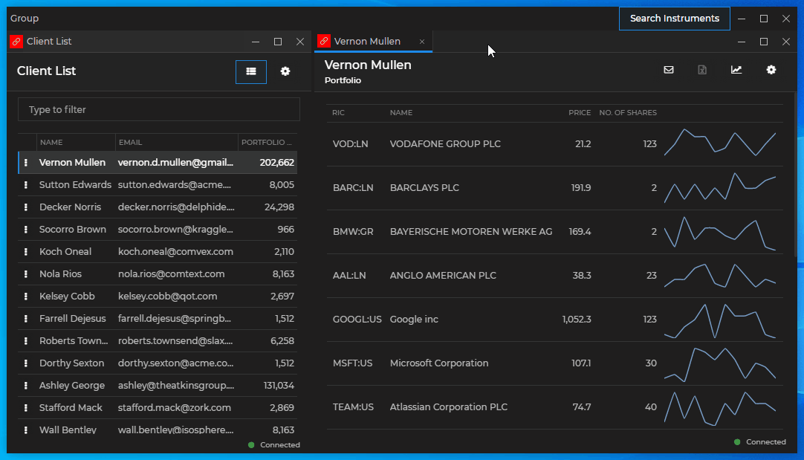

Create a custom group overlay:

```javascript
import React from "react";

const CustomGroupOverlay = () => {
    return (
        <div className="custom-group-overlay">
            <input placeholder="Search instruments" />
            <button>Load Portfolios</button>
        </div>
    );
};

export default CustomGroupOverlay;
```

Create a custom group caption bar and place a custom button in it that will show or hide the group overlay:

```javascript
import React from "react";
import {
    GroupMoveArea,
    GroupCaption,
    GroupButtons
} from "@glue42/groups-ui-react";
import CustomButton from "./CustomButton";

const CustomGroupCaptionBar = ({ moveAreaId, caption, showOverlay, setShowOverlay, ...props }) => {
    return (
        <div className="custom-group-caption-bar">
            <GroupMoveArea moveAreaId={moveAreaId}>
                <GroupCaption caption={caption} />
            </GroupMoveArea>
            <button onClick={() => setShowOverlay(!showOverlay)}>Search Instruments</button>
            <GroupButtons {...props} />
        </div>
    );
};

export default CustomGroupCaptionBar;
```

Pass the custom components to your custom Web Groups App and render the group overlay conditionally:

```javascript
import React, { useState } from "react";
import Group from "@glue42/groups-ui-react";
import CustomGroupCaptionBar from "./CustomGroupCaptionBar";
import CustomGroupOverlay from "./CustomGroupOverlay";

const App = () => {
    const [showOverlay, setShowOverlay] = useState(false);

    return (
        <Group
            components={{
                group: {
                    CaptionBar: props => {
                                    return (
                                        <CustomGroupCaptionBar
                                            showOverlay={showOverlay}
                                            setShowOverlay={setShowOverlay}
                                            {...props}
                                        />
                                    );
                                },
                    Overlay: () => showOverlay ? <CustomGroupOverlay /> : <></>
                }
            }}
        />
    );
};

export default App;
```

*See also the [Web Groups with Banners](https://github.com/Glue42/web-groups-with-banners) example on GitHub.*

### Requesting Focus

Some components in your custom Web Group App may require keyboard focus when the user clicks on them (e.g., input fields) or when the component that contains them has been mounted. By default, the keyboard focus isn't on the Web Group App (the web page itself), but rather on the apps participating in it. To move the keyboard focus to a component in the Web Group App, use the `requestPageFocus()` method.

The following examples demonstrate how to move the keyboard focus to a custom input field located in a [custom window tab](#extending_web_groups-tab_window_components). The input field is used for changing the tab title - when the user double clicks on the tab, the input will be shown, and when they double click again, the new title will be set.

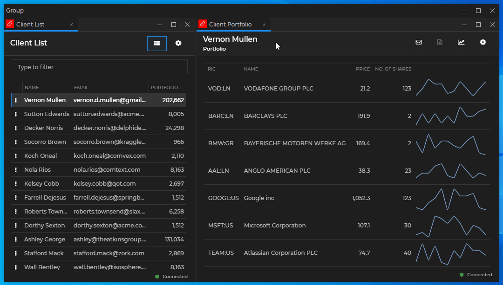

Create a custom input field and use the `requestPageFocus()` method to move the keyboard focus to it every time the component is mounted and when the user clicks on it. You must also use a direct reference to the element and stop the propagation of the `"mousedown"` and `"click"` events in order to prevent the Web Groups framework from processing them. Use the `requestPageFocus()` method in the `"click"` event in order to focus the element every time the user clicks on it, in case the element is already rendered, but loses focus, because the user has clicked somewhere else:

```javascript
import React, { useState, useEffect, useRef } from "react";
import { requestPageFocus } from "@glue42/groups-ui-react";

const CustomInput = ({ setTabTitle }) => {
    const [newTitle, setNewTitle] = useState("");
    const ref = useRef(null);

    useEffect(() => {
        if (!ref.current) { return };

        // Stop the propagation of the `"mousedown"` and `"click"` events,
        // in order to prevent the Web Groups framework from processing them.
        ref.current.onmousedown = e => e.stopPropagation();
        ref.current.onclick = (e) => {
            e.stopPropagation();
            // Request keyboard focus when the component is mounted and when the user clicks on it.
            requestPageFocus();
        };
    }, [ref]);

    return <input ref={ref} onDoubleClick={() => setTabTitle(newTitle)} onChange={e => {setNewTitle(e.target.value)}} value={newTitle} />
};

export default CustomInput;
```

*Note that due to the nature of the Web Group App and the fact that React event handlers are always executed after the native DOM event handlers, you must use a direct reference to the DOM elements instead of React events when handling the `"mousedown"` and `"click"` events.*

*Note that you shouldn't use `requestPageFocus()` in the window tab itself, but rather in an element it contains. If you use `requestPageFocus()` in the window tab, you will have to prevent the propagation of the `"click"` and `"mousedown"` events there, which will prevent the Web Groups framework from processing them, leading to undesirable side effects - the user won't be able to move the window tabs or even switch between them by clicking on them.*

Compose a custom window tab containing the custom input field that will render conditionally:

```javascript
import React, { useEffect, useState } from "react";
import { TabChannelSelector, TabCaption, TabCloseButton } from "@glue42/groups-ui-react";
import CustomInput from "./CustomInput";

const CustomTab = ({ channels, caption, selected, close }) => {
    const [showInput, setShowInput] = useState(false);
    const [tabTitle, setTabTitle] = useState(caption);

    useEffect(() => setTabTitle(caption), [caption]);

    return (
        <div className="t42-react-tab" onDoubleClick={() => setShowInput(!showInput)}>
            {channels.visible && <TabChannelSelector {...channels} />}
            {!showInput && <TabCaption caption={tabTitle} selected={selected} />}
            {showInput && <CustomInput setTabTitle={setTabTitle} />}
            <TabCloseButton selected={selected} close={close} />
        </div>
    );
};

export default CustomTab;
```

Replace the default `<Tab />` component with the custom one:

```javascript
import React from "react";
import Group from "@glue42/groups-ui-react";
import CustomTab from "./CustomTab";
import "@glue42/theme";
import "@glue42/groups-ui-react/dist/styles/styles.css";

const App = () => {
    return (
        <Group
            components={{
                tabs: {
                    Element: CustomTab
                }
            }}
        />
    );
};

export default App;
```

### Styles

To use the default styles for your custom Web Group App, import the following CSS file:

```javascript
import "@glue42/groups-ui-react/dist/styles/styles.css";
```

The default styles for the Web Group App must not be removed, because they contain both visual and behavioral styling. To use custom styles, simply import your CSS file after the default CSS import to override it. Two default themes are available - **Day** and **Night** - and the trigger for switching between them is the class property of the `<html>` element - `"light"` for the **Day** theme and `"dark"` for the **Night** theme:

```html
<!-- Day theme -->
<html class="light">

<!-- Night theme -->
<html class="dark">
```

### Limitations

You should consider the following technical limitations when using the [`@glue42/groups-ui-react`](https://www.npmjs.com/package/@glue42/groups-ui-react) library:

- Unless you set the `"rendererTransparencyMode"` property in the [`stickywindows.json`](../../../../assets/configuration/stickywindows.json) configuration file of [**Glue42 Enterprise**](https://glue42.com/enterprise/) to `"Transparent"` (usable on Windows 8+), any popups you may use must not have shadows or transparency. If `"rendererTransparencyMode"` is set to any other value, the shadow or the transparency will blend with the color specified in the `"rendererTransparencyKeyColor"` property which will result in an undesirable visual effect. Also, the color specified in `"rendererTransparencyKeyColor"` shouldn't be used individually or in a gradient, because it will always be rendered as transparent. For more details, see the [Developers > Configuration > Glue42 Windows](../../../../developers/configuration/glue42-windows/index.html#glue42_window_properties-renderer_transparency_mode) section.
- Hot module reloading may not work well because of the pool with instances of the Web Group App. This pool is [configurable](../../../../developers/configuration/application/index.html#app_configuration-web_group_app) and is necessary for ensuring smooth operation and better user experience when performing group operations.

As the Glue42 [web groups](#window_groups-web_groups) are still an experimental feature, the [`@glue42/groups-ui-react`](https://www.npmjs.com/package/@glue42/groups-ui-react) library currently doesn't support the following:

- expand and collapse programmatic commands and buttons;
- focus frames for windows on focus;
- the `"sizingMode": "Single"` option for [resizing windows in a group](../../../../developers/configuration/glue42-windows/index.html#glue42_window_properties-resizing_windows_in_a_group);
- [jump list](../../../glue42-platform-features/index.html#jump_list);
- HTML window button elements in the web groups aren't customizable;
- loading animations aren't customizable;
- the download bar isn't customizable;
- frame buttons can't be added programmatically to apps in web groups;