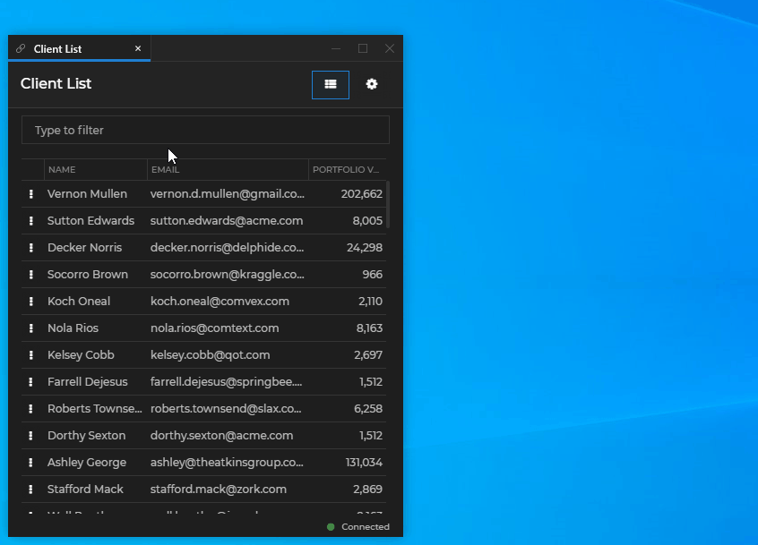
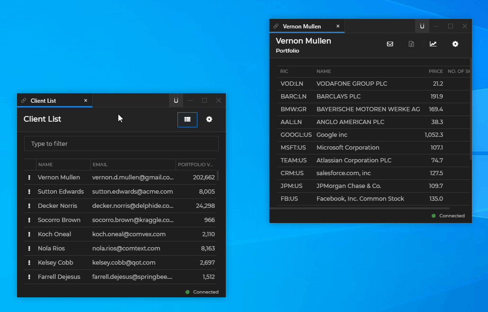
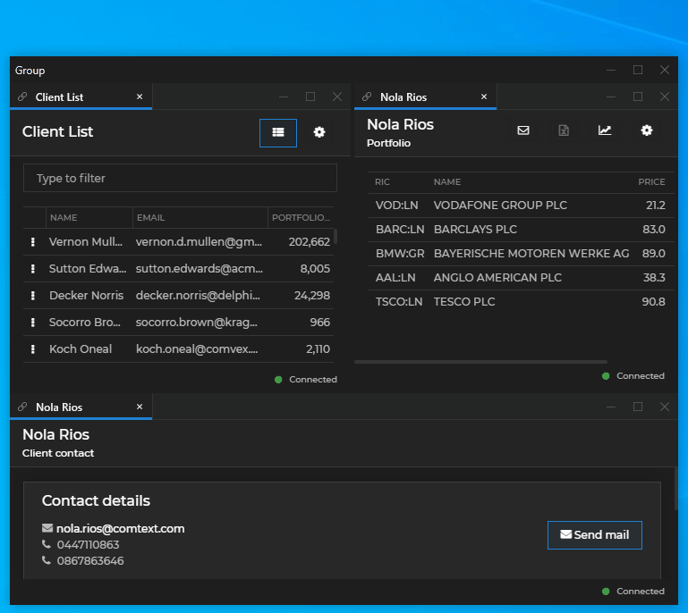
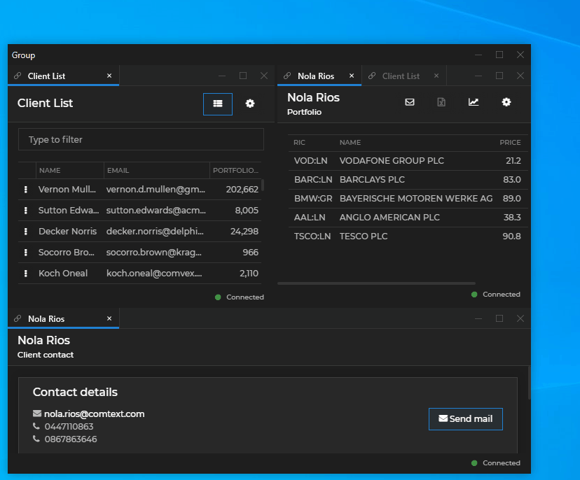
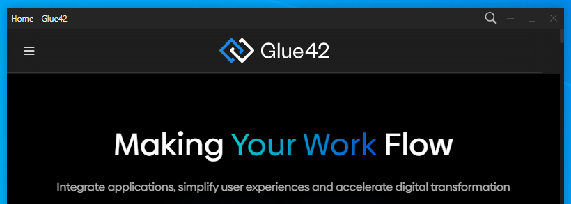
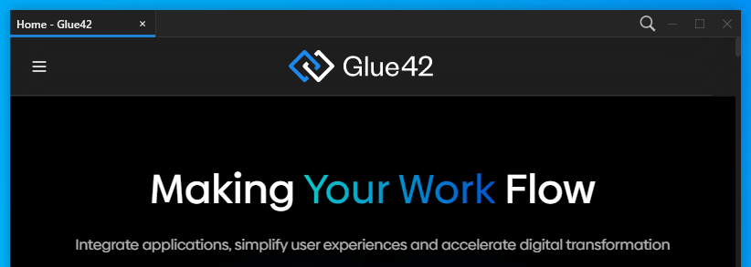

## Opening Windows

The Window Management API is accessible through the [`glue.windows`](../../../../reference/glue/latest/windows/index.html) object.

To open a new Glue42 Window, use the [`open()`](../../../../reference/glue/latest/windows/index.html#API-open) method:

```javascript
const name = "glue42-docs";
const url = "https://docs.glue42.com";
// Specify location for the new window.
const options = {
    top: 200,
    left: 200
};

const g42Window = await glue.windows.open(name, url, options);
```

The `name` and `url` parameters are required. The window `name` must be unique. The third parameter is an optional [`WindowCreateOptions`](../../../../reference/glue/latest/windows/index.html#WindowCreateOptions) object which specifies various settings for the new Glue42 Window - bounds, styles, mode, button settings and more.

*For all available settings when opening a new Glue42 Window, see the [Window Settings](#window_settings) section.*

### Handling the Browser window.open()

<glue42 name="addClass" class="colorSection" element="p" text="Available since Glue42 Enterprise 3.10">

A system configuration option is available for handling popup windows created with the native browser [`window.open()`](https://developer.mozilla.org/en-US/docs/Web/API/Window/open) call. Use the `"nativeWindowOpen"` property of the `"windows"` top-level key in the `system.json` file to control popup window behavior:

```json
{
    "windows": {
        "nativeWindowOpen": "browser"
    }
}
```

The possible values for the `"nativeWindowOpen"` property are:

| Property | Description |
|----------|-------------|
| `"window"` | Default. Windows created with `window.open()` will be opened as Glue42 Windows. |
| `"off"` | Opening windows with `window.open()` is disabled. |
| `"browser"` | Windows created with `window.open()` will be opened in the default browser. |

When popup windows are opened as Glue42 Windows on the same domain as the parent window, you can control them with the `Window` Web API:

```javascript
const newWindow = window.open("http://localhost:4242/clientlist/index.html");

newWindow.close();
```

### Opening PDF Files

<glue42 name="addClass" class="colorSection" element="p" text="Available since Glue42 Enterprise 3.11">

To open a PDF file in a Glue42 Window, use the [`open()`](../../../../reference/glue/latest/windows/index.html#API-open) method. Pass the URL to the PDF file and optionally specify parameters in the URL for opening the PDF file:

```javascript
// This will open the PDF file with the PDF toolbar turned off.
const PDF_URL = "https://url-to-pdf.com/file-name.pdf#toolbar=0";

await glue.windows.open("PDF File", PDF_URL);
```

To specify parameters in the URL, use the following template:

```cmd
<URL to PDF file>#<parameter>=<value>
```

To specify multiple parameters in the URL, use `&` to separate them:

```cmd
<URL to PDF file>#<parameter>=<value>&<parameter>=<value>&<parameter>=<value>
```

*Note that `#`, `&` and `=` are special characters which you must not use in parameter values because they can't be escaped.*

The following example will display page 3 of the PDF file, hide the PDF toolbar, set the zoom factor to 150% and scroll the page vertically and horizontally by 100px (pixels are relative to the zoom factor):

```javascript
const PDF_URL = "https://url-to-pdf.com/file-name.pdf#page=3&toolbar=0&zoom=150,100,100";

await glue.windows.open("PDF File", PDF_URL);
```

The following table lists all supported URL parameters for opening PDF files:

| Parameter | Description | Examples |
|-----------|-------------|----------|
| `page` | Specifies which page to display. Accepts an integer as a value. The first page of the document has a value of 1. | To open the PDF file to page 3, use `page=3`. |
| `toolbar` | Whether to enable or disable the PDF toolbar. Accepts 0 or 1 as values. | To hide the PDF toolbar, use `toolbar=0`. |
| `zoom` | Specifies the zoom factor and also the vertical and horizontal scroll position of the page in regard to the top left corner of the window. Accepts integer or floating point values. | To set the zoom factor to 150.5%, use `zoom=150.5`. To set the zoom factor to 120% and scroll the page 200px vertically and 100px horizontally, use `zoom=120,200,100`.
| `view` | Specifies the view mode of the page using values defined in the PDF language specification. See the possible values in the next table. Use the `page` parameter before `view`. | To fit the page in the window, use `view=Fit`. To fit the page vertically, use `view=FitV`. To fit the page horizontally and scroll it 200px vertically, use `view=FitH,200`. |

The following table lists the possible values for the `view` parameter:

| Value | Description | Example |
|-------|-------------|---------|
| `Fit` | Fits the entire page horizontally and vertically in the window. If the vertical and horizontal magnification factors are different, the smaller one will be used for fitting the page. In the other dimension the page will be centered. | `view=Fit` |
| `FitV` | Fits the page vertically in the window. | `view=FitV` |
| `FitH` | Fits the page horizontally in the window. | `view=FitH` |
| `FitV,<left>` | Fits the page vertically and scrolls it horizontally from the left edge of the window with the specified integer or floating point value. | `view=FitV,200` |
| `FitH,<top>` | Fits the page horizontally and scrolls it vertically from the top edge of the window with the specified integer or floating point value. | `view=FitH,200` |

## Runtime Configuration

To configure global Glue42 Windows settings at runtime, use the [`configure()`](../../../../reference/glue/latest/windows/index.html#API-configure) method:

```javascript
const config = {
    hideGroupCaption: true,
    showExtractButton: true
};

await glue.windows.configure(config);
```

The `configure()` method accepts a [`WindowsConfiguration`](../../../../reference/glue/latest/windows/index.html#WindowsConfiguration) object as a required argument which has the following properties:

| Property | Type | Description |
|----------|------|-------------|
| `hideGroupCaption` | `boolean` | Whether to show or hide the caption of Glue42 Window groups. |
| `showStickyButton` | `boolean` | Whether to show or hide the Sticky button. |
| `showExtractButton` | `boolean` | Whether to show or hide the Extract button. |
| `sticky` | `boolean` | Whether to allow Glue42 Windows to stick together and form groups. |

*For more details on configuring Glue42 Windows, see the [Configuration](../../../../developers/configuration/glue42-windows/index.html) section.*

## Finding Windows

All functions for finding Glue42 Windows return a [`GDWindow`](../../../../reference/glue/latest/windows/index.html#GDWindow) object (or a collection of such objects).

### Listing

To obtain a collection of all Glue42 Windows, use the [`list()`](../../../../reference/glue/latest/windows/index.html#API-list) method:

```javascript
const allG42Windows = glue.windows.list();
```

### Current Window

To get a reference to the current window, use the [`my()`](../../../../reference/glue/latest/windows/index.html#API-my) method:

```javascript
const currentWindow = glue.windows.my();
```

### By Name

To find a window by name, use the [`find()`](../../../../reference/glue/latest/windows/index.html#API-find) method:

```javascript
const name = "glue42-docs";
const g42Window = glue.windows.find(name);
```

### By ID

To find a window by ID, use the [`findById()`](../../../../reference/glue/latest/windows/index.html#API-findById) method:

```javascript
const ID = "2506_04";
const g42Window = glue.windows.findById(ID);
```

## Window Settings

Provide window settings per window by:

- using the app configuration settings:

```json
{
    "type": "window",
    "name": "glue42-docs",
    "details": {
        "url": "https://docs.glue42.com",
        "height": 640,
        "width": 560,
        "left": 100,
        "top": 100,
        "mode": "flat",
        "title": "Glue42 Documentation",
        "backgroundColor": "#1a2b30",
        "focus": false
    }
}
```

- passing a [`WindowCreateOptions`](../../../../reference/glue/latest/windows/index.html#WindowCreateOptions) object to the [`open()`](../../../../reference/glue/latest/windows/index.html#API-open) method:

```javascript
const name = "glue42-docs";
const url = "https://docs.glue42.com";
// Specify location for the new window.
const options = {
    height: 640,
    width: 560,
    left: 100,
    top: 100,
    mode: "flat",
    title: "Glue42 Documentation",
    backgroundColor: "#1a2b30",
    focus: false
};

const g42Window = await glue.windows.open(name, url, options);
```

All available window settings that can be passed via configuration or at runtime are described in the [app configuration schema](../../../../assets/configuration/application.json) under the `"windows"` key.

### Mode

Three window modes are supported for web apps - flat, tab and HTML. Specify the window mode in the [`WindowCreateOptions`](../../../../reference/glue/latest/windows/index.html#WindowCreateOptions) object when opening a new Glue42 Window:

```javascript
const name = "Glue42 Docs";
const url = "https://docs.glue42.com";
// Specify window mode.
const options = {
    mode: "tab"
};

const g42Window = await glue.windows.open(name, url, options);
```

### Relative Position

Position a new Glue42 Window relatively to an already existing Glue42 Window by providing the ID of the existing window and the relative direction:

```javascript
const clientsWindow = glue.windows.find("clientlist");

const name = "clientportfolio";
const url = "http://localhost:22080/clientportfolio/index.html";
// Provide the existing window ID and the relative direction.
const options = {
    relativeTo: clientsWindow.id,
    relativeDirection: "right"
};

await glue.windows.open(name, url, options);
```

And the result:



### Taskbar Icon

To specify an icon for the Glue42 Window, provide an image as a Base64 encoded string in the [`WindowCreateOptions`](../../../../reference/glue/latest/windows/index.html#WindowCreateOptions) object:

```javascript
const name = "Glue42 Docs";
const url = "https://docs.glue42.com";
// Specify taskbar icon.
const options = {
    base64ImageSource: "R0lGODlhPQBEAPeoAJosM//AwO/AwH..."
};

const g42Window = await glue.windows.open(name, url, options);
```

To get the taskbar icon of the current window:

```javascript
const myWindow = glue.windows.my();
const icon = await myWindow.getIcon();
```

To change the taskbar icon of the current window:

```javascript
const myWindow = glue.windows.my();
// Image encoded as a Base64 string.
const newIcon = "R0lGODlhPQBEAPeoAJosM//AwO/AwH...";

await myWindow.setIcon(newIcon);
```

### Downloads

To define the window behavior when downloading files, use the `donwloadSettings` property of the [`WindowCreateOptions`](../../../../reference/glue/latest/windows/index.html#WindowCreateOptions) object. It accepts a [`DownloadSettings`](../../../../reference/glue/latest/windows/index.html#DownloadSettings) object as a value:

```javascript
const name = "Glue42 Docs - test app";
const url = "https://docs.glue42.com/assets/js-test-app.zip";
// Specify window download behavior.
const options = {
    downloadSettings: {
        autoSave: true,
        autoOpenDownload: true
    }
};

const g42Window = await glue.windows.open(name, url, options);
```

## Window Operations

The Window Management API enables you to control a [`GDWindow`](../../../../reference/glue/latest/windows/index.html#GDWindow) instance programmatically. Access or change various window settings using the provided properties and methods.

### Stickiness

The Glue42 Window stickiness enables users to easily organize the windows on their desktop in visual groups. Window stickiness is enabled by default, but can be controlled programmatically and through [app configuration](../../../../developers/configuration/application/index.html).

<glue42 name="addClass" class="colorSection" element="p" text="Available since Glue42 Enterprise 3.11">

The [Sticky button](../../../../developers/configuration/system/index.html#window_settings-sticky_button) (disabled by default) in the window header allows the users to toggle the stickiness of individual windows from the UI:



*For details on how to enable the Sticky button through system configuration, see the [Developers > Configuration > System](../../../../developers/configuration/system/index.html#window_settings-sticky_button) section.*

To set the stickiness or the visibility of the Sticky button programmatically on a global level, use the [`configure()`](../../../../reference/glue/latest/windows/index.html#API-configure) method. Pass a [`WindowsConfiguration`](../../../../reference/glue/latest/windows/index.html#WindowsConfiguration) object with a `sticky` and `showStickyButton` properties set to Boolean values:

```javascript
// Turn off the stickiness and hide the Sticky button globally.
const windowsConfig = {
    sticky: false,
    showStickyButton: false
};

await glue.windows.configure(windowsConfig);
```

To set the stickiness of a Glue42 Window instance, use the [`setSticky()`](../../../../reference/glue/latest/windows/index.html#GDWindow-setSticky) method and pass a Boolean value as an argument:

```javascript
const myWindow = glue.windows.my();

// Turn off the stickiness for the current window.
await myWindow.setSticky(false);
```

To check whether the window is sticky, use the [`isSticky`](../../../../reference/glue/latest/windows/index.html#GDWindow-isSticky) property of a [`GDWindow`](../../../../reference/glue/latest/windows/index.html#GDWindow) instance:

```javascript
// Returns a Boolean value.
const isSticky = myWindow.isSticky;
```

### Title

To get the title of a Glue42 Window, use the [`title`](../../../../reference/glue/latest/windows/index.html#GDWindow-title) property or the [`getTitle()`](../../../../reference/glue/latest/windows/index.html#GDWindow-getTitle) method of a [`GDWindow`](../../../../reference/glue/latest/windows/index.html#GDWindow) instance:

```javascript
const title = myWindow.title;
// or
const winTitle = await myWindow.getTitle();
```

To set the title of a window, use the [`setTitle()`](../../../../reference/glue/latest/windows/index.html#GDWindow-setTitle) method:

```javascript
await myWindow.setTitle("New Title");
```

### Bounds

The bounds of a window describe its position (top and left coordinates) and size (width and height) on the screen.

To get the bounds of a Glue42 Window, use the [`bounds`](../../../../reference/glue/latest/windows/index.html#GDWindow-bounds) property or the [`getBounds()`](../../../../reference/glue/latest/windows/index.html#GDWindow-getBounds) method of a [`GDWindow`](../../../../reference/glue/latest/windows/index.html#GDWindow) instance:

```javascript
const bounds = myWindow.bounds;
// or
const winBounds = await myWindow.getBounds();
```

To move or resize a Glue42 Window, use the [`moveTo()`](../../../../reference/glue/latest/windows/index.html#GDWindow-moveTo), [`resizeTo()`](../../../../reference/glue/latest/windows/index.html#GDWindow-resizeTo) or [`moveResize()`](../../../../reference/glue/latest/windows/index.html#GDWindow-moveResize) methods.

To move a window:

```javascript
// Top and left coordinates (in pixels) for the top-left window corner.
await myWindow.moveTo(200, 300);
```

To resize a window:

```javascript
// Width and height (in pixels) for the window.
await myWindow.resizeTo(300, 400);
```

To move and/or resize a window:

```javascript
// New bounds for the window. All properties are optional.
const bounds = {
    top: 200,
    left: 300,
    width: 300,
    height: 400
};

await myWindow.moveResize(bounds);
```

### Channel

<glue42 name="addClass" class="colorSection" element="p" text="Available since Glue42 Enterprise 3.16">

To get the name of the [Channel](../../../data-sharing-between-apps/channels/overview/index.html) to which the window is currently joined, use the [`getChannel()`](../../../../reference/glue/latest/windows/index.html#GDWindow-getChannel) method of a [`GDWindow`](../../../../reference/glue/latest/windows/index.html#GDWindow) instance:

```javascript
const channelName = await myWindow.getChannel();

if (channelName) {
    // Use the Channels API to manipulate the Channel context.
};
```

Once you have the name of the Channel to which the window is currently joined, you can use the [Channels API](../../../../reference/glue/latest/channels/index.html) to manipulate the Channel context.

### Placement

<glue42 name="addClass" class="colorSection" element="p" text="Available since Glue42 Enterprise 3.11">

The placement feature of the Window Management API provides a way for a Glue42 Window to occupy a specific position on the screen. This position can be set only once - initially, on window creation, or can be kept throughout the entire lifetime of the window. The placement feature solves the problem of reacting adequately to changes of the screen resolution or the size of the app virtualization window hosting the Glue42 Window, ensuring that the Glue42 Window always stays at the desired screen position and with the desired dimensions. This is especially useful if you are developing a toolbar or a notifications panel that must always stay at the same position on the screen.

Window placement is controlled through the [app configuration](../../../../developers/configuration/application/index.html#app_configuration-window) (see the `placement` property in the [app configuration](../../../../assets/configuration/application.json) schema) and programmatically.

To get the current placement settings for a window, use the [`placementSettings`](../../../../reference/glue/latest/windows/index.html#GDWindow-placementSettings) property of a [`GDWindow`](../../../../reference/glue/latest/windows/index.html#GDWindow) instance:

```javascript
const placementSettings = myWindow.placementSettings;
```

To place a window at a specific position on the screen, use the [`place()`](../../../../reference/glue/latest/windows/index.html#GDWindow-place) method of a [`GDWindow`](../../../../reference/glue/latest/windows/index.html#GDWindow) instance and pass a [`PlacementSettings`](../../../../reference/glue/latest/windows/index.html#PlacementSettings) object as an argument.

The following example shows how to place the window at the top of the screen, stretched horizontally (`horizontalAlignment` defaults to `"stretch"` when `verticalAlignment` is set, see the Placement Settings table below) and with height set to 40 pixels. The `snapped` property is set to `true` in order to instruct [**Glue42 Enterprise**](https://glue42.com/enterprise/) that this Glue42 Window must always occupy that position, even when the screen resolution changes or the app virtualization window hosting it is resized:

```javascript
const settings = {
    snapped: true,
    verticalAlignment: "top",
    height: 40
};

await myWindow.place(settings);
```

*Note that the settings specified in the `place()` method won't be merged with the existing placement settings (if any) but will entirely overwrite them. If `snapped` is set to `true`, the `place()` method will also overwrite the settings saved in the App Default Layout (see [Layouts](../../layouts/overview/index.html)).*

The following table describes the properties of the [`PlacementSettings`](../../../../reference/glue/latest/windows/index.html#PlacementSettings) object:

| Property | Accepts | Description | Required |
|----------|---------|-------------|----------|
| `snapped` | `boolean` | If `true`, the Glue42 Window will remain snapped to the specified screen position even in cases of resolution changes, window visibility changes or when the app virtualization window hosting the Glue42 Window has been resized. However, this doesn't include any API calls or manual user interaction which affect the window placement or bounds. If `false`, the window will be positioned at the specified screen location only once when created. | Yes |
| `verticalAlignment` | `"top"` \| `"bottom"` \| `"center"` \| `"stretch"` | Defines a vertical alignment configuration. If `horizontalAlignment` is set, then `verticalAlignment` will default to `"stretch"`. | No |
| `horizontalAlignment` | `"left"` \| `"right"` \| `"center"` \| `"stretch"` | Defines a horizontal alignment configuration. If `verticalAlignment` is set, then `horizontalAlignment` will default to `"stretch"`. | No |
| `margin` | `string` | Sets the margin for all four sides of the window. | No |
| `width` | `number` \| `string` | Defines the window width. Use a `number` to define the width in pixels. Use a `string` to define the width in pixels or percentage of the screen width - e.g., `"10px"` or `"10%"`. | No |
| `height` | `number` \| `string` | Defines the window height. Use a `number` to define the height in pixels. Use a `string` to define the height in pixels or percentage of the screen width - e.g., `"10px"` or `"10%"`. | No |
| `display` | [`Display`](../../../../reference/glue/latest/displays/index.html#Display) | Defines the current display. | No |

### Visibility

To check whether a Glue42 Window is visible, use the [`isVisible()`](../../../../reference/glue/latest/windows/index.html#GDWindow-isVisible) property of a [`GDWindow`](../../../../reference/glue/latest/windows/index.html#GDWindow) instance:

```javascript
const isWindowVisible = myWindow.isVisible;
```

To change the window visibility, use the [`show()`](../../../../reference/glue/latest/windows/index.html#GDWindow-show), [`hide()`](../../../../reference/glue/latest/windows/index.html#GDWindow-hide) or [`setVisible()`](../../../../reference/glue/latest/windows/index.html#GDWindow-setVisible) methods of a [`GDWindow`](../../../../reference/glue/latest/windows/index.html#GDWindow) instance.

To hide a window:

```javascript
await myWindow.hide();
```

To make a window visible:

```javascript
await myWindow.show();
```

To change the window visibility:

```javascript
// Hide the window.
await myWindow.setVisible(false);

// Show the window.
await myWindow.setVisible(true);
```

### State

To get the Glue42 Window state (normal, maximized or minimized), use the [`state`](../../../../reference/glue/latest/windows/index.html#GDWindow-state) property of a [`GDWindow`](../../../../reference/glue/latest/windows/index.html#GDWindow) instance:

```javascript
const windowState = myWindow.state;

switch (windowState) {
    case "normal":
        // ...
        break;
    case "maximized":
        // ...
        break;
    case "minimized":
        // ...
        break;
};
```

Use the [`maximize()`](../../../../reference/glue/latest/windows/index.html#GDWindow-maximize), [`minimize()`](../../../../reference/glue/latest/windows/index.html#GDWindow-minimize) and [`restore()`](../../../../reference/glue/latest/windows/index.html#GDWindow-restore) methods to change the window state.

To maximize a window:

```javascript
await myWindow.maximize();
```

To minimize a window:

```javascript
await myWindow.minimize();
```

To restore a minimized or maximized window:

```javascript
await myWindow.restore();
```

To check whether the window is in a collapsed state, use the [`isCollapsed`](../../../../reference/glue/latest/windows/index.html#GDWindow-isCollapsed) property:

```javascript
const isWindowCollapsed = myWindow.isCollapsed;
```

Use the [`collapse()`](../../../../reference/glue/latest/windows/index.html#GDWindow-collapse) and [`expand()`](../../../../reference/glue/latest/windows/index.html#GDWindow-expand) methods to collapse and expand a window:

```javascript
// Collapse a window.
await myWindow.collapse();

// Expand a window.
await myWindow.expand();
```

### Focus

To check whether a Glue42 Window is on focus, use the [`isFocused`](../../../../reference/glue/latest/windows/index.html#GDWindow-isFocused) property of a [`GDWindow`](../../../../reference/glue/latest/windows/index.html#GDWindow) instance:

```javascript
const isWindowFocused = myWindow.isFocused;
```

To bring a window on focus, use the  [`focus()`](../../../../reference/glue/latest/windows/index.html#GDWindow-focus) method:

```javascript
await myWindow.focus();
```

### Zoom

To get the zoom factor of a Glue42 Window, use the [`zoomFactor`](../../../../reference/glue/latest/windows/index.html#GDWindow-isFocused) property of a [`GDWindow`](../../../../reference/glue/latest/windows/index.html#GDWindow) instance:

```javascript
const windowZoomFactor = myWindow.zoomFactor;
```

Use the [`zoomIn()`](../../../../reference/glue/latest/windows/index.html#GDWindow-zoomIn), [`zoomOut()`](../../../../reference/glue/latest/windows/index.html#GDWindow-zoomOut) and [`setZoomFactor()`](../../../../reference/glue/latest/windows/index.html#GDWindow-zoomOut) methods to change the window zoom factor.

To increment or decrement the zoom factor by one step, as defined in the [system configuration](../../../glue42-platform-features/index.html#zooming-configuration):

```javascript
// Zoom in by one step.
await myWindow.zoomIn();

// Zoom out by one step.
await myWindow.zoomOut();
```

To set the zoom factor:

```javascript
// The specified zoom factor must be a valid factor value
// defined in the Glue42 Enterprise system configuration.
await myWindow.setZoomFactor(125);
```

### Print

<glue42 name="addClass" class="colorSection" element="p" text="Available since Glue42 Enterprise 3.11">

To print a web page opened in a Glue42 Window, use the [`print()`](../../../../reference/glue/latest/windows/index.html#GDWindow-print) method. It accepts a [`PrintOptions`](../../../../reference/glue/latest/windows/index.html#PrintOptions) object as an optional parameter:

```javascript
const printOptions = {
    silent: true,
    landscape: true,
    copies: 2,
    pageSize: "A4"
};

await myWindow.print(printOptions);
```

To print a web page as a PDF file, use the [`printToPDF()`](../../../../reference/glue/latest/windows/index.html#GDWindow-printToPDF) method. It accepts a [`PrintToPDFOptions`](../../../../reference/glue/latest/windows/index.html#PrintToPDFOptions) object as an optional parameter:

```javascript
const printOptions = {
    silent: true,
    autoSave: true,
    copies: 2,
    pageRanges: [{ from: 0, to: 10 }, { from: 12, to: 15 }]
    pageSize: "A4"
};

await myWindow.printToPDF(printOptions);
```

*For details on how to configure the default printing options on system and app level, see the [Printing](../../../../developers/configuration/system/index.html#window_settings-printing) section.*

### Download

<glue42 name="addClass" class="colorSection" element="p" text="Available since Glue42 Enterprise 3.13">

To download a file, use the [`download()`](../../../../reference/glue/latest/windows/index.html#GDWindow-download) method. Pass a URL to the file to download and an optional [`DownloadOptions`](../../../../reference/glue/latest/windows/index.html#DownloadOptions) object:

```javascript
const url = "https://example.com/logo.png";
const options = {
    autoOpenDownload: true,
    // The file extension is taken from the downloaded file.
    name: "my-logo"
};

const { path, size, url } = await myWindow.download(url, options);

console.log(`Download path: ${path}, File size: ${size}, URL: ${url}`);
```

The method returns a [`DownloadResult`](../../../../reference/glue/latest/windows/index.html#DownloadResult) object containing the path to the downloaded file, the file size and the download URL.

*For details on how to configure the window download behavior at runtime, see the [Window Settings](#window_settings-downloads) section.*

### Close

To close a Glue42 Window, use the [`close()`](../../../../reference/glue/latest/windows/index.html#GDWindow-close) method of a [`GDWindow`](../../../../reference/glue/latest/windows/index.html#GDWindow) instance:

```javascript
await myWindow.close();
```

## Context

Each Glue42 Window has a dedicated [context](../../../data-sharing-between-apps/shared-contexts/javascript/index.html). The window context is a JavaScript object which may contain any information regarding the window instance in the form of key/value pairs.

Contexts can be set/passed initially on window creation and updated at runtime. Context changes can be tracked by subscribing to an event which fires when the window context has been updated (see [Window Events](#window_events)).

*Note that saving large volumes of custom data as window context (e.g., thousands of lines of table data) can lead to significant delays. A user usually has several (in some cases - many) running apps and/or Workspaces (which can also contain many apps) and if one or more of the apps saves large amounts of context data, this will significantly slow down the saving process (e.g., on shutdown or when saving a Layout). Saving custom context works best with smaller amounts of data. If your app needs to save large amounts of data, you have to think about how to design this process better - for instance, you may store IDs, indices, etc., as context data, save the actual data to a database and when you restore the app, fetch the data using the data IDs saved as window context.*

### Get

To get the context of a Glue42 Window, use the [`context`](../../../../reference/glue/latest/windows/index.html#GDWindow-context) property or the [`getContext()`](../../../../reference/glue/latest/windows/index.html#GDWindow-getContext) method of a [`GDWindow`](../../../../reference/glue/latest/windows/index.html#GDWindow) instance:

```javascript
const context = myWindow.context;
// or
const winContext = await myWindow.getContext();
```

### Update

To update the context of a Glue42 Window, use the [`updateContext()`](../../../../reference/glue/latest/windows/index.html#GDWindow-updateContext) method of a [`GDWindow`](../../../../reference/glue/latest/windows/index.html#GDWindow) instance:

```javascript
const newContext = { glue: 4242 };

await myWindow.udpateContext(newContext);
```

This method will update the current context object with the provided properties and values, adding any new properties and updating the values of existing ones.

### Set

To open a Glue42 Window with initially set context, use the `context` property of the [`WindowCreateOptions`](../../../../reference/glue/latest/windows/index.html#WindowCreateOptions) object:

```javascript
const name = "Glue42 Docs";
const url = "https://docs.glue42.com";
// Specify window context.
const options = {
    context: { glue: 42 }
};

const g42Window = await glue.windows.open(name, url, options);
```

To replace the current window context, use the [`setContext()`](../../../../reference/glue/latest/windows/index.html#WebWindow-setContext) method of a [`GDWindow`](../../../../reference/glue/latest/windows/index.html#GDWindow) instance:

```javascript
const newContext = { tick: 42 };
const winContext = await myWindow.setContext(newContext);
```

This method will completely overwrite the existing context object, replacing its current value with the specified one.

## Window Events

Methods for tracking Glue42 Window events are available at top-level of the Window Management API and on the [`GDWindow`](../../../../reference/glue/latest/windows/index.html#GDWindow) instance. Below are described some of the available window events with examples of how to handle them.

*Most of the window event methods return an unsubscribe function which you can use to stop tracking the respective event.*

### Window Added or Removed

To track the opening and closing of Glue42 Windows, use the [`onWindowAdded()`](../../../../reference/glue/latest/windows/index.html#API-onWindowAdded) and [`onWindowRemoved()`](../../../../reference/glue/latest/windows/index.html#API-onWindowRemoved) methods of the Window Management API and pass handlers for the respective events:

```javascript
const handlers = {
    onAdded: (g42window) => {
        console.log(`Window added: ${g42window.name}`);
    },

    onRemoved: (g42window) => {
        console.log(`Window removed: ${g42window.name}`);
    }
};

glue.windows.onWindowAdded(handlers.onAdded);
glue.windows.onWindowRemoved(handlers.onRemoved);
```

### Bounds Change

To track Glue42 Window bounds changes, use the [`onBoundsChanged()`](../../../../reference/glue/latest/windows/index.html#GDWindow-onBoundsChanged) method of a [`GDWindow`](../../../../reference/glue/latest/windows/index.html#GDWindow) instance and pass an event handler:

```javascript
const boundsChangedHandler = (g42window) => {
    console.log(`Window bounds: ${JSON.stringify(g42window.bounds)}`);
};

myWindow.onBoundsChanged(boundsChangedHandler);
```

Use this event to get notifications every time the position or the size of the window changes.

### Placement Change

To track changes of the Glue42 Window placement settings, use the [`onPlacementSettingsChanged()`](../../../../reference/glue/latest/windows/index.html#GDWindow-onPlacementSettingsChanged) method of a [`GDWindow`](../../../../reference/glue/latest/windows/index.html#GDWindow) instance and pass an event handler:

```javascript
const placementChangedHandler = (g42window) => {
    console.log(`Window placement settings: ${JSON.stringify(g42window.placementSettings)}`);
};

myWindow.onPlacementSettingsChanged(placementChangedHandler);
```

*Note that the `onPlacementSettingsChanged()` method notifies about runtime updates of the window placement settings, not the window bounds. To track changes of the window bounds (e.g., when the user resizes or moves the window, or when the window is moved/resized programmatically) use the [`onBoundsChanged()`](../../../../reference/glue/latest/windows/index.html#GDWindow-onBoundsChanged) method.*

### Context Update

To track updates of the context of a Glue42 Window, use the [`onContextUpdated()`](../../../../reference/glue/latest/windows/index.html#GDWindow-onContextUpdated) method of a [`GDWindow`](../../../../reference/glue/latest/windows/index.html#GDWindow) instance and pass an event handler:

```javascript
const contextUpdatedHandler = (context, g42window) => {
    console.log(`The context of "${g42window.name}" has been updated: ${JSON.stringify(context)}`);
};

myWindow.onContextUpdated(contextUpdatedHandler);
```

### Close and Refresh

To track when a Glue42 Window is about to be refreshed or closed, use its [`onClosing()`](../../../../reference/glue/latest/windows/index.html#GDWindow-onClosing) and [`onRefreshing()`](../../../../reference/glue/latest/windows/index.html#GDWindow-onRefreshing) methods. The [`onRefreshing()`](../../../../reference/glue/latest/windows/index.html#GDWindow-onRefreshing) method can also be used to prevent page refresh if necessary.

The close and refresh handlers can be enabled/disabled globally through the system configuration of [**Glue42 Enterprise**](https://glue42.com/enterprise/) or individually for each window in its respective app configuration file. You can also specify a timeout in milliseconds for their execution.

#### Handlers Configuration

To configure the close and refresh handlers globally for all windows, go to the `system.json` file located in `%LocalAppData%\Tick42\GlueDesktop\config` and edit the `refresheHandlers` and `closeHandlers` properties under the `windows` top-level key:

```json
{
    "windows": {
        "refreshHandlers": {
            "enabled": true,
            "timeout": 2000
        },
        "closeHandlers": {
            "enabled": true,
            "timeout": 2000
        }
    }
}
```

To configure close and refresh handlers only for specific windows, modify the `details` property in each respective app configuration file:

```json
{
    "details": {
        "refreshHandlers": {
            "enabled": false,
            "timeout": 2000
        },
        "closeHandlers": {
            "enabled": true,
            "timeout": 2000
        }
    }
}
```

#### Window Close Handler

The [`onClosing()`](../../../../reference/glue/latest/windows/index.html#GDWindow-onClosing) method allows you to execute code before the window is closed. The event handler can be asynchronous and will be awaited up to the configured timeout:

```javascript
const closeHandler = async () => {
    await asyncOperation();
};

myWindow.onClosing(closeHandler);
```

#### Window Refresh Handler

The [`onRefreshing()`](../../../../reference/glue/latest/windows/index.html#GDWindow-onRefreshing) method allows you to execute code before the window is refreshed. The event handler can be asynchronous and will be awaited up to the configured timeout:

```javascript
const refreshHandler = async () => {
    await asyncOperation();
};

myWindow.onRefreshing(refreshHandler);
```

#### Preventing Page Refresh

<glue42 name="addClass" class="colorSection" element="p" text="Available since Glue42 Enterprise 3.9">

To prevent page refresh, use the `prevent()` function that is passed as an argument to the [`onRefreshing()`](../../../../reference/glue/latest/windows/index.html#GDWindow-onRefreshing) handler:

```javascript
const refreshHandler = (prevent) => {
    const inputField = document.getElementById("input-field");
    const shouldNotRefresh = inputField.value !== "" ? true : false;

    if (shouldNotRefresh) {
        prevent();
    };
};

myWindow.onRefreshing(refreshHandler);
```

### Navigating

<glue42 name="addClass" class="colorSection" element="p" text="Available since Glue42 Enterprise 3.16">

To get notified when a Glue42 Window is about to navigate to a new address, use its [`onNavigating()`](../../../../reference/glue/latest/windows/index.html#GDWindow-onNavigating) method. Pass a handler for the event which will receive as an argument an object containing the new address in its `newUrl` property:

```javascript
const navigationHandler = (info) => {
    console.log(`Navigating to: ${info.newUrl}`);
};

myWindow.onNavigating(navigationHandler);
```

## Window Groups

Glue42 Windows can be snapped together. One or more windows stuck together form a [`Group`](../../../../reference/glue/latest/windows/index.html#Group).
The Window Management API offers methods for managing Glue42 Window groups. The [Groups API](../../../../reference/glue/latest/windows/index.html#GroupsAPI) is accessible through the `glue.windows.groups` object.

### Finding Groups

#### Listing

To get a collection of all window groups, use the [`list()`](../../../../reference/glue/latest/windows/index.html#GroupsAPI-list) method:

```javascript
const allGroups = glue.windows.groups.list();
```

#### Current Group

To get the group of the current window, use the [`group`](../../../../reference/glue/latest/windows/index.html#GDWindow-group) property of a [`GDWindow`](../../../../reference/glue/latest/windows/index.html#GDWindow) instance or the [`my`](../../../../reference/glue/latest/windows/index.html#GroupsAPI-my) property of the Groups API:

```javascript
const myGroup = myWindow.group;
// or
const group = glue.windows.groups.my;
```

#### By Window

To find a Glue42 Window group by a window ID or a [`GDWindow`](../../../../reference/glue/latest/windows/index.html#GDWindow) object, use the [`findGroupByWindow()`](../../../../reference/glue/latest/windows/index.html#GroupsAPI-findGroupByWindow) method:

```javascript
const g42window = glue.windows.find("clientlist");
const windowID = g42window.id;

const group = glue.windows.groups.findGroupByWindow(windowID);
// or
const winGroup = glue.windows.groups.findGroupByWindow(g42window);
```

### Group Operations

#### Title

To get the title of a Glue42 Window group, use the [`getTitle()`](../../../../reference/glue/latest/windows/index.html#Group-getTitle) method of a [`Group`](../../../../reference/glue/latest/windows/index.html#Group) instance:

```javascript
const groupTitle = await myGroup.getTitle();
```

To set the title of a window group, use the [`setTitle()`](../../../../reference/glue/latest/windows/index.html#Group-setTitle) method of a [`Group`](../../../../reference/glue/latest/windows/index.html#Group) instance:

```javascript
await myGroup.setTitle("New Title");
```

#### State

To maximize a Glue42 Window group, use the [`maximize()`](../../../../reference/glue/latest/windows/index.html#Group-maximize) method of a [`Group`](../../../../reference/glue/latest/windows/index.html#Group) instance:

```javascript
myGroup.maximize();
```

To restore a window group, use the [`restore()`](../../../../reference/glue/latest/windows/index.html#Group-restore) method of a [`Group`](../../../../reference/glue/latest/windows/index.html#Group) instance:

```javascript
myGroup.restore();
```

#### Group Header

To check whether the header of a Glue42 Window group is visible, use the [`isHeaderVisible`](../../../../reference/glue/latest/windows/index.html#Group-isHeaderVisible) property of a [`Group`](../../../../reference/glue/latest/windows/index.html#Group) instance:

```javascript
const isGroupHeaderVisible = myGroup.isHeaderVisible;
```

To hide the header of a window group, use the [`hideHeader()`](../../../../reference/glue/latest/windows/index.html#Group-hideHeader) method of a [`Group`](../../../../reference/glue/latest/windows/index.html#Group) instance:

```javascript
await myGroup.hideHeader();
```

To hide the header of a window group, use the [`showHeader()`](../../../../reference/glue/latest/windows/index.html#Group-showHeader) method of a [`Group`](../../../../reference/glue/latest/windows/index.html#Group) instance:

```javascript
await myGroup.showHeader();
```

#### Finding Windows in a Group

To get a collection of all Glue42 Windows participating in a Glue42 Window group, use the [`windows`](../../../../reference/glue/latest/windows/index.html#Group-windows) property of a [`Group`](../../../../reference/glue/latest/windows/index.html#Group) instance:

```javascript
const allGroupWindows = myGroup.windows;
```

To find a window in a Glue42 Window group by window ID, use the [`find()`](../../../../reference/glue/latest/windows/index.html#Group-find) method of a [`Group`](../../../../reference/glue/latest/windows/index.html#Group) instance:

```javascript
const windowID = "25406_2";
const g42window = myGroup.find(windowID);
```

#### Ungrouping Windows

<glue42 name="addClass" class="colorSection" element="p" text="Available since Glue42 Enterprise 3.11">

To extract a window from a Glue42 Window group, use the [`ungroup()`](../../../../reference/glue/latest/windows/index.html#GDWindow-ungroup) method of a [`GDWindow`](../../../../reference/glue/latest/windows/index.html#GDWindow) instance and pass an optional [`UngroupOptions`](../../../../reference/glue/latest/windows/index.html#UngroupOptions) object as an argument:

```javascript
const options = {
    bounds: {
        width: 400,
        height: 300
    },
    focus: true
};

const g42window = await myWindow.ungroup(options);
```

If you don't specify any options for `ungroup()`, the window will be moved up and to the right by default after being ungrouped:



Using the `ungroup()` method on a tab window will extract the entire tab group:



### Window Neighbors

To get the neighbors of a window in a Glue42 Window group, use the [`topNeighbours`](../../../../reference/glue/latest/windows/index.html#GDWindow-topNeighbours), [`leftNeighbours`](../../../../reference/glue/latest/windows/index.html#GDWindow-leftNeighbours), [`rightNeighbours`](../../../../reference/glue/latest/windows/index.html#GDWindow-rightNeighbours) and [`bottomNeighbours`](../../../../reference/glue/latest/windows/index.html#GDWindow-bottomNeighbours) properties of a [`GDWindow`](../../../../reference/glue/latest/windows/index.html#GDWindow) instance:

```javascript
const topNeighbours = myWindow.topNeighbours;
const leftNeighbours = myWindow.leftNeighbours;
const rightNeighbours = myWindow.rightNeighbours;
const bottomNeighbours = myWindow.bottomNeighbours;
```

*An empty collection will be returned if the window doesn't have any neighbor windows in the respective direction.*

### Group Events

The Groups API offers several methods for tracking group events.

*The group event methods return an unsubscribe function which you can use to stop tracking the respective event.*

#### Window Added or Removed

To track adding or removing windows to a Glue42 Window group, use the [`onWindowAdded()`](../../../../reference/glue/latest/windows/index.html#Group-onWindowAdded) and [`onWindowRemoved()`](../../../../reference/glue/latest/windows/index.html#Group-onWindowRemoved) methods of a [`Group`](../../../../reference/glue/latest/windows/index.html#Group) instance and pass handlers for the respective events:

```javascript
const handlers = {
    onAdded: (g42group, g42window) => {
        console.log(`Window "${g42window.name}" added to group with ID: ${g42group.id}`);
    },

    onRemoved: (g42group) => {
        console.log(`Window removed from group with ID: ${g42group.id}`);
    }
};

myGroup.onWindowAdded(handlers.onAdded);
myGroup.onWindowRemoved(handlers.onRemoved);
```

#### Header Visibility Changed

To track changes in the visibility of a Glue42 Window header, use the [`onHeaderVisibilityChanged()`](../../../../reference/glue/latest/windows/index.html#Group-onHeaderVisibilityChanged) method of a [`Group`](../../../../reference/glue/latest/windows/index.html#Group) instance and pass an event handler:

```javascript
const handler = (g42group) => {
    console.log(`Header visibility of group with ID ${g42group.id} has changed.`)
};

myGroup.onHeaderVisibilityChanged(handler);
```

## Tab Windows

To open a Glue42 Window as a tab window, set the `mode` property of the [`WindowCreateOptions`](../../../../reference/glue/latest/windows/index.html#WindowCreateOptions) object to `"tab"`:

```javascript
const name = "glue42-docs";
const url = "https://docs.glue42.com";
// Set `mode` to "tab".
const options = {
    mode: "tab"
};

const g42Window = await glue.windows.open(name, url, options);
```

### Tab Group

Use the `tabGroupId` property of the [`WindowCreateOptions`](../../../../reference/glue/latest/windows/index.html#WindowCreateOptions) object to specify a tab group for the tab window. Tab windows with identical `tabGroupId` value will be opened in the same tab group:

```javascript
const name = "glue42-docs";
const url = "https://docs.glue42.com";
// Specify a tab group.
const options = {
    tabGroupId: "my-tab-group"
};

const g42Window = await glue.windows.open(name, url, options);
```

Use the `tabGroupId` property of a [`GDWindow`](../../../../reference/glue/latest/windows/index.html#GDWindow) instance to retrieve the tab group ID of a window:

```javascript
const tabGroup = myWindow.tabGroupId;
```

### Attaching and Detaching Tabs

To attach a tab to an existing tab window, use the [`attachTab()`](../../../../reference/glue/latest/windows/index.html#GDWindow-attachTab) method of a [`GDWindow`](../../../../reference/glue/latest/windows/index.html#GDWindow) instance. Pass a window ID or a `GDWindow` object as a first argument:

```javascript
const name = "glue42-docs";
const url = "https://docs.glue42.com";
const options = {
    mode: "tab"
};

const newTab = await glue.windows.open(name, url, options);

// Attach a new tab window to an existing tab window.
// It is assumed that `myWindow` is a tab window.
await myWindow.attachTab(newTab);
```

To detach a tab from a tab group, use the [`detachTab()`](../../../../reference/glue/latest/windows/index.html#GDWindow-detachTab) method of a [`GDWindow`](../../../../reference/glue/latest/windows/index.html#GDWindow) instance. The `detachTab()` method accepts a [`DetachOptions`](../../../../reference/glue/latest/windows/index.html#DetachOptions) object as an optional parameter. Use it to specify bounds and other options for the detached tab:

```javascript
const detachOptions = {
    bounds: {
        top: 200,
        left: 200,
        height: 400,
        width: 300
    }
};

// Detach `myWindow` from the tab group.
// It is assumed that `myWindow` is a tab window.
await myWindow.detachTab(detachOptions);
```

## Frame Buttons

The Window Management API allows placing custom buttons in the frame area of the window and handling clicks on them.

Frame button in a flat window:



Frame button in a tab window:



Frame button in an HTML window:


### Adding Buttons

To add or replace an existing frame button, use the [`addFrameButton()`](../../../../reference/glue/latest/windows/index.html#GDWindow-addFrameButton) method of a [`GDWindow`](../../../../reference/glue/latest/windows/index.html#GDWindow) instance. It accepts a [`ButtonInfo`](../../../../reference/glue/latest/windows/index.html#ButtonInfo) object as a required first parameter. The `buttonId` (must be unique) and the `imageBase64` (button image encoded as a Base64 string) properties of the `ButtonInfo` object are required:

```javascript
const buttonInfo = {
    buttonId: "search-button",
    tooltip: "Search",
    order: 1,
    imageBase64: "iVBORw0KGgoAAAAN..."
}

await myWindow.addFrameButton(buttonInfo);
```

Use the `order` property to control the position of the buttons in the frame, and the `tooltip` property to provide concise information about the frame button to the user.

### Removing Buttons

To remove a frame button, use the the [`removeFrameButton()`](../../../../reference/glue/latest/windows/index.html#GDWindow-removeFrameButton) method of a [`GDWindow`](../../../../reference/glue/latest/windows/index.html#GDWindow) instance and pass the ID of the button to remove:

```javascript
const buttonID = "search-button";

await myWindow.removeFrameButton(buttonID);
```

### Button Events

*The frame button event methods return an unsubscribe function that you can use to stop tracking the respective event.*

To track frame button clicks, use the [`onFrameButtonClicked()`](../../../../reference/glue/latest/windows/index.html#GDWindow-onFrameButtonClicked) method of a [`GDWindow`](../../../../reference/glue/latest/windows/index.html#GDWindow) instance and pass an event handler:

```javascript
const clickHandler = (buttonInfo, g42window) => {
    if (buttonInfo.buttonId === "search-button") {
        console.log(`The Search button of "${g42window.name}" was clicked.`);
    };
};

myWindow.onFrameButtonClicked(clickHandler);
```

To track adding or removing frame buttons, use the [`onFrameButtonAdded()`](../../../../reference/glue/latest/windows/index.html#GDWindow-onFrameButtonAdded) and [`onFrameButtonRemoved()`](../../../../reference/glue/latest/windows/index.html#GDWindow-onFrameButtonRemoved) methods of a [`GDWindow`](../../../../reference/glue/latest/windows/index.html#GDWindow) instance and pass handlers for the respective events:

```javascript
const handlers = {
    onAdded: (buttonInfo, g42window) => {
        console.log(`Frame button with ID "${buttonInfo.buttonId}" was added to "${g42window.name}".`);
    },

    onRemoved: (buttonInfo, g42window) => {
        console.log(`Frame button with ID "${buttonInfo.buttonId}" was removed from "${g42window.name}".`);
    }
};

myWindow.onFrameButtonAdded(handlers.onAdded);
myWindow.onFrameButtonRemoved(handlers.onRemoved);
```

## Flydown Windows

Flydown windows are helper windows which can be easily configured to appear on hover on an area in your window. This spares you the need to write boilerplate code for showing and hiding additional windows. Note that flydowns work with existing windows - first, create a window and keep it hidden, and then use that window to create a flydown.


*See the JavaScript [Flydown example](https://github.com/Glue42/js-examples/tree/master/flydown) on GitHub.*

*The delay times for showing and hiding flydown windows can be set using the global [Glue42 Window configuration](../../../../developers/configuration/glue42-windows/index.html#glue42_window_properties-flydown_windows).*

### Basic Configuration

To create a flydown window, use the [`createFlydown()`](../../../../reference/glue/latest/windows/index.html#API-createFlydown) method. You can call it either through [`glue.windows.createFlydown()`](../../../../reference/glue/latest/windows/index.html#API-createFlydown) or directly on a window instance. The method accepts `targetWindowId` and a [`FlydownOptions`](../../../../reference/glue/latest/windows/index.html#FlydownOptions) object as arguments. If you call [`createFlydown()`](../../../../reference/glue/latest/windows/index.html#API-createFlydown) on a window instance, pass only a [`FlydownOptions`](../../../../reference/glue/latest/windows/index.html#FlydownOptions) object as an argument, since the current window will be used as a target for the created flydown window.

The following snippet shows how to use flydown windows in the most basic case when you need to show a flydown on hover on a button in an app. First, create a window which you will use as a flydown and then create the actual flydown. Open a window for a flydown with the [`open()`](../../../../reference/glue/latest/windows/index.html#API-open) method and pass `hidden: true` in the configuration object, or use a hidden app which has been auto started or started before creating the flydown. Use the [`createFlydown()`](../../../../reference/glue/latest/windows/index.html#API-createFlydown) method to create a flydown:

```javascript
// Open a hidden window to be used as a flydown.
const name = "myFlydown";
const url = "http://localhost:22080/myFlydown";
const options = { hidden: true };

const myFlydownWindow = await glue.windows.open(name, url, options);

// Define a unique zone identifier for each zone that will trigger the flydown.
const myWindowID = glue.windows.find("MyWindow").id;
const zoneID = "uniqueZoneIdentifier";
const flydownWindowID = myFlydownWindow.id;
const buttonBounds = { left:42, top:42, height:42, width:42 };
const flydownOptions = {
    windowId: flydownWindowID,
    // The flydown will appear at this position relative to the target (zone).
    targetLocation: "bottom",
    size: {
        width: 200,
        height: 200
    },
    zones: [
        {
            id: zoneID,
            // The flydown will appear on hover within these bounds.
            bounds: buttonBounds,
            flydownSize: {
                width: 300,
                height: 400
            }
        }
    ]
};

// Create the actual flydown.
const flydown = await glue.windows.createFlydown(myWindowID, flydownOptions);
```

| Property | Description |
|----------|-------------|
| `targetWindowId` | The ID of the target window for which the flydown will be created. Not needed when you call [`createFlydown()`](../../../../reference/glue/latest/windows/index.html#API-createFlydown) on a window instance. |
| `windowId` | The ID of the window which will be used as a flydown window. |
| `targetLocation` | The location (`"bottom"`, `"top"`, `"left"`, `"right"` or `"none"`) where the flydown will appear relative to the defined flydown zone. If `"none"` is passed, the flydown will appear at `{ left: 0, top: 0 }` of the flydown trigger zone. |
| `size` | The size of the rendered flydown window (`width` and `height`). Can be an object with a specific size or a callback that calculates the size. |
| `zones` | An array of defined [`FlydownZone`](../../../../reference/glue/latest/windows/index.html#FlydownZone) objects which when triggered will show a flydown window. |
| `id` | A unique zone ID. |
| `bounds` | Bounds of the zone which can trigger a flydown window. These bounds are relative to the target window - the coordinates `{ left: 0, top: 0 }` correspond to the top left corner of the target window, rather than the top left corner of the monitor. |
| `flydownSize` | Either the desired size of the flydown or a callback invoked before the flydown is shown in order to calculate the flydown size or cancel the flydown. |

The properties [`targetLocation`](../../../../reference/glue/latest/windows/index.html#FlydownZone-targetLocation) and [`windowId`](../../../../reference/glue/latest/windows/index.html#FlydownZone-windowId) can be set both in the [`FlydownOptions`](../../../../reference/glue/latest/windows/index.html#FlydownOptions) object and/or in each [`FlydownZone`](../../../../reference/glue/latest/windows/index.html#FlydownZone) object within the `zones` array. The values set in the [`FlydownOptions`](../../../../reference/glue/latest/windows/index.html#FlydownOptions) object will be used as default values if no such value is specified in a [`FlydownZone`](../../../../reference/glue/latest/windows/index.html#FlydownZone) object. If you specify a value for any of these properties both in the [`FlydownOptions`](../../../../reference/glue/latest/windows/index.html#FlydownOptions) object and in a [`FlydownZone`](../../../../reference/glue/latest/windows/index.html#FlydownZone) object, the one in the [`FlydownZone`](../../../../reference/glue/latest/windows/index.html#FlydownZone) object will have higher priority than the one in the [`FlydownOptions`](../../../../reference/glue/latest/windows/index.html#FlydownOptions) object.

The size of the flydown window, however, is handled a little differently. Since its value can be either a size object or a callback for calculating the size (see [Dynamic Size Calculation](#flydown_windows-dynamic_size_calculation)), there are several cases if you set the flydown size both in the [`FlydownOptions`](../../../../reference/glue/latest/windows/index.html#FlydownOptions) object (the `size` property) and in a [`FlydownZone`](../../../../reference/glue/latest/windows/index.html#FlydownZone) object (the [`flydownSize`](../../../../reference/glue/latest/windows/index.html#FlydownZone-flydownSize) property). In any case, the values in the [`FlydownZone`](../../../../reference/glue/latest/windows/index.html#FlydownZone) object have higher priority, except when you pass a callback in the [`FlydownOptions`](../../../../reference/glue/latest/windows/index.html#FlydownOptions) object and specific size in the [`FlydownZone`](../../../../reference/glue/latest/windows/index.html#FlydownZone) object - then the callback in the [`FlydownOptions`](../../../../reference/glue/latest/windows/index.html#FlydownOptions) object will be taken into account.

### Flydown Active Area

To create a flydown window which is triggered by a particular area within your app and remains active (visible) as long as the user stays within a certain range of the app window, use the [`activeArea`](../../../../reference/glue/latest/windows/index.html#FlydownOptions-activeArea) property in the options object.

```javascript
// Range where the flydown will remain active - values are relative to the target window.
const activeArea = { left: 20, top: 20, height: 60, width: 60 };
const flydownOptions = {
    windowId: flydownWindowID,
    // The flydown will appear at this position relative to the target (zone).
    targetLocation: "bottom",
    size: {
        width: 200,
        height: 200
    },
    // The flydown won't disappear while the user is hovering within that range.
    activeArea: activeArea,
    zones: [
        {
            id: zoneID,
            // The flydown will appear on hover within these bounds.
            bounds: buttonBounds,
            flydownSize: {
                width: 300,
                height: 400
            }
        }
    ]
};

const flydown = await glue.windows.createFlydown(MyWindowID, flydownOptions);
```

### Dynamic Size Calculation

To change the size of your flydown window at runtime, pass a callback function to the [`size`](../../../../reference/glue/latest/windows/index.html#FlydownOptions-size) property in the [`FlydownOptions`](../../../../reference/glue/latest/windows/index.html#FlydownOptions) object (or to the [`flydownSize`](../../../../reference/glue/latest/windows/index.html#FlydownZone-flydownSize) property in the [`FlydownZone`](../../../../reference/glue/latest/windows/index.html#FlydownZone) object) instead of a specific [size](../../../../reference/glue/latest/windows/index.html#Size):

```javascript
const myWindow = glue.windows.my();
const flydownOptions = {
    windowId: flydownWindowID,
    targetLocation: "bottom",
    size: (data, cancel) => {
        // Make calculations here...
        return {
            width,
            height
        }
    },
    zones: [
        {
            id: zoneID,
            bounds: buttonBounds
        }
    ]
};

// The `targetWindowId` property is omitted, as `createFlydown()` is called on a window instance.
const flydown = await myWindow.createFlydown(flydownOptions);
```

The callback function receives two arguments - [`data`](../../../../reference/glue/latest/windows/index.html#ShowFlydownData) and `cancel`. The [`data`](../../../../reference/glue/latest/windows/index.html#ShowFlydownData) argument is an object with the following properties:

| Property | Description |
|----------|-------------|
| `zoneId` | The ID of the zone which has triggered the flydown. |
| `flydownWindowId` | The ID of the window used as a flydown. |
| `flydownWindowBounds` | The initial bounds of the flydown if set before the callback is invoked. If not set, this defaults to `{ left: 0, top: 0, height: 200, width: 200}`. |

### Canceling Flydowns

The `cancel` argument of the callback that can be passed to the [`size`](../../../../reference/glue/latest/windows/index.html#FlydownOptions-size) property (or the [`flydownSize`](../../../../reference/glue/latest/windows/index.html#FlydownZone-flydownSize) property) is a function that you can use to cancel the flydown:

```javascript
// Condition on which to cancel the flydown.
const shouldBeCanceled = true;
const flydownOptions = {
    windowId: flydownWindowID,
    targetLocation: "bottom",
    size: (data, cancel) => {
        if (shouldBeCanceled) {
            cancel();
        }
        return {
            width: 200,
            height: 200
        }
    },
    zones: [
        {
            id: zoneID,
            bounds: buttonBounds
        }
    ]
};

const flydown = await myWindow.createFlydown(flydownOptions);
```

*Note that this callback isn't the place to make heavy calculations - you must return a response within 100 ms. Return a `Promise` from the callback if your logic is asynchronous.*

The [`Flydown`](../../../../reference/glue/latest/windows/index.html#Flydown) object has a [`destroy`](../../../../reference/glue/latest/windows/index.html#Flydown-destroy) property that you can use to destroy the zones that trigger the flydowns. This will only remove the flydown trigger zones and not the actual windows used as flydowns:

```javascript
const flydownOptions = {
    windowId: flydownWindowID,
    targetLocation: "bottom",
    size: (data, cancel) => {
        if (shouldBeCanceled) {
            cancel();
        }
        return {
            width: 200,
            height: 200
        }
    },
    zones: [
        {
            id: zoneID,
            bounds: buttonBounds
        }
    ]
};

const flydown = await myWindow.createFlydown(flydownOptions);

// Remove the flydown trigger zones.
await flydown.destroy();
```

## Popup Windows

Popup windows are helper windows that can appear when the user clicks an area in your app.


*See the JavaScript [Popup example](https://github.com/Glue42/js-examples/tree/master/popup) on GitHub.*

Implementing the behavior of popup windows can be a very tedious task. You must handle all cases in which the popup may go out of screen, handle user input from multiple windows which may involve confusion with timeouts and potential race conditions. While not impossible, it is an endeavor prone to many errors, while the end result most often is unreliable. The [`showPopup()`](../../../../reference/glue/latest/windows/index.html#API-showPopup) method handles all these problems and almost no additional code is required to make it work smoothly in all cases. You can call [`showPopup()`](../../../../reference/glue/latest/windows/index.html#API-showPopup) either through `glue.windows.showPopup()` or directly on a window instance. This method accepts `targetWindowId` and a [`PopupOptions`](../../../../reference/glue/latest/windows/index.html#PopupOptions) object as arguments. If you call [`showPopup()`](../../../../reference/glue/latest/windows/index.html#API-showPopup) directly on a window instance, don't pass a `targetWindowId`, as the ID of the current window will be used to create the popup window.

As with the [Flydown Windows](#flydown_windows), create a window which you will use as a popup and after that create the actual popup.Open a window for a popup with the [`open()`](../../../../reference/glue/latest/windows/index.html#API-open) method and pass `hidden: true` in the configuration object, or use a hidden app which has been auto started or started before creating the popup. Use the [`showPopup()`](../../../../reference/glue/latest/windows/index.html#API-showPopup) method to create a popup.

The following snippet demonstrates the steps to follow to create a popup for a window:

```javascript
// Open a window to use as a popup.
const name = "myPopup";
const url = "http://localhost:22080/myPopup";
const options = { hidden: true };

const myPopupWindow = await glue.windows.open(name, url, options);

const myWindowID = glue.windows.find("MyWindow").id;
// Area which will trigger the popup when the user clicks on it.
const buttonBounds = { left: 42, top: 42, width: 42, height: 42 };
const popupOptions = {
    windowId: myPopupWindow.id,
    targetBounds: buttonBounds,
    size: {
        width: 100,
        height: 200
    },
    targetLocation: "bottom"
};

// Create the popup.
const popup = await glue.windows.showPopup(myWindowID, popupOptions);
```

| Property | Description |
|----------|-------------|
| `targetWindowId` | The ID of the target window for which the popup will be created. Not needed when you call `showPopup()` on a window instance. |
| `windowId` | The ID of the window which will be used as a popup window. |
| `targetBounds` | The bounds of the area around which the popup window will appear. |
| `size` | The size of the rendered popup window (`width` and `height`). |
| `targetLocation` | The location (`"bottom"`, `"top"`, `"left"`, `"right"` or `"none"`) where the popup will appear relative to the defined popup area (`targetBounds`). If `"none"` is passed, the popup will appear at `{ left: 0, top: 0 }` of the popup area. |

## Reference

For a complete list of the available Window Management API methods and properties, see the [Window Management API Reference Documentation](../../../../reference/glue/latest/windows/index.html).