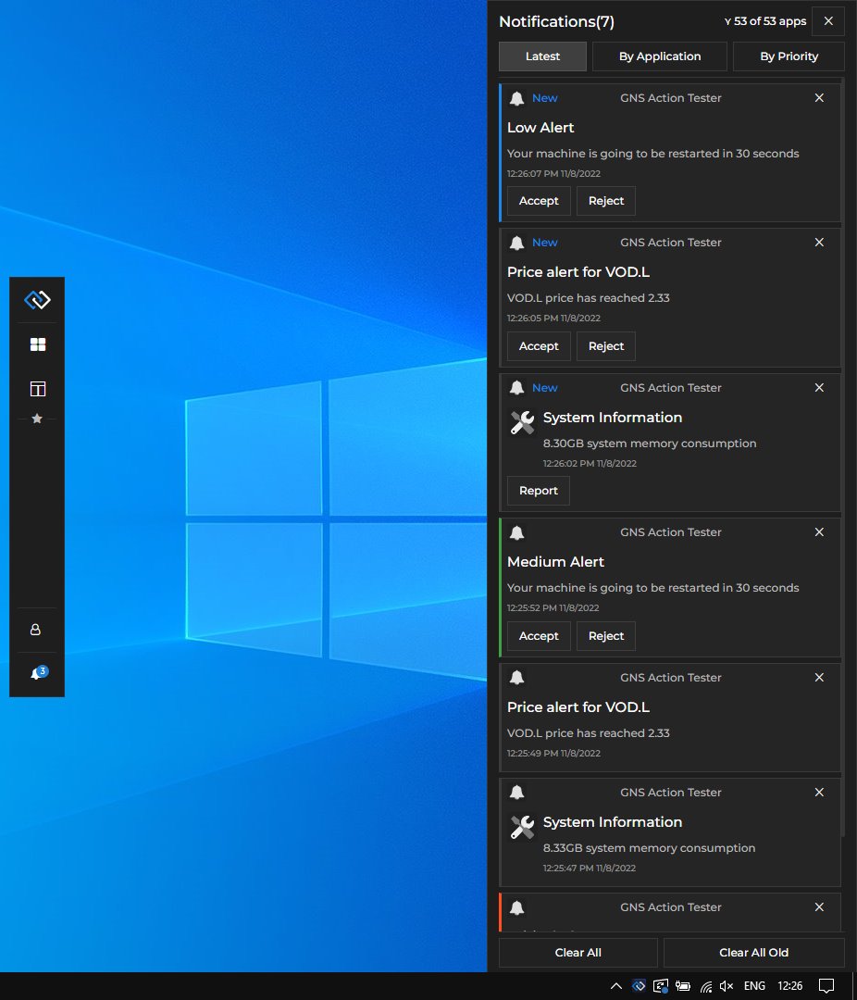

## Overview

Notifications represent events important enough to be brought to the attention of the user. Some examples are:

- an alert from an app for an automatic machine restart, or from a metrics monitoring tool for a system running hot;
- a trade order execution notification from an Order Management System;
- a workflow task assigned to a user or a group of users that can optionally need a response - e.g., a change of client address;
- an activity that is forwarded or re-assigned to a user - e.g., handling a client call;

[**Glue42 Enterprise**](https://glue42.com/enterprise/) provides a notifications service that normalizes and consolidates notifications from different apps and delivers them directly to the user on the desktop in a customizable UI as both toasts and ordered lists in a Notification Panel:



The notification toasts and the Notification Panel are [configurable](#configuration) and [customizable](#extending_notifications) system apps.

Glue42 enabled apps can use the Glue42 Notification APIs to raise notifications at runtime.

*Note that since [**Glue42 Enterprise**](https://glue42.com/enterprise/) 3.17, the system notification apps have been replaced with more easily customizable React web apps. Legacy Glue42 notifications are still supported. For more details on configuring and customizing the legacy Glue42 notifications, see the [Legacy Notifications](#legacy_notifications) section.*

## Configuration

By default, notifications are enabled in [**Glue42 Enterprise**](https://glue42.com/enterprise/). The notification settings are under the `"notifications"` top-level key in the `system.json` [configuration file](../../../developers/configuration/system/index.html) located in the `%LocalAppData%\Tick42\GlueDesktop\config` folder:

```json
{
    "notifications": {
        "enabled": true,
        // Specify lists of allowed and/or forbidden URLs.
        "sourceFilter": {
            "allowed": [
                "*"
            ]
        },
        // Amount of time in milliseconds specifying how long the notification toast will be shown.
        "toastExpiry": 15000
    }
}
```

To change the location of the Notification Panel, use the `"placement"` property. The following example demonstrates how to place the Notification Panel on the left of the screen and change its width in pixels:

```json
{
    "details": {
        "placement": {
            // Make the Notification Panel preserve its specific position in case of screen resolution changes.
            "snapped": true,
            // Place the Notification Panel on the left of the screen.
            "horizontalAlignment": "left",
            // Stretch the Notification Panel to occupy the entire screen height.
            "verticalAlignment": "stretch",
            // Change the Notification Panel width.
            "width": 350
        }
    }
}
```

*For more details on Glue42 Window placement, see the `"placement"` property in the [`application.json`](../../../assets/configuration/application.json) schema.*

## Extending Notifications

<glue42 name="addClass" class="colorSection" element="p" text="Available since Glue42 Enterprise 3.17">

The [`@glue42/notifications-ui-react`](https://www.npmjs.com/package/@glue42/notifications-ui-react) library enables you to create your own Notifications App for [**Glue42 Enterprise**](https://glue42.com/enterprise/). The library provides [hooks](#extending_notifications-hooks) and default [components](#extending_notifications-components) which you can use to build your own Notifications App by using, modifying or replacing the available components and functionalities.

To use the library in your project, execute the following command:

```cmd
npm install @glue42/notifications-ui-react
```

*Note that the [`@glue42/notifications-ui-react`](https://www.npmjs.com/package/@glue42/notifications-ui-react) library doesn't include a built Notifications App. A Notifications App is provided in [**Glue42 Enterprise**](https://glue42.com/enterprise/). You can also use and customize the [Notifications App template](https://github.com/Glue42/templates/tree/master/notifications-ui-react).*

### Configuration

To use your custom Notifications App built with the [`@glue42/notifications-ui-react`](https://www.npmjs.com/package/@glue42/notifications-ui-react) library, modify the `notifications.json` [app configuration](../../../developers/configuration/application/index.html) file located in `%LocalAppData%\Tick42\GlueDesktop\config\apps`. Set the `"url"` property of the `"details"` top-level key to the URL of your custom Notifications App:

```json
{
    "details": {
        "url": "http://localhost:3000"
    }
}
```

*For more available customizations of the Notifications App through configuration, see the [Notifications > Configuration](#configuration) section.*

### Hooks

The `useNotificationsContext()` hook provides context information about the Notifications App and the available notifications, as well as methods for the default notification functionalities which you can use directly in your custom components:

```javascript
const {
    allApplications,
    allowedApplications,
    clearAll,
    clearAllOld,
    close,
    configuration,
    hidePanel,
    isPanelVisible,
    markAllAsAcknowledged,
    notifications,
    setAutoHidePanel,
    showPanel,
    sortBy
} = useNotificationsContext();
```

| Property | Type | Description |
|----------|------|-------------|
| `allApplications` | `number` | The number of all available Glue42 apps. |
| `allowedApplications` | `number` | The number of Glue42 apps allowed to raise notifications. |
| `clearAll()` | `function` | Clears all notifications from the Notification Panel. |
| `clearAllOld()` | `function` | Clears all notifications that have already been seen by the user in the Notification Panel. |
| `close()` | `function` | Closes a notification toast or a notification in the Notification Panel. |
| `configuration` | `object` | Object with [configuration](#configuration) for the Glue42 Notifications.  |
| `hidePanel()` | `function` | Hides the Notification Panel. |
| `isPanelVisible` | `boolean` | Whether the Notification Panel is currently open. |
| `markAllAsAcknowledged()` | `function` | Marks all notifications as acknowledged. A notification is considered acknowledged when the user opens the Notification Panel or clicks on the notification toast. |
| `notifications` | `object[]` | A list of all available notification objects. |
| `setAutoHidePanel()` | `function` | Accepts a Boolean value as an argument and specifies whether the Notification Panel should hide automatically when it loses focus. |
| `showPanel()` | `function` | Shows the Notification Panel. |
| `sortBy()` | `function` | Sorts the notifications in the Notification Panel. Pass `"timestamp"` to show the latest notifications, `"priority"` to sort notification by priority, or `"application"` to sort the notifications by the name of the app that has raised them. |

### Components

All default components can be reused and composed with custom code. If usage of such component has been detected, its default behavior will be applied. For instance, if you use the `<PanelFooterClearAllButton />` component, it will automatically clear all notifications when the button is clicked, without the need of custom code to induce this behavior. If you pass the same component more than once, an error will be thrown.

To remove a component, pass a `<Fragment />` component. If you want to use a default functionality (e.g., for clearing or sorting notifications) in your custom components, use the `useNotificationsContext()` [hook](#extending_notifications-hooks) to acquire it and pass it to your component.

In your custom Notifications App, you should place the `<Panel />` and `<Toasts />` components in the `<NotificationsProvider />` component. This component is a React context provider component that provides notification-related data and functionality accessible through the `useNotoficationsContext()` hook. The `<NotificationsProvider />` component should contain a `<NotificationsWrapper />` component whose purpose is to render either the `<Panel />` or the `<Toasts />` component when a notification is received, based on whether the Notification Panel is currently visible or not. If, for instance, you don't want to use notification toasts, you can place your customized `<Panel />` component directly under the `<NotificationsProvider />` component.

The following example demonstrates a basic usage of the library:

```javascript
import React from "react";
import {
    NotificationsProvider,
    useNotificationsContext
} from "@glue42/notifications-ui-react";
import CustomPanel from "./CustomPanel";
import CustomToasts from "./CustomToasts";

// Create a wrapper component that will render either the Notification Panel or
// the toasts wrapper when a notification is received based on whether the panel is visible.
const NotificationsWrapper = () => {
    const { isPanelVisible } = useNotificationsContext();

    return isPanelVisible ? <CustomPanel /> : <CustomToasts />;
};

const App = () => {
    return (
        <NotificationsProvider>
            <NotificationsWrapper />
        </NotificationsProvider>
    );
};

export default App;
```

### Notification Panel

The `<Panel />` component is used for rendering the Notification Panel. The following example demonstrates the structure of the `<Panel />` component, its properties and default values:

```javascript
<Panel
    hideOnFocusLost={true}

    components={{
        Body: () => {
            return (
                <div>
                    <NotificationsList />
                </div>
            );
        },
        NotificationsList: NotificationsList,
        Notification: Notification,
        Footer: () => {
            return (
                <div>
                    <FooterButtons />
                </div>
            );
        },
        FooterButtons: () => {
            return (
                <ButtonGroup>
                    <FooterButtonsClearAll />
                    <FooterButtonsClearAllOld />
                </ButtonGroup>
            );
        },
        FooterButtonsClearAll: FooterButtonsClearAll,
        FooterButtonsClearAllOld: FooterButtonsClearAllOld,
        Header: () => {
            return (
                <>
                    <HeaderCaption />
                    <HeaderSortButtons />
                </>
            );
        },
        HeaderCaption: () => {
            return (
                <div>
                    <HeaderCaptionTitle />
                    <HeaderCaptionFilter />
                    <HeaderCaptionButtons />
                </div>
            );
        },
        HeaderCaptionButtons: () => {
            return (
                <ButtonGroup>
                    <HeaderCaptionButtonsClose />
                </ButtonGroup>
            );
        },
        HeaderCaptionButtonsClose: HeaderCaptionButtonsClose,
        HeaderCaptionFilter: HeaderCaptionFilter,
        HeaderCaptionTitle: HeaderCaptionTitle,
        HeaderSortButtons: () => {
            return (
                <ButtonGroup>
                    <HeaderSortButtonsTimestamp />
                    <HeaderSortButtonsApplication />
                    <HeaderSortButtonsPriority />
                </ButtonGroup>
            );
        },
        HeaderSortButtonsApplication: HeaderSortButtonsApplication,
        HeaderSortButtonsPriority: HeaderSortButtonsPriority,
        HeaderSortButtonsTimestamp: HeaderSortButtonsTimestamp
    }}
/>
```

The following example demonstrates creating a custom Notification Panel with custom header, footer and custom text on the buttons for clearing notifications. The header contains two custom buttons for sorting notifications that use the default functionality for sorting by timestamp and by priority:

```javascript
import {
    useNotificationsContext
    Panel,
    PanelFooterButtons,
    PanelFooterClearAllButton,
    PanelFooterClearAllOldButton
} from "@glue42/notifications-ui-react";

// Get the default method for sorting notifications.
const { sortBy } = useNotificationsContext();

// Custom header for the Notification Panel containing
// custom buttons with default sorting functionality.
const CustomPanelHeader = () => {
    return (
        <div>
            <button onClick={() => sortBy("timestamp")}>Show Latest</button>
            <button onClick={() => sortBy("priority")}>Sort by Priority</button>
        </div>
    );
};

// Custom footer for the Notification Panel.
const CustomPanelFooter = ({ className, ...rest }) => {
    return (
        <div className={className} {...rest}>
            <div>Custom Footer</div>
            <PanelFooterButtons />
        </div>
    );
};

const CustomPanel = () => {
    return (
        <Panel
            // The Notification Panel will remain visible when it loses focus.
            hideOnFocusLost={false}
            components={{
                Header: CustomPanelHeader,
                // Providing a custom class for the footer.
                Footer: props => <CustomPanelFooter className={"my-custom-class"} {...props}/>,
                // Providing custom text for the Notification Panel footer buttons.
                FooterButtonsClearAll: () => <PanelFooterClearAllButton text="Remove All" />,
                FooterButtonsClearAllOld: () => <PanelFooterClearAllOldButton text="Remove All Read" />
            }}
        />
    );
};

export default CustomPanel;
```


### Toasts Wrapper

The `<Toasts />` component is used for rendering the toasts wrapper which shows one or more notification toasts when the Notification Panel is closed. The following example demonstrates the structure of the `<Toasts />` component, its properties and default values:

```javascript
<Toasts
    maxToasts={1}

    components={{
        Body: () => {
            return (
                <div>
                    <NotificationsList />
                </div>
            );
        },
        NotificationsList: NotificationsList,
        Notification: Notification,
        Footer: () => <></>,
        Header: () => <></>
    }}
/>
```

The following example demonstrates creating a custom toasts wrapper containing a custom header and footer. The toasts wrapper will contain a maximum of three notifications at a time and will appear at the top of the screen, instead of at its default location at the bottom of the screen. The functionality for getting a list of the active notifications (the ones for which the time limit set in the `"toastExpiry"` [notification configuration](#configuration) property hasn't elapsed yet) and limiting it up to the number specified in the `maxToasts` property is taken directly from the default `<Body />` component, part of the `<ToastsWrapper />` component, provided by the library:

```javascript
import { useEffect, useState } from "react";
import { Toasts, Notification, NotificationsList } from "@glue42/notifications-ui-react";

const CustomToastsBody = ({ className, notifications, maxToasts, ...rest }) => {

    const [activeNotifications, setActiveNotifications] = useState([]);

    // Getting the active notifications and limiting the list of notification toasts
    // displayed in the toasts wrapper up to the number specified in the `maxToasts` property.
    useEffect(() => {
        const active = notifications?.filter(n => n.state === "Active").slice(0, maxToasts);

        setActiveNotifications(active);
    }, [notifications]);

    return (
        // Use the `"toast-top"` class to make the toasts wrapper appear at the top of the screen.
        <div className={`toast-top ${className}`} {...rest}>
            <NotificationsList
                Notification= {Notification}
                notifications={activeNotifications}
                noNotificationText=""
            />
        </div>
    );
};

const CustomToasts = () => {
    return (
        <Toasts
            // Specifying the number of notifications that can appear in the toasts wrapper.
            maxToasts={3}
            components={{
                Header: () => <div>Custom Header</div>,
                // Passing a custom class.
                Body: props => <CustomToastsBody className={"my-custom-class"} {...props} />,
                Footer: () => <div>Custom Footer</div>
            }}
        />
    );
};

export default CustomToasts;
```


### Notification

The `<Notification />` component is used for rendering the notification itself. The following example demonstrates the structure of the `<Notification />` component, its properties and default values:

```javascript
<Notification
    notification={Glue42Notification}

    components={{
        Body: () => {
            return (
                <div>
                    <BodyIcon />
                    <div>
                        <BodyTitle />
                        <BodyDescription />
                        <BodyTimestamp />
                    </div>
                </div>
            );
        },
        BodyDescription: BodyDescription,
        BodyIcon: BodyIcon,
        BodyTimestamp: BodyTimestamp,
        BodyTitle: BodyTitle,
        Footer: () => {
            return (
                <div>
                    <FooterButton />
                </div>
            );
        },
        FooterButton: FooterButton,
        Header: () => {
            return (
                 <div>
                    <HeaderIcon />
                    <HeaderTitle />
                    <HeaderButton />
                </div>
            );
        },
        HeaderButton: HeaderButton,
        HeaderIcon: HeaderIcon,
        HeaderTitle: HeaderTitle
    }}
/>
```

The following example demonstrates creating a custom notification for the Notification Panel that has a customized header and body titles. The color of the notification titles will change depending on the severity of the received notification:

```javascript
import { Panel, Notification } from "@glue42/notifications-ui-react";

const CustomNotification = ({ notification }) => {
    const { severity, appTitle, title } = notification;
    let textColor;

    // Assign a color value according to the notification severity.
    switch (severity) {
        case "Low": textColor = "#0066c0";
            break;
        case "Medium": textColor = "#43a047";
            break;
        case "High": textColor = "#f9a825";
            break;
        case "Critical": textColor = "#ff511f";
            break;
        default: textColor = "grey"
    };

    return (
        <Notification
            notification={notification}
            components={{
                HeaderTitle: () => <div style={{color: textColor}}>{appTitle}</div>,
                BodyTitle: () => <h1 style={{color: textColor}}> {title}</h1>
            }}
        />
    );
};

const CustomPanel = () => {
    return (
        <Panel
            components={{
                Notification: CustomNotification
            }}
        />
    );
};

export default CustomPanel;
```


## Legacy Notifications

Since [**Glue42 Enterprise**](https://glue42.com/enterprise/) 3.17, the system notification apps have been replaced with more easily customizable React web apps. The legacy Glue42 notification apps used until [**Glue42 Enterprise**](https://glue42.com/enterprise/) 3.16 are still supported.

### Architecture

The Glue42 Notification Service (GNS) provides:

- A common data model for normalizing notifications raised by apps.
- Consolidation of notifications from multiple backend and desktop servers and their customizable delivery to the user desktop via the GNS Desktop Manager.
- Specification for GNS servers for passive (REST) and active ([Interop](../../data-sharing-between-apps/interop/overview/index.html), HTTP Push) publishing of notifications.
- Interop Publishing API for desktop GNS Servers.
- A set of GNS Servers:
	- Outlook Mail Interop GNS Server (e.g., public folder messages, but may also be rule-based);
	- Thomson Reuters Eikon News Interop GNS Server;
	- Google Alerts Interop GNS Server;
- Interop Subscription API for desktop clients/subscribers (typically UIs);
- UIs for displaying notifications (toasts and lists) with customizable UX via Glue42 Routing;

<glue42 name="diagram" image="../../../images/notifications/gns.gif">

### Configuration

The [app configurations](../../../developers/configuration/application/index.html) for the Notification Panel and the notification toast apps are in the `gns.json` file located in `%LocalAppData%\Tick42\GlueDesktop\config\apps`. The Notification Panel is named `"js-gns-dialog-panel"` and the notification toast - `"js-gns-dialog-toast"`. Use this file to specify custom configuration for the notification apps.

#### Filtering Notifications

To filter notifications by app name, use the `"sourceFilter"` property under the `"customProperties"` top-level key of the Notification Panel configuration. The `"sourceFilter"` object has the following properties:

| Property | Type | Description |
|----------|------|-------------|
| `"allowed"` | `string[]` | List of the app names of the allowed notification sources. Use a wildcard (`"*"`) to allow all. |
| `"blocked"` | `string[]` | List of the app names of the blocked notification sources. Use a wildcard (`"*"`) to block all. |

If you set the `"allowed"` or `"blocked"` property to an empty array (default for both properties), all notification sources will be allowed or blocked respectively. The allowed list is applied first, then the blocked, which means that if an app is in both lists, it will be blocked.

The following example demonstrates how to allow all notification sources using a wildcard and then block a specific app:

```json
{
    "name": "js-gns-dialog-panel",
    "customProperties": {
        "sourceFilter": {
            "allowed": ["*"],
            "blocked": ["glue42-application-manager"]
        }
    }
}
```

#### Notification Toasts

Use the following properties under the `"customProperties"` top-level key of the Notification Panel configuration to enable or disable notification toasts, to customize their size and duration:

| Property | Type | Description |
|----------|------|-------------|
| `"enabled"` | `boolean` | Whether to enable or disable (default) notification toasts. |
| `"width"` | `number` | Width of the notification toast in pixels. |
| `"height"` | `number` | Height of the notification toast in pixels. |
| `"duration"` | `number` | Time in milliseconds after which the notification toast will disappear. If set to `0`, the notification toast will remain visible until the user closes it manually. |

The following example demonstrates how to enable notification toasts, specify their size and set their duration to 5 seconds:

```json
{
    "name": "js-gns-dialog-panel",
    "customProperties": {
        "enabled": true,
        "width": 300,
        "height": 200,
        "duration": 5000
    }
}
```


### Styles

The Glue42 Notification Panel and notification toasts are web apps that can be modified by editing their HTML and CSS files.

The HTML files of the default notification apps are located in `%LocalAppData%\Tick42\GlueDesktop\assets\tick42-gns-js-ui` and are named `dialog-panel.html` for the Notification Panel and `dialog-toast.html` for the notification toasts. Use them to remove, edit or add custom elements to the apps.

As a base style, the default notification apps use the Glue42 web themes bundle - `t42bootstrap.bundle.css`, located in `%LocalAppData%\Tick42\GlueDesktop\assets\styles`. As a style override is used the `panel.css` file located in `%LocalAppData%\Tick42\GlueDesktop\assets\tick42-gns-js-ui\dialog_panel`. Either use the `panel.css` file to override the existing styles, or create your own CSS override file and reference it in the HTML files of the default apps.

To change the taskbar icon of the Notification Panel, modify the [app configuration](../../../developers/configuration/application/index.html) of the Notification Panel app. Either provide a path to your custom icon using the `"icon"` top-level configuration property, or replace the `icon.ico` file in the `%LocalAppData%\Tick42\GlueDesktop\assets\tick42-gns-js-ui\resources` folder:

```json
{
    "name": "js-gns-dialog-panel",
    "icon": "file:///%GDDIR%/assets/custom/icon.ico"
}
```

### Custom Notification Apps

To replace the default notification apps with your own custom apps, remove or edit the existing [app configurations](../../../developers/configuration/application/index.html) for the Notification Panel and the notification toast apps. Provide the URLs to your custom apps and don't change the `"name"` properties in the configurations - keep the original names of the apps (`"js-gns-dialog-panel"` for the Notification Panel and `"js-gns-dialog-toast"` for the notification toast), otherwise the Glue42 Notification Service won't function properly.

The following is an example configuration for a custom notification toast app:

```json
{
    "name": "js-gns-dialog-toast",
    "allowMultiple": false,
    "autoStart": true,
    "type": "window",
    "hidden": true,
    "service": true,
    "icon": "file:///%GDDIR%/assets/tick42-gns-js-ui/resources/icon.ico",
    "details": {
        "url": "file:///../assets/custom/my-custom-toast.html",
        "mode": "html",
        "hidden": true,
        "onTop": true,
        "hasMoveAreas": false,
        "hasSizeAreas": false,
        "showInTaskbar": false,
        "focus": false,
        "isSticky": false,
        "allowMinimize": false,
        "allowMaximize": false,
        "allowClose": false,
        "allowCollapse": false,
        "buttonsVisibility": "off"
    }
}
```