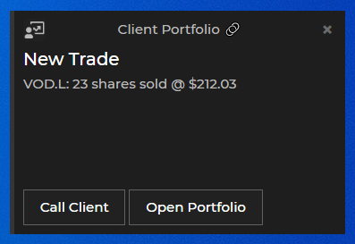

## Overview

Notifications represent events important enough to be brought to the attention of the user. Some examples are:

- an alert from an app for an automatic machine restart, or from a metrics monitoring tool for a system running hot;
- a trade order execution notification from an Order Management System;
- a workflow task assigned to a user or a group of users that can optionally need a response - e.g., a change of client address;
- an activity that is forwarded or re-assigned to a user - e.g., handling a client call;

[**Glue42 Enterprise**](https://glue42.com/enterprise/) provides a notifications service that normalizes and consolidates notifications from different apps and delivers them directly to the user on the desktop in a customizable UI as both toasts and ordered lists in a Notification Panel:


The notification toasts and the Notification Panel are [configurable](#configuration) and [customizable](#styles) system apps.

Glue42 enabled apps can use the Glue42 Notification APIs to raise notifications at runtime.

## Architecture

The Glue42 Notification Service (GNS) provides:

- A common data model for normalizing notifications raised by apps.
- Consolidation of notifications from multiple backend and desktop servers and their customizable delivery to the user desktop via the GNS Desktop Manager.
- Specification for GNS servers for passive (REST) and active ([Interop](../../data-sharing-between-apps/interop/overview/index.html), HTTP Push) publishing of notifications.
- Interop Publishing API for desktop GNS Servers.
- A set of GNS Servers:
	- Outlook Mail Interop GNS Server (e.g., public folder messages, but may also be rule-based);
	- Thomson Reuters Eikon News Interop GNS Server;
	- Google Alerts Interop GNS Server;
- Interop Subscription API for desktop clients/subscribers (typically UIs);
- UIs for displaying notifications (toasts and lists) with customizable UX via Glue42 Routing;

<glue42 name="diagram" image="../../../images/notifications/gns.gif">

## Configuration

The [app configurations](../../../developers/configuration/application/index.html) for the Notification Panel and the notification toast apps are in the `gns.json` file located in `%LocalAppData%\Tick42\GlueDesktop\config\apps`. The Notification Panel is named `"js-gns-dialog-panel"` and the notification toast - `"js-gns-dialog-toast"`. Use this file to specify custom configuration for the notification apps.

### Filtering Notifications

To filter notifications by app name, use the `"sourceFilter"` property under the `"customProperties"` top-level key of the Notification Panel configuration. The `"sourceFilter"` object has the following properties:

| Property | Type | Description |
|----------|------|-------------|
| `"allowed"` | `string[]` | List of the app names of the allowed notification sources. Use a wildcard (`"*"`) to allow all. |
| `"blocked"` | `string[]` | List of the app names of the blocked notification sources. Use a wildcard (`"*"`) to block all. |

If you set the `"allowed"` or `"blocked"` property to an empty array (default for both properties), all notification sources will be allowed or blocked respectively. The allowed list is applied first, then the blocked, which means that if an app is in both lists, it will be blocked.

The following example demonstrates how to allow all notification sources using a wildcard and then block a specific app:

```json
{
    "name": "js-gns-dialog-panel",
    "customProperties": {
        "sourceFilter": {
            "allowed": ["*"],
            "blocked": ["glue42-application-manager"]
        }
    }
}
```

### Notification Toasts

Use the following properties under the `"customProperties"` top-level key of the Notification Panel configuration to enable or disable notification toasts, to customize their size and duration:

| Property | Type | Description |
|----------|------|-------------|
| `"enabled"` | `boolean` | Whether to enable or disable (default) notification toasts. |
| `"width"` | `number` | Width of the notification toast in pixels. |
| `"height"` | `number` | Height of the notification toast in pixels. |
| `"duration"` | `number` | Time in milliseconds after which the notification toast will disappear. If set to `0`, the notification toast will remain visible until the user closes it manually. |

The following example demonstrates how to enable notification toasts, specify their size and set their duration to 5 seconds:

```json
{
    "name": "js-gns-dialog-panel",
    "customProperties": {
        "enabled": true,
        "width": 300,
        "height": 200,
        "duration": 5000
    }
}
```



## Styles

The Glue42 Notification Panel and notification toasts are web apps that can be modified by editing their HTML and CSS files.

The HTML files of the default notification apps are located in `%LocalAppData%\Tick42\GlueDesktop\assets\tick42-gns-js-ui` and are named `dialog-panel.html` for the Notification Panel and `dialog-toast.html` for the notification toasts. Use them to remove, edit or add custom elements to the apps.

As a base style, the default notification apps use the Glue42 web themes bundle - `t42bootstrap.bundle.css`, located in `%LocalAppData%\Tick42\GlueDesktop\assets\styles`. As a style override is used the `panel.css` file located in `%LocalAppData%\Tick42\GlueDesktop\assets\tick42-gns-js-ui\dialog_panel`. Either use the `panel.css` file to override the existing styles, or create your own CSS override file and reference it in the HTML files of the default apps.

To change the taskbar icon of the Notification Panel, modify the [app configuration](../../../developers/configuration/application/index.html) of the Notification Panel app. Either provide a path to your custom icon using the `"icon"` top-level configuration property, or replace the `icon.ico` file in the `%LocalAppData%\Tick42\GlueDesktop\assets\tick42-gns-js-ui\resources` folder:

```json
{
    "name": "js-gns-dialog-panel",
    "icon": "file:///%GDDIR%/assets/custom/icon.ico"
}
```

## Custom Notification Apps

To replace the default notification apps with your own custom apps, remove or edit the existing [app configurations](../../../developers/configuration/application/index.html) for the Notification Panel and the notification toast apps. Provide the URLs to your custom apps and don't change the `"name"` properties in the configurations - keep the original names of the apps (`"js-gns-dialog-panel"` for the Notification Panel and `"js-gns-dialog-toast"` for the notification toast), otherwise the Glue42 Notification Service won't function properly.

The following is an example configuration for a custom notification toast app:

```json
{
    "name": "js-gns-dialog-toast",
    "allowMultiple": false,
    "autoStart": true,
    "type": "window",
    "hidden": true,
    "service": true,
    "icon": "file:///%GDDIR%/assets/tick42-gns-js-ui/resources/icon.ico",
    "details": {
        "url": "file:///../assets/custom/my-custom-toast.html",
        "mode": "html",
        "hidden": true,
        "onTop": true,
        "hasMoveAreas": false,
        "hasSizeAreas": false,
        "showInTaskbar": false,
        "focus": false,
        "isSticky": false,
        "allowMinimize": false,
        "allowMaximize": false,
        "allowClose": false,
        "allowCollapse": false,
        "buttonsVisibility": "off"
    }
}
```