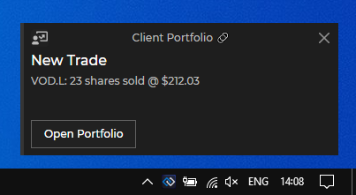

## Raising Notifications from a Web App

*Note that the Glue42 Notifications API uses interfaces extending the interfaces of the [DOM Notifications API](https://developer.mozilla.org/en-US/docs/Web/API/Notifications_API). The documentation below describes the specifics of the Glue42 Notifications API. For full details on the DOM Notification API interfaces, see the respective DOM documentation for [`Notification`](https://developer.mozilla.org/en-US/docs/Web/API/Notification), [`NotificationAction`](https://developer.mozilla.org/en-US/docs/Web/API/NotificationAction), [`NotificationOptions`](https://microsoft.github.io/PowerBI-JavaScript/interfaces/_node_modules_typedoc_node_modules_typescript_lib_lib_dom_d_.notificationoptions.html) and [`Event`](https://developer.mozilla.org/en-US/docs/Web/API/Event).*

The Notifications API is accessible through the [`glue.notifications`](../../../reference/glue/latest/notifications/index.html) object.

To raise a notification from your application, use the [`raise()`](../../../reference/glue/latest/notifications/index.html#API-raise) method of the API. The method accepts as an argument a required [`Glue42NotificationOptions`](../../../reference/glue/latest/notifications/index.html#Glue42NotificationOptions) object with settings for the notification you want to raise:

```javascript
const options = {
    title: "New Trade",
    body: "VOD.L: 23 shares sold @ $212.03",
    actions: [
        {
            action: "openClientPortfolio",
            title: "Open Portfolio"
        }
    ]
};

// Raising a notification.
const notification = await glue.notifications.raise(options);
```



### Notification Options

The [`Glue42NotificationOptions`](../../../reference/glue/latest/notifications/index.html#Glue42NotificationOptions) object extends the standard web `NotificationOptions` object with several additional properties:

| Property | Description |
|----------|-------------|
| `actions` | An array of [`Glue42NotificationAction`](../../../reference/glue/latest/notifications/index.html#Glue42NotificationAction) objects. |
| `title` | The title of the notification. |
| `clickInterop` | Accepts an [`InteropActionSettings`](../../../reference/glue/latest/notifications/index.html#InteropActionSettings) object as a value. Use this property to [invoke an Interop method](../../data-sharing-between-apps/interop/javascript/index.html#method_invocation) when the user clicks on the notification. You can specify arguments for the method and an [Interop target](../../data-sharing-between-apps/interop/javascript/index.html#method_invocation-targeting). |
| `severity` | Defines the urgency of the notification which is represented visually by different colors in the notification UI. Can be `"Low"`, `"Medium"`, `"High"`, `"Critical"` or `"None"`. |
| `source` | Overrides the source of the notification. Provide the name of the Glue42 application which you want to be displayed as a source of the notification. |
| `type` | Accepts `"Notification"` or `"Alert"` as a value. This property is meant to be used only as a way to distinguish between notification types in case you want to create different visual representations for them - e.g., the `"Notification"` type may be considered a general notification, while the `"Alert"` type may be considered a more important or urgent notification. |

## Notification Click

### Standard Click Handler

The `raise()` method returns a [`Glue42Notification`](../../../reference/glue/latest/notifications/index.html#Glue42Notification) object. Use its `onclick` property to specify a callback that will be invoked when the user clicks on the notification:

```javascript
const options = {
    title: "New Trade",
    body: "VOD.L: 23 shares sold @ $212.03",
    actions: [
        {
            action: "openClientPortfolio",
            title: "Open Portfolio"
        }
    ]
};

const notification = await glue.notifications.raise(options);

notification.onclick = () => console.log("Notification was clicked.");
```

### Interop Click Handler

You can also use the `clickInterop` property of the [`Glue42NotificationOptions`](../../../reference/glue/latest/notifications/index.html#Glue42NotificationOptions) object to specify an Interop method that will be invoked when the user clicks on the notification. For instance, another application has [registered an Interop method](../../data-sharing-between-apps/interop/javascript/index.html#method_registration):

```javascript
const methodName = "HandleNotificationClick";
const handler = (args) => {
    console.log(JSON.stringify(args));
};

await glue.interop.register(methodName, handler);
```

To invoke this Interop method for handling the notification click, define an [`InteropActionSettings`](../../../reference/glue/latest/notifications/index.html#InteropActionSettings) object and assign it as a value to the `clickInterop` property of the notification options object:

```javascript
const interopSettings = {
    // The only required property is the method name.
    method: "HandleNotificationClick",
    arguments: {
        name: "Vernon Mullen",
        id: "1"
    }
};

const options = {
    title: "New Trade",
    body: "VOD.L: 23 shares sold @ $212.03",
    actions: [
        {
            action: "openClientPortfolio",
            title: "Open Portfolio"
        }
    ],
    clickInterop: interopSettings
};

const notification = await glue.notifications.raise(options);
```

## Notification Actions

You can create action buttons for the notification. When the user clicks on an action button, the specified callbacks will be invoked. 


To define action buttons, use the `actions` property of the [`Glue42NotificationOptions`](../../../reference/glue/latest/notifications/index.html#Glue42NotificationOptions) object when creating a notification. The `actions` property accepts an array of [`Glue42NotificationAction`](../../../reference/glue/latest/notifications/index.html#Glue42NotificationAction) objects:

```javascript
const options = {
    title: "New Trade",
    body: "VOD.L: 23 shares sold @ $212.03",
    actions: [
        {
            action: "callClient",
            title: "Call Client"
        },
        {
            action: "openClientPortfolio",
            title: "Open Portfolio"
        }
    ]
};
```

*Note that the action buttons in a Glue42 Notification are limited to two, as the web browsers currently support a maximum of two actions.*

See below how to create standard notification actions (actions that don't require Interop functionality) as well as Interop actions.

### Standard Actions

Besides all properties of a standard web `Notification` object, the [`Glue42Notification`](../../../reference/glue/latest/notifications/index.html#Glue42Notification) object has an additional `onaction` property. You can use this property to assign a callback that will be invoked when the user clicks an action button in the notification. The callback receives as an argument an [`ActionEvent`](../../../reference/glue/latest/notifications/index.html#ActionEvent) object which extends the standard web `Event` object. The `ActionEvent` object has an `action` property that holds the name of the triggered action.

```javascript
const notificationOptions = {
    title: "New Trade",
    body: "VOD.L: 23 shares sold @ $212.03",
    actions: [
        {
            action: "openClientPortfolio",
            title: "Open Portfolio"
        }
    ]
};

const notification = await glue.notifications.raise(notificationOptions);

notification.onaction = function (actionEvent) {
    if (actionEvent.action === "openClientPortfolio") {
        console.log(`Action button in notification "${this.title}" has been clicked.`);
    };
};
```

### Interop Actions

The `Glue42NotificationAction` object extends the standard web `NotificationAction` object by adding an `interop` property which you can use to [invoke Interop methods](../../data-sharing-between-apps/interop/javascript/index.html#method_invocation) when the user clicks an action button in the notification.

First, [register an Interop method](../../data-sharing-between-apps/interop/javascript/index.html#method_registration) in another application:

```javascript
const methodName = "HandleNotificationClick";
const handler = (args) => {
    console.log(JSON.stringify(args));
};

glue.interop.register(methodName, handler);
```

After that, in your app define an [`InteropActionSettings`](../../../reference/glue/latest/notifications/index.html#InteropActionSettings) object and assign it as a value to the `interop` property of the action object in the `actions` array:

```javascript
const interopSettings = {
    // The only required property is the method name.
    method: "HandleNotificationClick",
    arguments: {
        name: "Vernon Mullen",
        id: "1"
    }
};

const notificationOptions = {
    title: "New Trade",
    body: "VOD.L: 23 shares sold @ $212.03",
    actions: [
        {
            action: "openClientPortfolio",
            title: "Open Portfolio",
            interop: interopSettings
        }
    ]
};

const notification = await glue.notifications.raise(notificationOptions);
```

## Notification Filters

<glue42 name="addClass" class="colorSection" element="p" text="Available since Glue42 Enterprise 3.12.1">

Notifications can be filtered programmatically based on lists of allowed and/or blocked applications.

To set a notification filter, use the [`setFilter()`](../../../reference/glue/latest/notifications/index.html#API-setFilter) method and pass a [`NotificationFilter`](../../../reference/glue/latest/notifications/index.html#NotificationFilter) object as an argument:

```javascript
const filter = {
    allowed: ["*"],
    blocked: ["app-one", "app-two"]
};

await glue.notifications.setFilter(filter);
```

Use a [`NotificationFilter`](../../../reference/glue/latest/notifications/index.html#NotificationFilter) object to specify which applications will be able to raise notifications. This object has two properties:

| Property | Type | Description |
|----------|------|-------------|
| `allowed` | `string[]` | List of the names of the applications which will be allowed to raise notifications. Use `*` to allow all applications. |
| `blocked` | `string[]` | List of the names of the applications which won't be allowed to raise notifications. Use `*` to block all applications. |

Using a combination of both lists enables you to create various filters:

```javascript
// Allows all applications to raise notifications.
const allowAll = {
    allowed: ["*"]
};

// Allows only the specified apps to raise notifications.
const allowOnly = {
    allowed: ["app-one", "app-two"]
};

// Allows all except the blocked apps to raise notifications. 
const allowAllExcept = {
    allowed: ["*"],
    blocked: ["app-one", "app-two"]
};

// Blocks all apps from raising notifications.
const blockAll = {
    blocked: ["*"]
};
```

To get the current notification filter, use the [`getFilter()`](../../../reference/glue/latest/notifications/index.html#API-getFilter) method:

```javascript
const filter = await glue.notifications.getFilter();
```

## Notification Panel

<glue42 name="addClass" class="colorSection" element="p" text="Available since Glue42 Enterprise 3.12.1">

The Notification Panel can be controlled programmatically - show, hide or toggle its visibility. The Notification Panel API is accessible through the `glue.notifications.panel` object.

To check whether the Notification Panel is visible, use the [`isVisible()`](../../../reference/glue/latest/notifications/index.html#NotificationPanelAPI-isVisible) method:

```javascript
const isPanelVisible = await glue.notifications.panel.isVisible();
```

To show the Notification Panel, use the [`show()`](../../../reference/glue/latest/notifications/index.html#NotificationPanelAPI-show) method:

```javascript
await glue.notifications.panel.show();
```

To hide the Notification Panel, use the [`hide()`](../../../reference/glue/latest/notifications/index.html#NotificationPanelAPI-hide) method:

```javascript
await glue.notifications.panel.hide();
```

To toggle the visibility of the Notification Panel, use the [`toggle()`](../../../reference/glue/latest/notifications/index.html#NotificationPanelAPI-toggle) method:

```javascript
await glue.notifications.panel.toggle();
```

## Advanced Usage

### Glue42 Routing

Glue42 Routing enables customization of GNS notifications delivery and display. Glue42 Routing can be applied at the source, category and notification level and is overridden in the same order, so that the Glue42 Routing in a notification overrides the one specified in the notification category, which overrides the one specified in the notification source.

There are 4 customizations you can make:

- specify an [Interop](../../data-sharing-between-apps/interop/javascript/index.html) handler method which will be called by the GNS Desktop Manager before passing a notification to GNS clients (UIs). The GNS Desktop Manager will call this method and if any application returns `true`, the GNS Desktop Manager will assume that the application will handle the notification and will not pass it to other clients.
- specify an Interop popup method which should be called by GNS clients instead of displaying their own notifications;
- specify an Interop detail method which should be called by GNS clients instead of displaying their own notification details view;
- specify a list of Glue42 Actions associated with the notification which GNS clients can use to display buttons or a context menu with the actions applicable to a notification. Each action is tied to an Interop method which will be called when the action is executed.

#### Using Notifications in a Workflow

A mortgage specialist might be entering information about a mortgage in an application. This will create a server-side notification that in turn will be pushed to a mortgage support team. Then, the notification will be received by a team member who will click on it and the "Mortgages" application will be automatically opened. The team member can then review and validate the information entered by the mortgage specialist. 

All this becomes possible by assigning an Interop detail routing method to the notification so that the GNS Desktop Manager will call this method (registered by the "Mortgages" app) instead of showing the notification details.

#### Handler, Popup and Detail Methods

**Handler Method**

Signature: 

```javascript
bool HandleNotification(Notification notification)
```

If present, the method will be called by the GNS Desktop Manager when a notification arrives. If the method returns `true` (meaning "handled"), the notification will not be passed to generic GNS Clients (i.e. UIs).

**Popup Method**

Signature: 

```javascript
void PopupNotification(Notification notification)
```

Used to define a method which GNS Clients should call to display the notification as a popup/toast.

**Detail Method**

Signature: 

```javascript
void ShowNotificationDetails(Notification notification)
```

Used to define a method which should be called by GNS Clients to display the details of a notification (instead of doing that themselves). It can only be called from a GNS Client (UI/Viewer), either by clicking on the popup (toast) or double-clicking a notification in a notification list/history window.

#### Actions

A list of actions can be applied to a notification group, notification source or a particular notification instance. An action has a human-readable name, and a method name, which will be called when the action is performed by the user. The method parameters are macro-enabled and can cite the notification properties.

Generic GNS clients will merge the actions defined in the:

- notification category
- notification source
- notification itself

The merging will be done in that order of precedence. 
	
The GNS clients can then present the actions to the user in a suitable way (e.g., as hover buttons or a context menu). When a user clicks on an action, the GNS client will execute the corresponding Interop method. Actions can be optionally grouped in a pattern, which may be used by a GNS client to merge the actions under a menu tree or to group the actions in clusters. 

```javascript
const notificationOptions = {
    title: "Critical Alert",
    body: "Your computer will be restarted in 30 seconds",
    actions: [{ 
        action: "restart",
        description: "Initiate system restart.",
        title: "Restart"
    },
    { 
        action: "postpone",
        description: "Postpone system restart.",
        title: "Postpone"
    }]
};

await glue.notifications.raise(notificationOptions);
```

### Custom Notification UI

You can change the default notification UI by changing the GNS application configuration:

1. If you are running in local mode, go to `%LOCALAPPDATA%\Tick42\GlueDesktop\config\apps\gns.json`.
2. Find the GNS application.
3. Add a `customProperties` section (or update the existing one):

```json
"customProperties": {
    "toastUrl": "https://enterprise-demos.tick42.com/gns-custom-toasts/",
    "width": 250,
    "height": 125,
    "count": 3
}
```


## Reference

[Notifications API Reference](../../../reference/glue/latest/notifications/index.html)