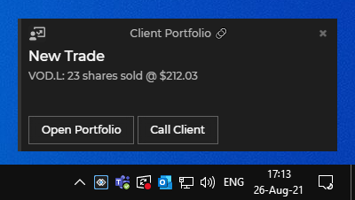

## Raising a Notification

To raise a notification on the user's desktop, you first need to create a `Notification` instance and then call the `raise()` method on it:

``` java
// create notification instance
Notification alert = glue.notifications()
        .create("Example", notification -> notification.title("New Trade"));

// raise the notification
alert.raise(NotificationSeverity.LOW);
```

## Notification Click

When raising a notification, you can specify what happens when the user clicks on the notification. By default, this will show the built-in notification details view, but you can replace that with invoking an [Interop](../../data-sharing-between-apps/interop/net/index.html#method_invocation) method.

In the following example, clicking on the notification will invoke the `DetailsHandler` Interop method:

``` java
glue.notifications()
        .create("Example", notification -> notification.details("DetailsHandler"));
```

## Actions

Notifications may contain actions (usually displayed as buttons in the UI) that the user can execute when they see the notification. Executing an action results in invoking an Interop method. This Interop method can be registered by the publisher of the notification or any other application that can handle the action. The handler of the Interop action can also receive parameters, specified by the publisher of the notification.

In the following example, we add actions **Call Client** and **Open Portfolio**, passing an `id` parameter to both actions: 

``` java
glue.interop().register("CallClient", (arg, caller) -> Collections.emptyMap());
glue.interop().register("OpenPortfolio", (arg, caller) -> Collections.emptyMap());
glue.notifications()
        .create("Example", notification -> notification
                    .action("CallClient", "Call Client", Collections.singletonMap("id", 42))
                    .action("OpenPortfolio", "Open Portfolio", Collections.singletonMap("id", 42)));
```

 