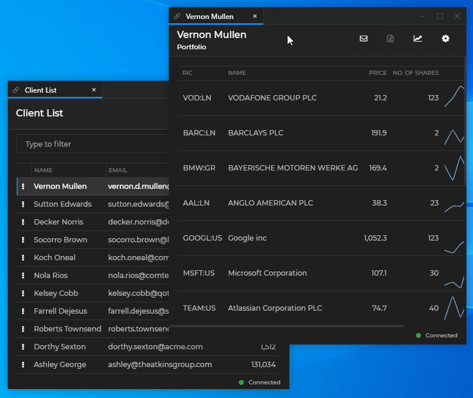

## Overview

To improve the efficiency of your business processes, you often find the need to collect extensive data about the daily workflows and routines within your company. You want to see the specific actions your employees take and the choices they make when achieving outstanding results or when performing poorly, as to optimize your processes or tools. The most efficient way for achieving this is through recording relevant data in the form of metrics. Metrics data is also useful for technical purposes like monitoring how well your hardware infrastructure handles the workload or tracking the performance of your applications.

## Metrics Pipeline

<glue42 name="diagram" image="../../../images/metrics/metrics-pipeline.png">

## Generation

[**Glue42 Enterprise**](https://glue42.com/enterprise/) starts to generate metrics automatically when initialized. To control the data you want to receive, add configuration for the metrics in the `"configuration"` property of the `"gw"` top-level key of the `system.json` file, located in `%LocalAppData%\Tick42\GlueDesktop\config`.

The example configuration below shows how to allow only the [User Journey](#generation-user_journey_metrics) metrics from all publishers and publish them to a local file:

```json
{
    "gw": {
        "configuration": {
            "metrics": {
                "publishers": ["file"],
                "file": {
                    "location": "metrics.json",
                    "append": false
                },
                "filters": {
                    "publishers": [
                        {
                            "publisher": {},
                            "metrics": {
                                "whitelist": [
                                    "/ACS/UserJourney"
                                ]
                            }
                        }
                    ],
                    "non-matched": "blacklist"
                }
            }
        }
    }
}
```

[**Glue42 Enterprise**](https://glue42.com/enterprise/) offers the following types of out-of-the-box metrics:

- [Performance Metrics](#generation-performance_metrics)
- [Summary Metrics](#generation-summary_metrics)
- [User Journey Metrics](#generation-user_journey_metrics)
- [Click Stream Metrics](#generation-click_stream_metrics)
- [Interop Metrics Metrics](#generation-interop_metrics)

You can instrument your own applications to generate metrics. This is achieved through a Metrics API and the generated metrics are called [FAV Metrics](#generation-fav_metrics) - Feature, Action, Value metrics.

The table below shows what string values (regex values start with `#`) to use in the `"whitelist"` array to allow the type of metrics you are interested in:

| Metrics Type | Value to Enable |
|--------------|-----------------|
| Performance | `"#/App/performance.*"` |
| Summary | `"/App/reporting/features"` |
| User Journey | `"/ACS/UserJourney"` |
| Click Stream | `"#/ClickStream.*"` |
| Interop | `"/App/reporting/features"` |
| All | `"#.*"` |

*The `"/App/reporting/features"` value enables publishing FAV Metrics. The same value is used for enabling Summary and Interop Metrics, because they are published in the form of FAV Metrics. See also [Interop Metrics](#generation-interop_metrics) for the additional configuration required to enable the Interop Metrics.*

### Performance Metrics

<glue42 name="addClass" class="colorSection" element="p" text="Available since Glue42 Enterprise 3.10">

Performance Metrics are relevant only to web apps. They measure memory usage and statistics related to web app resources and navigation.

Below is an example of a Performance Metric:

```json
{
    // The time the metric was created.
    "timestamp": 1600347688676,
    "value": {
        // Information about the JS Heap memory size.
        "value": "{\"totalJSHeapSize\":10317445,\"usedJSHeapSize\":8357333}"
    }
}
```

### Summary Metrics

<glue42 name="addClass" class="colorSection" element="p" text="Available since Glue42 Enterprise 3.9">

Summary Metrics allow you to track how long an application has been on focus. This can be useful when determining which apps are most used/needed. The configuration for the Summary Metrics is under the `"metrics"` top-level key of the `system.json` file of [**Glue42 Enterprise**](https://glue42.com/enterprise/):

```json
{
    "metrics": {
        "summaryMetric": {
            "enabled": true,
            "collectInterval": 30,
            "minimalFocusInterval": 1000,
            "flushOnShutdown": true,
            "debugLoggingEnabled": true
        }
    }
}
```

| Property | Type | Description |
|----------|------|-------------|
| `"enabled"` | `boolean` | Set to `true` to enable Summary Metrics. |
| `"collectInterval"` | `number` | Interval in minutes at which to publish the gathered metrics. Can't be less than 30 minutes. |
| `"minimalFocusInterval"` | `number` | The minimal focus time in milliseconds for which to record metric data (e.g., if you want to filter out accidental focus of apps). |
| `"flushOnShutdown"` | `boolean` | Whether to publish the gathered metrics on shutdown. |

Summary Metrics are recorded in the form of [FAV Metrics](#generation-fav_metrics). Below is an example of a Summary Metric:

```json
{
    // The time the metric was created.
    "timestamp": 1581341578526,
    // The set of specific information the metric contains.
    "value": {
        "value": {
            "name": {
                // Name of the application on focus.
                "value": "channelsclientlist"
            },
            "action": {
                "value": "Focused Duration"
            },
            "payload": {
                // Information about start and end times, application name and focus duration.
                // This example shows that the "Client List" application has been on focus for 3582 ms.
                "value": "{\"start\":1581334200000,\"end\":1581336000000,\"application\":\"channelsclientlist\",\"focusedDuration\":3582}"
            }
        }
    }
}
```

### User Journey Metrics

Information about the User Journey is extremely useful when you want to optimize your workflows. For example, if your employees need to work with several apps to perform their duties, you can collect information about the order in which they typically use the apps for certain tasks. This can provide you with crucial insights on how to plan your work processes, so that your employees can save time, effort and minimize the risk of errors.

The example below shows a user transitioning from the "Client Portfolio" app to the "Client List" app, which will be recorded as a User Journey metric:



And here is how the metric describing the transition from the "Client Portfolio" app to the "Client List" app looks like:

```json
{
    // The time the metric was created.
    "timestamp": 1568894332012,
    // The set of specific information the metric contains.
    "value": {
        "value": {
            // Application type - Glue42 container or external app.
            "AppType": {
                "value": "HC"
            },
            // Name of the application.
            "AppName": {
                "value": "channelsclientlist"
            },
            // The time when the previous application has lost focus.
            "PrevAppLostFocus": {
                "value": 1568894332011
            },
            "Info": {
                "value": ""
            },
            // The time when the previous application has gotten focus.
            "PrevAppGotFocus": {
                "value": 1568894328788
            },
            // The name of the previous application.
            "PrevAppName": {
                "value": "channelsclientportfolio"
            },
            // App instance ID within Glue42 Enterprise.
            "Instance": {
                "value": "9816_10"
            },
            // The action described by the metric - e.g., getting/losing focus, starting/stopping an application.
            "Action": {
                "value": "GotFocus"
            },
            // The time the action occured.
            "Time": {
                "value": 1568894332012
            }
        }
    }
}
```

### Click Stream Metrics

The Click Stream metrics provide you with information about what the user has clicked in the application window. This can be useful in determining the most efficient workflow patterns and best practices when using an application.

Here is how a Click Stream metric may look like when a user clicks on a DOM element in an app:

```json
{
    // The time the metric was created.
    "timestamp": 1569935517070,
    // The set of specific information the metric contains.
    "value": {
        "value": {
            // The type of the event.
            "type": {
                "value": "click"
            },
            "timestamp": {
                "value": 1569935517070
            },
            // The targeted app element.
            "target": {
                "value": {
                    // The class of the DOM element, if any.
                    "className": {
                        "value": "expand"
                    },
                    // The ID of the DOM element, if any.
                    "id": {
                        "value": "imageWrapper"
                    },
                    // The type of the DOM element, if any.
                    "type": {
                        "value": "<div>"
                    },
                    // The URL the DOM element points to, if any.
                    "href": {
                        "value": ""
                    }
                }
            }
        }
    }
}
```

### Interop Metrics

The Glue42 Gateway can be configured to publish [Interop](../../data-sharing-between-apps/interop/overview/index.html) metrics that are subject to filtering (methods and arguments). This can be useful when you want to track which application has invoked which method and with what arguments.

Below is an example configuration for publishing Interop Metrics to a local file. Data will be collected about all methods whose names start with `"T42.Wnd"` (these are actual methods for handling windows in [**Glue42 Enterprise**](https://glue42.com/enterprise/)). Further filtering of the matched methods will be applied to exclude metrics about methods which have an argument called `"email"` in order to avoid leaking personal information.

The `"identity"` property must be present and the `"enabled"` property of the `"interop"` key must be set to `true`:

```json
{
    "metrics": {
        "identity": {
            "system": "Glue",
            "service": "Gateway"
        },
        "publishers": ["file"],
        "file": {
            "location": "metrics.json",
            "append": false
        },
        "interop": {
            "enabled": true,
            "invoke": {
                "filters": {
                    "methods": [{
                        "name": "#T42.Wnd.*",
                        "arguments": {
                            "blacklist": ["email"]
                        }
                    }],
                    "non-matched": "blacklist"
                }
            }
        }
    }
}
```

See below how an actual Interop Metric (structured as a FAV Metric) may look like. It shows information about the `"T42.Wnd.OnEvent"` streaming method which publishes updates about windows (in this case, it was triggered when a window was closed):

```json
{
    // The time the metric was created.
    "timestamp": 1570012440145,
    // The set of specific information the metric contains.
    "value": {
        "value": {
            // The name of the feature for which you want to gather information. In this case - Interop methods.
            "name": {
                "value": "interop"
            },
            // A more specific action you want to track. In this case - Interop events.
            "action": {
                "value": "event"
            },
            // The recorded information about the specified action. In this case -
            // information about the invoked method (method name, result from the invocation),
            // the instance that has invoked it and contextual system information.
            "value": {
                "value": "{\"subscription_id\":\"r-91647ca3d11f49c5a41cc8ba466fc1df-45\",
                \"subscriber\":{\"machine\":\"::1\",\"application\":\"js-gns-dialog-panel\",
                \"windowId\":\"848_5\",\"process\":21560,\"user\":\"testUser\",\"instance\":\"i-91647ca3d11f49c5a41cc8ba466fc1df-42\"},
                \"server\":{\"machine\":\"::ffff:127.0.0.1\",\"application\":\"Glue Enterprise\",
                \"applicationName\":\"Glue Enterprise\",\"process\":848,\"user\":\"testUser\",
                \"login\":\"testUser\",\"instance\":\"i-91647ca3d11f49c5a41cc8ba466fc1df-4\"},
                \"method\":\"T42.Wnd.OnEvent\",\"oob\":false,\"sqn\":null,\"snapshot\":null,
                \"data\":{\"type\":\"Closed\",\"windowId\":\"848_6\"}}"
            }
        }
    }
}
```

### FAV Metrics

You can instrument your applications to generate metrics through a Metrics API. These metrics are named FAV Metrics - "Feature, Action, Value" metrics. Their structure allows you to cover an extremely wide variety of scenarios for collecting and sorting the data you need.

For example, you may have an application which can present information to your clients in two views - a list or a grid view. You want to see which is the preferred view in order to improve the UX of your app. Instrument your application to generate a FAV Metric with the following structure:

| Feature | Action | Value |
|---------|--------|-------|
| "Info View" | "Selected" | "grid" or "list" |

Use the `Feature` and `Action` fields in whatever creative way you may think of to describe the data you are collecting in order to sort it and analyze it later. The `Value` is an object with an arbitrary structure, holding the value you need.

The generated metrics are also injected automatically with meta-data like timestamp and general system, user and application information.

### Custom Metrics

There is constant communication between the Glue42 team and clients in order to improve [**Glue42 Enterprise**](https://glue42.com/enterprise/) with new features and functionalities. It is therefore possible to create custom metrics and add them to [**Glue42 Enterprise**](https://glue42.com/enterprise/), if the ideas discussed prove to be useful and of value.

## Publishing

The Glue42 Gateway publishes the generated metrics to a server. The means of transporting the generated metrics (REST or a high-speed message queue) depends chiefly on the metrics volume and the available or preferred client infrastructure. The Glue42 Gateway can publish metrics to:

- Local file (e.g., for development purposes)
- REST service
- A user defined JavaScript function
- Solace
- Kafka

### Publishers

The Glue42 Gateway can be configured to route metrics to one or multiple publishers specified in the configuration. For example, this is how a file-based publisher may be configured:

```json
{
    "gw": {
        "configuration": {
            "metrics": {
                "publishers": ["file"],
                "file": {
                    "location": "metrics.json",
                    "append": false
                }
            }
        }
    }
}
```

The `"publishers"` key specifies a list of metrics publishers. Each publisher in the `"publishers"` key has its own configuration under a key that matches the publisher name. The currently available publishers are `"raw"`, `"file"`, `"rest"` and `"kafka"`. It is also possible to [publish metrics with Solace](#publishing_with_solace) or [using a JavaScript function](#javascript_metrics_publishers).

- The `"raw"` metrics publisher saves the data to a file and doesn't have any specific configuration for publishing metrics other than the location of the file in which to write:

| Property | Type | Description |
|----------|------|-------------|
| `"location"` | `string`  | **Required.** The location of the file in which to write. |

- The `"file"` metrics publisher saves the data in a local file. The following configuration properties are available:

| Property | Type | Description |
|----------|------|-------------|
| `"location"` | `string`  | **Required.** The location of the file in which to write. |
| `"append"`| `boolean` | Whether to append the new metrics to the file on restart of [**Glue42 Enterprise**](https://glue42.com/enterprise/) or to overwrite it. |
| `"conflation"` | `object` | Object with two properties: `"max-size"` - the number of metrics to collect before sending them to the publisher, and `"interval"` - at what interval in milliseconds to send them. |
| `"buffer-size"` | `number` | The number of metrics to store before starting to drop them (e.g., when publishing is slow). |
| `"heartbeats"` | `number` | Interval in milliseconds at which status messages will be generated. Defaults to `1000`. Set to `-1` to disable heartbeats. |

- The `"rest"` metrics publisher posts the data to a REST service. The following configuration properties are available:

| Property | Type | Description |
|----------|------|-------------|
| `"endpoint"` | `string` | **Required.** The URL to the REST service where the metrics will be sent. |
| `"authentication"` | `object` | Optional object with `"user"` and `"password"` properties for basic authentication. |
| `"conflation"` | `object` | Object with two properties: `"max-size"` - the number of metrics to collect before sending them to the publisher, and `"interval"` - at what interval in milliseconds to send them. |
| `"buffer-size"` | `number` | The number of metrics to store before starting to drop them (e.g., when publishing is slow). |
| `"heartbeats"` | `number` | Interval in milliseconds at which status messages will be generated. Defaults to `1000`. Set to `-1` to disable heartbeats. |

- The `"kafka"` metrics publisher sends the data via Kafka. The following configuration properties are available:

| Property | Type | Description |
|----------|------|-------------|
| `"topic"` | `string` | **Required.** Kafka topic to which the metrics will be published. |
| `"publisher-config"` | `object` | Kafka producer settings. For more details, see [Publishing with Kafka](#publishing_with_kafka). |
| `"conflation"` | `object` | Object with two properties: `"max-size"` - the number of metrics to collect before sending them to the publisher, and `"interval"` - at what interval in milliseconds to send them. |
| `"buffer-size"` | `number` | The number of metrics to store before starting to drop them (e.g., when publishing is slow). |
| `"heartbeats"` | `number` | Interval in milliseconds at which status messages will be generated. Defaults to `1000`. Set to `-1` to disable heartbeats. |

*See also [Publishing with Kafka](#publishing_with_kafka).*

- Solace and JavaScript publisher configuration:

The configurations for publishing with Solace or with a JavaScript function are similar and use the `"customMetricsPublishers"` key which has the following properties:

| Property | Type | Description |
|----------|------|-------------|
| `"file"` | `string` | **Required.** The path (absolute or relative) to the Node.js module that is to be loaded. |
| `"publisherConfiguration"` | `object` | Custom configuration options that will be passed as an object argument to the function exported from the Node.js module defined in the `"file"` property. |
| `"metricsConfiguration"` | `object` | Configuration regarding the way the publisher will receive the metrics. |

The `"metricsConfiguration"` object has the following properties:

| Property | Type | Description |
|----------|------|-------------|
| `"split-size"` | `number` | The number of pieces the metrics batch is split into when it is pushed to the publisher. |
| `"conflation"` | `object` | Object with two properties: `"max-size"` - the number of metrics to collect before sending them to the publisher, and `"interval"` - at what interval in milliseconds to send them. |
| `"buffer-size"` | `number` | The number of metrics to store before starting to drop them (e.g., when publishing is slow). |
| `"heartbeats"` | `number` | Interval in milliseconds at which status messages will be generated. Defaults to `1000`. Set to `-1` to disable heartbeats. |

*See also [Publishing with Solace](#publishing_with_solace) and [JavaScript Metrics Publishers](#javascript_metrics_publishers).*

### Publishing with Kafka

You can configure the Glue42 Gateway to publish metrics using Kafka. The data is serialized in [Avro](https://avro.apache.org/) using a custom schema.

#### Configuration

The following is an example configuration for publishing metrics with Kafka:

```json
{
    "gw": {
        "configuration": {
            "metrics": {
                "publishers": ["kafka"],
                "kafka": {
                    "topic": "metrics",
                    "publisher-config": {
                        "client.id": "gateway",
                        "metadata.broker.list": "127.0.0.1:9092",
                        "debug": "all",
                        "dr_cb": true,
                        "event_cb": true
                    },
                    "heartbeats": 1000
                }
            }
        }
    }
}
```

The Glue42 Gateway uses [`librdkafka`](https://github.com/edenhill/librdkafka) under the hood. To configure the Kafka client (e.g., for SSL or authentication), add the relevant configuration under the `"publisher-config"` key. For more details, see the available [configuration properties](https://github.com/edenhill/librdkafka/blob/v1.4.2/CONFIGURATION.md).

When creating the Kafka topic to which to publish metrics, you must consider:

- The needed replication factor. For metrics replication a factor of 1 is usually sufficient, but depending on your requirements, you may consider increasing it.
- The number of partitions. The more partitions you have, the more parallel subscribers you can run in a single consumer group.
- Data retention. It is a good practice to set both size and time.

The following is an example command to create a topic with 8 partitions, replication factor of 1 and data retention capped to 20 GB in size and up to a week in time:

```sh
kafka-topics.sh --zookeeper 127.0.0.1:2181 --create --topic metrics \
  --replication-factor 1 \
  --partitions 8 \
  --config retention.ms=604800000 \
  --config retention.bytes=21474836480
```

### Publishing with Solace

You can configure the Glue42 Gateway to publish metrics using Solace as a transport.

#### Configuration

Use the `"customMetricsPublishers"` property in the Glue42 Gateway configuration to specify configuration for publishing metrics with Solace.

The following is an example configuration for publishing metrics with Solace:

```json
{
    "gw": {
        "configuration": {
            "customMetricsPublishers": [
                {
                    "file": "%GDDIR%/assets/metrics-publishers/solace/index.js",
                    "publisherConfiguration": {
                        "url": "tcp://localhost:55555",
                        "host": "localhost",
                        "vpn": "default",
                        "password": "",
                        "user": "default",
                        "queue-name": "metrics-queue"
                    }
                }
            ]
    }
}
```

You must provide the user credentials (`"user"` and `"password"`), provide a name for the created message queue (`"queue-name"`) and specify the URL address (`"url"`) to which to connect.

### JavaScript Metrics Publishers

Metrics can be passed to a JavaScript function which handles the publishing. It is possible to define your custom JavaScript publisher function and configure the Glue42 Gateway to pass the metrics to it.

#### Configuration

The following is an example configuration for enabling a custom JavaScript publisher. The example uses the template file for creating a JavaScript publisher function provided with the [**Glue42 Enterprise**](https://glue42.com/enterprise/) distribution. To add your custom metrics publisher, use the `"customMetricsPublishers"` property of the Glue42 Gateway configuration:

```json
{
    "gw": {
        "configuration": {
            "customMetricsPublishers": [
                {
                    "file": "%GDDIR%/assets/metrics-publishers/template/index.js",
                    "metricsConfiguration": {
                        "conflation": {
                            "max-size": 0,
                            "interval": 1000
                        },
                        "buffer-size": 10000,
                        "split-size": 1
                    },
                    "publisherConfiguration": {
                        "prop": 1
                    }
                }
            ]
        }
    }
}
```

#### JavaScript Publishing Function

The following is an example skeleton you can use to create your custom JavaScript publisher:

```javascript
// The function must return an object with three methods.

// The `publisherConfiguration` is specified in the `system.json` file.
module.exports = function (publisherConfiguration) {
    function startupFunction() {
        // Write your initialization logic here.
        // Return a `Promise` indicating when to start receiving metrics.
        return Promise.resolve();
    };

    function cleanupFunction() {
        // Write your cleanup logic here.
    };

    function handleMetric(metric) {
        // Write the code for publishing metrics here.
    };

    return {
        startup: startupFunction,
        cleanup: cleanupFunction,
        function: handleMetric
    };
};
```

| Function | Description |
|----------|-------------|
| `startupFunction()` | This function should notify you when everything needed to publish the metrics is set up and metrics can be received. |
| `cleanupFunction()` | This function should handle the cleanup process after publishing metrics. |
| `handleMetric()` | This is the function that publishes the metrics. |

### Filtering

The Glue42 Gateway allows the metrics and their publishers to be filtered based on matching of the publisher and metric names. Filtering is useful for targeting only the metrics you would actually consume and to avoid leaking sensitive information.

The filtering configuration has the following syntax:

```json
{
    "metrics": {
        "filters": {
            "publishers": [<publisher configuration>],
            "non-matched": <non matched configuration>
        }
    }
}
```

- `<publisher configuration>` is a `Map` with the following structure:

```json
{
    "publisher": {<identity key>: <value regex/string>},
    "metrics": {
        "whitelist": [<value regex/string>],
        "blacklist": [<value regex/string>]
    }
}
```

To match the publisher, the value of its identity needs to match the regex (or direct string) that is specified in the `"publisher"` configuration. For every configuration that is matched, the `"whitelist"` and `"blacklist"` are checked against the metric name. If a single blacklist or no whitelists match, then the metric won't be published.

If a publisher isn't matched, the value specified in the `"non-matched"` property will be taken into consideration - it can be set to either `"whitelist"` or `"blacklist"`.

A sample configuration that allows only the User Journey and Feature metrics coming from all publishers looks like this:

```json
{
    "metrics": {
        "filters": {
            "publishers": [
                {
                    "publisher": {},
                    "metrics": {
                        "whitelist": [
                            "/ACS/UserJourney",
                            "/App/reporting/features"
                        ]
                    }
                }
            ],
            "non-matched": "blacklist"
        }
    }
}
```

The following is a configuration that allows all metrics from a publisher whose service starts with "Glue" (note that regex values start with `#`):

```json
{
    "metrics": {
        "filters": {
            "publishers": [
                {
                    "publisher": {
                        "service": "#Glue.*"
                    },
                    "metrics": {
                        "whitelist": [
                            "#.*"
                        ]
                    }
                }
            ],
            "non-matched": "blacklist"
        }
    }
}
```

*Note that publishers are going to be created on the metrics bus only when they have matching metrics.*

## Transformation and Storage

The Glue42 metrics are published as structured JSON trees. Once published to a server, they are transformed and routed to the respective storage (or to another transport bus, depending on the client infrastructure and intentions). The transformation is done using the [JSLT](https://github.com/schibsted/jslt) language. The fields in the JSON files are queried and if they meet certain requirements, the metrics are routed to the respective storage/bus.

Glue42 provides solutions for metrics transformation depending on the respective storage and data volumes: [Metrics Server](#transformation_and_storage-metrics_server) - for lower record volumes, and [Metrics Recorder](#transformation_and_storage-metrics_recorder) - for large record volumes. Also available is a [Metrix in a Box](#transformation_and_storage-metrics_in_a_box) solution which includes the Metrics Server connected with a preconfigured SQL database and allows clients to quickly connect an analytics tool of their choice in order to evaluate the Metrics Server.

Currently, storage support is offered for RDBMS, ElasticSearch and VaranDB (Tick42 proprietary Cassandra/ElasticSearch high-volume solution). Support for other options is being developed as well.

### Metrics Server

The Metrics Server is a server-side component combining a REST and a transformation service. It can receive metrics via a REST protocol, Kafka and Solace. The Metrics Server transforms the Glue42 metrics allowing for direct storage in SQL databases. Clients can also insert custom code to write to any data store of their choice. The Metrics server is a solution suitable for lower record volumes. The actual volumes depend on the number of metrics and the capacity of the SQL database, but the Metrics Server can handle hundreds of desktops.

<glue42 name="diagram" image="../../../images/metrics/metrics-server.png">

### Metrics in a Box

The Metrics in a Box solution allows developers to easily setup and evaluate the [Metrics Server](#transformation_and_storage-metrics_server). It comes as two docker images that contain the Metrics Server and an SQL database. The SQL database is preconfigured with tables which store some of the default Glue42 metrics. The Metrics Server transforms the metrics so that they can be used in these tables. Based on this setup, users can connect an analytics software of their choice (e.g., Tableau or Qlik) to the SQL database.

<glue42 name="diagram" image="../../../images/metrics/metrics-in-a-box.png">

### Metrics Recorder

The Metrics Recorder is a Glue42 Java application based on the Tick42 proprietary VaranDB library. The Metrics Recorder can transform large volumes of metrics (from tens of thousands of users) and store them using Cassandra and ElasticSearch storage engines. Supported transports are REST API, Kafka, Solace. A site-specific data extraction process is required to extract the data from the Cassandra/ElasticSearch store and use it for reports. Typically, this involves writing the extracted data to an SQL store for use by a business intelligence system.

<glue42 name="diagram" image="../../../images/metrics/metrics-recorder.png">

## Visualization

All visualizations and analyses of the gathered information are handled by the client with their preferred tools and infrastructure.

See also the [Glue42 Insights](https://glue42.com/insights/) product which provides means for aggregating and visualizing the collected metrics information.