## Overview

<glue42 name="addClass" class="colorSection" element="p" text="Available since Glue42 Enterprise 3.12">

Glue42 Server is a server-side app that provides data to Glue42 (apps, Layouts, preferences) and allows monitoring and interacting with users running Glue42.

It also includes an Admin UI that helps managing the data stored in the Glue42 Server easier.

<glue42 name="diagram" image="../../images/server/server-architecture.png">

## Features

#### App Store

The Glue42 Server provides an [app definition store](../application-management/overview/index.html#app_stores) that can be used by [**Glue42 Enterprise**](https://glue42.com/enterprise/) to retrieve the list of apps for the current user.

#### Layout Store

The Glue42 Server is a [Layout store](../windows/layouts/overview/index.html#layout_stores) from where common or private user Layouts can be fetched.

#### App Preferences Store

The Glue42 Server is an [app preferences](../app-preferences/overview/index.html) store where any app running in [**Glue42 Enterprise**](https://glue42.com/enterprise/) can store custom data per user and retrieve it later.

#### Configurations Store

The Glue42 Server can host and supply all [configuration files](../../developers/configuration/overview/index.html) for [**Glue42 Enterprise**](https://glue42.com/enterprise/). Different versions of the configuration files can be provided for different versions of [**Glue42 Enterprise**](https://glue42.com/enterprise/).

#### Diagnostics

The Glue42 Server comes with an Admin UI which offers the following functionalities:

- Command Center - send commands to specific user sessions for getting logs, triggering page refresh, restarting the desktop client or even executing custom code;
- Feedback and Native Crashes - monitor, review and comment user Feedback and Native Crashes reports;
- User Monitoring - monitor users and their sessions (current and closed), inspect their hardware setup;

## Admin UI

The Admin UI enables you to manage the data stored in the Glue42 Server more easily.

### Dashboard

The "Dashboard" is the entry page that allows quick access to other pages.

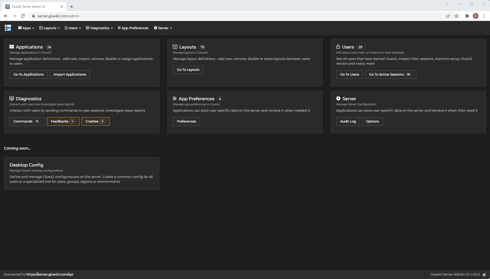

### Applications

The "Applications" section allows you to:

- see a list of all apps:

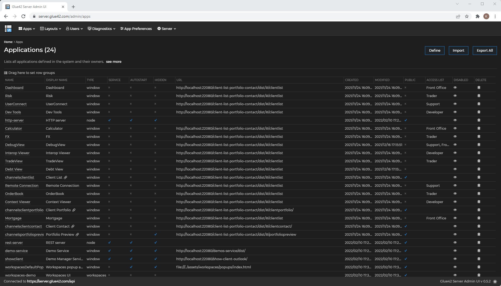

- see apps that are available to a specific user group:

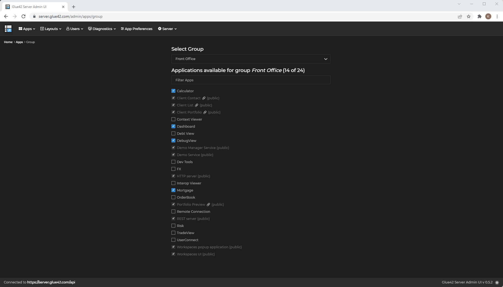

- see apps that are available to a specific user:

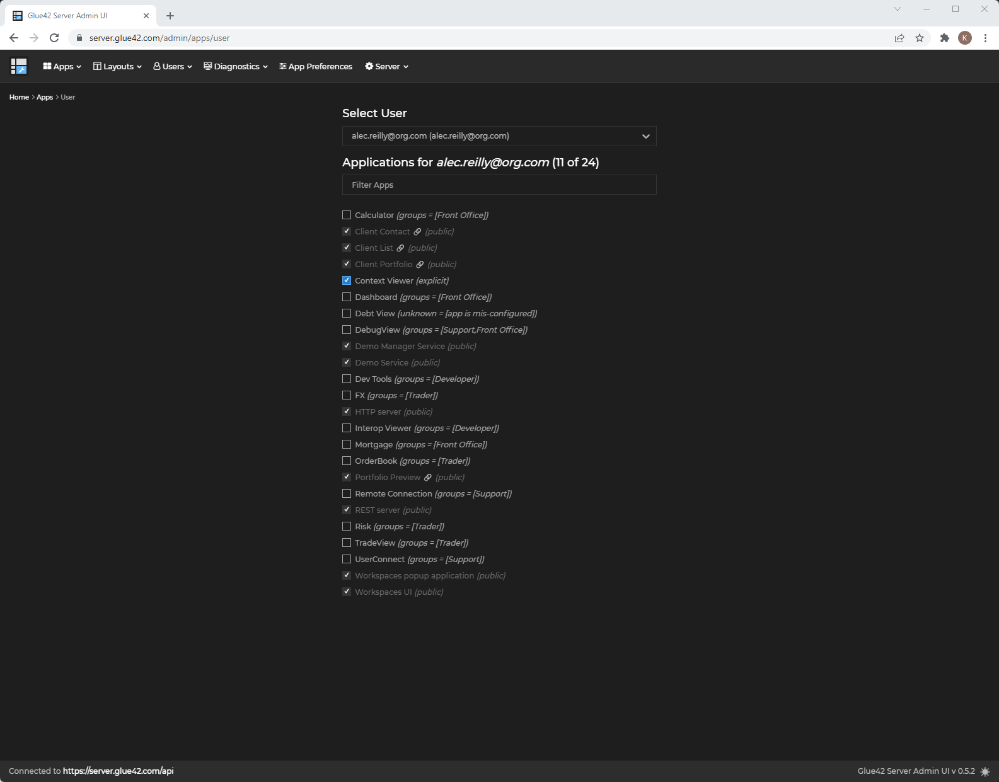

- import new apps:

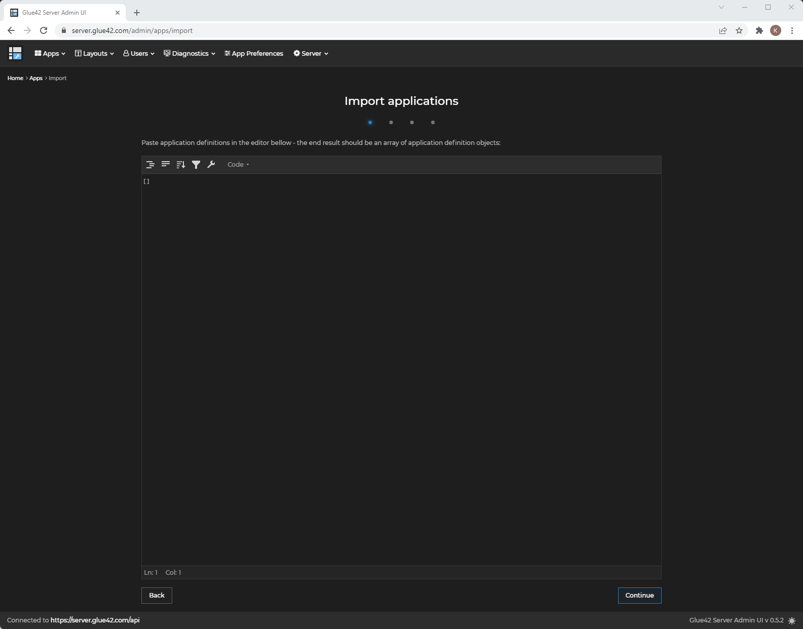

### Layouts

The "Layouts" section allows you to:

- see a list of all Layouts:

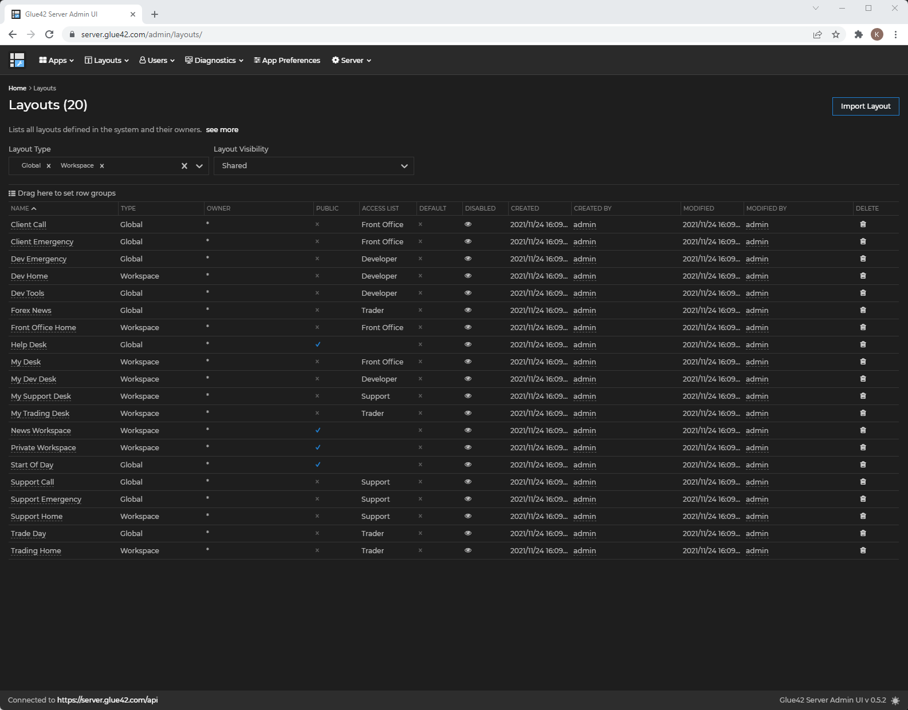

- see Layouts that are available to a specific user group:

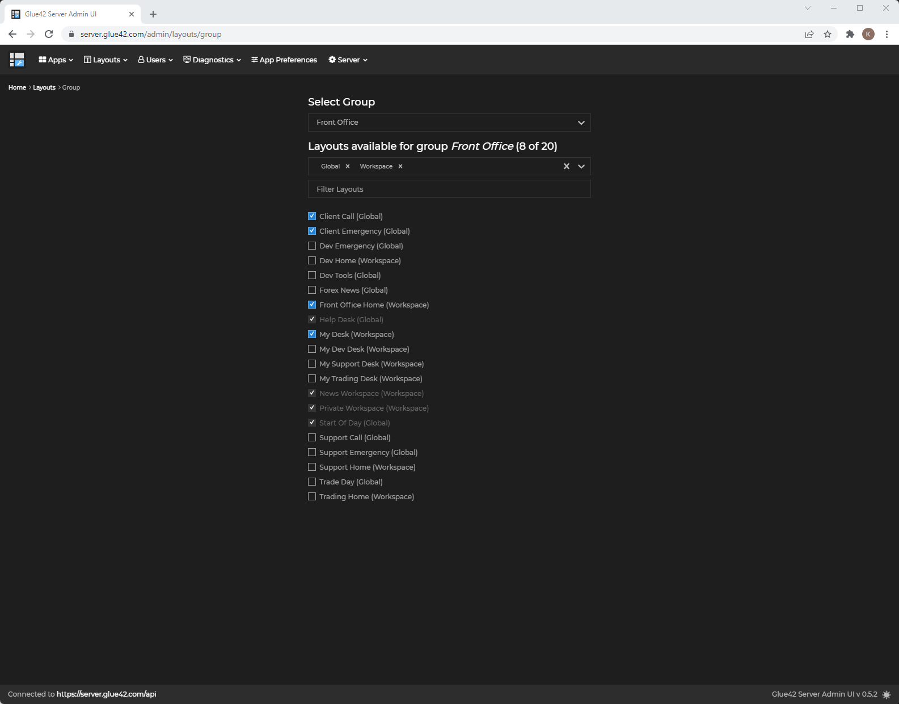

- import new Layouts:

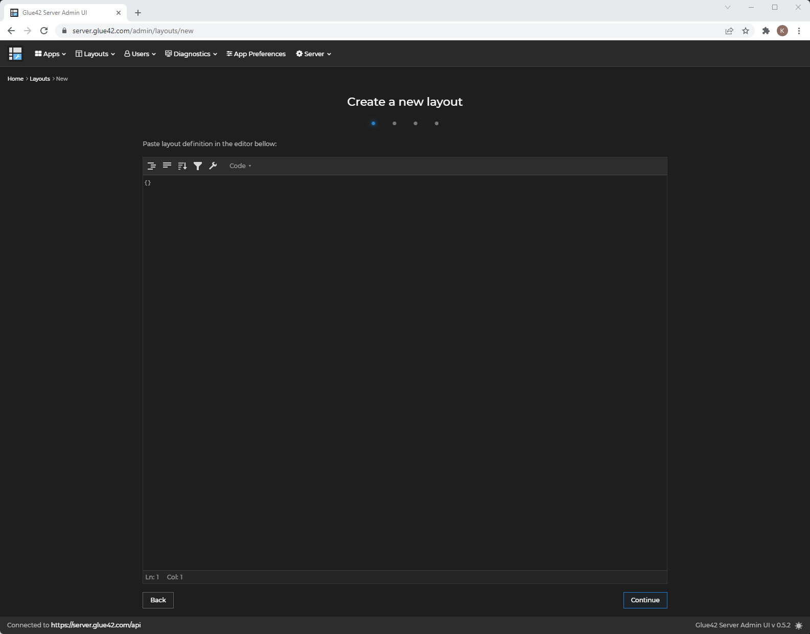

### Desktop Configs

<glue42 name="addClass" class="colorSection" element="p" text="Available since Glue42 Enterprise 3.17">

The "Desktop Configs" section allows you to add, edit and remove different versions of the [configuration files](../../developers/configuration/overview/index.html) for [**Glue42 Enterprise**](https://glue42.com/enterprise/). The remote configurations provided here will be merged with the locally available ones when [**Glue42 Enterprise**](https://glue42.com/enterprise/) is initialized.

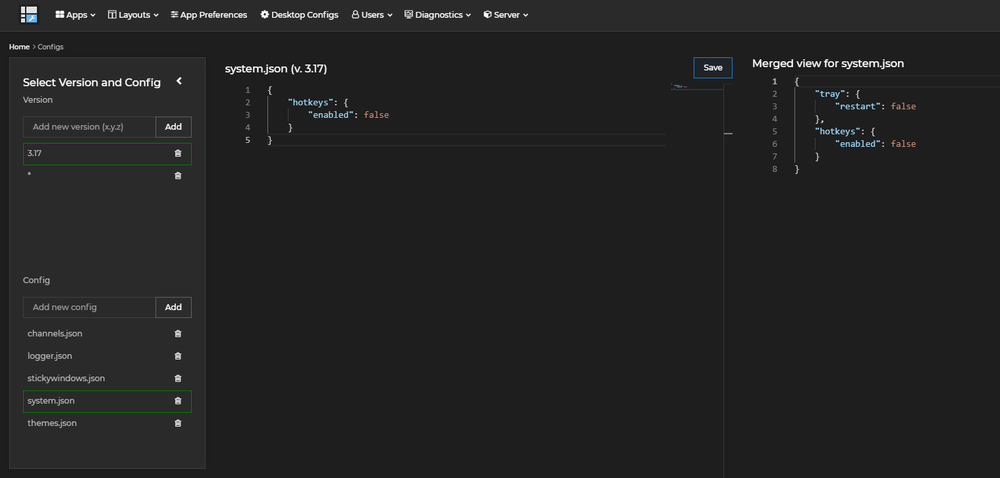

*For more details on how to enable [**Glue42 Enterprise**](https://glue42.com/enterprise/) to fetch configurations from a remote location, see the [How to Rebrand Glue42 Enterprise > Functionality > Remote Configurations](../../getting-started/how-to/rebrand-glue42/functionality/index.html#remote_configurations) section.*

Use the "Select Version and Config" panel on the left to add different [**Glue42 Enterprise**](https://glue42.com/enterprise/) versions. When you add a version, it appears on the list below the "Add new version" input field. When you click on a newly added version, empty templates for all configuration files of [**Glue42 Enterprise**](https://glue42.com/enterprise/) will appear automatically. You can also add other files manually by using the "Add new config" input field. Click on a file to edit it. The left editor section shows the currently edited file, while the right editor section shows the final merged version of the file (e.g., the files from a specific version named `3.17` will be merged with the same files from a base version named `*`).

*Note that merging is available only for top-level file properties. If you provide different values for the same top-level key in different file versions, the value in the most specific version will be taken into account when merging the files.*

The following demonstrates creating a specific version of the `system.json` file which contains a setting for disabling the [hotkeys](../glue42-platform-features/index.html#hotkeys) functionality of [**Glue42 Enterprise**](https://glue42.com/enterprise/). This version is automatically merged with the `system.json` file from an already existing version named `*`, in which there is a setting for disabling the "Restart" entry in the tray icon menu:

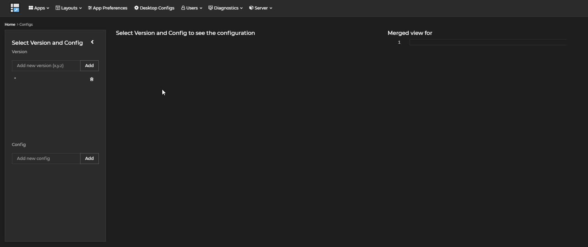

### Users

The "Users" section allows you to see all users that have connected to the server:

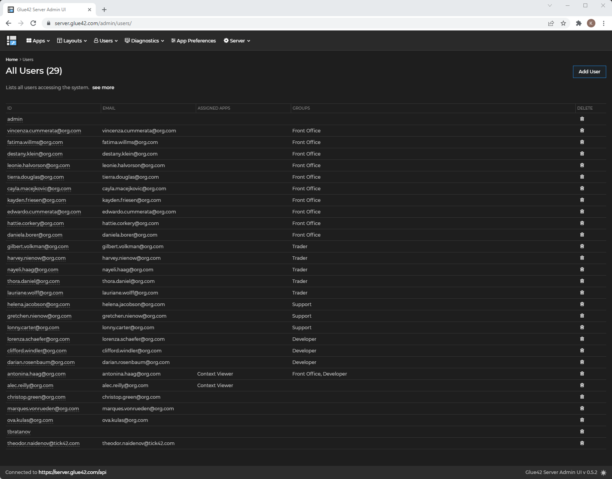

### Sessions

The "Sessions" section allows you to monitor all user sessions:

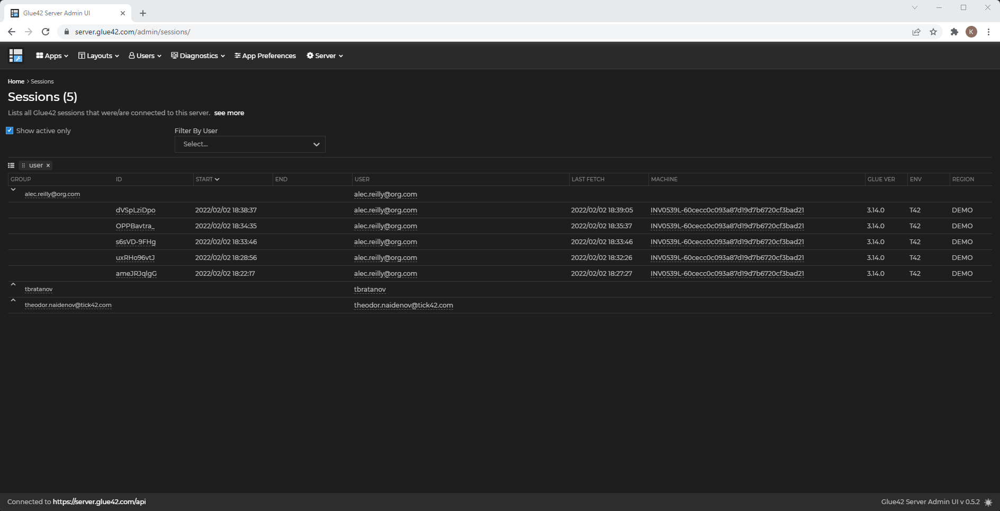

### Commands

The "Commands" section allows you to send commands to a specific user session:

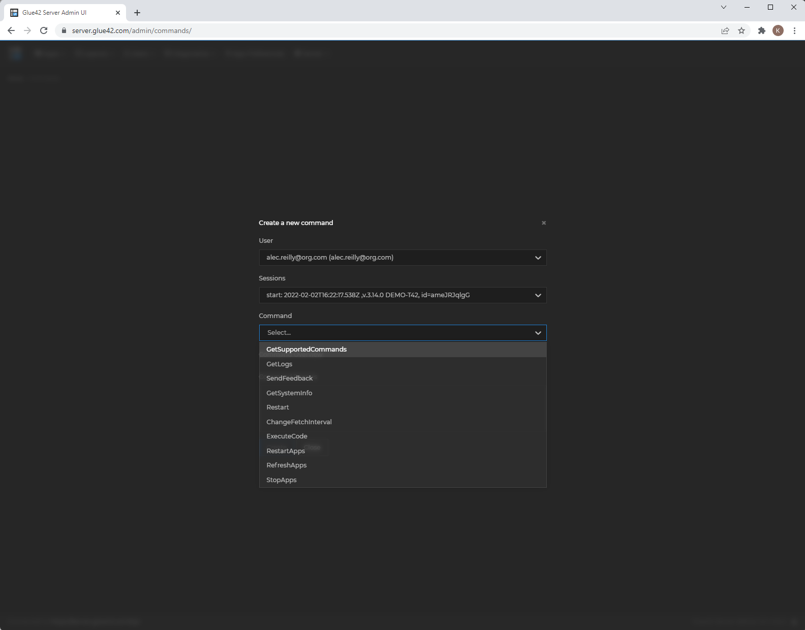

### Feedback

The "Feedback" section allows you to see a list of all feedback items submitted by the users:

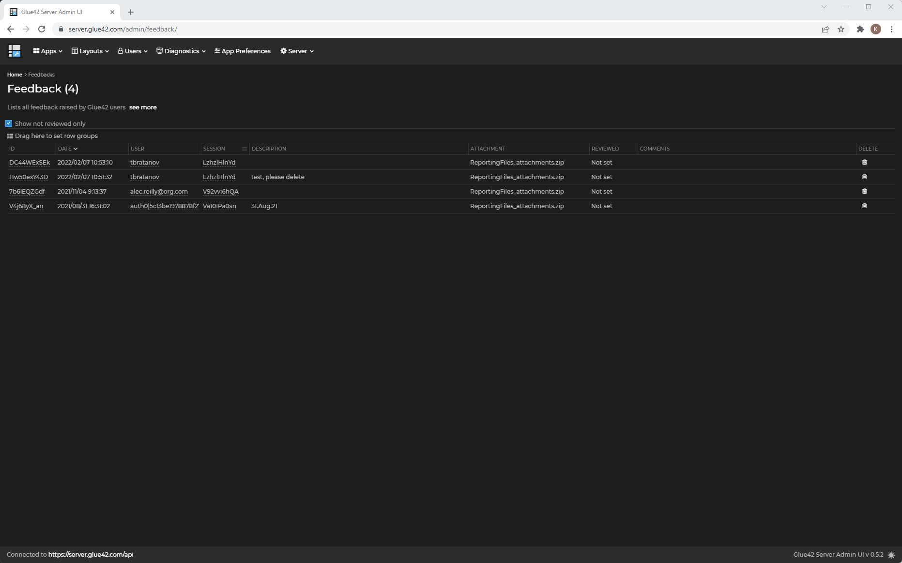

## Deployment

The Glue42 Server can be deployed on-premise and can run inside your organization network.

The deployment consists of the following:

- Glue42 Server - a NodeJS app, the actual server;
- Glue42 Server Admin UI - a React app that allows managing the data stored in the Glue42 Server;
- MongoDB database;

Docker images are available for the stock implementation. The Docker images allow you to deploy a stock version of the Glue42 Server.

If any customization is necessary, NPM packages exposing the Glue42 Server and the Glue42 Server Admin UI as modules are available. The modules provide extension points for different customizations like authentication and storage.

It is recommended to use the NPM packages as this approach is much more flexible.

### Using NPM Packages

#### Access

The NPM packages exposing the Glue42 Server and the Admin UI are hosted in a private NPM repository. To obtain access, [contact us](https://glue42.com/contacts/) at `info@glue42.com`.

#### Environment Setup

Generate an `.npmrc` file that will contain the authentication information for connecting to the private NPM repository. Make sure to exclude this file from your source control system.

To generate an `.npmrc` file:

- Login to [Glue42 JFROG](https://glue42.jfrog.io/).
- Expand the menu in top right.
- Click "Setup".
- Select "NPM".
- From the dropdown menu select `_default-npm-virtual_`.
- Copy the snippet.
- Create an `.npmrc` file with the copied contents.

#### MongoDB

The Glue42 Server uses [MongoDB](https://www.mongodb.com/) as a database. You must have a running MongoDB instance.

Now you can begin using the packages and start the server locally. For an example of how to run the Glue42 Server and the Admin UI using NPM packages and basic authentication, see the [Basic Server Example](https://github.com/Glue42/server-example-basic) repo on GitHub. Follow the instructions in the README file to start the Glue42 Server and the Admin UI.

## How to...

### Configure Glue42 Enterprise

To configure [**Glue42 Enterprise**](https://glue42.com/enterprise/) to connect to the Glue42 Server, use the `"server"` top-level key of the `system.json` configuration file, located in the `%LocalAppData%\Tick42\GlueDesktop\config` folder. Add the following configuration to enable connection to the Glue42 Server:

```json
{
    "server": {
        "enabled": true,
        "url": "http://localhost:4356/api"
    }
}
```

This will add the Glue42 Server as an additional app store. If you want the Glue42 Server to be the only app store, set the `"appStores"` top-level key to an empty array.

This will also instruct [**Glue42 Enterprise**](https://glue42.com/enterprise/) to store Layouts and App Preferences on the Glue42 Server.

If you want to send client crashes to the server, edit the `"output"` property of the `"crashReporter"` top-level key:

```json
{
    "crashReporter": {
        "output": {
            "type": "server",
            "serverUrl": "http://localhost:4356/api/crashes"
        }
    }
}
```

If you want to support different environments and regions that connect to different Glue42 Server instances, see the [How to Rebrand Glue42 Enterprise > Functionality > Environments & Regions](../../getting-started/how-to/rebrand-glue42/functionality/index.html#environments__regions) section.

### Add a Custom Authenticator

If your organization has an authentication mechanism that isn't supported by the Glue42 Server, you can implement plugins and build a custom version of the Glue42 Server and the Glue42 Server Admin UI that work with it.

The following steps must be executed in order to allow the Glue42 Server to work with your custom authentication mechanism:

1. Add a custom login page to [**Glue42 Enterprise**](https://glue42.com/enterprise/) - when the user logs in, this new page will add a token that will be used by the Glue42 Server to authenticate the user.

2. Implement a custom authenticator in the Glue42 Server.

3. Implement a custom authenticator in the Admin UI.

#### Custom Login Page

To add a custom login screen that will appear on [**Glue42 Enterprise**](https://glue42.com/enterprise/) startup to authenticate the user, edit the `"ssoAuth"` top-level key of the `system.json` file:

```json
{
    "ssoAuth": {
        "authController": "sso",
        "options": {
            "url": "<URL_TO_LOGIN_PAGE>",
            "window": {
                "width": 500,
                "height": 730,
                "mode": "flat"
            }
        }
    }
}
```

*For more details on setting up a custom login page and managing custom authentication, see the  [How to Rebrand Glue42 Enterprise > Functionality > Login Screen](../../getting-started/how-to/rebrand-glue42/functionality/index.html#login_screen) section.*

#### Custom Authenticator in the Glue42 Server

On the Glue42 Server, the custom authenticator should take care of authenticating requests based on a token passed by [**Glue42 Enterprise**](https://glue42.com/enterprise/):

```typescript
import { start, Config } from "@glue42/server";

export class Authenticator implements CustomAuthenticator {

    initialize(): void {
        // Will be called when initializing the Glue42 Server.
    };

    authenticate(req: Request, res: Response, next: (err?: Error, info?: User) => void): void {
        // A typical implementation would the following:
        // 1. Extract a token from the `req` object (e.g., from the authorization request header).
        // 2. Validate the token.
        // 3. Extract user info.
        // 3. Call the `next()` function.
    };
};

const startServer = async () => {
    const config: Config = {
        name: "test-server",
        port: 4356,
        store: {
            type: "mongo",
            connection: "mongodb://localhost:27017/server",
        },
        token: {
            secret: "mV|GuHok*+6N<C5~S|I0Wy^;Vg1!B~{KT4<U'@%6ZweX;]aw)|wkK5}QmodFl.s"
        },
        auth_method: "custom",
        auth_custom: new Authenticator(),
    };

    const server = await start(config);
};

startServer();
```

*For a full example, see the [Glue42 Server example](https://github.com/glue42/server-example) on GitHub.*

#### Custom Authenticator in the Admin UI

The following is a sample implementation of a custom authenticator for the Admin UI:

```typescript
import { AuthProvider } from "@glue42/server-admin-ui";

export class CustomAuthProvider implements AuthProvider {
    public isLoading = false;
    public isAuthenticated = true;
    public addTokenToRequest = true;
    public addCredentialsToRequest = false;
    public addUsernameToRequest = false;
    public error: any = undefined;

    public async loginIfNeeded(): Promise<void> {
        // Do nothing, `isAuthenticated` is hard-coded to `true`, so this is never called.
    };

    public async getAccessToken(): Promise<string | undefined> {
        return "test.token";
    };

    public async getUserInfo(): Promise<{ id?: string | undefined; } | undefined> {
        return {
            id: "test"
        };
    };
};
```

Plugging the custom authenticator in the Admin UI:

```javascript
// index.tsx
import React from "react";
import ReactDOM from "react-dom";

import AdminUI from "@glue42/server-admin-ui";
import "@glue42/theme";
import "@glue42/theme/dist/packages/rc-select.css";
import "@glue42/server-admin-ui/dist/src/styles/index.css";
import "@ag-grid-community/core/dist/styles/ag-grid.css";
import { LicenseManager } from "@ag-grid-enterprise/core";

LicenseManager.setLicenseKey("");

ReactDOM.render(
    <React.StrictMode>
        <AdminUI
            serverBase="http://localhost:4356"
            auth={new CustomAuthProvider()}
            theme="dark"
        />
    </React.StrictMode>,
    document.getElementById("root")
);
```