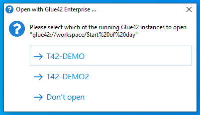
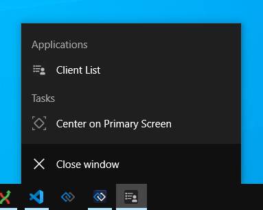

## Service Windows

Service windows are hidden windows which perform a specific supporting role for your apps. They can be configured as any normal window (name, URL, etc.), the difference being that UI configuration isn't necessary, as it is assumed that the purpose of these windows is to provide some background service to your apps. Therefore, the user doesn't need to see them or interact with them.

Service windows may be useful in many scenarios. For instance, you may have a number of apps that will receive and process data from several different providers. Instead of setting up each app to receive and then process the data from every provider, you can create a hidden service window which will communicate with the providers, collect the data, pre-process it and route it to the respective apps. This way, your apps will handle communication with only one end point, all the necessary data is consolidated, processed and filtered at one central data hub from where it can be sent to any window. Depending on your needs and goals, you can configure your service windows to auto start on system startup, or to start when an app requests that service. The service windows approach offers you additional flexibility and versatility in designing solutions for the app services you need.

<glue42 name="diagram" image="../../images/platform-features/service-windows.png">

There are different ways to configure a service window, depending on whether you want the window to be automatically started when [**Glue42 Enterprise**](https://glue42.com/enterprise/) is initiated. Use a combination of the following [app configuration](../../developers/configuration/application/index.html) properties to specify whether the window should be automatically started, invisible, or hidden from the [Glue42 Toolbar](../glue42-toolbar/index.html):

| Property | Type | Description |
|----------|------|-------------|
| `"service"` | `boolean` | If `true`, both the `"autoStart"` top-level key and the `"hidden"` property of the `"details"` object will be overridden and set to `true`. The window will be invisible and will start automatically on [**Glue42 Enterprise**](https://glue42.com/enterprise/) startup. |
| `"hidden"` | `boolean` | If `true`, the app won't be available in the [Glue42 Toolbar](../glue42-toolbar/index.html). |
| `"autoStart"` | `boolean` | If `true`, the window will be started automatically on [**Glue42 Enterprise**](https://glue42.com/enterprise/) startup. |
| `"details"` | `object` | Use the `"hidden"` Boolean property of the `"details"` object to set the window visibility. If `true`, the window will be invisible. |

*Note that when using the `"service"` property, it's pointless to use the `"autoStart"` top-level key and the `"hidden"` property of the `"details"` object, because the `"service"` key will override any values you may set for them.*

The following example demonstrates how to use the `"service"` and `"hidden"` top-level keys to configure a service window that will start automatically, will be invisible and hidden from the [Glue42 Toolbar](../glue42-toolbar/index.html):

```json
{
    "name": "service-window",
    "type": "window",
    "service": true,
    "hidden": true,
    "details": {
        "url": "https://example.com/my-service-window",
    }
}
```

The following example demonstrates how to use the `"hidden"` and `"autoStart"` top-level keys and the `"hidden"` property of the `"details"` top-level key to configure a service window that will be hidden from the [Glue42 Toolbar](../glue42-toolbar/index.html), won't start automatically and will be invisible:

```json
{
    "name": "service-window",
    "type": "window",
    "hidden": true,
    "autoStart": false,
    "details": {
        "url": "https://example.com/my-service-window",
        "hidden": true
    }
}
```

*Note that service windows aren't closed when restoring a [Layout](../windows/layouts/overview/index.html).*

*For more details, see the [Developers > Configuration > Application](../../developers/configuration/application/index.html#app_configuration-service_window) section and the [app configuration schema](../../assets/configuration/application.json).*

## Citrix Apps

<glue42 name="addClass" class="colorSection" element="p" text="Available since Glue42 Enterprise 3.12">

[**Glue42 Enterprise**](https://glue42.com/enterprise/) provides *experimental* support for Citrix Virtual Apps. Citrix apps can participate in the Glue42 environment as first-class citizens - they can be configured and added to the Glue42 Toolbar, saved in Layouts and Workspaces, and can use all Glue42 functionalities like Interop, Channels, etc.

Additionally, [**Glue42 Enterprise**](https://glue42.com/enterprise/) can be run as a Citrix Virtual App itself, in which case any other Virtual Apps from the same VDA can be configured as normal apps. See [Dynamic Gateway Port](../../developers/configuration/system/index.html#dynamic_gateway_port) for configuration specifics.

For more details on configuring a Citrix app, see the [Developers > Configuration > Application](../../developers/configuration/application/index.html#app_configuration-citrix_app) section. For details on configuring the system-wide Citrix Virtual Apps support, see the [System Configuration](../../developers/configuration/system/index.html#citrix_apps) section.

*Note that this feature is experimental – although it has been properly tested, additional tests and adjustments might be necessary for your specific Citrix environment.*

*Note that in order for [**Glue42 Enterprise**](https://glue42.com/enterprise/) to run Citrix Virtual Apps, Citrix Workspace must be installed on the user's machine and the user must be logged into it using their Citrix StoreFront URL and credentials. If you have access to a web-based StoreFront, you can configure your local Citrix Workspace by clicking on the "Activate" link in the settings or user preferences menu and running the downloaded file. The StoreFront SSL certificate must be trusted by the user's machine.*

### .NET Citrix Apps

To Glue42 enable a .NET Citrix app:

1. In your Visual Studio project, reference the `Glue42.dll` available in the [Glue42 NuGet package](https://www.nuget.org/packages/Glue42/).

2. Follow the standard procedure for [Glue42 enabling .NET apps](../../getting-started/how-to/glue42-enable-your-app/net/index.html).

3. After initializing Glue42, you can check whether your app is connected to Glue42 in the following manner:

```csharp
using Tick42.StartingContext;
if (InitializeOptions.IsCitrixGD)
{
    // Running in Citrix, connected to Glue42 Enterprise.
}
else if (InitializeOptions.IsCitrixVirtualApp)
{
    // Running in Citrix, not connected to Glue42 Enterprise.
}
```

When your Citrix app is connected to [**Glue42 Enterprise**](https://glue42.com/enterprise/), you may want to remove any custom window decorations, since the top-level window chrome will be handled by [**Glue42 Enterprise**](https://glue42.com/enterprise/).

4. Add `%**` to the app arguments in the Citrix Application Settings:


5. Configure your app as a [Glue42 Citrix app](../../developers/configuration/application/index.html#app_configuration-citrix_app).

You will now be able to run your .NET Citrix app from [**Glue42 Enterprise**](https://glue42.com/enterprise/) and interoperate with it using the various Glue42 APIs.

### Java Citrix Apps

To Glue42 enable a Java Citrix app:

1. Follow the standard procedure for [Glue42 enabling Java apps](../../getting-started/how-to/glue42-enable-your-app/java/index.html).

2. In the Citrix Application Settings, set the path to a `javaw.exe` or `java.exe` file, use standard VM arguments to launch your Java app, and add `%**` at the end of the app arguments:


3. Configure your app as a [Glue42 Citrix app](../../developers/configuration/application/index.html#app_configuration-citrix_app).

You will now be able to run your Java Citrix app from [**Glue42 Enterprise**](https://glue42.com/enterprise/) and interoperate with it using the various Glue42 APIs.

## Preload Scripts

<glue42 name="addClass" class="colorSection" element="p" text="Available since Glue42 Enterprise 3.13">

The [app configuration](../../developers/configuration/application/index.html) file allows you to specify preload scripts for an app. The preload scripts will be executed before the actual web app is loaded and before each `<iframe>` on the page. Use the `"preloadScripts"` array of the `"details"` top-level key in the app configuration file to define the scripts and they will be executed in the specified order. This allows for easily injecting Glue42 functionality into third-party web apps over which you have little to no control.

The following example demonstrates defining two preload scripts by providing their respective URLs:

```json
{
    "details": {
        "preloadScripts": [
            "https://my-domain.com/my-script.js",
            "https://my-domain.com/my-other-script.js"
        ]
    }
}
```

<glue42 name="addClass" class="colorSection" element="p" text="Available since Glue42 Enterprise 3.15">

Preload scripts can be defined globally in the [system configuration](../../developers/configuration/system/index.html) of [**Glue42 Enterprise**](https://glue42.com/enterprise/). Use the `"preloadScripts"` property of the `"windows"` top-level key in the `system.json` file:

```json
{
    "windows": {
        "preloadScripts": [
            "https://my-domain.com/my-script.js",
            "https://my-domain.com/my-other-script.js"
        ]
    }
}
```

## Global Protocol Handler

<glue42 name="addClass" class="colorSection" element="p" text="Available since Glue42 Enterprise 3.12">

When you install [**Glue42 Enterprise**](https://glue42.com/enterprise/), it is registered as the default handler of the Glue42 global protocol. The protocol is in the following format:

```cmd
glue42://<option>/<identifier>[?args&args]
```

*To pass arguments when employing the different options of the Glue42 global protocol, use a single `?` after the identifier, except with `url` - use double `??` when passing arguments for the `url` protocol option. Use `&` between the arguments when specifying more than one argument.*

The Glue42 global protocol allows you to create and send links which will open a URL in a Glue42 Window. You can also create links that will start a Glue42 enabled app, load a specified Workspace or Layout and even invoke Interop methods with custom arguments.

When the link is clicked, [**Glue42 Enterprise**](https://glue42.com/enterprise/) will be started in order to handle it. If an instance of [**Glue42 Enterprise**](https://glue42.com/enterprise/) is already running, it will be reused. If multiple instances are running (e.g., in different environments), then the user will be presented with a dialog from which to choose the Glue42 instance that will handle the link:



### Configuration

The Glue42 global protocol can be configured from the `system.json` file of [**Glue42 Enterprise**](https://glue42.com/enterprise/) using the `"potocolHandler"` top-level key:

```json
{
    "protocolHandler": {
        "enabled": true,
        "allowOpeningURLs": {
            "allowed": ["https://glue42.com"],
            "forbidden": ["https://youtube.com/.*", "https://facebook.com/.*"]
        }
    }
}
```

The `"protocolHandler"` key has the following properties:

| Property | Type | Description |
|----------|------|-------------|
| `"enabled"` | `boolean` | If `true` (default), will enable the Glue42 global protocol handler. |
| `"protocol"` | `string` | Custom name for the protocol prefix. Defaults to `"glue42"`. |
| `"startNewInstance"` | `object` | If enabled, a new instance of Glue42 will be started when opening links with the Glue42 protocol handler. |
| `"allowOpeningURLs"` | `boolean` \| `object` | If `true`, will allow handling all URLs. Can also be set to an object containing a list of allowed or forbidden URLs for the Glue42 global protocol handler. |

The `"startNewInstance"` object has the following properties:

| Property | Type | Description |
|----------|------|-------------|
| `"enabled"` | `boolean` | If `true` (default), will allow starting a new instance of Glue42 when opening links with the Glue42 protocol handler. |
| `"defaultExecutable"` | `object` | An object with two properties - `"path"` and `"args"`. The `"path"` property accepts a string path to an executable file that will be started if no other Glue42 instance is running. Defaults to the Glue42 executable file. The `"args"` property accepts a string array with items, each item representing a command line argument. Defaults to an empty array. Note that if you point the `"path"` property to a script file that in turn will launch [**Glue42 Enterprise**](https://glue42.com/enterprise/), then you must pass the startup arguments from the script to [**Glue42 Enterprise**](https://glue42.com/enterprise/). |
| `"errorMessage"` | `string` | Message that will override the default error message displayed when starting a new Glue42 instance is disabled. |

The `"allowOpeningURLs"` property can be set to an object with the following properties:

| Property | Type | Description |
|----------|------|-------------|
| `"allowed"` | `string[]` | List of allowed URLs. All other URLs will be forbidden. |
| `"forbidden"` | `string[]` | List of forbidden URLs. All other URLs will be allowed. |

You can use exact URL values or regular expressions to specify allowed and forbidden URLs.

### Protocol Options

The Glue42 global protocol can be used in different formats depending on what you want to do.

#### Apps

To start a Glue42 enabled app, use the `app` protocol option and pass the app name:

```cmd
glue42://app/clientlist
```

To pass startup options for a Glue42 enabled app, use `?` after the app identifier and `&` before each settings. The following example demonstrates passing a location and context for the started app:

```cmd
glue42://app/clientlist?left=100&context.clientID=1
```

*To specify a property of an object as an option, use the standard dot notation - e.g., `context.clientID=42`.*

#### Layouts

To restore a Global Layout, use the `layout` protocol option and pass the name of the Layout:

```cmd
glue42://layout/StartOfDay
```

#### Workspaces

To open a Workspace, use the `workspace` protocol option and pass the Workspace name:

```cmd
glue42://workspace/StartOfDay
```

To pass context for the Workspace, use `context`:

```cmd
glue42://workspace/StartOfDay?context.clientID=1
```

*To specify a property of an object as an option, use the standard dot notation - e.g., `context.clientID=42`.*

#### Glue42 Windows

To open a URL in a Glue42 Window, use the `url` protocol option and pass the URL:

```cmd
glue42://url/https://google.com 
```

To specify [Glue42 Window settings](../../reference/glue/latest/windows/index.html#WindowSettings) when opening a URL, use `??` after the URL and `&` before each setting. The following example demonstrates passing a location for the newly opened window:

```cmd
glue42://url/https://google.com??left=100&top=200
```

*To specify a property of an object as a setting, use the standard dot notation - e.g., `downloadSettings.autoSave=false`.*

#### Interop Methods

To invoke an Interop method, use the `invoke` protocol option and pass the method name:

```cmd
glue42://invoke/Shutdown
```

To pass arguments and/or target when invoking an Interop method, use `args` and `target`:

```cmd
glue42://invoke/ShowClient?args.clientId=1&target=best
```

## Jump List

<glue42 name="addClass" class="colorSection" element="p" text="Available since Glue42 Enterprise 3.15">

The jump list is a configurable categorized list of actions that can be shown in the context menu when the user right-clicks on a taskbar icon of a Glue42 enabled app or a group of such icons:



Currently, only one predefined action is supported - centering an app or a group of app instances on the primary screen. This action is extremely useful when you have many windows open on multiple displays and can't find the app you need. Use this action to find an app that: you may have moved to another screen or outside the screen bounds altogether; may be hidden behind other windows; may have been resized and become too small to notice; or may have simply blended visually with other apps:


**Configuration**

The jump list can be enabled, disabled and configured globally and per app. The [app configuration](../../developers/configuration/application/index.html) will override the global [system configuration](../../developers/configuration/system/index.html).

To configure the jump list system-wide, use the `"jumpList"` property of the `"windows"` top-level key in the `system.json` file of [**Glue42 Enterprise**](https://glue42.com/enterprise/). The following is the default system jump list configuration:

```json
{
    "windows": {
        "jumpList": {
            "enabled": true,
            "categories": [
                {
                    "title": "System",
                    "actions": [
                        {
                            "icon": "%GDDIR%/assets/images/myIcon.ico",
                            "type": "centerScreen",
                            "singleInstanceTitle": "Center on Primary Screen",
                            "multiInstanceTitle": "Center all on Primary Screen"
                        }
                    ]
                }
            ]
        }
    }
}
```

The `"jumpList"` object has the following properties:

| Property | Type | Description |
|----------|------|-------------|
| `"enabled"` | `boolean` | If `true` (default), will enable the jump list. |
| `"categories"` | `object[]` | Categorized lists with actions to execute when the user clicks on them. |

Each object in the `"categories"` array has the following properties:

| Property | Type | Description |
|----------|------|-------------|
| `"title"` | `string` | Title of the category to be displayed in the context menu. |
| `"actions"` | `object[]` | List of actions contained in the category. |

Each object in the `"actions"` array has the following properties:

| Property | Type | Description |
|----------|------|-------------|
| `"icon"` | `string` | Icon for the action to be displayed in the context menu. Must point to a local file. |
| `"type"` | `string` | Type of the action to execute. |
| `"singleInstanceTitle"` | `string` | Title of the action to be displayed in the context menu when there is a single instance with a single taskbar icon. |
| `"multiInstanceTitle"` | `string` | Title of the action to be displayed in the context menu when there are multiple instances with grouped taskbar icons. |

To override the system configuration per app, use the `"jumpList"` property of the `"details"` top-level key in the [app configuration](../../developers/configuration/application/index.html) file. The following example demonstrates how to disable the jump list for an app:

```json
{
    "title": "My App",
    "type": "window",
    "name": "my-app",
    "details": {
        "url": "https://downloadtestfiles.com/",
        "jumpList": {
            "enabled": false
        }
    }
}
```

*Note that currently the jump list isn't available for Java apps, [Workspaces](../windows/workspaces/overview/index.html) and apps in [web groups](../windows/window-management/overview/index.html#window_groups-web_groups).*

## Downloading Files

[**Glue42 Enterprise**](https://glue42.com/enterprise/) allows for files to be downloaded by clicking on a link in the web page or by invoking an [Interop](../data-sharing-between-apps/interop/javascript/index.html#method_invocation) method.


**Configuration**

The file download behavior is controlled by the system configuration. It can be alternatively overridden by the app configuration. The system download behavior configuration can be set in the `system.json` file of [**Glue42 Enterprise**](https://glue42.com/enterprise/) from the `"downloadSettings"` property of the `"windows"` top-level key:

System configuration example:

```json
{
    "windows" {
        "downloadSettings": {
            "autoSave": true,
            "autoOpenPath": false,
            "autoOpenDownload": false,
            "enable": true,
            "enableDownloadBar": true,
            "path": "%DownloadsFolder%"
        }
    }
}
```

The `"downloadSettings"` object has the following properties:

| Property | Type | Description |
|----------|------|-------------|
| `"autoSave"` | `boolean` | If `true`, will auto save the file (without asking the user where to save it). If `false`, a system save dialog will appear. |
| `"autoOpenPath"` | `boolean` | If `true`, will open the folder that contains the downloaded file after the download is completed. |
| `"autoOpenDownload"` | `boolean` | If `true`, will open the download file after the download is completed. |
| `"enable"` | `boolean` | If `true`, enables the window to download files. |
| `"enableDownloadBar"` | `boolean` | If `true`, a download bar tracking the progress will appear at the bottom of the window when downloading. If `false`, the download process will be invisible. |
| `"path"` | `string` | Path where the downloaded file will be saved. Due to security reasons, it is only possible to provide two download paths: the Windows "Temp" or "Downloads" folder. |

You can also override the default system download behavior in the app configuration JSON file:

```json
{
    "title": "Download Test Files",
    "type": "window",
    "name": "download-test-files",
    "details": {
        "url": "https://downloadtestfiles.com/",
        "top": 100,
        "left": 400,
        "width": 800,
        "height": 800,
        "allowCollapse": false,
        "startLocation": "center",
        "downloadSettings": {
            "autoSave": false
        }
    }
}
```

**Clicking on a Link in the Web Page**

When a user clicks on a download link in the website, the download will start and [**Glue42 Enterprise**](https://glue42.com/enterprise/) will show the download bar in the page.

The user has options to:

- cancel the download;
- pause and later resume the download;
- open the downloaded file in the containing folder;

**Invoking an Interop Method**

On startup, [**Glue42 Enterprise**](https://glue42.com/enterprise/) registers an Interop method `"T42.Wnd.DownloadFile"` which you can [invoke](../data-sharing-between-apps/interop/javascript/index.html#method_invocation) with the following arguments in order to download files programmatically:

| Parameter | Type | Description |
|-----------|------|-------------|
| `url` | `string` | **Required**. Download link.|
| `name` | `string` | *Optional*. File name. |
| `path` | `string` | *Optional*. Location for the file. |
| `autoOpenDownload` | `boolean` | *Optional*. If `true`, will open the file after download. Defaults to `false`. |
| `autoOpenPath` | `boolean` | *Optional*. If `true`, will open the location of the file. Defaults to `false`. |

When downloading the selected file, the cookies for that domain are taken and sent together with the request.

*Note that if the file name already exists, the downloaded file will be saved with an incremented number in the name (e.g., `my-docs(2).pdf`).*

**Using the Window Management API**

Download settings can also be specified using the [Window Management](../windows/window-management/javascript/index.html) API (for more details, see [Downloads](../windows/window-management/javascript/index.html#window_settings-downloads).

## Opening URLs in the Default Browser

<glue42 name="addClass" class="colorSection" element="p" text="Available since Glue42 Enterprise 3.13">

[**Glue42 Enterprise**](https://glue42.com/enterprise/) comes with a predefined app which can be used to open a URL in the default browser using the [App Management API](../application-management/overview/index.html). The following example shows how to open a URL in the default browser by using the [JavaScript App Management API](../application-management/javascript/index.html).

Get the [`Application`](../../reference/glue/latest/appmanager/index.html#Application) instance by passing the name of the app - `"open-browser"`, invoke the [`start`](../../reference/glue/latest/appmanager/index.html#Application-start) method to start the app and pass a starting context with a `url` property holding the URL:

```javascript
const url = "https://glue42.com";

await glue.appManager.application("open-browser").start({ url });
```

*Note that only URLs with HTTP or HTTPS protocols can be opened.*

## Web App Search

<glue42 name="addClass" class="colorSection" element="p" text="Available since Glue42 Enterprise 3.11">

Search in web apps opened in Glue42 Windows just like in a browser with the `CTRL + F` command:


Use `ENTER` and `SHIFT + ENTER` to scroll through the results. Click `ESC` to close the search bar.

## Context Menu

[**Glue42 Enterprise**](https://glue42.com/enterprise/) has a right-click context menu available in all Glue42 apps for which it has been enabled. It offers standard cut/copy/paste actions, zoom and spelling controls:


Enable the context menu:

- globally for all apps, under the `"windows"` top-level key in the `system.json` file:

```json
{
    "windows": {
        "contextMenuEnabled": true
    }
}
```

- per app, under the `"details"` top-level key of the app configuration file:

```json
[
    {
        "details": {
            "contextMenuEnabled": true
        }
    }
]
```

## Hotkeys

The Hotkeys API allows apps to register key combinations and receive notifications when a key combination is pressed by the user irrespective of whether the app is on focus or not. Hotkeys is useful for web apps that don't have access to system resources and can't register global shortcuts.

### Configuration

You can control the hotkeys behavior from the `system.json` file under the `"hotkeys"` top-level key. You can find the `system.json` in the `%LocalAppData%\Tick42\GlueDesktop\config` folder.

Hotkeys configuration example:

```json
{
    "hotkeys": {
        "enabled": true,
        "blacklist": ["appManager"],
        "reservedHotkeys": ["ctrl+c", "ctrl+p", "ctrl+s"]
    }
}
```

The hotkeys object has the following properties:

| Property | Type | Description |
|----------|------|-------------|
| `"enabled"` | `boolean` | If `true`, hotkeys will be enabled. |
| `"whitelist"` | `string[]` | List of apps that can register hotkeys. Any app not on the list won't be able to register hotkeys. |
| `"blacklist"` | `string[]` | List of apps that can't register hotkeys. Any app not on the list will be able to register hotkeys. |
| `"reservedHotkeys"` | `string[]` | List of reserved (system or other) hotkeys that can't be overridden by other apps. |

### Hotkeys API

The Hotkeys API is accessible through the [`glue.hotkeys`](../../reference/glue/latest/hotkeys/index.html) object. To register a hotkey, your app must be using a Glue42 JavaScript version newer than 4.3.5.

To register a hotkey, use the [`register()`](../../reference/glue/latest/hotkeys/index.html#API-register) method:

```javascript
// Define a hotkey object.
const hotkeyDefinition = {
    hotkey: "shift+alt+c",
    description: "Open Client Details"
};

// This function will be invoked when the hotkey is pressed.
const hotkeyHandler = () => {
    glue.appManager.application("Client Details").start();
};

// Register the hotkey.
await glue.hotkeys.register(hotkeyDefinition, hotkeyHandler);
```

To remove a hotkey, use the [`unregister()`](../../reference/glue/latest/hotkeys/index.html#API-unregister) and pass the value of the hotkey combination as an argument:

```javascript
await glue.hotkeys.unregister("shift+alt+c");
```

To remove all hotkeys registered by your app, use the [`unregisterAll()`](../../reference/glue/latest/hotkeys/index.html#API-unregisterAll) method:

```javascript
await glue.hotkeys.unregisterAll();
```

To check if your app has registered a specific hotkey, use the [`isRegistered()`](../../reference/glue/latest/hotkeys/index.html#API-isRegistered) method:

```javascript
// Returns a Boolean value.
const isRegistered = glue.hotkeys.isRegistered("shift+alt+c");
```

### Hotkeys View

There is a utility view that allows you to see all hotkeys registered by different apps. You can open it from the [**Glue42 Enterprise**](https://glue42.com/enterprise/) tray icon menu - right-click on the tray icon to display the menu. When you click on the Hotkeys item you will see a list of the hotkeys registered by your app:


For a complete list of the available Hotkeys API methods and properties, see the [Hotkeys API Reference Documentation](../../reference/glue/latest/hotkeys/index.html).

## Zooming

[**Glue42 Enterprise**](https://glue42.com/enterprise/) supports zooming in and out of windows of JavaScript apps. Zooming can be controlled via configuration (system-wide or per app) or programmatically via the available methods/properties of a window instance.

You can zoom in and out of windows in several ways:

- `CTRL + =` (zoom in) and `CTRL + -` (zoom out);
- `CTRL + MOUSE SCROLL`;
- `CTRL + 0` - resets to the default zoom factor;
- mouse pad gestures;
- using the right-click context menu (if enabled);

*Note that zooming is based on domain - i.e., if you open two apps with the same domain and change the zoom factor of one of them, the zoom factor of the other will change accordingly.*


### Configuration

You can configure window zooming system-wide from the `system.json` file in the `%LocalAppData%\Tick42\GlueDesktop\config` folder. Use the `"zoom"` property under the `"windows"` top-level key:

```json
{
    "windows": {
        "zoom": {
            "enabled": true,
            "mouseWheelZoom": true,
            "factors": [25, 33, 50, 67, 75, 80, 90, 100, 110, 125, 150, 175, 200, 250, 300, 400, 500],
            "defaultFactor": 100
        }
    }
}
```

| Property | Type | Description |
|----------|------|-------------|
| `"enabled"` | `boolean` | If `true`, zooming will be enabled. |
| `"mouseWheelZoom"` | `boolean` | If `true`, will enable zooming with `CTRL` + `mouse scroll`. |
| `"factors"` | `number[]` | List of zoom factors to be used when the user zooms in or out of the window. The factors must be in ascending order and may have integer or floating point values. Zooming will only work with factor values within the range of 25 to 500. Avoid passing negative values when setting the zoom factor (via configuration or programmatically), as this will cause unexpected behavior.|
| `"defaultFactor"` | `number` | Default zoom factor within the range of 25 to 500. Avoid negative values. |

You can also enable zooming per app which will override the system-wide zoom configuration. Use the `"zoom"` property under the `"details"` top-level key of the app configuration file:

```json
[
    {
        "title": "MyApp",
        "type": "window",
        "name": "myApp",
        "details": {
            "url": "http://localhost:22080/my-app/index.html",
            "zoom": {
                "enabled": true,
                "mouseWheelZoom": true,
                "factors": [25, 33, 50, 67, 75, 80, 90, 100, 110, 125, 150, 175, 200, 250, 300, 400, 500],
                "defaultFactor": 100
            }
        }
    }
]
```

### Using Zoom Programmatically

There are several methods and properties exposed on the window instance, which you can use to control zoom behavior.

Get the current zoom factor:

```javascript
const win = glue.windows.my();

console.log(win.zoomFactor);
```

Zoom in:

```javascript
// Will zoom in the window to the next factor in the "factors" array.
await win.zoomIn();
```

Zoom out:

```javascript
// Will zoom out the window to the previous factor in the "factors" array
await win.zoomOut();
```

Set a desired zoom factor:

```javascript
await win.setZoomFactor(number);
```

Carefully consider all cases if you intend to pass a zoom factor value based on a logic in your app. Negative values will cause unexpected behavior. Passing positive values lower than 25 will cause zoom out with a factor of 25, positive values higher than 500 will cause zoom in with a factor of 500 and passing zero as a factor will preserve the previous zoom factor.

Listening for zoom factor changes:

```javascript
// Returns a function which you can use to unsubscribe from events for zoom factor changes.
const unsubscribe = win.onZoomFactorChanged(w => {
    console.log(`Zoom factor changed to ${w.zoomFactor}`)
});

unsubscribe();
```

## Displays

<glue42 name="addClass" class="colorSection" element="p" text="Available since Glue42 Enterprise 3.9">

[**Glue42 Enterprise**](https://glue42.com/enterprise/) provides a way for apps to programmatically capture screenshots of the available monitors. Based on custom logic you can capture one or all monitors in order to save a snapshot of the visual state at a given moment.

### Configuration

To enable display capturing you must add the `"allowCapture"` property to your app configuration file and set it to `true`.

```json
{
    "name": "MyApp",
    "type": "window",
    "allowCapture": true,
    "details": {
        "url": "http://localhost:3000"
    }
}
```

### Displays API

The Displays API is accessible through the [`glue.displays`](../../reference/glue/latest/displays/index.html) object.

#### All Displays

To get all displays, use the [`all()`](../../reference/glue/latest/displays/index.html#API-all) method. It returns an array of all available [`Display`](../../reference/glue/latest/displays/index.html#Display) objects:

```javascript
const allDsiplays = await glue.displays.all();
```

#### Primary Display

You can get the primary display with the [`getPrimary()`](../../reference/glue/latest/displays/index.html#API-getPrimary) method:

```javascript
// Returns the primary display.
const primaryDisplay =  await glue.displays.getPrimary();
```

Example of finding and capturing the primary display:

```javascript
const display = await glue.displays.getPrimary();
const screenshot = await display.capture({ scale:0.5 });
```

#### Specific Display

To get a specific display, use the [`get()`](../../reference/glue/latest/displays/index.html#API-get) method. It accepts a display ID as an argument and resolves with a [`Display`](../../reference/glue/latest/displays/index.html#Display) object:

```javascript
const displayID = 2528732444;

// returns a display by ID
const display = await glue.displays.get(displayID);
```

#### The Display Object

The [`Display`](../../reference/glue/latest/displays/index.html#Display) object has the following properties:

| Property | Description |
|----------|-------------|
| `id` | Unique identifier associated with the display. |
| `bounds` | A [`Bounds`](../../reference/glue/latest/displays/index.html#Bounds) object with `height`, `width`, `left` and `top` properties, describing the bounds of the display. |
| `workArea` | A [`Bounds`](../../reference/glue/latest/displays/index.html#Bounds) object describing the working area of the display (the desktop area, excluding taskbars, docked windows and toolbars). |
| `dpi` | Dots per inch resolution of the display. |
| `isPrimary` | A `boolean` value specifying whether this is the primary display. |
| `index` | Index assigned to the display by the operating system. |
| `name` | Name assigned to the display by the operating system. |
| `aspectRatio` | Display aspect ratio (e.g., 16:9). |
| `scaleFactor` | The scale factor of the returned display (e.g., 1.25 = 125%). |

#### Capturing All Displays

To capture all displays, use the [`captureAll()`](../../reference/glue/latest/displays/index.html#API-captureAll) method. It accepts a [`CaptureAllOptions`](../../reference/glue/latest/displays/index.html#CaptureAllOptions) object and returns a Base64 encoded string or an array of Base64 encoded strings depending on the specified [`combined`](../../reference/glue/latest/displays/index.html#CaptureAllOptions-combined) option.

The following example demonstrates how to capture all available displays and combine the screenshots into a single image with `width` set to 2000 pixels. The aspect ratio of the combined images will be preserved (the omitted [`keepAspectRatio`](../../reference/glue/latest/displays/index.html#AbsoluteSizeOptions-keepAspectRatio) property in the `size` object defaults to `true`) and the images will be arranged the way you have arranged your displays from your operating system settings:

```javascript
const screenshot = await glue.displays.captureAll({ combined: true, size: { width: 2000 } });
```

The [`CaptureAllOptions`](../../reference/glue/latest/displays/index.html#CaptureAllOptions) object has the following properties:

| Property | Type | Description |
|----------|------|-------------|
| `combined` | `boolean` | **Required**. If `true`, will return a single image of all captured displays. If `false`, will return separate images for all captured displays. |
| `size` | `object` | *Optional*. Accepts either a [`ScaleOptions`](../../reference/glue/latest/displays/index.html#ScaleOptions) or an [`AbsoluteSizeOptions`](../../reference/glue/latest/displays/index.html#AbsoluteSizeOptions) object, specifying the size of the output image. |

#### Capturing a Single Display

To capture a single display, use the `capture()` method at top level of the API or on a [`Display`](../../reference/glue/latest/displays/index.html#Display) instance.

When you use the [`capture()`](../../reference/glue/latest/displays/index.html#API-capture) method at top level of the API, pass a [`CaptureOptions`](../../reference/glue/latest/displays/index.html#CaptureOptions) object. The following example demonstrates how to use the display ID to find and capture the desired display and also how to specify capturing options. The `width` and `height` of the output image will be half the width and height of the captured monitor. The captured image is returned as a Base64 encoded string:

```javascript
const displayID = 2528732444;
const captureOptions = {
    id: displayID,
    size: { scale: 0.5 }
}

const screenshot = await glue.displays.capture(captureOptions);
```

The [`CaptureOptions`](../../reference/glue/latest/displays/index.html#CaptureOptions) object has the following properties:

| Property | Type | Description |
|----------|------|-------------|
| `id` | `number` | **Required**. ID of the targeted display. |
| `size` | `object` | *Optional*. Accepts either a [`ScaleOptions`](../../reference/glue/latest/displays/index.html#ScaleOptions) or an [`AbsoluteSizeOptions`](../../reference/glue/latest/displays/index.html#AbsoluteSizeOptions) object, specifying the size of the output image. |

The [`ScaleOptions`](../../reference/glue/latest/displays/index.html#ScaleOptions) object has only one property - `scale`, which accepts a number. The value you pass to it specifies the size of the output image relative to the actual screen size. For instance, if you use `scale: 0.5` the height and width of the output image will be half the height and width of the captured screen.

The [`AbsoluteSizeOptions`](../../reference/glue/latest/displays/index.html#AbsoluteSizeOptions) object has the following properties, all of which are optional:

| Property | Type | Description |
|----------|------|-------------|
| `width` | `number` | Specifies the width of the output image. Defaults to the captured display width. |
| `height` | `number` | Specifies the height of the output image. Defaults to the captured display height. |
| `keepAspectRatio` | `boolean` | Whether to keep the aspect ratio of the output image when you specify `width` and/or `height` of the output image. If `true` and both `width` and `height` are set, then the specified `width` will be used as a basis for the output image aspect ratio. |

When you use the [`capture()`](../../reference/glue/latest/displays/index.html#Display-capture) method of a [`Display`](../../reference/glue/latest/displays/index.html#Display) instance, pass either a [`ScaleOptions`](../../reference/glue/latest/displays/index.html#ScaleOptions) or an [`AbsoluteSizeOptions`](../../reference/glue/latest/displays/index.html#AbsoluteSizeOptions) object, specifying the size of the output image. The following example demonstrates how to find and capture all non-primary displays:

```javascript
const screenshots = await Promise.all(
            // Get all displays.
            (await glue.displays.all())
            // Filter out the primary display.
            .filter(display => !display.isPrimary)
            .map(display => display.capture({ scale: 0.5 })));
```

#### Capturing Windows and Window Groups

You can use the [`capture()`](../../reference/glue/latest/windows/index.html#GDWindow-capture) method of a Glue42 Window instance or a Glue42 Window group to capture the respective window or window group. This method works also for minimized windows and window groups but doesn't work for hidden windows.

```javascript
// Capture the current window.
const windowScreenshot = await glue.windows.my().capture();

// Capture the current group.
const groupScreenshot = await glue.windows.groups.my.capture();
```

#### Events

<glue42 name="addClass" class="colorSection" element="p" text="Available since Glue42 Enterprise 3.13">

The [`onDisplayChanged()`](../../reference/glue/latest/displays/index.html#API-onDisplayChanged) method allows you to handle the event that fires when a display has been modified - its resolution or position has changed, a display has been connected or disconnected, etc. Pass a handler that will be invoked each time a display changes and use the list of [`Display`](../../reference/glue/latest/displays/index.html#Display) objects that it receives as an argument to react to the changes:

```javascript
const handler = (displays) => {
    // React to DPI changes, display connected or disconnected, monitor position changed, etc.
    console.log(displays);
};

glue.displays.onDisplayChanged(handler);
```

For a complete list of the available Displays API methods and properties, see the [Displays API Reference Documentation](../../reference/glue/latest/displays/index.html).

## Logging

<glue42 name="addClass" class="colorSection" element="p" text="Available since Glue42 Enterprise 3.9">

[**Glue42 Enterprise**](https://glue42.com/enterprise/) offers a [Logger](../../reference/glue/latest/logger/index.html) API which enables JavaScript apps to create a hierarchy of sub-loggers mapped to app components where you can control the level of logging for each component. You can also route the output of log messages (depending on the logging level) to a variety of targets - the developer console or an external output (usually a rolling file on the desktop, but actually any target the `log4net` library supports).

*Note that you can also customize the logging mechanism of [**Glue42 Enterprise**](https://glue42.com/enterprise/) through its [logging configuration](../../developers/configuration/system/index.html#logging).*

Adding logging to files to your JavaScript apps can be helpful in a variety of ways. Having a well-designed and meaningful logging structure in your apps and their components can save a lot of time when debugging an app during development or troubleshooting problems with an app in production.

### Configuration

Logging for apps in [**Glue42 Enterprise**](https://glue42.com/enterprise/) is disabled by default. To allow it, use the `"allowLogging"` top-level key in the [app configuration](../../developers/configuration/application/index.html) file:

```json
{
    "allowLogging": true
}
```

### Logger API

The Logger API is accessible through the [`glue.logger`](../../reference/glue/latest/logger/index.html) object.

Logger instances have a [`subLogger()`](../../reference/glue/latest/logger/index.html#API-subLogger) method that creates a new sub-logger of the current logger. The name of each logger instance is a dot delimited string containing all names of the loggers constituting an hierarchy line from the base logger (the app name) down to the current logger. This allows an effective and intuitive logging structure which can be easily adjusted to the component hierarchy in your app. For instance, a structure like `app-name.main-component.sub-component` gives you a clear idea from where the respective log entry originates and helps you find the necessary information much faster in a log file that may (and usually does) contain thousands of entries.

To use a logger in your Glue42 enabled apps, create a logger instance with the `subLogger()` method and assign the logger a name:

```javascript
const logger = glue.logger.subLogger("main-component");
```

Next, set the logging level at which to publish log entries to the file. Use the [`publishLevel()`](../../reference/glue/latest/logger/index.html#API-publishLevel) method of the logger instance:

```javascript
logger.publishLevel("info");
```

Everything at and above the specified logging level will be logged, all else will be skipped. The available logging levels are `"trace"`, `"debug"`, `"info"`, `"warn"` and `"error"`.

To log messages, either use the [`log()`](../../reference/glue/latest/logger/index.html#API-log) method of the logger instance, or the respective logging level methods - [`error()`](../../reference/glue/latest/logger/index.html#API-error), `trace()`, etc.

```javascript
// The log() method accepts a message and logging level as arguments.
logger.log("Could not load component!", "error");

// or

// Each logging level method accepts only a message as an argument.
logger.error("Could not load component!");
```

### Location and Output

User app log files are located in the `%LocalAppData%\Tick42\UserData\<ENV>-<REG>\logs\applications` folder, where `<ENV-REG>` must be replaced with the environment and region of your [**Glue42 Enterprise**](https://glue42.com/enterprise/) copy (e.g., `T42-DEMO`). A separate log file is created for each app that has logging enabled. The file is named after the app and is created after the app starts to output log entries. All instances of an app log to the same file.

The log file entries are in the following format:

```cmd
[<DATE>T<TIME>] [<LOGGING_LEVEL>] [<INSTANCE_ID>] [<LOGGER_NAME>] - <LOG_MESAGE>
```

Here is how an actual entry in a log file looks like:

```cmd
[2020-03-11T14:27:58.087] [ERROR] [30760_11] [client-list.test-logger] - test-error
    at t.error (http://localhost:22080/client-list/desktop-4.8.0.js:1:39269)
    at <anonymous>:1:8
```

For a complete list of the available Logger API methods and properties, see the [Logger API Reference Documentation](../../reference/glue/latest/logger/index.html).

## Cookies

<glue42 name="addClass" class="colorSection" element="p" text="Available since Glue42 Enterprise 3.16">

Web apps can retrieve, filter, set and remove cookies programmatically by using the Glue42 Cookies API.

### Configuration

By default, Glue42 enabled web apps aren't allowed to manipulate cookies. To allow an app to manipulate cookies, use the `"allowCookiesManipulation"` property of the `"details"` top-level key in the [app configuration](../../developers/configuration/application/index.html) file:

```json
{
    "details": {
        "allowCookiesManipulation": true
    }
}
```

### Cookies API

The Cookies API is accessible through the [`glue.cookies`](../../reference/glue/latest/cookies/index.html) object.

#### Get

To retrieve all cookies, use the [`get()`](../../reference/glue/latest/cookies/index.html#API-get) method:

```javascript
const allCookies = await glue.cookies.get();
```

The [`get()`](../../reference/glue/latest/cookies/index.html#API-get) method returns a list of [`Cookie`](../../reference/glue/latest/cookies/index.html#Cookie) objects.

To filter the cookies, pass a [`CookiesGetFilter`](../../reference/glue/latest/cookies/index.html#CookiesGetFilter) object with the properties which you want to use as a filter.

The following example demonstrates filtering cookies by domain:

```javascript
const filter = { domain: "glue42.com" };

// Get a list of cookies for the same domain.
const filteredCookies = await glue.cookies.get(filter);
```

The [`CookiesGetFilter`](../../reference/glue/latest/cookies/index.html#CookiesGetFilter) object has the following optional properties, which you can use in any combination to filter the cookies:

| Property | Type | Description |
|----------|------|-------------|
| `url` | `string` | Retrieves the cookies which are associated with the specified URL. If not specified, will retrieve the cookies for all URLs. |
| `name` | `string` | Filters the cookies by name. |
| `domain` | `string` | Retrieves the cookies whose domains match or are subdomains of the specified domain. |
| `path` | `string` | Retrieves the cookies whose path matches the specified path. |
| `secure` | `boolean` | Filters cookies by their `Secure` attribute. |
| `session` | `boolean` | If `true`, will return only the session cookies. If `false`, will return only the persistent cookies. |

#### Set

To create a cookie, use the [`set()`](../../reference/glue/latest/cookies/index.html#API-set) method. It accepts as a required argument a [`CookiesSetDetails`](../../reference/glue/latest/cookies/index.html#CookiesSetDetails) object with a required `url` property:

```javascript
const cookie = {
    url: "https://example.com",
    name: "MyCookie",
    value: "42"
};

await glue.cookies.set(cookie);
```

The [`CookiesSetDetails`](../../reference/glue/latest/cookies/index.html#CookiesSetDetails) object has the following properties:

| Property | Type | Description |
|----------|------|-------------|
| `url` | `string` | **Required.** URL to associate with the cookie. |
| `name` | `string` | Name for the cookie. |
| `value` | `string` | Value for the cookie. |
| `domain` | `string` | Domain for the cookie. Will be normalized with a preceding dot in order to be valid for subdomains too. |
| `path` | `string` | Path for the cookie. |
| `secure` | `boolean` | If `true`, the cookie will be marked with a `Secure` attribute. Default is `false`, unless the `SameSite` attribute has been set to `None`. |
| `httpOnly` | `boolean` | If `true`, the cookie will be marked with an `HttpOnly` attribute. Default is `false`. |
| `expirationDate` | `number` | The expiration date of the cookie as a number of seconds since the UNIX epoch. If not specified, the cookie will become a session cookie and won't be persisted between sessions. |
| `sameSite` | `"unspecified"` \| `"no_restriction"` \| `"lax"` \| `"strict"` | The value to be applied to the `SameSite` attribute. If set to `"no_restriction"`, the `secure` property will be set automatically to `true`. Default is `"lax"`. |

#### Remove

To remove a cookie, use the [`remove()`](../../reference/glue/latest/cookies/index.html#API-remove) method and pass the cookie URL and name:

```javascript
const url = "https://example.com";
const name = "MyCookie";

await glue.cookies.remove(url, name);
```

## Accessing OS Info

<glue42 name="addClass" class="colorSection" element="p" text="Available since Glue42 Enterprise 3.13">

You can allow apps to access OS information (list of running processes, OS version, Glue42 start time) through their [app configuration](../../developers/configuration/application/index.html). The information can then be retrieved through the `glue42gd` object injected in the global `window` object when the app is started.

### Configuration

Set the `"allowOSInfo"` property to `true` in the `"details"` top-level key to allow an app to access OS information:

```json
{
    "details": {
        "allowOSInfo": true
    }
}
```

### Retrieving Info

Use the `glue42gd` object injected in the global `window` object to retrieve the necessary information:

```javascript
// Returns a list of all running processes.
const processes = await glue42gd.os.getProscesses();

// Extracting the PID, name and start time of the first process from the list.
const { pid, name, startTime } = processes[0];

// Returns the OS version as a string.
const version = glue42gd.os.getVersion();

// Returns the Glue42 start time as a string - e.g., "2021-10-20T06:54:49.411Z".
const startTime = glue42gd.glue42StartTime;
```

## Adding DevTools Extensions

You can extend the Chrome DevTools in [**Glue42 Enterprise**](https://glue42.com/enterprise/) with additional extensions. To add a [DevTools Extension supported by Electron](https://electronjs.org/docs/tutorial/devtools-extension#supported-devtools-extensions), you need to have the extension installed and add a configuration for it in the `system.json` file of [**Glue42 Enterprise**](https://glue42.com/enterprise/) and in the configuration file of your app. The example below demonstrates adding the React DevTools Extension to [**Glue42 Enterprise**](https://glue42.com/enterprise/):

1. Install the [React DevTools](https://chrome.google.com/webstore/detail/react-developer-tools/fmkadmapgofadopljbjfkapdkoienihi) Chrome extension.

2. Locate the extension on your local machine - the default location for the React DevTools Extension is `%LocalAppData%\Google\Chrome\User Data\Default\Extensions\fmkadmapgofadopljbjfkapdkoienihi`. (You can move the extension installation folder wherever you like.)

3. Open the `system.json` configuration file of [**Glue42 Enterprise**](https://glue42.com/enterprise/) located in `%LocalAppData%\Tick42\GlueDesktop\config` and add the path to the React DevTools Extension under the `"devToolsExtensions"` top-level array:

```json
{
    "devToolsExtensions": [
        "C:\\Users\\<username>\\AppData\\Local\\Google\\Chrome\\User Data\\Default\\Extensions\\fmkadmapgofadopljbjfkapdkoienihi\\4.23.0_0"
    ]
}
```

*Replace `<username>` with your local username. The path must point to the version folder of the extension containing the `manifest.json` file. Remember to escape the backslash characters.*

4. Open the JSON configuration file of your app and add the following configuration under the `"details"` top-level key:

```json
{
    "security": {
        "sandbox": false
    }
}
```

For instance:

```json
{
    "name": "My App",
    "details": {
        "url": "http://localhost:3000",
        "security": {
            "sandbox": false
        }
    }
}
```

5. Start [**Glue42 Enterprise**](https://glue42.com/enterprise/), open your [Glue42 enabled](../../getting-started/how-to/glue42-enable-your-app/javascript/index.html) app and you should be able to see the added extension to the Chrome DevTools when you open the developer console. In this case, you will need a React app in order to be able to see the React DevTools Extension.